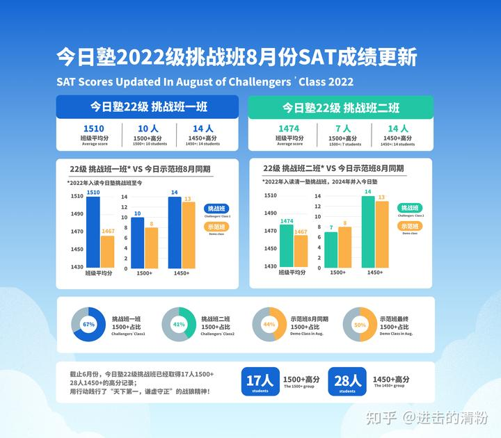
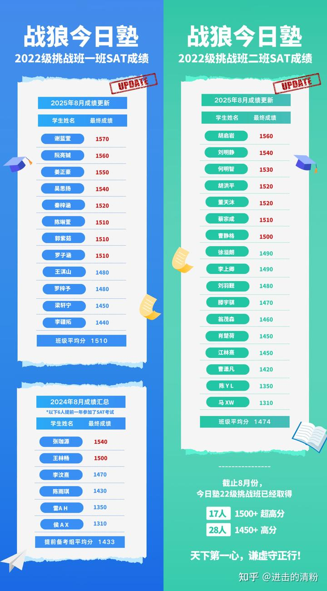

昨天的最新成绩出来了。

正好某清黑正在满世界宣传她是今日三校“唯一会教外语课程的教师”。想要忽悠新教育圈的人去她的学堂上学，不知道看到这份成绩单脸疼不疼！拿不出自己的教学成绩来说话，就只好碰瓷今日。但宣传词也夸张了。

估计黑子是跟我学的本事---专说大话。比如我一介文人，居然敢说我要弄“一个人的武林”，“办一个人的大学”，我要去超过现代格斗，拿世界冠军。我是狂人一个，教出来的学生比我更狂。直接定目标是超过我办的学校！佩服。。。

某清黑甚至赌咒发誓：这些超过1500分的学生，考入常春藤名校的概率是零。就算她假装不知道原来已经有几个人都考取了常春藤，她干嘛不等两年看看示范班的结果再说话？真不知道这个清黑是想提供理性的建议？还是因为羡慕嫉妒和恨的心理，纯粹的想去诅咒比她更优秀的学生。女人都是不理性的。

简单的常识：有了成绩，三年时间要用来补充个符合名校要求的简历，难道难度会比考出成绩来更难吗？巧妇难为无米之炊。现在米在手上，说我们不会做饭？这是鬼话居然都有人相信，实在是友邦惊诧。

真的要一个高中文凭吗？我们马上就联系帮你联系一个优质的国际学校，别人欢迎优等生免费入读。

家长们认为是先读出成绩重要呢？还是先拿到（你们以为的正规资格）重要？

由此，2027年，坐等打脸吧！这些自以为是的又蠢又坏的黑子。

[清一新教育 | 今日塾八月SAT成绩更新：最高班级平均分高达1510分！本届17人1500+，28人1450+！逆势而上，再创新高！](https://zhuanlan.zhihu.com/p/1947716143734297464)