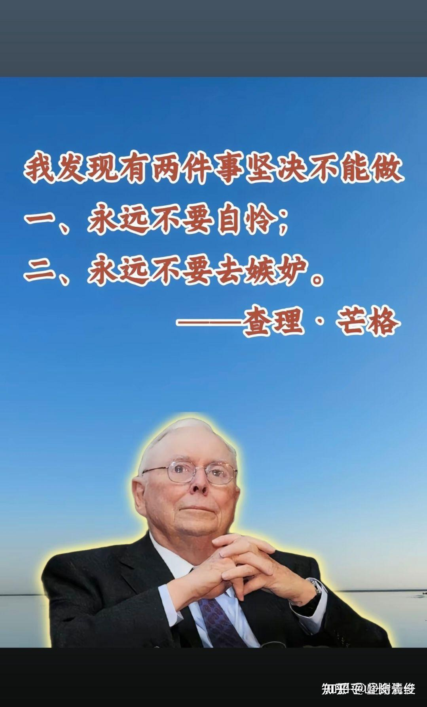

昨天让公主们学习了芒格的智慧：

没有丰富人生阅历考验的公主们，很难理解“老江湖”芒格的智慧。

我就解释给她们说：这两种心理状态，都是人自毁的最佳利器！两种心理的本质一样，就是攀比！

**所谓的自怜，就是对自己身上拥有的东西不满意。**

因此很自卑，觉得自己是可伶虫，不配得！

比如女子很多会对自己的容貌不满意，个子矮不满意，个性不满意等等，出身不满意，就去抱怨，就去自卑，自怜，自伤。

这种心态，就是向宇宙发射：我不行，我不是，我不配的信号。因此这种人注定一生落魄！因为她想宇宙发射的信号是“失败者”的身份！宇宙回馈给他的礼物就是失败者。

他向周围人宣泄自己的负能量，哀叹自己不幸的时候，其实是希望别人来安慰她，鼓励她---告诉他配得上，他值得拥有。

一个需要别人来鼓励他的人，真实身份就是“自己认为自己不行”，当然自己得到的，就是“不行”了！

而且，这种负能量，极其的消耗自己和他人。一开口就会让人远远的离开她，不愿意接近他。

**很有意思的是：自夸自卖，攻击贬低他人，本质也和自怜是一样的！**

自夸自卖，是对自己的拥有的一点点优点，表达出过度的自恋。总希望得到别人的认同和支持，常常忘记不了要去对别人吹嘘自己的本事，让别人承认他很了不起等等。

看起来这种人似乎非常的自大，与“自怜者”完全相反，** 本质上也是寻求别人的认同**。心理上，向宇宙发射的信号也是“我不是”，需要别人认同才能安慰自己。这种人当然也得不到自己想要的结果！

比如身边的孙大丝案例就非常的典型。他拥有一身的武功，却不去寻求“价值实现”的途径。早期他找各种理由，不去正规的拳台拼搏，不去用自己的武功打出自己的天下，和张志磊和李景亮这种人不一样。后面两人，可能没有他一样祖宗给的强悍武功，但他们拥有强悍的心灵，敢打敢斗，因此已经全球成名！

孙大S也想成功，采取的方式不是去高级的舞台上展现和证明自己，却是在广场上和大妈比舞，和几个老伙伴吹嘘，去打一些武功不如他的人来自嗨。他看到任何人，不管懂不懂武功，就不断吹嘘他的光荣历史，抱怨自己多么的怀才不遇，别人对他种种不好不尊等等故事，我每次都听他，都在不断的重复说这些东西，甚至几百遍不厌其烦的重复。想证明自己很厉害，自己真的值得拥有！却让人越来越远离他。身边连一个徒弟都没有。

**一个人需要用自吹自擂，自嗨，需要求的别人认同的时候，其实也是向宇宙发射“我不行”的信号**，因此孙大S的一生，就是没有啥拿得出来的武术成绩，也创造不出来啥记录！也根本就拿不出来什么可以证明自己“有武术价值”的东西。大多数人武术圈内的人，都被他鄙视，自然 这些人不可能去捧他，毕竟谁都不是他家养的奴才。

武行之外的人，虽然不明觉厉，会听他瞎吹，会捧捧他的场子，但谁也帮不上他的忙。他甚至连个像样的徒弟都教不出来。最终虽然勤奋练武一生，就活出了一个卑微无助，甚至可怜，还可恨的人生！

**因此：人生拥有什么其实不重要，资质优劣，等都不是成败的理由。自己怎样看待自己拥有的东西，自己的态度才重要**。

不自恋，也不自怜，这种人才是正常人。

这就是芒格说的：**永远不能去做的事情！就是不要嫉妒，也不要自怜。**

我认为我就做到了这一点！

年轻时候，我被人说成是癞蛤蟆。对自己“实力不足”的缺点，对自己喜欢，却无法拥有的东西。我不去自哀，自叹，自怜，我的选择是无视他人的贬低糟蹋，自强自立的态度来面对人生！

面对有人嘲笑自己弱不禁风，像个林妹妹的侮辱攻击，我不是跟随去认同，去感叹自己武功好差劲，自叹自怨，自我否定，而是不以为意，认为自己从小习文，没必要跟这些从小练武的武人一较高低。谦虚接受自己的短处，欣赏别人的长处，学习和提高即可！

这样，我成功地逃过了“自怜”的陷阱。

同样，自己拥有的优点，也不傲慢。自高自大，自吹自擂，到处去贬低他人，抬高自己的陷阱，我也一样逃过了。

因为我从小就没有这个习惯。父母从小教我的做人品德，就是不要去贬低他人，不要去夸耀自己！这是没有教养的表现。

因此我长期以来，一直觉得自己的能力不够，武功也不行。一直在谦虚的学习和提高中，到处都是谦虚的请教。结果有一天（2019年）：我的师父让我出来弘扬中华武术。我说我一个文人怎么行?我都没有好好练过武术，就是业余爱好罢了。

师父说---你行的。你的武功，达到你这个认知程度的人，中国只有三个。其他人都做不出来了。鼓励我去开办武道馆，去击败现代格斗！

我就听师父的，文人来教武事吧。最终我突然发现---怎么这些现代格斗的冠军们，水平也就这样呀？比我还慢？力量还不如我。跟我交手几秒钟就垮掉了！

突然发现自己-----武功似乎还行。

但我也没有到处去外面显摆夸耀的意思，遇到有人要比武，我就说我不行，就是一文人，一个老头。说你行，你棒，我只敢跟徒弟过过招玩，因为他们会让我。。。我这样，也尽量避免与武林中人的冲突比较！中国的武人，就是输不起的。我知道。我输得起，不怕。

其实表面上“我不行”的背后，是自信。是“我是”，我能。因为我总在想：怎样才行！我们怎样才能击败现代格斗。因此才有了今天！才帮助学生拿到了世界冠军。

**对自我拥有东西（品质）的自卑和自恋，造成了自怜和自证的陷阱。**

那么，**对别人拥有优质东西的自卑和自恋。就造成了“嫉妒”的陷阱，造成了人生的失败！**

有人就很奇怪：对自己拥有的优点和长处，即使是最珍贵的东西，也完全的无视！

相反，她对别人拥有的东西，却特别的渴望，甚至是病态的渴望。

比如：有些孩子，虽然拥有最宠爱她的父母，但依然会对伙伴的父母“比自己的父母更优秀”而嫉妒伙伴。愤怒自己为什么不能拥有优秀的父母。这是非常病态的心理。

当年静慧的一个同学，就是这样的人。她13岁好不容易才入学，表现也特别好，是个小才女，挺聪明的。她来学堂后，却一直嫉妒静慧的父母比自己的父母“更好”，更受世人尊重。结果她的嫉妒心，给自己造成了很严重的攀比结果，导致她无法静心去学习提高。她不接受自己与静慧的对比，也不愿意和静慧成为真正的好朋友。她在16岁，就早早退学离开今日，在她最关键的人生关口期，在她最需要导师和伙伴的时候，突然的要退学离开，去“追逐梦想”，当摄影师！核心原因是逃离她无法面对的静慧的“幸运父母”。由于这个家庭的孩子和父母，也不是太尊重我。我虽然知道这孩子出去后遭遇不会太好，但这孩子的父母只是“通知”我她们要离开学堂，而不是来问我她现在怎样安排才更好。因此我只是简单表达了祝福，就礼送她们离开了。

结果，却比我想象的更糟糕。更凄惨！

她出去后想要证明自己，乱学习乱拜师，去跟随刘老师曾经学过的一个老师学习，享受当刘老师“师妹”的感觉。号称全世界最年轻的某某师。没几年就因为乱作灵修的事情，人都差点死掉。后来抑郁，到处流浪。也恨嫁，一直找不到男生愿意娶她！记得有一次到了某城市，她发社交账号说：我来某某城市了，有人理我吗？满满的寂寞和艳遇的渴望。

现在这孩子应该30来岁了，已经很久没有她的消息了。当然我也不太关心，现在的人。几乎没有啥人认识她的！因此她就毫无声讯了。结果，她应该是混成了人生的失败者。这种人，还在不断的涌现！

** 什么是羡慕嫉妒恨？这种情绪，会把自己拥有的最美好的东西全都毁掉的！一生辛苦，却一生失败。**

我举个例子来说明！

一个人可能一直很瘦小，对自己的身材很自卑。她可能就会很羡慕运动员强壮的身体，想当世界冠军，她也很努力的训练自己！

结果她的运气很好，真的当上了世界冠军！拥有了普通人没有拥有的荣耀。按道理她应该很满足，很自豪。去走上新的高地。

但她却开始焦虑：觉得自己“不如别人有文化”，因此她要去“弥补自己的缺陷”。要去考大学，证明自己有价值，有文化！

等她考完大学后，就算是读完了名牌大学，可能也不会满足。她又会马上发现自己的不足。比如：她不如身边的某人可爱。她不如身边的某人会说话。或者“她得不到想要人的爱”等等。

于是她还要去证明自己“值得爱”。会继续努力去作。甚至是作死的节奏。。。。

当然，她嫉妒的不一定是“爱“，而是其他值得人羡慕嫉妒的东西。比如金钱，地位，名誉等等！反正身边出现了比她某种条件更优秀的人，她就会感到不安全，就会失落。就会嫉妒！

**这就是喜欢攀比，喜欢嫉妒他人拥有的优点，却忽略自己拥有的最大宝藏的人！**这种人就算非常的努力，其实一生都会很可怜。因为：无论她们拥有什么东西，都不会满足！永远都在追寻的路上！否定自己的路上。

相比之下：我认为刘老师拥有无比珍贵的个性。就是珍惜自己拥有的一切，不去嫉妒别人拥有的优点。如果喜欢，就去点赞，就去努力学习。她非常的不自恋，但也绝对不自卑！认为自己不好的地方，就是努力学习改进。

**这真是高贵的品质！最终会让自己变得高贵！**

而嫉妒，会让本来有机会变得高贵不凡的人，变得一个庸俗和底层的普通人。甚至因为嫉妒，不能接受他人优点，不能学习别人优胜之处，不能和人合作。最终一意孤行，会让她变得可怜和可恨，造成自己的孤独和个性障碍，人生走向平庸和失败！

因此，我看到芒格的这个格言，特别的有感触！

**我觉得芒格真是智者，把嫉妒和自怜，都列入了“千万不能做”的事情！**

**其实要改变也很简单：就是放下自我，静心去听从智者的指导！追随智者的脚步，所有的努力如果有了方向，一生就可以获得超级的成功！**

**否则，跟随自己浅薄的思维和情绪，习气去走人生之路，就如同无头苍蝇一样，人生所有的努力，都只是自己嫉妒的自毁情绪的发泄罢了！**

**不能看到和珍惜自己身边的资源，不懂珍惜自己拥有的宝贝，这种活在自我否定中的人，也许是最愚蠢固执的生物了！**