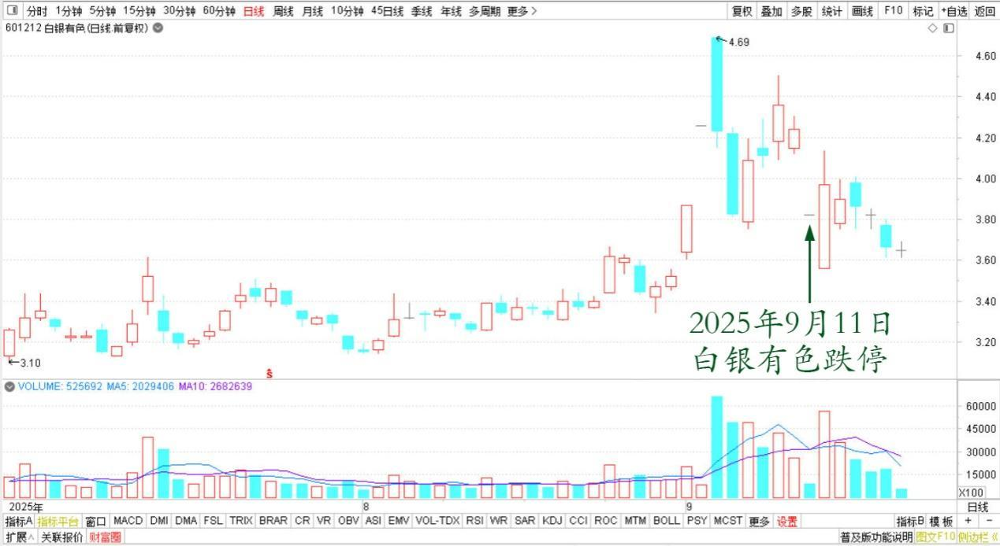
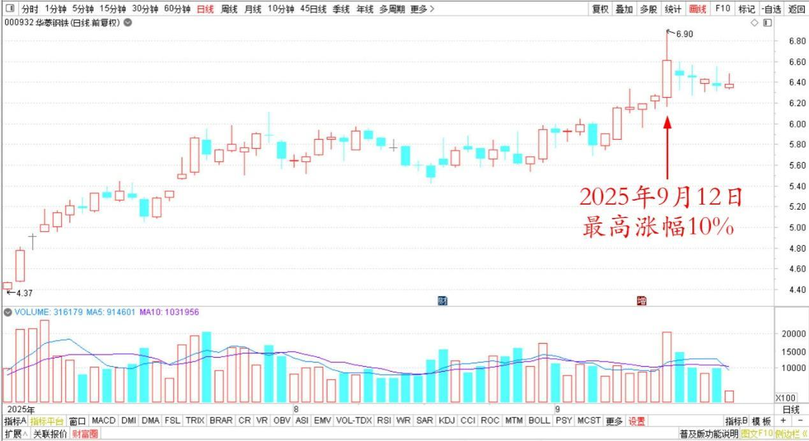
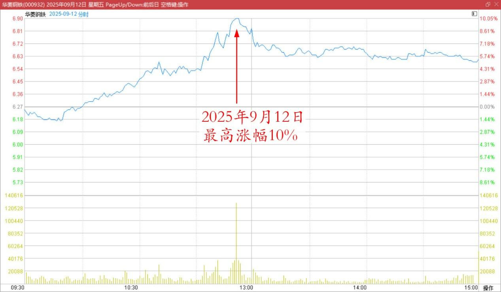
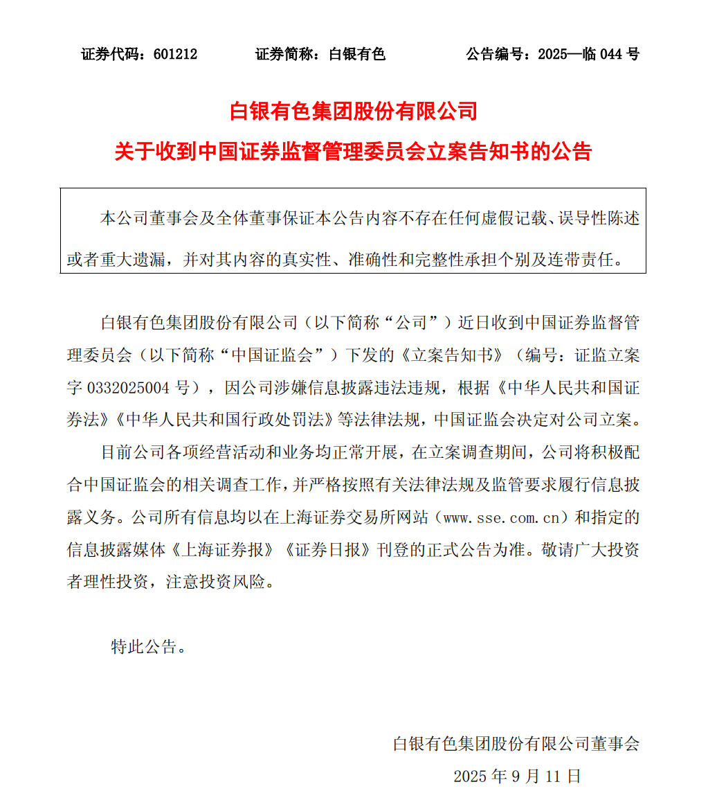
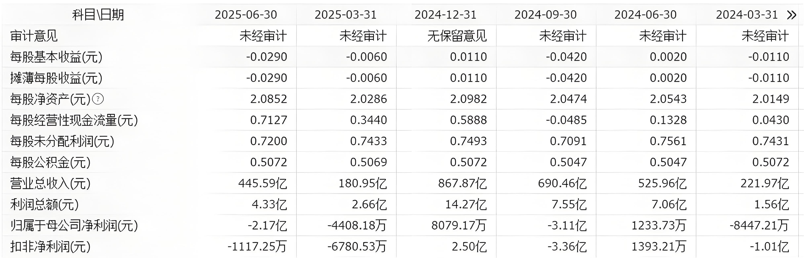
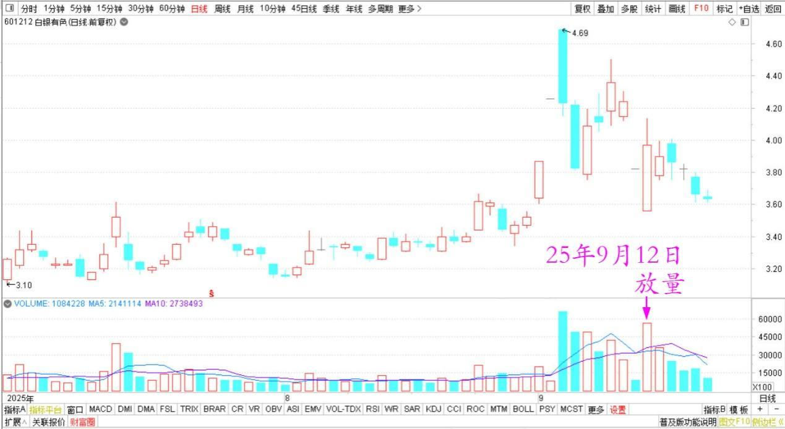
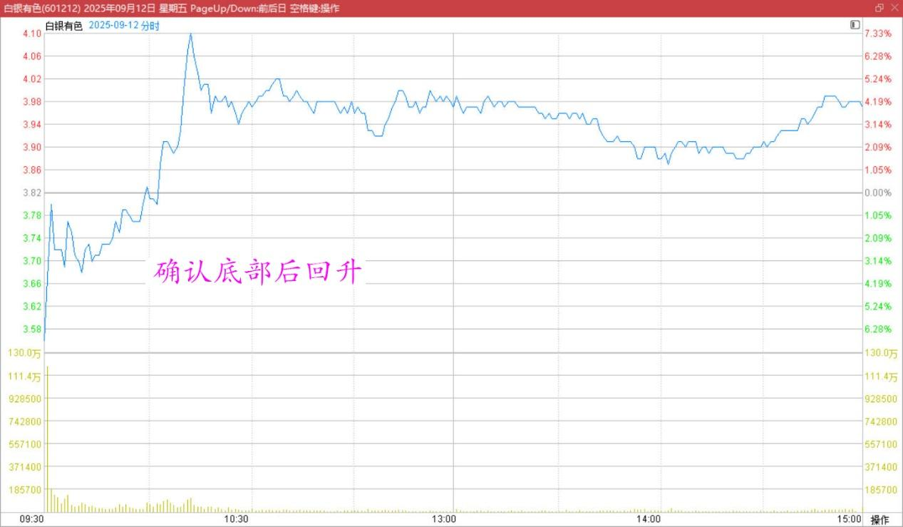

181篇.白银有色：中国股民真蠢！

**清一山长[2025年9月12日13:52](https://www.zhihu.com/pin/1949832614182643259)**

今天送走了英子的团队，小安告诉我：我的持仓白银跌停了，问我涨停的时候走掉没？我说没有。

白银有色2025年7月～9月日线图

又告诉我：我重仓的华菱钢铁今天涨停了？我说我也不知道。我还告诉小安我重仓华菱的理由，和他的不一样，他过于注重细节了！

华菱钢铁2025年7月～9月日线图

华菱钢铁2025年9月12日分时图

送走他们团队后，我就来看看怎么回事，看到前天，有一个通知：

公司近日收到中国证监会下发的《立案告知书》，因公司涉嫌信息披露违法违规，根据法律法规，中国证监会决定对公司立案调查。

[白银有色集团股份有限公司关于收到中国证券监督管理委员会立案告知书的公告](http://link.zhihu.com/?target=https%3A//www.cninfo.com.cn/new/disclosure/detail%3ForgId%3D9900027220%26announcementId%3D1224650094%26announcementTime%3D2025-09-11)

猜我的第一感觉是什么？好消息，是不是应该赶快买股，多买一点白银。

因为，公司的信息披露，就是上市以来第一次亏损。现在的金属的价格，都是节节高。你来个亏损，啥意思？估计就是用利空来打压，主力想要抢筹码的。公司被处罚，但以此坏消息来抢筹码的主力，也没有啥处罚的，因为责任人难以判定。这不是意味着——白银未来有强大的利好背景吗？

但我看市场对此好消息的反应，居然是跌停。坏消息是针对管理层违规，企业面，基本面，明明是好消息才对呀?

如果昨天我看到，说不定我会继续多买一点。我觉得股民真的太傻了！而且——跌停也出不去，昨天就没啥人买，成交量很低！

但今天就放量了，冲底确认底部后回升，恐慌者大量抛出。这次洗盘好干净！说明我的判断是有道理的，大量的资金在买入白银。

我看今天白银的架势，后续应该还要涨的，我就继续稳坐钓鱼台，不买，也不卖！

白银有色2025年7月～9月日线图

白银有色2025年9月12日分时图

**虽然我看多，但我不做多。就是看主力的游戏，以后涨了，我也不会懊恼。我不求快钱，我只求安全边际。**

白银有色的安全度，不如我2元多不到3元买入的时候安全了。但——也不危险，因此我啥都不做！继续等！**有钱，我买更安全的股去！**

**（标题、图片为编者所加）** **文章音频**：

[598篇.白银有色：中国股民真蠢！](http://link.zhihu.com/?target=https%3A//www.ximalaya.com/sound/914621779)

**参考链接：**

[175篇.中粮糖业涨停，卖出退出十大](https://zhuanlan.zhihu.com/p/1946518083939336830)

[176篇.只拿本分的本金仓位，只赚本分的利息钱](https://zhuanlan.zhihu.com/p/1948022731460314408)

[177篇.只能赚认知范围内的利润](https://zhuanlan.zhihu.com/p/1948065037659910791)

[178篇.张清一是傻瓜？](https://zhuanlan.zhihu.com/p/1950663717466411770)

[179篇.燕京股东增多，人气逐步激活](https://zhuanlan.zhihu.com/p/1951677642467156967)

[180篇.听券商的话，会不会赔死？](https://zhuanlan.zhihu.com/p/1953143141692605509)

[链接汇总（截止2025年9月12日）](https://zhuanlan.zhihu.com/p/621215591)

