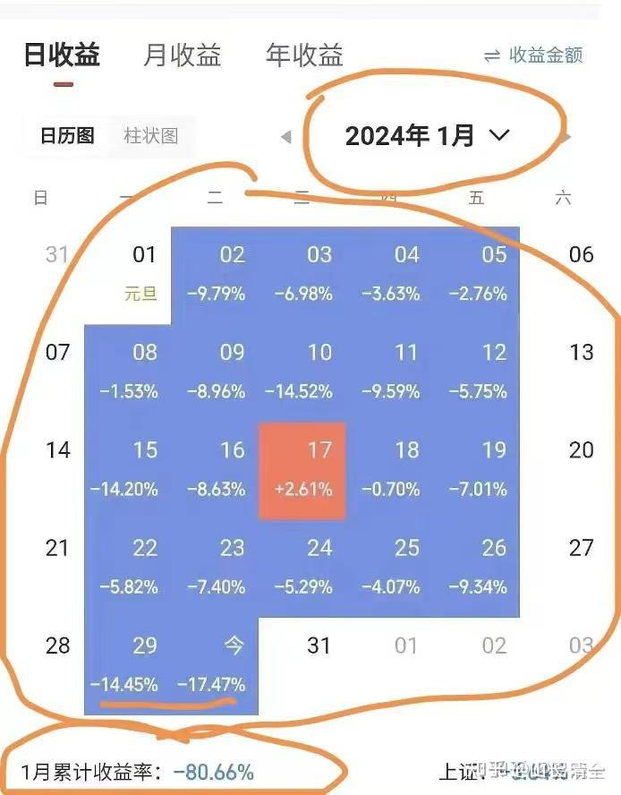

据说下面的业绩，来自于一位无名前家长的杰作：

**一个月之内，就让自己从千万富翁晋级到了百万富翁。**

都说NO作NO die。金融市场上，我看很多人真的是自己把自己作死的！

我猜：他是想要复制下面的这种传奇的暴富故事： 一年创造32倍收益。短短几年的时间从30万做到10亿？

[为什么游资陈小群能在短短几年的时间从30万做到10亿？](https://zhuanlan.zhihu.com/p/1922535566366466838)

只是很不幸，他完全做反了节奏！反向做到了一个月“四倍”！倒过来，他就比这个故事的人还成功了。（其实我不相信上面这个故事，我怀疑是故意编造出来的假人）

我告诉朋友，这人是股神，他们认为我讽刺人。其实真不是：

如果你跟这人无脑反向操作【不是现在都有融资融券了吗？】。这样玩的话，你绝对赚死了！一个月资产就增长4倍！

这人让自己老婆一起配合：双倍资产跟自己完全反向操作，肯定会赚死！

当然，实际上没有这么理想的。到了一定的资产。你买东西就买不到了！

今天我买一个长线持有的医疗股，就买不到，成交很稀稀落落的（因为我喜欢在不影响价格变化，不去推高市场的情况下买股。我可不愿意被举报为操控市场）。我只能一两万股的慢慢买了玩！

但在涨停的情况下，你可以每单就一百万股丢出去，特别的轻松。

我希望永远记住上面这张图：提醒自己，永远不要自以为是。就算是一个想要故意赔钱的人，专门去买赔钱股票，他也没法弄到这么精准的，一个月就亏掉80%的资产！赔钱也真发达不容易。

我其实买过赔钱90%的股票（一只广州的地产股），但是用了很多年的时间，才赔这么多的，买了几百万，快赔光了。不过创始人更惨：过去40年，积累下来多少亿的身家，信誉，都全部完蛋了！我幸亏只是拿很少的钱玩一下。假如贪心，甚至动用融资去玩的话，几个30年的身家都会亏光的！

因此，结论就是：千万不要贪心！特别在顺风顺水的时候，不要贪心去高位买任何东西，当然包括股票！

总结贪官的一生：

1：在自己高位的时候，身边拥着一群拍马溜须的人，最终害死他的也是这些人！

2：自己得意的时候，身边情人无数。而这群女人最终也害死他！情妇反腐。

3：他得到的一切物质享受，茅台，海鲜，各种豪华的宴会！自己觉得很好，其实每一样都是来摧毁自己的！

所以：得意的时候，成功的时候，自己悄悄的躲起来，不要去无效社交。有空自己读读书。思考一下人生！

失败的时候，更要躲起来。自己舔伤口。反思自己的错误。重新出发！

而不是拼命的去秀存在感。最终自己就毫无存在价值了！

做人，炒股，其实都一样的！都是一句话：

别太把自己当回事！