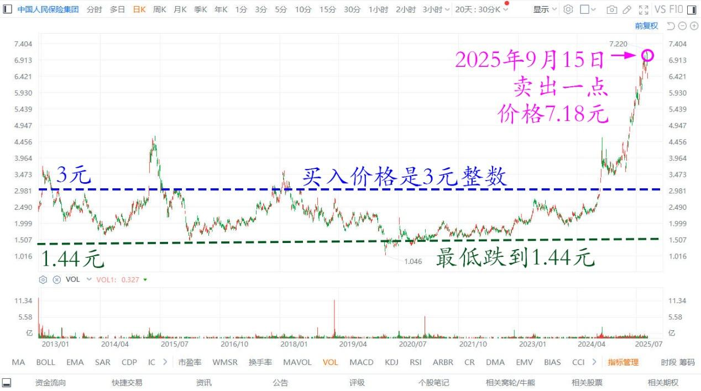
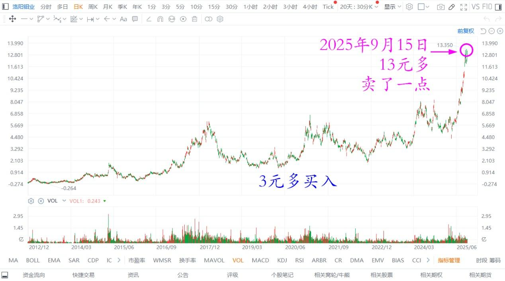

182篇.投资就是认错的艺术和技术

**[清一山长](https://www.zhihu.com/people/shan-chang-qing-yi)** **[2025年9月15日11:19](https://www.zhihu.com/pin/1950881499252495637)**

**高手就是认错专家！**

我刚刚卖了一点中国人民保险集团（PICC）港股出去，7.18元的卖价。我记得我买入的价格是3元整数，买了200万股。买了没多久，不但没涨，还跌了。最低跌到1.44元。

中国人民保险集团港股 2013～2025年日线图

如果我是用融资买入的PICC，我就爆仓了。多好的股票都会爆仓，H股比A股疯狂多了，绩优股也狂跌！因此**港股特别疯，大家真的不能用融资，太危险了。我都不敢用！**

**但我买入的时候，我的思维方式不是这个股票将来会涨一倍多（今天是事实）。而是担心：我错了怎么办？跌50%以上怎么办？**

**因此采用了是“我很可能是错的”这种思维方式来执行买入操作。**

**既然我可能是错的，我买了会跌，我就要想：跌了我怎么办？当年的想法就是“跌了就拿着不卖，等分红。反正这家公司不会倒闭的！”**

**另外：千万不能就买一只股。要分散风险！**

虽然巴菲特说：分散投资是自己没有信心的表现。其实我就是真的没有信心，不认为我一定是对的，所以我**分散投资，不把宝压在一只股票上，一个行业上。**

（其实U兄就是犯了两个错误，一个是认为自己是对的，另外就是股票过于集中，另外没有考虑下跌的危险。否则如果他当年自杀时候，正好是市场的底部，记得他的基金净值跌到0.36，如果全部换仓买入PICC的话，现在不但是满血复活，反而总资产还会多增加一倍。他认输的方式，就是拿命去认输。虽然他是个汉子，用生命来赔偿了投资人。但他真的不够敬畏市场，不懂得金融市场就是疯子，是没有逻辑的，他太相信自己的逻辑，太相信市场的理性了！

我根本不敢相信PICC中国最大的保险公司都会狂跌到一元多。但就算这个股跌了一多半，我依然没感觉，因为是用港股通买入的。现在看账上，我反而多了600万港币的利润，这个超过投资本金的翻倍利润，已经很好了。

我卖出的时候，也是认错模式：卖了股票，涨了怎么办？就像今天7.18元卖了，我肯定会买入其他没涨的股呀！股票多了我就赢了。

我找到了一个在PICC才一元多的时候、当时的价格是现价接近三倍的股。我当然觉得这样换我应该很划算，于是我就这样换股了！

因此，我发现我总是在计划我错了的情况下，也能安全落地！

而不是买入的时候，认为自己肯定是正确，就一把压上去；也不是卖出的时候，认为自己是对的，就洋洋得意。

我随时认为：“自己可能是错的。”

因此才保住了自己的股市长红的局面！那些与我反向思维，总认为自己是对的人，我看亏惨了！

我也会亏，但我已经准备了亏，因此最终反败为胜！

有点可惜我在PICC1.44元的时候没有补仓，但我没有浪费资金，没有吓得空仓等待，我大量买了其他股票。记得当时是买了3元多的洛阳钼业，今天我看涨到13元多了，每股净赚10元。我也卖了一点出去，买一些跌惨了的股票。

**投资就是认错的艺术！**

洛阳钼业港股2013～2025年日线图

**（标题、图片为编者所加）** **文章音频**：

[599篇.投资就是认错的艺术和技术](http://link.zhihu.com/?target=https%3A//www.ximalaya.com/sound/915857548)

**参考链接：**

[176篇.只拿本分的本金仓位，只赚本分的利息钱](https://zhuanlan.zhihu.com/p/1948022731460314408)

[177篇.只能赚认知范围内的利润](https://zhuanlan.zhihu.com/p/1948065037659910791)

[178篇.张清一是傻瓜？](https://zhuanlan.zhihu.com/p/1950663717466411770)

[179篇.燕京股东增多，人气逐步激活](https://zhuanlan.zhihu.com/p/1951677642467156967)

[180篇.听券商的话，会不会赔死？](https://zhuanlan.zhihu.com/p/1953143141692605509)

[181篇.白银有色：中国股民真蠢！](https://zhuanlan.zhihu.com/p/1954398004627894953)

[链接汇总（截止2025年9月12日）](https://zhuanlan.zhihu.com/p/621215591)

