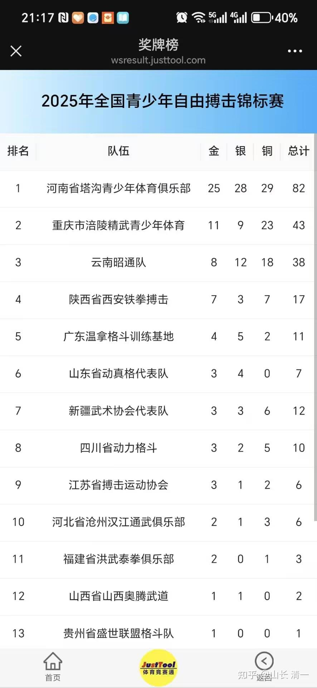
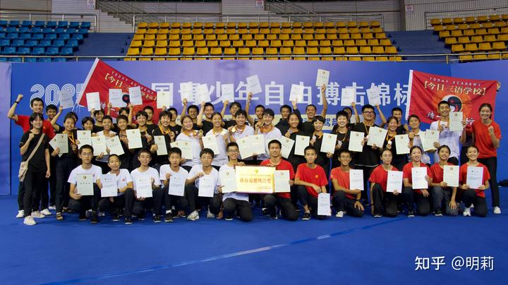
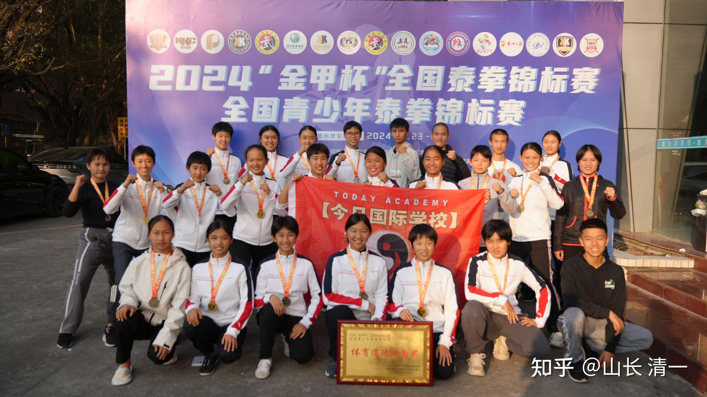
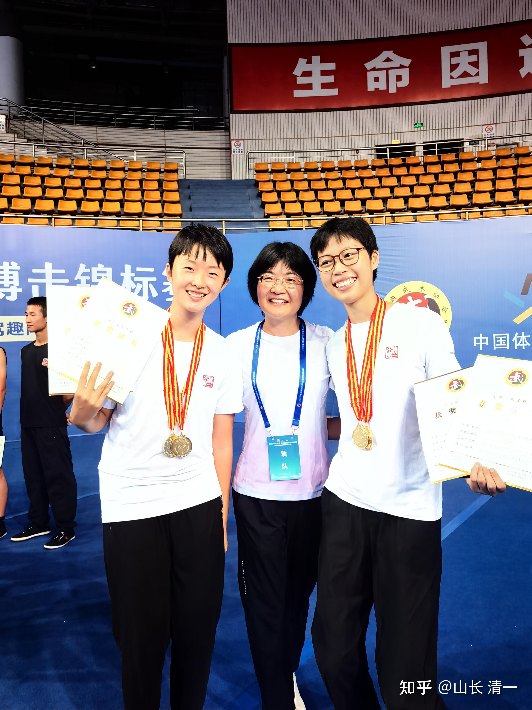

至今清一战队已经打了500多场泰拳和自由搏击的职业和锦标赛的赛事，已经崛起为中国的一只不可忽略的格斗新星。

2025年10月2日-9日。练了三年实战格斗的公主班13个人，和练了1年的冠军班30个学生，今年一起参加了在重庆举行的自由搏击锦标赛（青少年组）。本次赛事全国共有602人参加，其中最大的团队，是河南登封塔沟武校的格斗拳手，有两万人在这里练武。他们派了5只队伍来参赛，也就是说：一个量级可能有五个就是塔沟的人，竞争相当的激烈。目前国内的格斗高手，大多数来自这里。本次赛事，塔沟也取得了集体第一名的好成绩！但我们作为业余武术爱好者，文人格斗践行者，也取得了靓丽的成绩。

公主们也洗刷了自己去年8月，首次参加2024全国自由搏击锦标赛，零金牌的耻辱（去年只拿到两个银牌）。（跟泰拳全国锦标赛相比，自由搏击锦标赛的中国裁判们，更像泰国人一样对待我们。因此公主们夺牌的难度比泰拳更大，往往不KO对手就没戏）。

10月9日的两场最终决赛，金牌争夺战中，我们的两个公主，都Tko了对手。陆韵如的决赛对手，就是强队塔沟武校的拳手，因为国内的格斗界的裁判，教练等等，大多数都是出自塔沟的。韵如公主由于担心又被裁判黑掉比赛，就全力以赴，最终以KO结束比赛，不给裁判活动的空间。

可惜李想公主就因为“差一点才KO对手”，虽然场上一路狂殴对手，但相比对手的裁判，她显然实力还是差一点。最终被判负，失去了金牌。只拿到一张让她肯定不服气的银牌。

最终的业绩报表，是我们团队总共拿到了**6块金牌，银牌7块，铜牌9块！**在全国武术界显然已经获得了不容忽视的地位！

练了三年的公主班，目前是我们的金牌大户，获取了最多的金牌。5块金牌来自她们。银牌只有4块，铜牌也只有五个，有两位小公主都拿到了双金牌（同时参加K1和半接触两个项目）。

首次参加全国锦标赛的冠军班也获得了突破性的进步。本来这一次，只是想锻炼一下队伍的，没有夺牌的计划。但本次赛事，也取得了零的突破。这一次，首次参赛的冠军班学生，取得了**一块金牌，三块银牌，4块铜牌。**

只练了一年的冠军班同学，这些业余拳手，与国内的“专业拳手”打过之后，觉得也“不过如此”，没啥好怕的，反而信心大涨。认为老祖宗的功夫实在太好了，让他们这群学霸都可以与专业拳手一较高低，信心满满的想要明年再来，夺回属于自己的奖牌。

同时，由于我们的学霸拳手文雅文明，举手投足都与其他武校的拳手不一样。给赛事主办方留下了深刻的印象。我们获得了主办方给于的集体【体育道德风尚奖】！

下面是清一战队2024和2025两年参加全国格斗锦标赛的对比：可以从照片中看到，我们的文人格斗，正在快速的壮大。明年将会有70个队员要参加全国锦标赛。因为今年入学的冠军2班，明年也要走上赛场去练兵了！

*2025年10月参加全国自由搏击锦标赛（青少年组）的清一战队*

*2024年参加全国泰拳锦标赛的清一战队*

好像去年今年的【体育道德风尚奖】，都发给了我们：文人格斗的优势，就是有文化，有教养。

*昭通侨联主席与代表昭通参赛的两个金牌公主合影*

本次清一战队有一只队伍，是代表云南昭通队的，两个小公主拿到了四块金牌。李想公主按水平来说，也能拿金牌的。昭通队的裁判教练一直认为李想的金牌是被抢走了。不过，可能别人也认为我们的金牌，是把别人应该有的抢走了了吧？