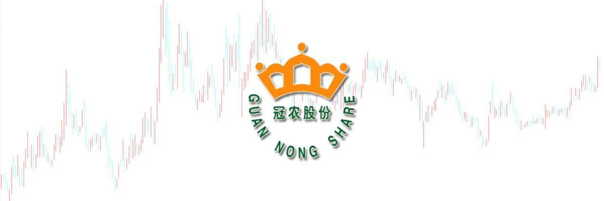
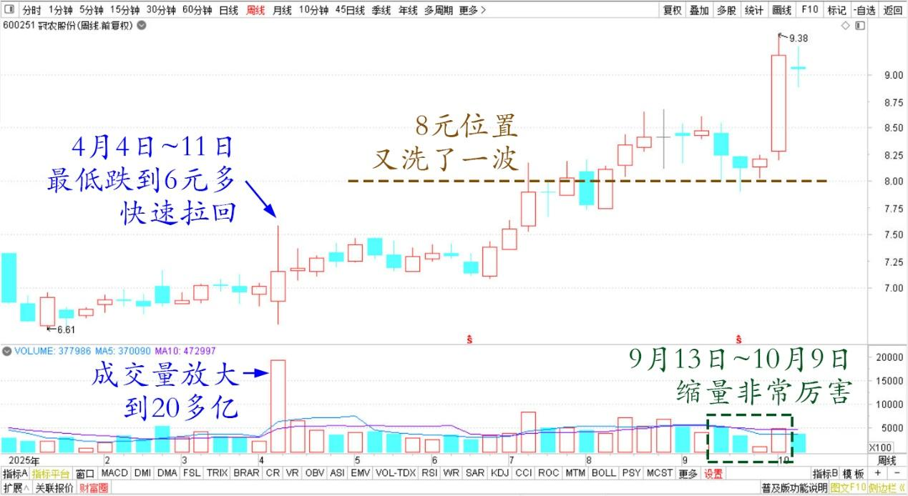
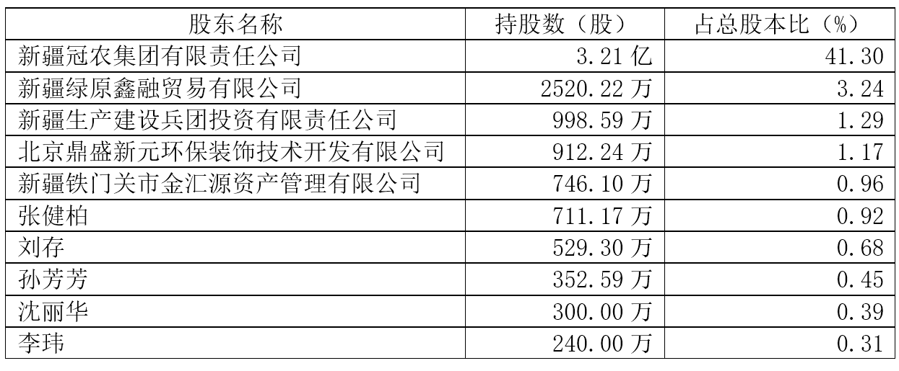
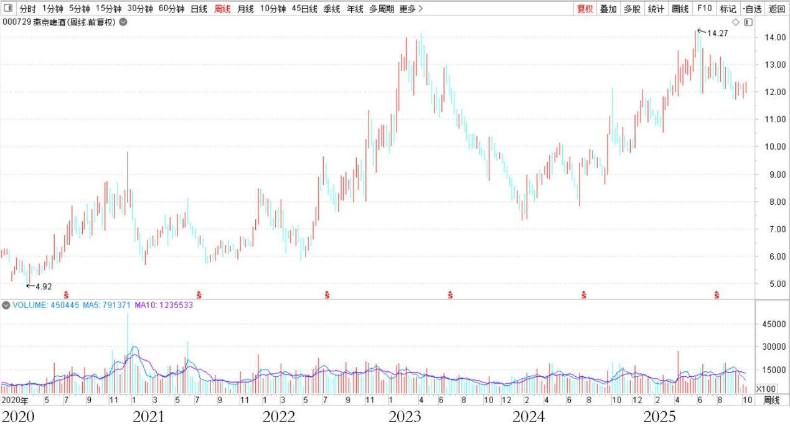

188篇.冠农的技术图形与走势

清一山长**[2025年10月9日18:00](https://www.zhihu.com/pin/1959679550410696381)**

刚刚无意中去看了冠农的周线图：突然发现最近四周的缩量非常厉害。最近几周的下跌其实就是假的（当然我也乘机买了一点8元左右的货色，成功晋升三大了）。今天的拉起基本就是必然的！

再往前看了一下走势：发现关键的走势点出在4月11日的周线图上。最低跌到6元多，快速拉回。一周成交量放大到了20多亿，几乎就是流通盘的一半换了一遍！判断下来——散户筹码基本上洗得差不多了。之后较长时间的震荡，把投机买入的资金洗掉了。主力开始拉升，到了8元位置又洗了一波。现在应该是洗完了，主力基本控盘了！

冠农股份 2025年 周线图

冠农股份2025年中报十大股东

不过以后怎么走？走多高？我还是不知道！就像知道燕京控盘了，但它的走势我永远想不到。猜都猜不到，只能高了就乱卖，低了就乱买！所幸一直在给我机会不断上下车！拿到持仓千万却是负成本持有，真真不好意思[捂脸]。冠农我一直买进，从无卖出。就是不像燕京这么妖，真想冠农也像燕京一样妖一下，让我看不懂，我就有更多机会了！

燕京啤酒2020~2025年周线图

原来我只是被冠农的奇特走势诱惑，忍不住手，瞎买了不少。但它到底是个啥等级的美女?内涵如何？真不知道，信息太少了。只知道暗中有人在抢它。

我看看该股的股息，业务都还不错，身架也不像是风尘女，起码是个良家妇女，多美就不知道了。所以我跟随主力的节奏一起买入，不小心居然是三大了。我估计我的成本和主力是差不多的！真不好意思。主力莫怪，真是不小心被诱惑买多了。以后给点好处我就走，就像中糖一样，我不恋战。

现在我已经不买了，我买别的去。吃太多了怕撑死我！（跌下来我还是会买的喔，涨了就不要了[大笑][大笑]）

**（标题、图片为编者所加）**

文章音频：

[605篇. 冠农的技术图形与走势](http://link.zhihu.com/?target=https%3A//www.ximalaya.com/sound/922622387)

**参考链接：**

[180篇.听券商的话，会不会赔死？](https://zhuanlan.zhihu.com/p/1953143141692605509)

[181篇.白银有色：中国股民真蠢！](https://zhuanlan.zhihu.com/p/1954398004627894953?utm_psn=1956920188550230942)

[182篇.投资就是认错的艺术和技术](https://zhuanlan.zhihu.com/p/1955773035073210008?utm_psn=1956920040768139542)

[183篇.抢钱游戏，傻人有傻福](https://zhuanlan.zhihu.com/p/1956918511621345947)

[184篇.卖矿买啤酒，啤酒也是矿](https://zhuanlan.zhihu.com/p/1958174319248152048)

[185篇.有色逻辑得验证，和大家反过来走](https://zhuanlan.zhihu.com/p/1958220089020097164)

[186篇.用涨了的矿，换低位的矿](https://zhuanlan.zhihu.com/p/1960840960616399003)

[187篇.在绝望的时候进场，随欢呼的浪潮退场](https://zhuanlan.zhihu.com/p/1961858710361047662)

[链接汇总（截止2025年10月10日）](https://zhuanlan.zhihu.com/p/621215591)

