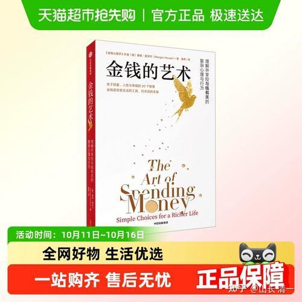

**金钱并非简单的数字游戏，而是与家庭、选择和幸福紧密交织的生命体验。**摩根·豪泽尔

**这是【金钱的艺术】艺术作者的核心观点，我非常认同这个观点！我认为：所有先富起来的国人，都应该好好的消化这种观点，避免自己成为暴发户。也让自己的新钱，有机会成为老钱！**

**这也是我特别希望让小明慧去学习和掌握的财富思想。她已经学会了怎样赚钱，但我现在给她的任务，是怎样去花钱！怎样去操控金钱来实现自己的人生目标，而不是像大多数人一样，被金钱操纵和控制一生！**

**我的计划12月底，带小女在广州，去现场边游览，观看广州人的财富之道，边读书学习讨论【金钱的艺术】，把书中的观点，和现场看到的一切结合在一起！等与是一个现场版的，以鲜活的生命和现场的观看，来分享财富思维的高级现场课程。**

基于儒家【幼吾幼以及人之幼】的基本精神，我计划另外接纳10个与小女年龄差不多的伙伴，加入一起学习（17-22岁）。因此，这是一个超级小众的课程。

计划是在广州的10天时间里，我们用上午和晚上，都拿来讨论和学习本书的内容。中间的时间，就带孩子去参观广州的各种商圈，各种批发市场，去看13行博物馆等等，还会带孩子们去欣赏价值10亿的高级音响，去接触各行各业的商人们，去看退休者的生活，去互相讨论和思考金钱的奥秘。

这个是我很早就想对小明慧做的财富专享课程了。让她懂得如何用金钱来获得自由。对于富二代来说，使用金钱的智慧，比赚钱金钱的智慧也许更加重要。让他们去理解商业的本质，比去经商更重要。

这种思维方式，也是培养高级金融人才的方式。本质上，金融就是对商业模式的深刻理解。谁能够理解商业模式，谁就能获取更深入的智慧。

参与者10个小伙伴，将从清一公社的首期社员中选出，不接待陌生人。有愿心的家长，可以为自己的孩子申请加入该现成分享课程！鹰粉工作组，负责替我审核符合要求的家庭和人选。

当然，我知道很多成人特别需要参加这种彻底理解金钱的高级财富课程。也许明年1月份，我可以在磨丁开设一个成人的【金钱的艺术】专项培训课程---看是否有人需要了。因为我知道仅仅看书，很多人是无法理解背后的思维的，很多人只能看懂文字，不知道背后的深意！只有拥有金钱思维的人，才能看透作者的财富思维。他教的是用钱，其实本质上，会用钱的人，一定会赚钱！

但只关心赚钱的人，最终会失去自己的金钱！周围很多富豪们的失落。充分证实了这一结论！

本书中，作者提出了很有意思的【财务独立的0到15级】。我发现小女已经是最高等级的，第15级的人了。

那么，你们是什么级别呢？其实来上课的人，每一个人，都可以认真的照照镜子。发现自己的财富等级。这个等级有价值的地方就是：它不是根据你拥有的金钱多少来定义的财富等级，而是根据你的财富思想来定位的财富等级！如果各位发现自己的财富地位还不够高，那么你可以找到两个宝贵的东西：

第一：可以发现自己的努力的方向，不至于因为惯性。一直在原地踏步

第二：可以看到自己的思维局限。改进自己原有的错误！

很多人，会因为自己拥有的财富使用机会，就以为自己是”高级人"，其实用这个等级来看，很多人可能是最低级的人。比如很多富二代，其实只是0级和1级的（两者差别不大，都是完全无法独立的人）。但父母和家长的宠爱和供养，会让这群无能的人，因为自己无所不能。以为自己很高级，从而完全的丧失了自己发展进步的空间。让他们一旦发现自己的真实面貌，才会激发他们努力的方向！

这就是照镜子的好处。

在《金钱的艺术》中，他提出了“财务独立的0到15级”，从完全依赖他人到随心支配时间，每个等级都对应着一种掌控力，每个人都能在这份清单里找到自己的位置。

第0级：完全依赖陌生人的善意，毫无掌控力。

第1级：依赖家人、朋友或慈善的救助才能生活。

第2级：依赖政府或社会保障体系维持生计。

第3级：靠工作养活自己，但一旦失业就陷入困境。

第4级：有少量储蓄，能短期应对意外开支。

第5级：积蓄能支撑几个月，即使暂时失业也不至于崩溃。

第6级：技能或职业有一定不可替代性，不易被取代。

第7级：能拒绝糟糕的老板或工作，真正拥有选择权。

第8级：即使换城市、换行业，也能凭储蓄和能力顺利过渡。

第9级：拥有稳定的资产或副业收入，减少对单一工作的依赖。

第10级：储蓄和投资足以覆盖数年的生活成本。

第11级：即便遭遇金融危机或行业衰退，也能从容应对。

第12级：被动收入足以覆盖基本生活开支，不再依赖工作生存。

第13级：储蓄和资产支撑的不仅是温饱，而是理想的生活方式。

第14级：财富充裕到足以支持你做任何想做的事。

第15级：完全自由，能随心所欲支配时间，按照自己的方式生活。

序言 IX 引言　追求简单生活的真谛 XI 1 　　钱应该花在哪里

001 关于消费观念的大多数争论， 实际上只是有不同人生经历的人各执一词。

2 　　你想要的并非你真正渴望的 015 你以为自己想要的是豪车、豪宅， 但你真正渴望的，其实是尊重、钦佩和关注。

3 　　衡量财富的最佳标准 029 如果你的期望膨胀速度高过收入增长， 你就永远不会对自己的金钱感到满意。

4 　　赚钱重要，但快乐更重要 041 幸福感远不只取决于收入。 全球十大富豪中，离婚案例高达十三起。

5 　　最宝贵的资产是不需要取悦任何人 053 具备不需要向陌生人证明自己的能力，是无价的。

6 　　反差的力量 067 最好喝的饮料，是你口渴时的一杯水。 真正的快乐是由期望与现实之间的对比产生的。 7 　　有钱与富裕 079 受金钱控制是一种隐性负债。 正如所有债务一样，终将连本带利地偿还。

8 　　实用vs 地位 095 任何事物的价值， 仅在于它能否帮助你过上想要的生活，不过如此。

9 　　风险与遗憾 105 关于理财的好建议，从来不是简单地说“活在当下”或 “为未来储蓄”，真正有价值的建议只有一句话： “尽可能减少未来的遗憾。”

10 　 看看他们 121 摆脱嫉妒、羡慕和“地位游戏”的陷阱。

11 　 没有独立的财富是一种特殊形式的贫困 135 那些你未曾花掉的钱，买到的是某种无形却弥足珍贵的东西： 自由、独立，以及按照自己的意愿支配时间的能力。

12 　 社交债务 149 当你的消费方式影响了他人对你的看法时， 就产生了一种无形负担。

13 　 静默复利 159 最快的致富之道，是慢慢来。

14 　 身份认同 167 富人、穷人、投资者、储蓄者…… 当你被金钱定义时，你就被金钱掌控了。

15 　 尝试新事物 179 我强烈建议你这样做：在预算允许的范围内， 尽可能多地尝试各种花钱方式，对那些对你没用、 无法带来价值的项目，要毫不犹豫地进行割舍。

16 　 你的财富和你的孩子 193 孩子与金钱的关系最棘手的一点， 就是父母如何用金钱帮助他们， 却又不会把他们宠坏。

17 　 电子表格不在乎你的感受 205 有时，情感比数字更具洞察力。

18 　 小额开销与财富增长 211 那些细微之处的智慧与盲点。

19 　 贪婪与恐惧的生命周期 221 它始于纯真，演变为疯狂，最终又回到起点。

20 　 如何通过花钱让自己痛苦不堪 235 一份关于错误决策的简明指南。

21 　 简易理财之道 243 8 个简单至上的财富理念。