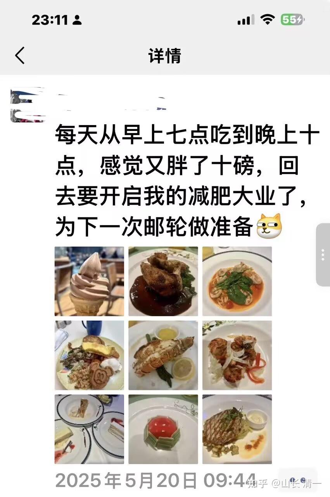
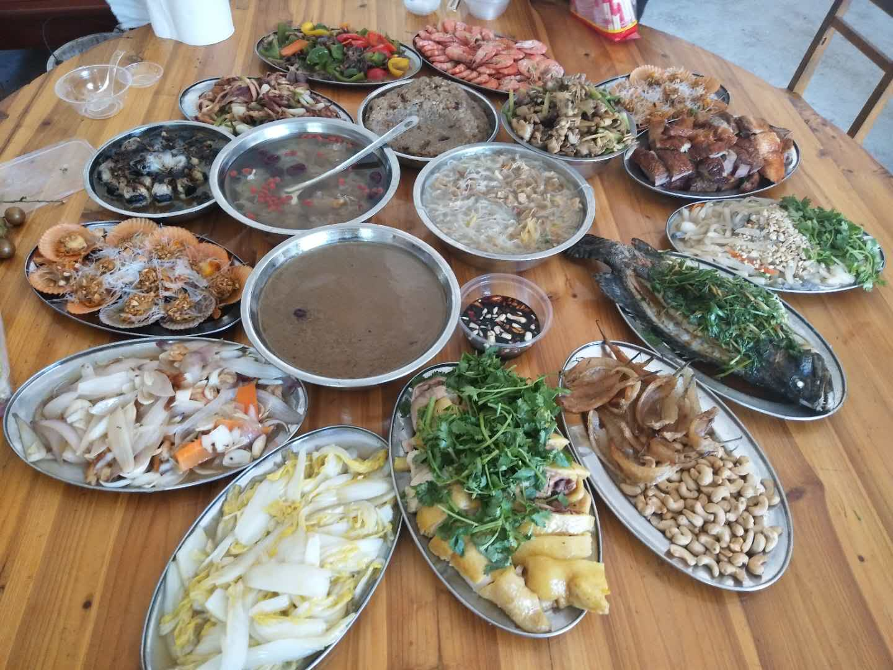

你羡慕下面这个秀邮轮大餐的人吗？她刚刚参加完邮轮旅游，正在想为下一次的邮轮餐会做准备呢。你羡慕她的生活吗？想加入她，跟她一样潇洒吗？

上面是我的一个学生发给我的信息，她的同学的社交账户上的信息。

这个学生发给我信息，是因为她想感谢我。因为她突然发现自己已经意外地成为千万富姐了。

她说：老师当初我听了你在网上说了一句话“未来农行会很不错”，然后我就买农行，到现在我的农行成本都只有一块多，现在股价已经超过八块了。听老师的，做个傻猫跟着学，真香😄

我当年跟她说的时候，农行的价格应该是2块多一点，我也买了不少。现在她的成本是一块多，应该是分红导致的成本降低，因为她一直没有卖。现在涨到8块多，她当然赚了不少，不小心就成了千万富姐。我今天又再次教她换仓，买一点没太涨的好股继续睡觉去！

因为银行涨了这么多，未来涨幅不会太大了。也许我教她换的股涨幅空间更大一些！

那么，你认为是不是这个千万富姐姐，赚了大钱，就跑去游轮玩，去吃大餐了？

其实不是。我这个学生学的我的生活方式，极其简单。跟我学的。每天花不了多少钱。

这几天。我在云南的昭通。我们每天吃饭，往往一个人只需三块钱就吃好了：一碗粥，一份饼。有时候吃套餐，社区食堂，人均两个菜，大概也就是7-9元钱左右一餐。非常的简单朴素。

前天晚饭的时候，我表姐请客。我们去吃老昭通的传统菜。也就点了三个菜：一个小炒肉，一个红豆汤，一份素豆花。价格也不贵，也就是68元钱。人均20多。味道真的很地道，很好吃，毕竟是小时候的地道家乡菜，老味道。我馋了就吃了两碗饭（平时吃一碗粥就行了的）。我70岁的姐夫还说我吃少了，他吃了三碗饭。

吃完饭后，我觉得有点撑。去广场上走了很长时间。晚上回来，还是睡不好，人难受极了。到了四五点钟都睡不着。只好爬起来屋内瞎转悠。最后忍不住还是吐一顿，把晚上吃的全吐了。这下才舒服了。就回去补了一觉！勉强过了这关。

第二天，我告诉朋友：看来地球上的食物，已经留不住我了。居然连家乡的味道都没法吃了。我这一世估计与地球的缘分差不多快断了，下辈子可以不来了！哈哈哈。

所以。我真正的学生，也许会去参与邮轮旅游，社交。但恐怕不会去吃邮轮大餐的，我们就算去吃自助餐。都是吃最简单的东西！

我的学生，发给我看的，其实是她的老同学秀的社交账户上的图片。她这位老同学现在已经死了。她在5月20日的游轮大餐分享，是她个人账号的最后一个信息！看样子，她死的很满足---吃喝玩乐到了极致了！

我的学生发给我看的意思，是她很后怕。也是来感谢老师救了她的命的意思。因为原来她的生活方式两人差不多的。她如果不学我的生活方式。她认为现在死掉的就是她了！但跟我学新教育，不仅钱多了很多，还身体好了。

的确，这个女学生刚来的时候，看起气色很差，内部特别虚弱。看她就病歪歪的样子。这几年慢慢的养过来了。比原来健康多了。

现在，比较了这两种结果，你们还去追邮轮大餐吗？

我是40岁这年，发现主流生活方式是错的。你们认为的吃喝玩乐，其实是找死。因此我研究以后（看了很多真正专业级的，研究食物和身体健康的书籍，不是被利益集团收买的广告），我马上改掉了原来的生活方式。当年我是创业的成功老板，啥好吃的，都会弄来吃，还会一筐一筐的买螃蟹吃螃蟹宴。结果吃了不少好东西，但我的身体差极了。我发现不对，就改了！体重半年内就降下来了，少了30多斤。人却舒服了，健康多了。现在我123斤左右，原来我是158斤的中年油腻男。

但我弟弟没有改生活方式，他的体重也没有降，他可能认为我自讨苦吃吧？我的亲戚朋友都觉得我不会享受生活，挣个钱也不会用，是个傻子！

结果10年前，他47岁的时候，就突然死了。救都救不过来！

但是：他的死亡，并没有让周围的人醒悟。他们还是照样吃喝玩乐！照样嘲笑我不会生活。尽管我现在60多岁，跟冠军们大家一点也不站下风。还可以跟他们拼连环战呢。

我叹息：人很难接受真正的教育。但人很容易被忽悠和欺骗！也许，人就是喜欢自己骗自己的吧？

我的另外一个17年前的武大学生，现在是深圳工作的小富姐，她几年前没有买农行，所以还没有到千万。但她决定要辞职离开深圳了。要来磨丁加入清一公社当自由人，去旁听清一大学的课程。不再给老板打工了。

也许她疯了。不过，也许你可以17年之后，再来看她活得怎么样，也许被骗了！但我认为：17年后，她资产上说不定就上亿了！外加额外的健康和学识以及其他收获。

她两周前，在磨丁体验了清一公社的生活方式，很喜欢。

回去后，已经很不适应都市的生活。所以：她想跑掉了。

我不支持你们随便辞职，现在这个时代。找个工作太难了。但如果10万元的大餐，都留不住她的心的话，似乎再高的工资，也留不住她了！她辞职想做自由人，也无可厚非。因此，我也没有劝说她继续去做自己不喜欢的工作，去赚自己花不掉的钱！就随她去吧。其实她过去17年赚的钱，也真的够她用一生了！不去跟别人攀比的话！

但你们如果真心不想赚钱了，只想做个无欲无求的傻子的话，我也不反对，都是你们的自由！

我不鼓励任何人做任何选择，只希望你们无悔人生就好！

你们看看她的文章吧。

[清一新教育| 喝一碗稀饭也欢喜](https://zhuanlan.zhihu.com/p/1965467315207386422)