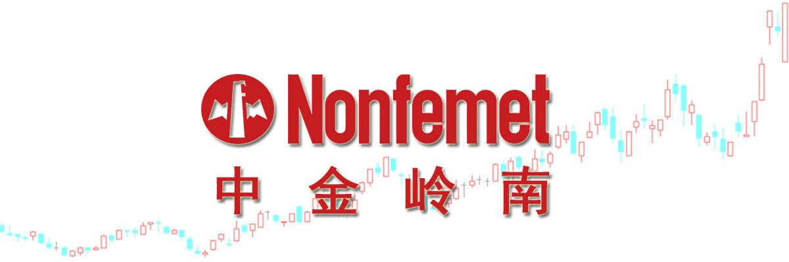
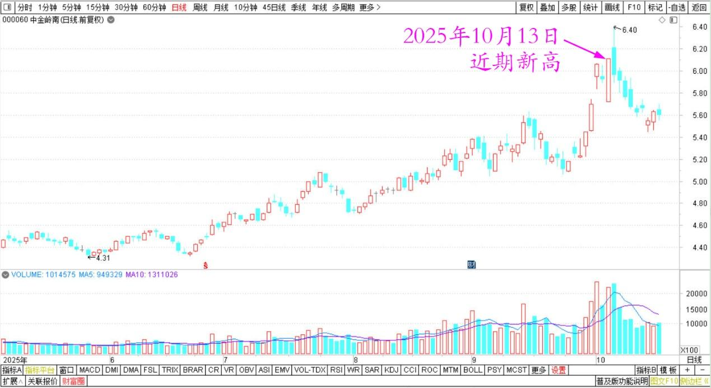
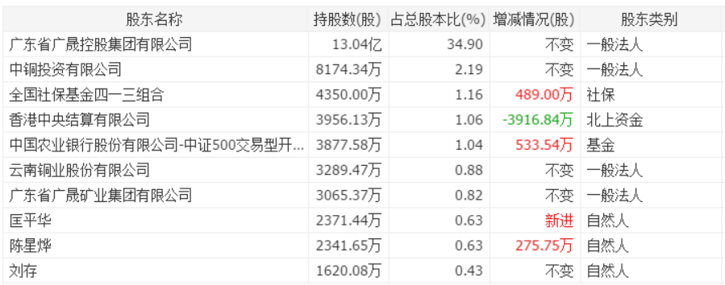
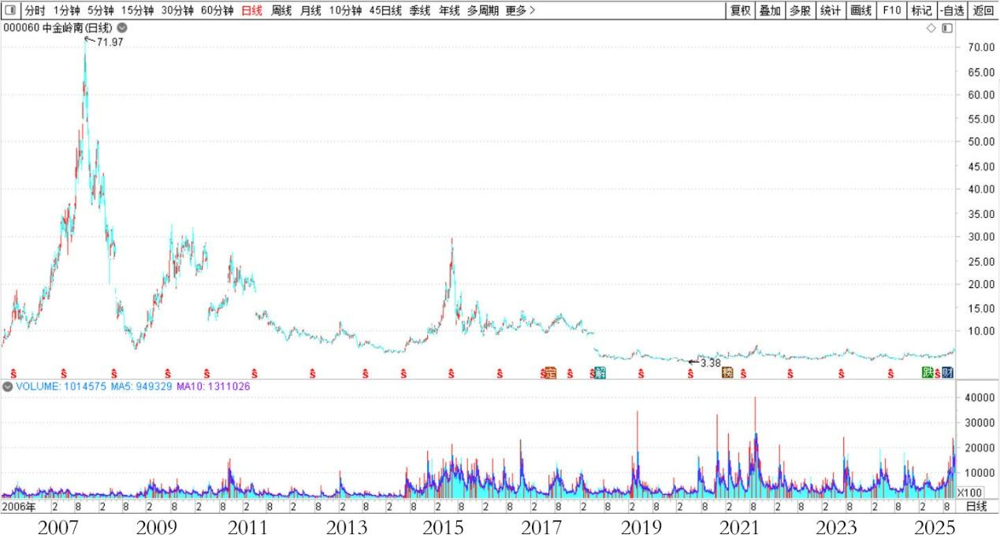
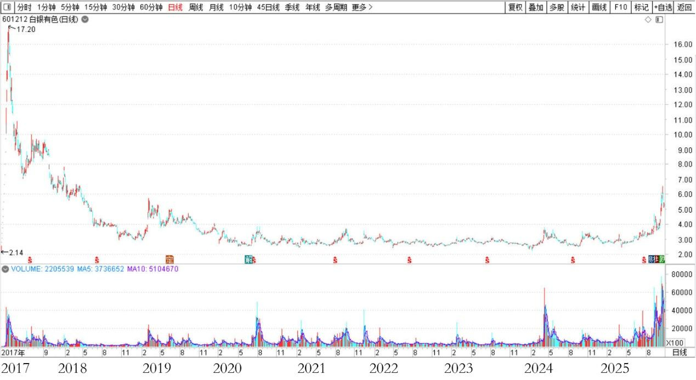

192篇.历史上中金涨得比白银更疯

清一山长 [2025年10月13日20:24](https://www.zhihu.com/pin/1961165440949650683)老挝

中金岭南也近期新高了。

中金岭南2025年5月～10月日线图

十大中，新进入一个大户，一口就吃了两千多万股。看样子，我马上就要被这些新人逐出十大了。

这些新人才是牛人，他们出来开干，我们这种小散就该消失了。

中金岭南2025年中报十大股东

**不过我的持仓成本低，不怕**，输时间不输钱。这些牛人刚赚完白酒的钱，就来玩有色，效率太高了，不得不佩服！

**我继续一股不少，坚持持仓中金岭南**。反正现在也才6元多而已，我不恐高。过了10元再恐高也不迟！

**我就喜欢这种慢慢涨的。涨太快，我都拿不住**！

洛钼港股从3元多，慢慢涨，到现在17元了，我还持有不少。如果涨快了，像中糖一样，可能我赚了50%就跑了。我就丢大了！

喜欢岭南，慢慢表现！

另外比较以下市值：中金才220亿市值，白银已经413亿市值了。**市净率、PE等，中金都比白银低估得多。这也是我重仓主要在中金，而非白银的核心原因！**另外，历史上中金涨得可比白银疯。

中金岭南2006～2025日线图

白银有色2017～2025年日线图

现在它怎么可能比白银更便宜呢？

有一天，中金岭南涨到400亿，跟白银市值接轨，我算算，我可以赚快两倍呢？先做做梦，万一实现了呢？

（别跟风喔！我说说玩的。我现在一股没买，早就买够了，我的成本低于4元。）

**（标题、图片为编者所加）**

文章音频：

[609篇.历史上中金涨得比白银更疯](http://link.zhihu.com/?target=https%3A//www.ximalaya.com/sound/927445067)

**参考链接：**

[185篇.有色逻辑得验证，和大家反过来走](https://zhuanlan.zhihu.com/p/1958220089020097164)

[186篇.用涨了的矿，换低位的矿](https://zhuanlan.zhihu.com/p/1960840960616399003)

[187篇.在绝望的时候进场，随欢呼的浪潮退场](https://zhuanlan.zhihu.com/p/1961858710361047662)

[188篇.冠农的技术图形与走势](https://zhuanlan.zhihu.com/p/1963456936990204416)

[189篇.白银涨停，冠农不涨停](https://zhuanlan.zhihu.com/p/82013845894)

[190篇.是狼还是羊？](https://zhuanlan.zhihu.com/p/1965856208259900157)

[191篇.今天上了白银主力的当](https://zhuanlan.zhihu.com/p/1967003445232918755)

[链接汇总（截止2025年10月13日）](https://zhuanlan.zhihu.com/p/621215591?utm_psn=1967007144831350474)

