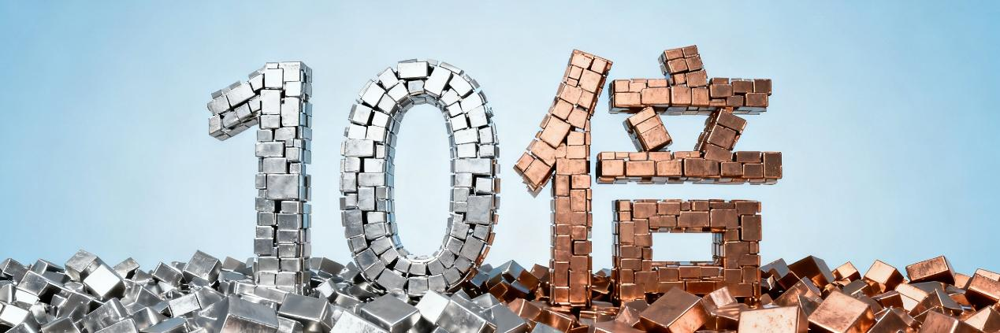
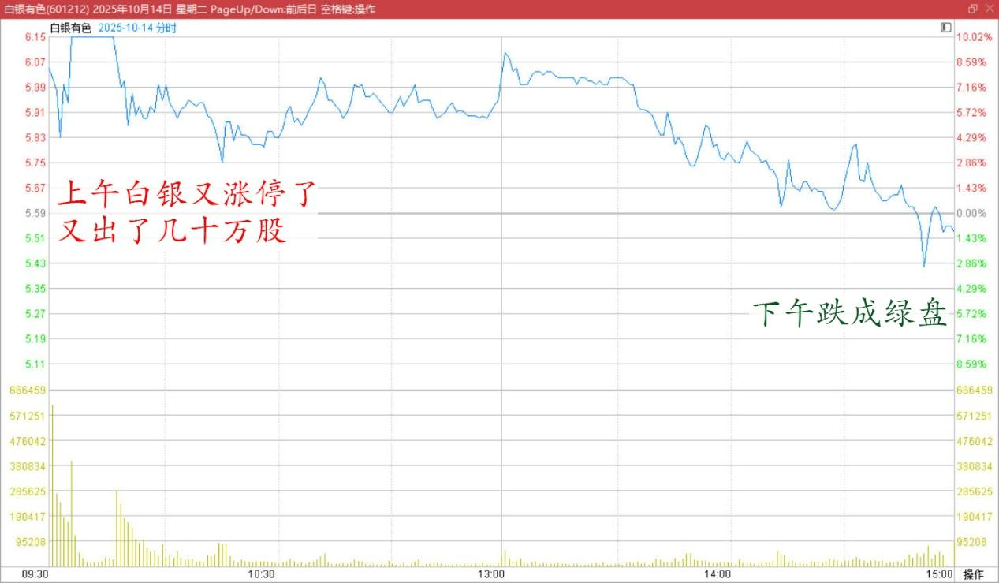
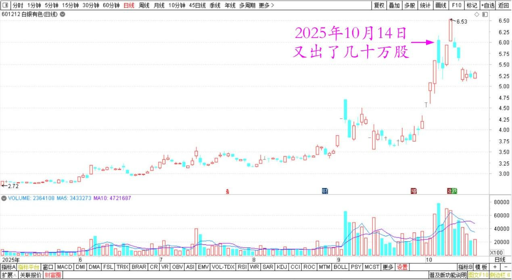
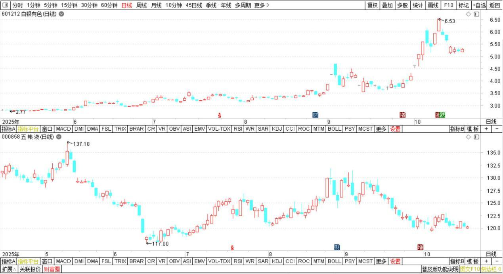
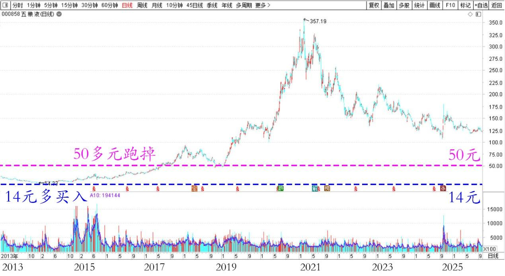
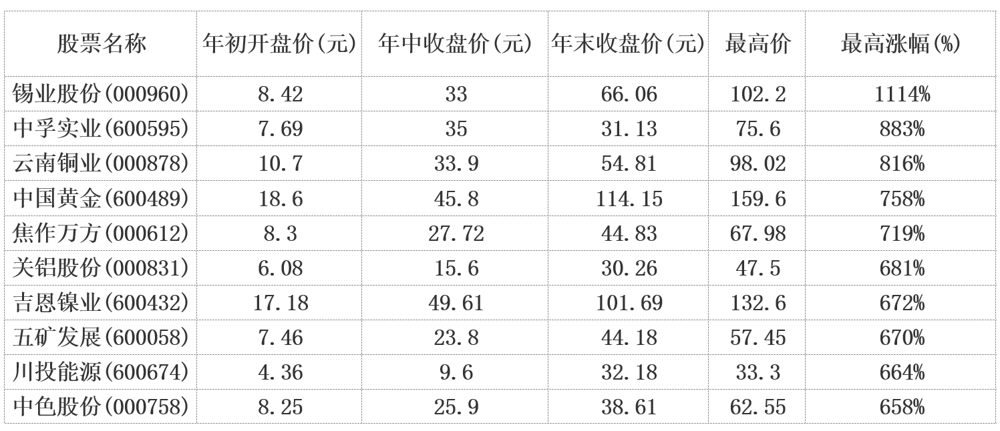

193篇.有色也能涨十倍？

**清一山长** [2025-10-14 21:44](https://www.zhihu.com/pin/1961547979472212698) **云南**

今天早上去了贵州，中午坐火车回云南。上午看白银又涨停了，忍不住上午又出了几十万股。下午一看，居然跌成绿盘了？真是想不到，早知道，上午出光掉多好，可惜我还是没摸透主力的心思，主力太厉害了，我不如也！

白银有色2025年10月14日分时图

白银有色2025年5月～10月日线图

正好其他有色都在跌，我明天补回仓位，等于白赚了一个涨停甚至还多。比如我补仓的如果本来就是低位，还跌了5%以上，我岂不是相当于多收入了15%以上的筹码？

**另外我观察到：有色涨的时候，酒类都在跌。但有色跌的时候，酒股票却在涨？**

白银有色、五粮液2025年5月～10月日线图

难道有色，真的就是这帮“酒老板”做起来的行情？真这样的话，有色也能像酒股一样，也涨十倍吗？

2007年是涨了10倍的！

这样的话，我可不能像原来一样，14元多买的五粮液，50多块钱我就跑掉了。如果我拿到200多再跑，我就太牛了。谁能想到酒可以赚这么多呢？

五粮液2013～2025年日线图

**有色怎么地，我认为也比酒水更“硬通货”一点吧？说不定，还真能涨十倍呢！**

[2007年有色板块十大最高价涨幅股](http://link.zhihu.com/?target=https%3A//www.cnmn.com.cn/ShowNews1.aspx%3Fid%3D148045)

**（标题、图片为编者所加）**

文章音频：

[610篇. 有色也能涨十倍](http://link.zhihu.com/?target=https%3A//www.ximalaya.com/sound/928391480)

**参考链接：**

[185篇.有色逻辑得验证，和大家反过来走](https://zhuanlan.zhihu.com/p/1958220089020097164)

[186篇.用涨了的矿，换低位的矿](https://zhuanlan.zhihu.com/p/1960840960616399003)

[187篇.在绝望的时候进场，随欢呼的浪潮退场](https://zhuanlan.zhihu.com/p/1961858710361047662)

[188篇.冠农的技术图形与走势](https://zhuanlan.zhihu.com/p/1963456936990204416)

[189篇.白银涨停，冠农不涨停](https://zhuanlan.zhihu.com/p/82013845894)

[190篇.是狼还是羊？](https://zhuanlan.zhihu.com/p/1965856208259900157)

[链接汇总（截止2025年10月13日）](https://zhuanlan.zhihu.com/p/621215591?utm_psn=1967007144831350474)

