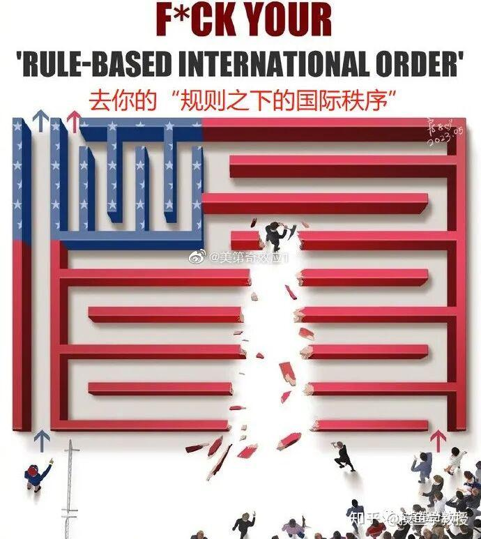
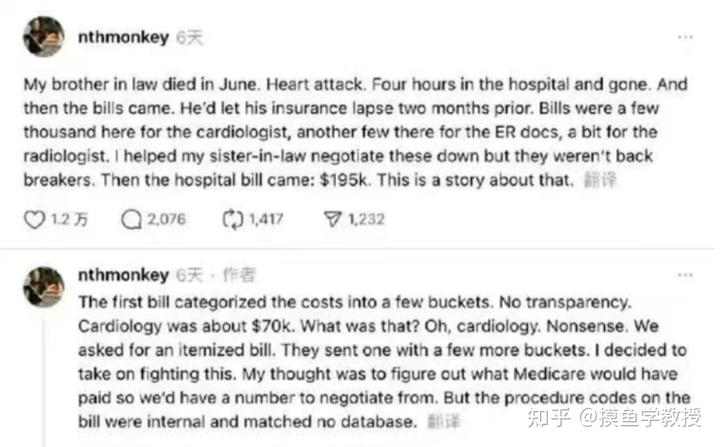

英美权贵们，用教育，食品，医疗，以及金融四大手段，加上消费主义的媒体灌输，思想控制，牢牢地锁定了大群的牛羊们，终身成为他们的炮灰和羔羊！

屁民的一生，就是要用一生来做牛马。在利益集团划定的框架内。。。学习，成长，生活，工作，死亡。用尽一生的努力，来为利益集团服务。

**而少数的特权阶级，他们可以直通自己的目的地！过上自由的生活。**

特权阶级，比如金融大鳄，完全可以利用规则，来控制世界的一切，控制经济以及一切，甚至利用涨跌，来为自己谋利。

上面这个图面中的“打破规则者”，似乎能够给小民们带来希望。但这只是幻想罢了。这些特权阶层是拥有暴力机器的。 正常的情况下，这个想要打破规则的人，并不能带领大家走上一条轻松的近路，可能只会为自己惹来巨大的麻烦，会被以“破坏者的”身份被规则制定者给消灭。

谁想改变现有的格局和现状，就必须拥有一样强大的暴力机器才有资格对话，不是你勤奋努力付出就可以的！比如中国，想要在“美国制定的国际规则范围内”，走出一条自我发展的大路。但只要我们想要走得到的结果，违反了美国的利益。美国就会毫不犹豫的下手，全方位的打击中国，甚至包括热战。除非中国强大到美国对付不了的情况下，中美才会“和平共处”。 这就是中国在不停的下饺子玩军事机器的原因！

普通老百姓，你有啥资格去改变规则？**只能有两条路---参与或者离开。不玩！**

我的选择，是离开这些利益集团！我不玩了。

我用简单饮食，离开食品利益集团的控制！也离开各种慢性疾病的威胁。

我用自然疗法，奉行道家的健康生活方式，尽可能地远离医疗利益集团的控制。

**医疗利益集团最恐怖的手段，是可以借用一个根本就治不好病的“医院”，其实是抢钱一样的，把老百姓的一生继续抢光！**

这位美国网友的帖子很长，这里节选一部分：
“我姐夫六月因心脏病去世，在医院仅四小时。两个月前他的保险刚失效，账单接踵而至：一张 19.5 万美元的账单。
我要求逐项明细，没有回应，反复追问，才勉强拿到带 CPT 代码的账单。但这些代码背后规则复杂，几乎无法理解，更别提质疑。于是我想到用 AI。Claude 分析后发现，医院存在严重违规：主手术费之外又重复计费子项目，金额高达十几万美元；还使用了“住院专用”代码，但我姐夫根本没住院；甚至所有用品都被按 Medicare 价格的 150% 到 2300% 收费。医院完全自定规则，企图从外行人身上捞黑钱。

这就是美国的“白衣天使”的丑陋行径----送人到医院里面，你就是送钱大使。他们用四个小时的假装“抢救”，让你付出19.5万美元的账单！反正只要是有机会，他们都会狠狠的咬你一口。以及让你的亲人背负沉重的负担！

其实想通了就简单了---

**这个世界上，没谁是来侍候你的。这些利益集团设立，以及存在的根本目的，就是要让你掏钱做牛马的。没有例外！**

想要不做牛马，只能自己想办法！

因此，我决心自己作孩子的教育，避免他们教我的孩子将来去做牛马！

我自己研究健康，毕竟自己将来被医疗利益集团收割！

我自己做自己的养老保险，避免自己成为被恐惧操纵的木偶。

**一句话：寇可往，我也可往！资本集团在哪里，我也在哪里。**

我一看，啥保险公司，啥国家机构，我们社保的各种组合，不都在买股票吗？

我要啥社保？五险一金？我跟这些人站在一起不就行了吗？

这就是我的策略---跟随！这些社保公司投资什么公司，我跟投不就行了？有啥难度呀？无非就是克服人性的弱点，长期主义击败短期投机就行了！

清一公社，就是我的伙伴们一起玩的“独立生活，自我保险”的小群体！不再依靠这些大集团来保障我们的未来！

我们先让自己的孩子去做“自由人”！不再被资本束缚。

我们的后代子孙，不再需要绑在资本的战车上当炮灰。

而是可以去像自由人一样生活！而不是像牛马一样苦卷！

我们用资本主义的手段，逃离资本主义的异化！