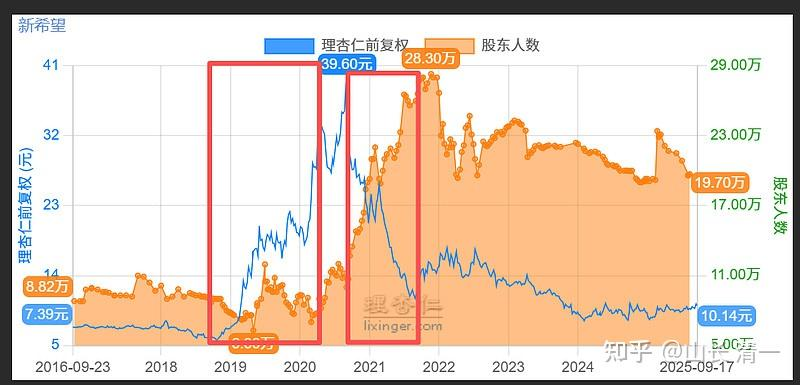

有个朋友问我对猪周期怎么看？我正好有个朋友8元的时候买入新希望，后一路上升，到了40元。当年还老告诉我她赚了（几个亿—）。不知道高点走了没？现在又跌回来了。

能买不？我看看散户数量， 结论是不能买。

不过古怪的是：新希望的利润跌得一塌糊涂，多年不分配利润了。但牧原股份居然还10倍市盈率？分红居然还不错？这到底是不是周期底部？不太像呀？

转雪球文【回顾一下当年新希望的整套流程，经典。

1. 股价从5块多一路涨到33的过程中，压根就没有散户入场，反而是散户不断卖出（股东人数减少）

2. 从33回调到27的过程中，第一波散户入场。

3. 从27再一路涨到40的过程中散户都没有入场。

4. 从40开始下跌，一路跌到22的过程中散户大幅入场（股东人数大增）。

5. 随后三个月股价从22反弹到26，部分买入的散户解套后聪明地跑了。

6. 最后一路跌到11块，散户全方面入场，机构派发完毕，只剩下散户在寒风中瑟瑟发抖。

我的理解：

1：主力操盘的周期，已经拉长到了10年的周期了。拉升期都有三年，下降和调整平台整理期七年。

2：现在的股民不好骗了。新希望从7元拉到33元，散户都没有跟风。

33元回调到27元，散户才开始入场。说明前期散户一直在观望，一看下跌才开始买入。不追高已经成为散户的风险意识了。

散户真正的大量涌入和买入，发生在下跌的过程中，跌到2022年最低11元的时候，散户涌入最多，达到了29万人（快赶上中国建筑的36万人了）。

3：目前为止，未发现主力进驻迹象。形成平台整理。但散户也坚决不肯割肉。下跌80%的惨跌中，未见散户明显减少。

结论：不能进入。如果主力要进入的话，应该还有一轮破位下跌的！

不过：如果牧原赚钱，新希望赔钱，而且还多年不分红的话（我看雪球上次分红是2016年），这个股应该没有啥实在的投资价值！

另外---民营企业，没有恶龙来守护企业，也不符合我的投资原则。

继续零买入，只是观察，学习了解主力的操盘动向。毕竟上一轮猪周期，这只股是很风光的！