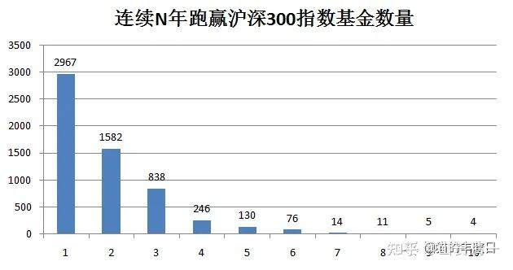
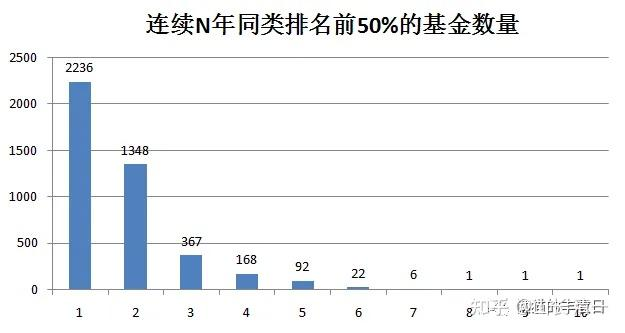

巴菲特说：普通人，就买指数基金算了。这个道理，我觉得对！

不过所有人，都觉得自己不普通。都是天生赢家。因此才进入股市！

专业的基金投资人，当然更不普通了。这些专员人，天天研究市场和金融，每天操心就是怎样买到最有潜力的股票！他们的战绩如何呢？

看起来比大猩猩随意投飞镖的概率，也高不到哪里去！

**市面上，股票基金+混合基金一共7926只。**

**2020年，一共有2967只基金跑赢了沪深300指数。**

**但连续10年，都跑赢沪深300指数的基金，总共只有4家！**

**博时主题行业，作为其中两个主动性基金（其他两个是被动基金），她连续10年，每年都能跑赢沪深300指数。**涨了310% 。

不过相比我的业绩，还是差一点。可见我的运气还是超级好！2011到2020年，正好是我财富增长最快的期间、这个考评周期的前五年就增长了10倍。

基金资料的原文链接

[连续十年跑赢沪深300的基金，全市场只有4只](http://link.zhihu.com/?target=https%3A//mp.weixin.qq.com/s%3F__biz%3DMzkzODQ1Mzc1Mw%3D%3D%26mid%3D2247505370%26idx%3D1%26sn%3D3b39b5682f97e8a35b88156354c165cf%26source%3D41%26poc_token%3DHBQKEGmjt6l80zbUkofBtnIsHj837-SyUh2lc7Xr)