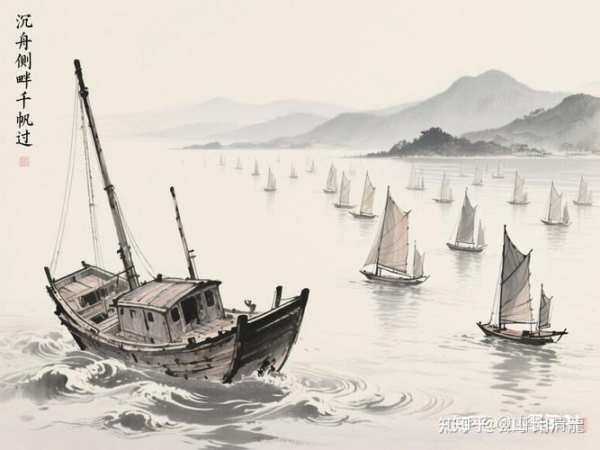

2026年，对清一武道馆来说，意味着什么？

清一武道馆，已经拿到了一个含金量极高的泰拳世界冠军---世运会冠军。

**那么：对于当事人来说，是不是拿到一个世界冠军，就证明她是武林高手了？可以安享荣誉了？**

也许这样想的话，最好的方式，就是再也不去打比赛了。防止某次战败后，失去“世界冠军”的光环。这就是有些聪明人自以为是的“急流勇退”法。这也是爱面子胜过爱里子，是一种投机取巧，不思进取的思维方式，这种短见识的想法，骨子里面毫无荣誉。藏着的都是自己的个人算计和利益权衡，而不是师门的责任和荣誉！

我来国内的时候，带两个冠军班的孩子去逛商场。正好见到谷爱凌作为做代言人展示的某品牌练陈列。我就问两个学生：为啥我们拿到的泰拳世界冠军，含金量，难度，竞争的激烈程度，都比谷爱凌这种参与人数很少，只有极少数有钱人才能堆出来的冬季运动项目更高。但为何商家，却不去找我们的拳手签约当代言人呢？

她们表示无法理解。我说：其实媒体和品牌方，只是为了你的名气来付款的，不是为了你的水平来付款。谷爱凌拿到的奖牌， 是中国原来从来没有拿到过的冬奥会冠军。这个项目中国玩的人很少，是中国的劣势项目，特别烧钱。但谷爱凌在参赛前，中国的官方就已经勾兑过，知道她的实力是可以拿世界冠军的，而且谷爱凌为了配合中国的身份，还专门修改了自己的国籍，代表中国来参赛，等于她是送给中国的国礼。官方层面早就知道结果了。因此开赛后，中国的媒体才得到方向，会去主动的，大量的报道她的各种事迹，转播她的赛事。因此导致全国人民几乎都知道她。拥有了媒体传播的巨大知名度，赛后，商家才会请她来代言的！甚至她现在做啥事都有媒体来报道，不断提高知名度，这才是流量明星。武术世界冠军的地位，本质上也这种规律。

我们拳手拿到的泰拳世界冠军，其实是一匹黑马。国家体育总局自己都不相信有可能拿冠军。领导赛前来队视察都说：希望第二天还看到中国队能够继续出现在赛场上。因为前面多年的世界泰拳锦标赛，中国队都在第一轮就被淘汰了。因此媒体的关注，是打赢之后，才开始关注的，赛前的宣传报道关注都很少！而且大家都心怀疑惑---不知道这个金牌是怎样拿下来的。肯定有人猜想，是不是花钱砸出来的。

因此拳手即使获奖了，而且是中国历年来的首金。但这个赛事，基本上没有啥知名度。商家当然不可能拿钱出来买你的代言了---因为国人根本就不知道你存在。只有极少数人知道！专业圈内的人知道是真功夫，真本事！

如果今后拳手，能够继续代表中华武术，代表太极去参加世界范围线的实战，真的有把握去不断拿到世界冠军的话，顶层的领导，知道我们这些拳手，有实力去拿冠军，就会运作中国的媒体来赛前赛后的跟踪采访报道，造势。最终就会全国关注该项赛事，最终才能算是真的打出来了，就会扬名天下！

这些媒体一旦加入进来，一定会挖掘你的各种故事，你的培养背景。三语四语的学霸素质，新闻题材越来越多，爆料越来越精彩，你就会成名天下！

因此，将来的商家一定会拿百万千万的代言费来找你，你就成了“明星”

**事实上，国家体育总局这个层面上，现在已经开始有动静了。**今年12月份的全国泰拳锦标赛，已经针对性的安排了比赛的内容。首先是完全按照IFMA的赛事规程，增加了原来从未安排过的，45公斤级的比赛。原来一直没有这个级别的比赛，但IFMA有。另外就是取消了身体的护具，与泰拳世界锦标赛规则相同。这对我们发挥正蹬技术特别有利。过去多年，我国锦标赛都是重点考虑安全问题，全身护具不可少。说明一个事实：国家武术中心的领导。正在考虑用世界标准的实战来办全国锦标赛，用于检验中国拳手面对世界赛事的实力，如果拳手比赛良好，特别是中国武术的含量是真的，能够压制外国拳手。我们国家将来一定会重点推广。但你必须先接受真正的实战检验，不能是意外，也不能是投机取巧（比如场下花钱买对手让输掉）。一旦我们的拳手2026年能够在世界锦标赛取得不错的成绩，我相信国家武术中心，将来还要申请在中国举办泰拳世界锦标赛，作为很多小国都举办过世界锦标赛，中国没有举办就是因为太丢人，每次第一轮都打不过。现在我们拳手能赢，用上一届的领导的话，就是我们起码能够拿一块金牌。这才会在中国举办世界锦标赛。这时候的全国媒体，肯定会全面的关注。 这时候我们的拳手去打比赛，就有很多的媒体资源可以使用了！虽然未来的泰拳世锦赛的级别比不上世界运动会，但媒体对你拿冠军的报道，赛前赛后，每日跟踪，采访等等，肯定比世界运动会多得多。这时候，你才是“一举扬名天下知”的时候。2029年的世界运动会，中国才有机会以前七名的资格代表去参赛。

因为中国对武术，对传武的热情一向是很高的。媒体报道之后，你肯定能够获得比谷爱凌高得多的知名度。说实话：谷爱凌是美国人培养出来的冠军。但我们的泰拳冠军，是我们中国人自己培养出来的，媒体肯定更喜欢挖掘这些题材--学霸拳手。因此，更容易天下扬名，全国的领导都会来捧场的，说不定拳手自己老家的领导，就直接送一套房子给你了！只要有知名度，领导们都愿意表达对你的喜欢和尊重！

因此，世界冠军，武术高手的称号，并不是一次锦标赛的比赛拿到就行了。而是要用自己的实力，**不断捍卫这个称号，才能一举成名的！因此，一两次比赛就指望天下扬名，没出现就自我否定，以为拿了世界冠军也没见到啥好处，因此练拳没有出息，拿不到名利。要去追随普通人的方式去走。这种思维，就是非常典型的清黑思维---“急功近利”“自以为是，是失败者思维方式！**

**我们要了解这个进程，从一个很有代表的。世界最强格斗国家---俄罗斯拳手身上就看出来了！她们每年都能夺走最多的冠军奖牌。比如：最近与张伟丽比赛的**瓦伦缇娜·舍甫琴科，看她的简历。就充分说明了一个世界冠军是怎样练成的！

从5岁开始练拳，37岁还在征战拳场的拳手瓦伦缇娜·舍甫琴科（英文：Valentina Shevchenko）。

女，1988年3月7日出生于[苏联](http://link.zhihu.com/?target=https%3A//baike.baidu.com/item/%25E8%258B%258F%25E8%2581%2594/199168%3FfromModule%3Dlemma_inlink)[吉尔吉斯苏维埃社会主义共和国](http://link.zhihu.com/?target=https%3A//baike.baidu.com/item/%25E5%2590%2589%25E5%25B0%2594%25E5%2590%2589%25E6%2596%25AF%25E8%258B%258F%25E7%25BB%25B4%25E5%259F%2583%25E7%25A4%25BE%25E4%25BC%259A%25E4%25B8%25BB%25E4%25B9%2589%25E5%2585%25B1%25E5%2592%258C%25E5%259B%25BD/4333014%3FfromModule%3Dlemma_inlink)伏龙芝市（今[比什凯克](http://link.zhihu.com/?target=https%3A//baike.baidu.com/item/%25E6%25AF%2594%25E4%25BB%2580%25E5%2587%25AF%25E5%2585%258B/3162957%3FfromModule%3Dlemma_inlink)），吉尔吉斯斯坦裔[秘鲁](http://link.zhihu.com/?target=https%3A//baike.baidu.com/item/%25E7%25A7%2598%25E9%25B2%2581/258354%3FfromModule%3Dlemma_inlink)格斗运动员。

瓦伦缇娜·舍甫琴科5岁开始练习跆拳道，12岁时开始练习泰拳。

2003年，舍甫琴科首次参加世界泰拳联合会（IFMA）世界锦标赛便获得青年组冠军。**（练了三年泰拳，15岁就拿到IFMA冠军---我们的拳手15岁才开始练拳）**

2006，舍甫琴科首次获得IFMA世界锦标赛成年组冠军。**（这一年她刚满18岁。首战就获得世界冠军）**

此后直至2010年，瓦伦缇娜又连续四年在IFMA世界锦标赛上获得冠军。**（所以，我说冠军班19岁之前，没有拿到全国冠军的学生，就不能留下继续打拳了。因为没有啥天赋，别人练了6年，18岁就拿世界冠军了）**

2010年第一届世界武博运动会（北京举办），舍甫琴科获得泰拳女子60公斤级冠军。

2012年，舍甫琴科时隔两年再次在IFMA世界锦标赛上获得冠军。

2013年第二届世界武博运动会， 舍甫琴科成功卫冕泰拳女子60公斤级冠军。

2014年IFMA世界锦标赛，舍甫琴科收获自己在该项赛事上的第8个冠军。（**2006到2014，8年8个IFMA世界冠军**）

2007年，舍甫琴科随教练帕维尔·费多托夫和姐姐前往秘鲁教授格斗，随后舍甫琴科入籍秘鲁，成为秘鲁公民。**【点评，俄罗斯优秀的拳手太多了，IFMA的冠军也太多了，不稀奇的。因此，她的教练，很聪明地让她拿到了第一个世界冠军之后，就转了国籍离开俄罗斯。让她成为了一个南美小国家的“国礼”，这样才更受尊重。将来很可能成为这个南美国家的一代宗师，“叶问”。也许这才是以后她每年都代表秘鲁参加世界锦标赛的原因吧？这个国家就靠她了。不断荣耀自己的国家，可惜是个小国）**

2010年和2013年，舍甫琴科连续两次获得世界武博运动会泰拳女子60公斤级冠军。

2014年IFMA世界锦标赛，舍甫琴科收获自己在该项赛事上的第8个冠军。

同年8月，舍甫琴科获得“昆仑决9·木兰传奇”女子60公斤级八人争霸赛冠军。【从记录上看，这时候拿了8个世界冠军的她，才是正式参加职业拳赛）

2015年12月19日，舍甫琴科迎来职业生涯[终极格斗冠军赛](http://link.zhihu.com/?target=https%3A//baike.baidu.com/item/%25E7%25BB%2588%25E6%259E%2581%25E6%25A0%25BC%25E6%2596%2597%25E5%2586%25A0%25E5%2586%259B%25E8%25B5%259B/61773367%3FfromModule%3Dlemma_inlink)（UFC）首秀获胜，以分歧判定战胜莎拉·考夫曼。

2018年12月，UFC 231，舍甫琴科击败乔安娜·耶德尔泽西克，加冕新任UFC女子蝇量级冠军。

2021年9月，UFC 266，舍甫琴科在第四回合TKO对手劳伦·墨菲，完成第六次卫冕。

2023年3月，UFC 285，舍甫琴科不敌亚历克莎·格拉索，失去冠军头衔。

2024年9月14日，UFC 306，舍甫琴科在与亚历克莎·格拉索的三番战中获胜，重夺UFC女子蝇量级冠军。

2025年5月10日，UFC 315，瓦伦缇娜·舍甫琴科战胜曼农·菲奥罗，第八次卫冕冠军头衔。

2025年11月16日，瓦伦缇娜·舍甫琴科战胜张伟丽，获得UFC322蝇量级冠军。（几天前结束的）

我们看了子弹姐的的经历，谁能不佩服一个拳手，为了荣誉，从5岁坚持到37岁？依然没有光荣隐退的想法！

同时，我们也感叹：我们的清一木兰们，实在是太幸运了。你们现在面对的世界冠军，几乎全都是这样从小以武术，以擂台为生命的人，是从小就热爱武术的人！一辈子献身给武术的人。

我们能够把一个资质平平，甚至是骨子里面并不热爱武术，不热爱擂台的学者文人，用一点技术，就送到世界冠军的位置上去，居然去击败这些从小就刻苦训练的世界级优秀拳手，不能不说是老祖宗留下来的宝贝多么的稀奇！看到这些世界级的优秀拳手被击败，我都有点不好意思。觉得对不起她们。

---但更多是自豪---我们中国人真是太聪明了，老祖宗太有智慧了。这些老外，练了几百年，都打不出我们两千年前就拥有的武道功夫！

同时也说明：生在中国，又是多么的幸运。在国外，你再爱武术，也只是一个拳手。只是一个运动员。

但在中国，如果你能打赢外国人，如果你能掌握中华武术，你就是中国人的民族英雄，会得到非常多的荣誉和利益！

而且我们是个大国---如果我们的拳手，能够成为14亿人眼中的国宝，这种商业价值不知道有多高。多少世界级品牌都要来捧你。但子弹姐在秘鲁---我相信她就算再努力，本国也没有啥品牌能够支撑她的。她将来就算是成为秘鲁的一代宗师，估计也没有多少好处。如果她文化修养上不够厉害，一辈子除了赚钱就没啥特别的文化地位了。

而在中国，成为武林高手，成为一代宗师的话，拥有这么美好的成功，成名的机会，甚至是发大财的机会，是全世界都不可能拥有的！如果现在初出茅庐的木兰们，居然会放弃这种机会去求一个打工证的话，我真不知道她的脑子里面进了多少水，才会抽抽才这样。如果她们相信了清黑的迷魂汤，连清黑的鬼话都相信，不知道这种人有多蠢。天堂有路你不去，地狱无门你偏来。

** 7天之后，我们清一武道的几个立志要当世界冠军的木兰拳手，就要出发去西安，征战今年的全国自由搏击锦标赛了！这是木兰们第二次征战自由搏击，决心在自由搏击项目上，也打出自己的精彩！**

等12月4日，刚刚打完西安的比赛木兰们，不会回泰国。而是直接就“转进”江城武汉，去参加今年的全国泰拳锦标赛，发挥我党我军连续作战的风格。马上就切换进入另外一种规则完全不同的格斗比赛。同时，这也是明年五月份在马来西亚举行的【IFMA世界泰拳锦标赛】的预选赛！

为了实现参加木兰们参加明年世界泰拳锦标赛的目标，原定我们还要派人去参加的“东亚泰拳锦标赛”。今年我们就不去了！因为举办的日期，正好和全国锦标赛重复，我们当然以国家为重，全体去武汉，在国家体管中心的领导面前，打出木兰的风采！肯定这是一次检验中国拳手含金量的重要赛事。

与2023年12月，我们首次参加全国锦标赛，没几个人参加的情况不一样。当年的ELLA还是“未成年人”，首次参加赛事，就击败了香港的优秀拳手，获得了冠军（51公斤的冠亚军争夺赛，ELLA是与明晓打，她在决赛就弃赛，拿了银牌）。Ella运气很不好，2023年是遇到了明晓弃赛失去冠军机会。2024年是判给了耿春蕾，再次失去夺取全国冠军机会（这场判决有争议）。今年她才有第三次参赛全国锦标赛的机会。

但今年，公主班有更多人参加本届成人赛事。因为公主们长大了，明年会更多的，小明慧明年就18岁了。原来的青少年冠军陆韵如和李想冠军，现在刚满18岁，现在是首次参加今年的成人泰拳赛事。也许公主班今年就有人被选入国家队，代表中国去征战世界锦标赛呢！

12月的全国泰拳赛，冠军班也派出了几个18岁的成年拳手参赛，虽然只练了一年，也想去历练一下。显然清一武道馆，比两年前阵容强大一些了！

2026 ，是清一武道批量冲击世界冠军的一年，我们已经不再是【一个人的武林】了。我们正在成林！

**2026年，清一武道馆将派出共计接近70人的队伍，去参加全国泰拳和自由搏击锦标赛**。此后每一年都维持不低于此数量的拳手参赛。因此，从2026年开始，清一武道馆，将成为全国人数最多，也最强大的格斗队，顶峰时期2027-2028年，甚至可能超过百人战队。我们将是中国武术征战世界的最主要的格斗力量！

**我们一起期待中华武术的崛起之日！**

*过去沉沦的中华武术人，不妨碍新人的崛起！*