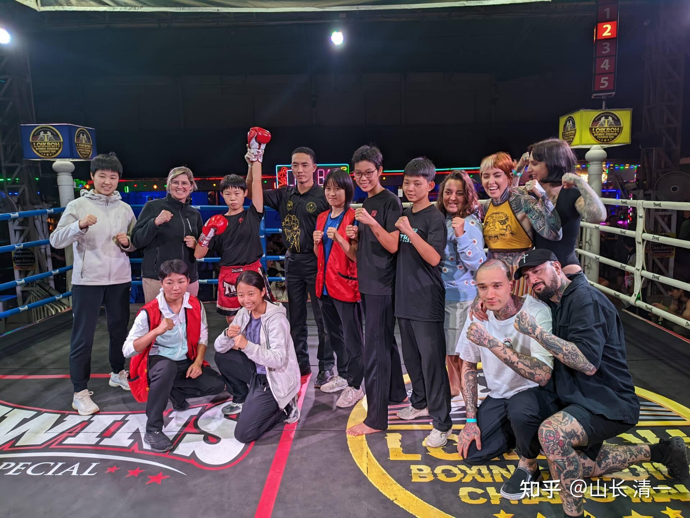
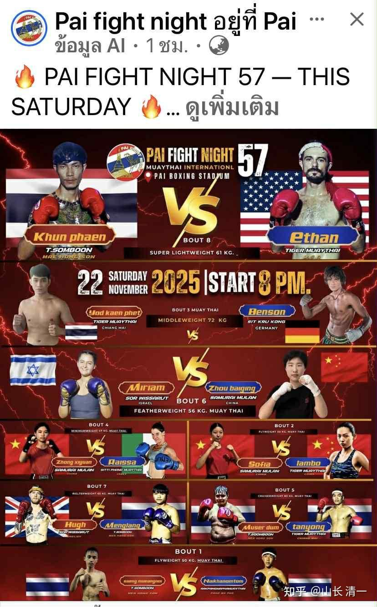
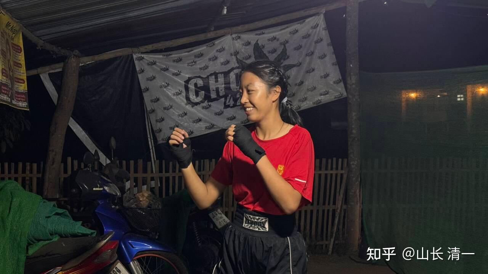
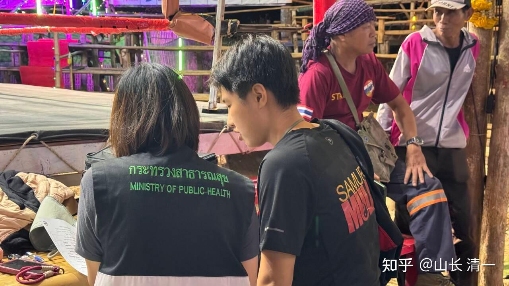
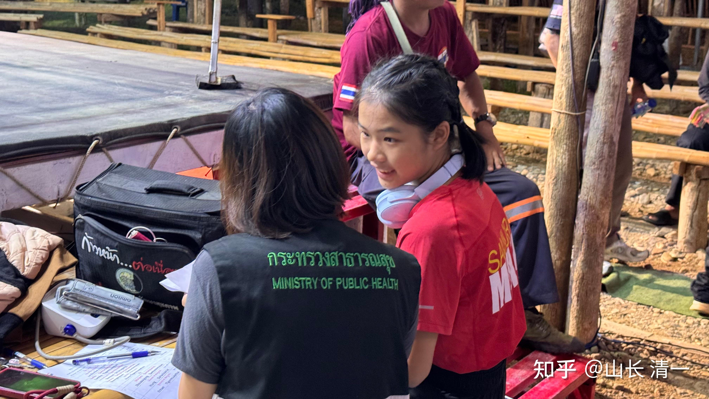
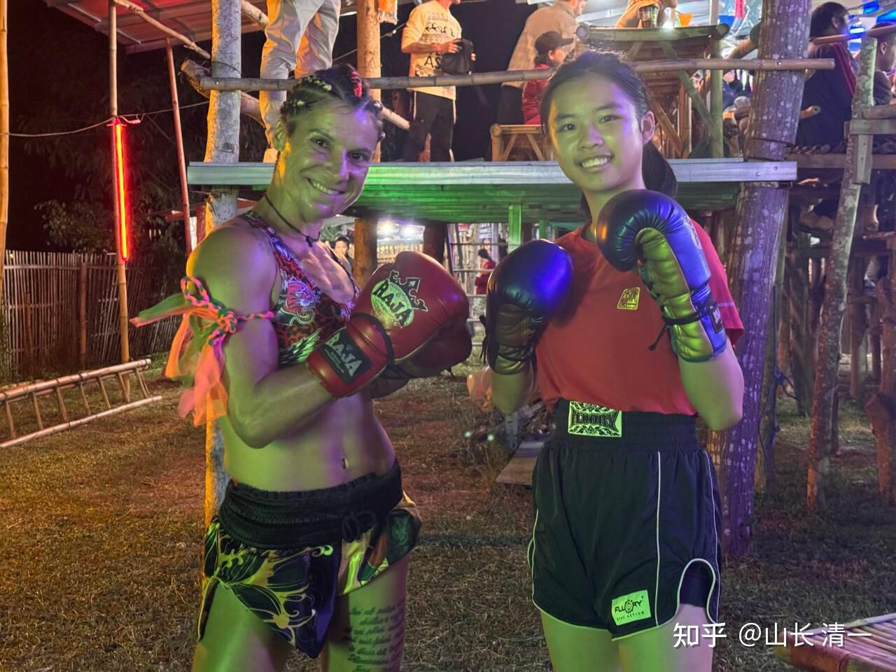
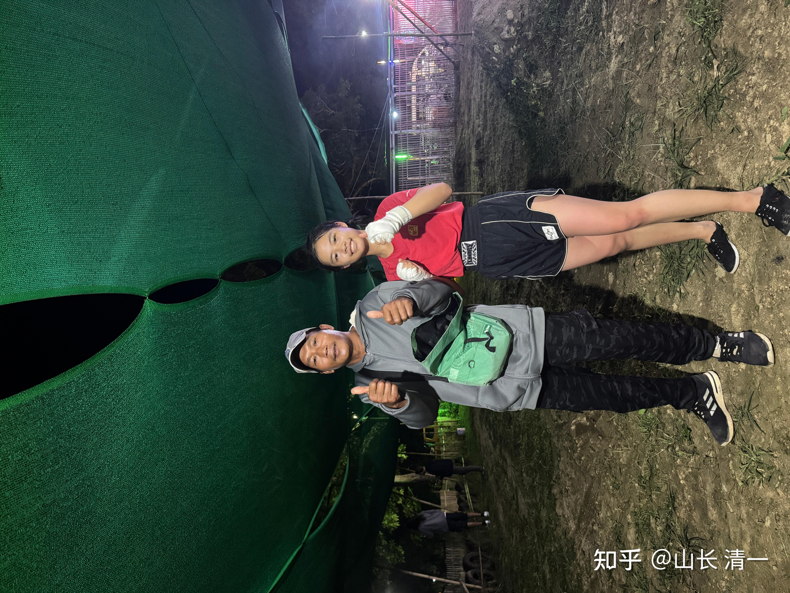
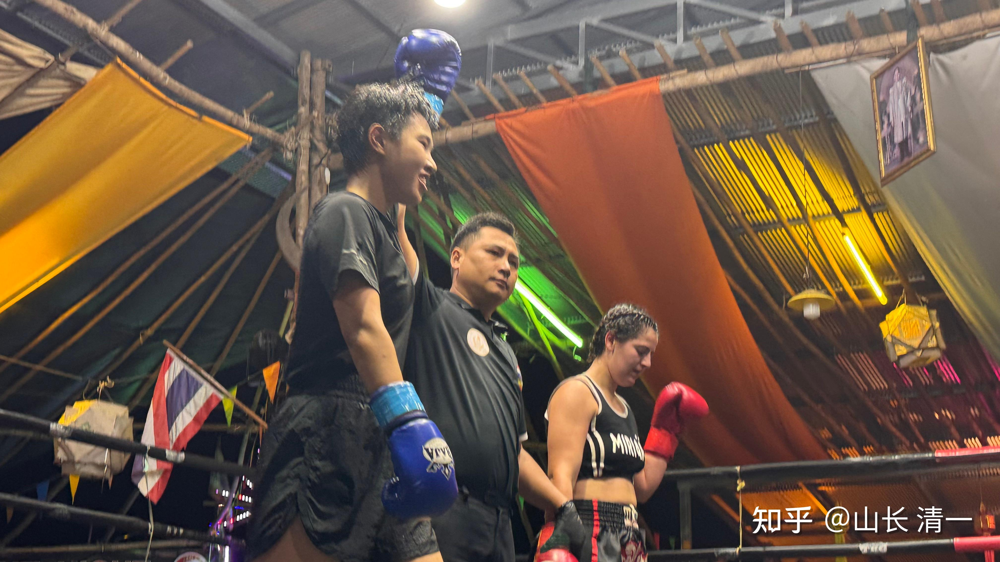
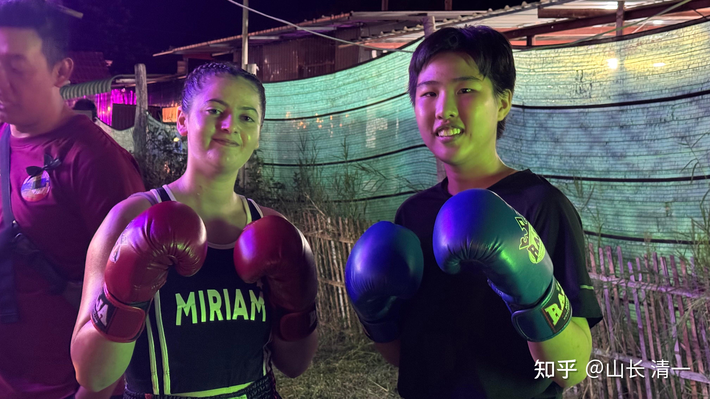

昨晚陆韵如公主和李想公主在清迈参加泰拳职业拳赛。

两人分别在第二局，第三局KO了对手，把对手都打哭了。收获了一堆粉丝！

在公主班去年8月参加自由搏击赛一金未得，因为粉拳太粉了，被狠狠的羞辱了一顿之后，最近一年，都在强化提高攻击力。训练方式也改进了，今年一年公主们在泰国打泰拳职业赛，大部分场次都是以KO对手作为结束的。不在纠纠缠缠的打满五局了！

这个结果，也导致一个不好的结果：就是清迈的女拳手大部分都不愿意和木兰拳馆的人交手，因为很容易受伤，老被公主们KO。昨天比赛， 主办方要求我们不许出肘攻击。因为知道木兰拳馆的肘法厉害，已经把好几个女泰拳手的脸破相了。这也是一些女拳手被要求和我们打比赛时候的要求---尽量避免我们的优势项目。不知道以后会不会禁止我们出腿了！哈哈！

*收获一堆外国粉丝！*

记得木兰们刚在清迈打比赛的时候，场上的外国人，对中国的拳手是鄙视的，很看不起。对手打我们，就算没有达到全场都欢呼鼓励。我们打赢了也是冷场的。让我们感到中国拳手真的格斗地位很低！泰国的主办方对我们的态度，也非常的不友好。

但现在，由于木兰们战绩出色，泰国的拳界对我们都很重视了！会安排一些不错的比赛！

比如今天，就有三名公主拳手都被安排了比赛（木兰们名气更大，更难安排比赛，最近木兰比赛的也总是以KO对手为结束）

下面是今天公主们远赴拜县的比赛海报。有意思的是：没有泰国拳手和我们打，公主们的对手，全是外国人！的确说明泰国拳手不想跟公主们交手了！

今晚北京时间九点开赛，拜县周日比赛：

王静恩第二场 对阵来自中国的外家拳手

钟熙媛第四场 意大利拳手

周柏清第六场 对阵以色列拳手，海报是重点介绍的，应该是女生的压轴戏。据说以色列的格斗技术马伽术很厉害。不知道遇到木兰结果会怎样？我印象中，我们拳手是第一次打以色列人。

第一个上场的人，是王静恩，她刚在11月结束的自由搏击锦标赛上，以一系列的正蹬击败了国内优秀的外家拳手，打的对手没脾气，拿到了全国冠军！

今天她的对手是一个中国的拳手，有意思。我们很少在泰国被安排与中国拳手对战。

*周柏青的对手是以色列人 正在检录处登记拳手资料*

*钟公主的随手是意大利人。我怀疑个子矮小的45公斤的她怎么打？*

9:55更新

王静恩的第一场比赛打完了。技术压制，毫无悬念的胜利，场上对方被多次击倒。

前方报道：第一场刚打完，王静恩比赛刚刚打完。是按照三局安排的，没有安排五局的赛事。以点数获胜[表情]

对方静恩踢倒了她特别多下，也膝了她很多下，整场处于在被KO的边缘。但因为考虑到是三局，所以就硬撑下来了。

静恩公主的笑话故事：她原来偏文，不太想练武的。她有点怕这种对抗性的竞争。我说她18岁之后，就要去她父亲的学堂当教师去，不能想别的公主18岁直接当教师。因为女儿服务家长开的学堂，是天经地义的，今日不能跟家长抢师资，她应该去帮家长。她急坏了，说怎样才能留下来？我说只有打了冠军才能留下来继续学习和练武。没想到这小丫头真的就使劲练武去了，这一下就从文公主就变武公主了，真拿了冠军。看样子她是真不想回家。女生外向（苦笑）。

半小时后钟公主打意大利人，应该不是黑手党吧[表情]。大概10点30以后就出结果了！

10:50再次更新播报：

钟公主打满回合后判输。

韵如报道：这次和钟熙媛打的意大利选手，是去年把陈子璇TKO的是同一位，练习泰拳有九年的时间，浑身是肌肉，体格很壮。但钟应对的非常好，正蹬踢中了对方很多下，对方也明显吃痛了。只是双方的体格差异较大，钟在内围不占优势，会容易被对方甩来甩去。但外围钟还是很占优的[表情]。与这种老手打，也没吃啥亏。算是一个挺好的锻炼机会。

*钟公主就算是输了，也收获了一个中国粉丝。*

23.40分更新：。。。

周柏青 对阵以色列马伽术拳手的比赛打赢了。

*观众欢呼支持的一方--以色列拳手很失落*

*赛前自信满满的样子。*

韵如公主现场报道: 本场比赛的优势特别明显！现场观众几乎全部都在支持以色列，还拿着以色列的国旗，欢呼声特别大（好像是专场粉丝？）。但是柏清打的非常碾压，让观众们想支持以色列的都喊不出声。最后宣布结果时，也有很多观众表示敬佩[表情]

看得出来：这些拳手都是成年的拳手，老手了。热爱泰拳的外国人。我们的三个小公主，还都是未成年人呢。只需再过一年，她们就更厉害了。预计明年这些公主就要参加成人锦标赛了。公主战队来清迈练拳已经三年了！三年就可以格斗技术成熟，可以去拿冠军了。超过这些学泰拳九年的老手。也许我们是全世界最快速培养全国冠军的格斗学校。

结语：

今天晚上我在清迈对即将出发去西安比赛的公主拳手们做了最后的技术指导。她们正在快速提升核心要点技术，预期明年公主们会打出非常精彩的比赛。木兰们在打完今年的全国锦标赛后，将全力采用全新的格斗技术来训练，预期2026年公主们都会取得更加靓丽的成绩。公主们正处在业绩爆发的前夜！