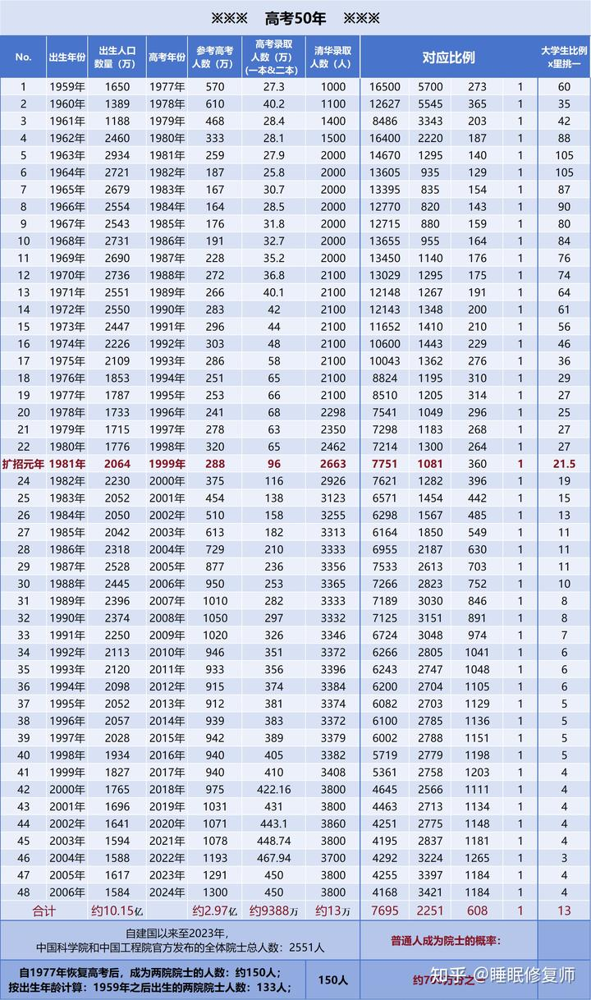
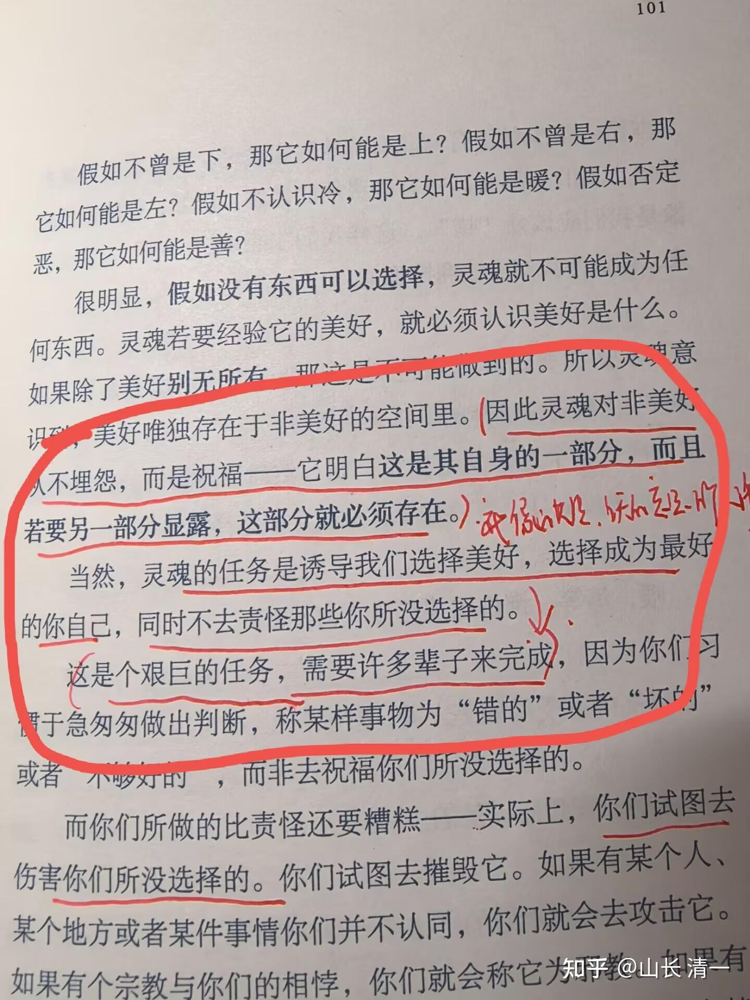

**所谓的【人比人，气死人】！**

**人内在，都有超越平庸的愿望和要求。不走正道，就会去走歪道。**

**人的成就感，来自于超越平庸的快乐和自信。**

很多发现自己沦为平庸的人，想获得超人的能力，就会用各种方式来“超越”他人。拼质的--有本事就喝茅台，没本事就二锅头。拼量的---有本事喝三瓶，没本事喝半瓶。

女生就喜欢去购物，去跳广场舞，去八卦，去贬低他人获取自己的优越感。

**其实：正路就是一路按照“社会标准价值观”超越他人，做到别人做不到的事情。**

比如你 18岁考上一个985，超越99%的人。

30岁升级中级主管

40岁当上主要领导

50岁当上核心。

60岁当上院士。成为千万分之一的人。

拥有这种地位，你跟其他没有正常的路径，到处去疯整，疯玩的人，心态，一生，结果都非常的不一样！

搞歪门邪道的人，就算也有一些本事，但保持稳定和良好的心态就很难。

比如S掌门，武功虽高，但他从小就非常缺乏社会认同感。也没上过大学，但自尊心强，他就很容易为了找到成就感，就成为疯子一样人，到处去贬低打压别人，去刷存在感。甚至加入清黑去刷存在。因为清黑为了利用他，抬举他几句话，就全都当真了。

这种人就特别见不得别人好。一旦发现别人的成就，特别是武术上的知名度，影响力，比他高一点，就启动其自卑感。内在的自我否定太严重，一定要跳出来，到处疯疯的去骂人，去求输赢啥的，用他以为“成功”的方式，想要来“证明”自己。其实，这些都是无效通道。别人根本不认。就算他赢了，也无法让人更认同他。他内心也原谅不了自己，我看就只能一辈子这样疯下去了。

我从小就不一样，社会认同感一直很强。因为基本上是按照社会评价标准来走的，而且走的比一般人更好。

中小学，我的成绩常常是满分，优等生，教师们都夸奖这个学生聪明，会读书。

17岁就进入985名校，一路都是周围人仰望的对象，自己也知道自己击败了大多数人同龄人。自然没有啥攀比之心，以后遇到说我怎么差，也无所谓。因为知道自己不差。

**越是下层人，越是说不得的！因为他们的自我认同度很低。一点就炸。**

全世界的中国人，都习惯用考大学获取自我认同度，也是过去40年形成的固化思维，其实这条路，错倒是不错的。

只是现在上大学，真没啥了不起了，甚至清华北大，也不如原来的稀奇了！

当然，你如果连大学都考不上，显然是妥妥的失败者，如果没有其他明显的成就标志的话。

**这时候，想要超越，就必须比几十年前，拿点更硬的实力出来了！光比大学文凭已经不行了！**

**比如“文人格斗，文武双全”之类的东西！就是超越同龄人的标记。**

粗略统计了一下，
**虽然普通人考上大学从曾经的百里挑一，变成了四个里面挑一个 。**

大学生占总人数的比例，差不多10%。只是同龄人中大学生的比例大大降低了。
**考上清华差不多万里挑一，（学习方面，努力的天花板。这里几乎是努力和天赋的分水岭了！**
**要想成为院士，几乎是千万分之一。**
**要想有点突破性的成果留名青史，基本上就是亿分之一了。没有天赋，几乎为零。**

** 我今天看了上面这个比例，突然想到，似乎我已经是亿万分之一了。**
如果

1：我完成了清一大学的建设，在教育上击败了美国。

2：我做了清一公社，帮助一堆人实现了财务自由。

3：我创建了清一武道，击败了西方现代格斗，在全世界重塑，振兴了中华武道。

这三件事情做出来，100年后，如果今天还有14个能被后代记录下来的“古人”，我应该是其中之一吧？

我倒是没有去追求这个目标，只是想：好像我就算不想要，也避免不了这种被后人纪念，甚至神化夸张的纪念！比如现在电影中的叶问形象，和真实的叶问相比，实在是天上地下。不知道100年后的张清一，也许就是一个多能全才大神了。还不仅仅是武功。

**我今天做的事情，就是导致自己肯定会成为亿万分之一的【留名青史】的人吗？**这真的是光靠“努力”做不成的事情呢。而靠的是天意，天赋！顺应了天道的结果。

上面名单中，差不多跟我同龄的院士，有133个。

我猜：100年后，恐怕没有几个院士，还会继续被后人记起来的！

现在的任正非，我认为比普通的院士牛多了。是一个非常了不起的人，也是一个改变历史的人。甚至是改变国运的人。

但我认为100年后的人，也未必记得他。因为100年后的科技，可能早就超越了现在的华为辉煌。不过万一有个【华为大学】，成为击败【斯坦福大学】的中华科技大学。任正非就绝对不会被历史忘记的！仅仅是科技和商业的话，他的名声也会腐朽的！

所以---只有精神产品的制造者，创造者，才能青史留名。

只是创造物质的话，会获取很多的财富，但想要青史留名就很难了。百年荣誉就更难了！

**我甚至认为：我的弟子们都比院士们更容易青史留名。**一旦5年后，我们真的实现太极格斗女打男世界冠军成功，成为各种中华传武门派的“一代宗师”的话，他们的国际地位，肯定比现在的中华院士更高。这可是传武，传统文化的大师呢。因为文化让这些弟子们成为“永恒之人”。青史留名了！

这不就是千万分之一的好机会吗？

似乎成名也不难呢？如果遇到了好机会的话！

所以：我真的认为，清黑黑我是有道理的！

她们为了一个男人，或者为了一点钱，或者为了一点好吃的鸭脖。

或者干脆就为了偷懒。然后她们失去了青史留名的机会，

只能成为一个普通的家庭主妇，一个平庸的胖妇人！

你认为：她们的灵魂会不会非常的沮丧？

她们会不会很想毁掉这个光荣的平台？

因为她们原来是拥有青史留名的机会的，她们居然主动放弃了。当然，就一定盼望我们失败了！她们绝对不能接受这个事实发生。因此，尽量去毁掉我们，才符合他们的正常思维！

因此，才会出现：我们创造出来的结果越好。她们越失落！越疯狂！

没错：这就是人性！

自己不成功，也不希望他人成功！

*英子读【与神对话】的书籍*

我回复英子的话【对--清黑就是这样做的，去伤害攻击自己“没有选择的”，而不是关注“自己拥有的”。想要用攻击来消除“自己不想看见”的结果。

他们想要毁灭自己原来“抛弃的垃圾”。我们是祝福清黑“成为他自己选择”的东西，我们会祝福她们啃鸭脖愉快，祝福她们成为胖妇人有福气，世俗的生活很适合她们。这就是神的思维。接受与自己不一样。

我们选择不吃鸭脖，但我们不会去反对别人吃鸭脖。

因为有人选择吃鸭脖，去宣传自己优秀，所以值得一切供养。这样才能对照和成就我们“不吃鸭脖”的身份，我们才能呈现自己“尊师重道”的身份！

因为有失败者的存在，才能有成功者的光荣。

因为有人在擂台上倒下，才能彰显站着的人的精彩。

**因此我们需要永远怀着慈悲去看对手。不是去原谅，也不是去攻击。而是远离，但不敌对！**

我们可以不选择清黑的生活和逻辑。但我们没必要去敌意和反对，这样自己太累了。我们只是拉黑不理，就行了！