这次带队回到武汉参加2025全国泰拳锦标赛，我们女子组报了四个级别的比赛，我们争取这次锦标赛拿到三块金牌，就算及格了。毕竟--刚刚结束的西安自由搏击锦标赛，我们只拿到了一块金牌。泰拳成人比赛，能够拿到三块金牌， 也算不辱使命了。再有更多的金牌， 就是超出预期了。

至于男子组么-------反正据说现在的男生都不太靠谱，我们就不做男子的金牌预算了。

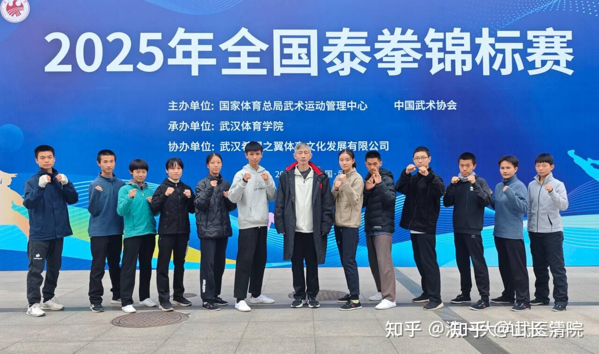

现在补补功课，把这几天的行程记录一下。因为今年是体检，报道的日子，我没啥事情做，就可以记录一下来武汉的收获了！

回汉DAY3：一早就去训练场，指导孩子们训练。

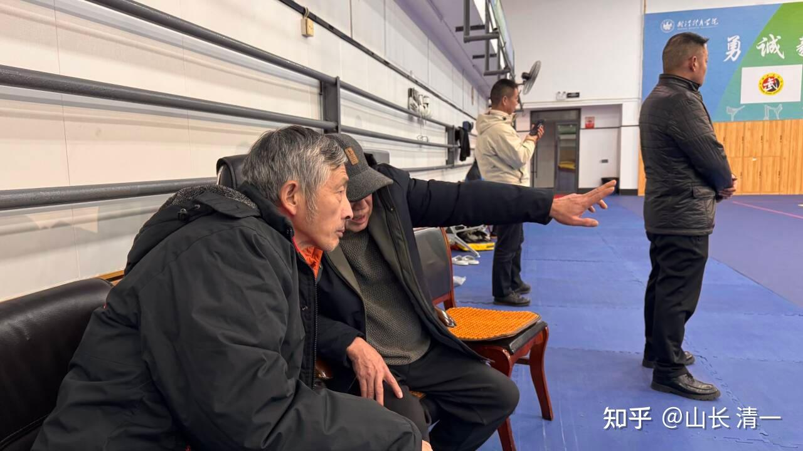

*训练场给我指点的是中国泰拳/散打教父，武林泰山李建平老师。*

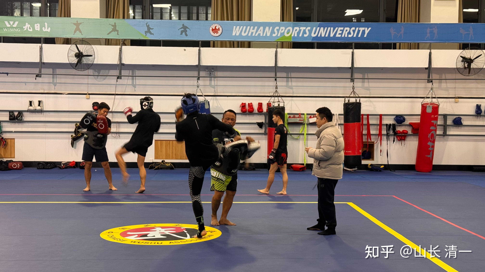

*武汉训练馆现场赛前训练*

中午饭去武体的学生食堂吃饭，期间也有交流活动，饭后基本上没有啥休息时间，因为下午是国家体育总局物管中心的领导来了，我们的队员也要去赛场熟悉一下。泰拳教父李老师让我早点去，因此匆忙去赛场见了领导。跟搏击部的负责人蔡部长多聊了一会。这次世界运动会的金牌奖金，就是蔡部长主持分发的。运动员得到奖金后，也给教练员相同的发一份。我还真没想到会拿到武术冠军教练员的国家奖金，非常荣幸。我还以为这笔奖金会给官方的国家队教练呢。蔡部长说：他主持武管中心的事务，肯定要公平。一定要把奖金给真正把运动员培养出来的教练，而不是给名义上的国家队教练。我表示对领导安排的感谢。蔡部长说：这点钱不多，但主要是表达总局的一种态度和荣誉，因此非常的荣幸。

我也把这笔钱，转给了李老师，让他用这笔奖金能够去为泰拳赛事做一些安排和支持。毕竟---荣誉属于大家。

李老师还告诉我：蔡部长出外参加赛事活动，要求很严格，一律不去参加饭局，他坚持只在食堂吃盒饭。是一个很有原则的人。我开玩笑对李老师说：我也想吃食堂，您就是不让，非要让我去酒店。就是不肯给我部长级待遇。李老师笑说，部长是领导，我当你是朋友。当然要陪着朋友喝喝酒了。

蔡部长一开始，就问了我刘晓慧来没来？为啥不来？我说这孩子原来是答应了，一定要来武汉的。因为很早李建平教授就让在锦标赛期间，把她带来武汉，因为李教练去年在珠海集训的时候，就对她有良好的印象。我也安排了她来拜贾老师为师，学习传武。我把这些安排都告诉她了。刘晓慧也答应，甚至是保证了她一定会来武汉的。这次来武汉之前，刘晓慧的父亲，还亲自跟我说：刘晓慧要备考，所以不参加比赛， 但她肯定会来武汉。会去跟贾老师学习传武的。因为她特长就是武术，不去发展她最擅长的东西，去学别的也不现实！

因此，我也没想到她居然会不来，也没告诉我任何理由！她的同伴也不知道她现在哪里，在做什么。她现在也不跟父母在一起！

当初刘晓慧打完比赛就跟我说过，认为拿到世运会金牌， 已经是泰拳格斗界的最高等级了。别的奖牌含金量都不如这个。因此想去上大学，还不想让人推荐，想凭自己的本事自己考上去。现在正在复习备考。我把这些情况告诉蔡部长了，他有点失望。说：拿到世运会比赛金牌，也不能说明一切，毕竟也是第一次拿金牌，也许还有中国主场优势的原因。她还年轻，应该再打几年世界锦标赛、多拿几块金牌的。只要去世界赛场上多打几次比赛，多拿几块金牌，才能让别人信服。以后要上大学很简单，她的文化课很好，打过这几年，让体育总局推荐一下，清华北大都是随便去的，现在着急个啥？

的确是这个道理。希望刘晓慧这次不来，只是认为全国锦标赛级别不够了，她已经拿了三个全国冠军，所以才不来。如果放弃去世界锦标赛平台的机会，就是太傻了。作为世界冠军，她肯定是种子选手。只是希望她没有荒废练习，别真派出去了，锦标赛打不出成绩来，就真的丢人了！

**军人的使命，就是能战，能胜。**

**剑客的使命，就是“仗剑生，为剑死”。**

**拳手的使命，自然是擂台驰骋擂台，击败对手。**

**中国人的使命，自然是为国争光！**

看到蔡部长有点失望，因为他多年来，一直致力于中国的搏击事业，也一直希望中国的泰拳能够打出一片天地来。不要像现在这么拉胯。他很希望2026年的世界锦标赛，亚洲锦标赛，刘晓慧能够作为主力参加比赛，没想她居然自有打算！因此看得出来蔡部长明显有些失望！

我告诉蔡部长：我们这里和刘晓慧水平相当的女拳手，还有三个！代表中国参加世界赛，她们应该是有水平和能力的。我们的拳手后备也较多。两年后，我们还有更多的，实力不亚于刘晓慧的拳手出现！大概会有10个吧。现在我们在清迈，有70多个拳手参加训练，选出10来人还是不难的。我们的训练三年作为一个周期，之后就可以去打全国锦标赛，甚至世界赛了。

蔡部长有点担心国内的女子拳手都太差了，这次锦标赛，很难检验出来这些木兰的实力。我就说：的确有这情况，我们就算是拿到了冠军，也不能说明水平能力如何！

为了让领导们能够真正的看到我们的女拳手实力如何，可以在这次赛事后。安排我们的女拳手，和同级别的优秀男拳手打一打（最好是打本届赛事的冠军）。我们现在有6个有水平的女拳手，可以参与这次检验，看领导们挑选一下，从可以和男拳手比赛表现水平良好的木兰中，挑选出2026年代表中国参加世界锦标赛。

蔡部长也说：中国的男拳手和世界水平差距很大，出国比赛往往是一轮游。如果我们的女子，有实力参加世界赛事的话，就可以多安排女拳手参加世界赛事，男拳手就少安排几个！这绝对是对木兰和公主们的利好消息。

同时，作为泰拳和散打出身的蔡部长，也对我们的传武格斗技术细节感兴趣。详细询问了我们怎样用传武来打泰拳的。国家武管中心的童部长，也希望我们把用传武击败泰拳的格斗理论，写出论文来公开发表，让大家都受益。我表示：我们都愿意把掌握的泰拳的优点，弱点。以及我们怎样击败泰拳的格斗经验和技术，全部的分享给大家，我们不保守。谁想知道我们的格斗方式，我都愿意分享出来！

领导说看有机会赛事期间安排一下技术分享的机会。

看得出来，国家武术中心的领导，还是非常关心中国武术在世界上的地位。希望我们的拳手，能够去外面击败世界对手，而不是只能自己躲在国内窝里斗。我希望我们的队员，能够有更多机会为国争光！实现传武的梦想。

晚上，没有去食堂吃晚饭，就和贾教练在他家里聊天，喝喝啤酒，一起聊了很多武林的事情。他也介绍了一些武林人士，国家级非遗传承人给我认识，说有空我们一起去拜访这些武林前辈。

晚上10点，才回到宾馆，处理一些内部事务后，晚上12点休息！

DAY2： 这一天的主要任务，是和武汉体院武术学院的三个主要领导在一起交流。他们接见我，是因为我出资支持武体的泰拳队的建设。李老师还特别设宴招待我。结果---中饭吃到下午四点。接著晚上6点又开席吃晚餐。晚上八点半去训练场观看武体泰拳队看他们备赛（说是我出资支持的队伍）。很晚才精疲力竭的回家！

我发现：吃饭太累了！接下来武汉的亲家秦教练，说我来武汉了，他在外训练，过两天就回武汉。肯定要请我吃饭的。我就琢磨——如果是我来请客的话，他想去哪就去哪儿。如果他要请客，我希望享受“部长级待遇”---去食堂。

当然，最好是去家里喝喝啤酒，啥菜都不要，一些小干果下酒就行了。

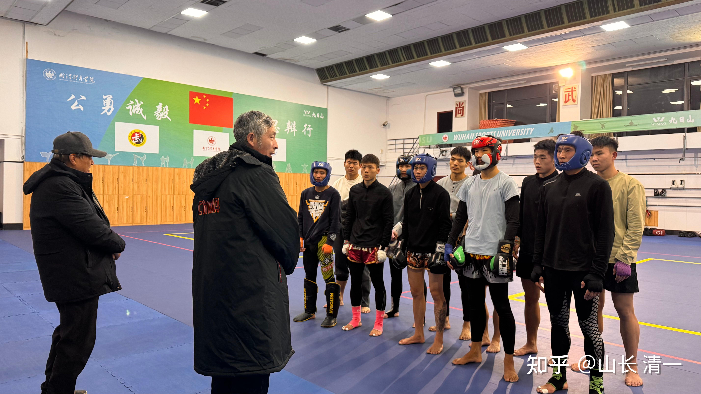

*我出资支持的武汉体院泰拳队*

[!\[image\](images/img_005.jpg)

泰拳教父李建平，和武体武术学院的院长书记一起，在训练馆看队员进行赛前训练 https://www.zhihu.com/video/1981341811369874866](http://link.zhihu.com/?target=https%3A//www.zhihu.com/video/1981341811369874866)

DAY1:

到武体的第一天，就有机会参加中国公安大学的顶级泰斗——八卦掌的第四代传人，赵氏擒拿格斗的创始人--赵大元的讲座！老先生82岁了，还现场和武汉体院的武术学生们过招，高大威猛的年轻人、很快就被赵老师轻松放翻在地。我希望自己82岁的时候，也能够像赵大师一样把20岁的年轻人轻松搞翻。

就算是实在不行了，就让我自己的冠军弟子们，配合我上场来演示一下，假装我还行。哈哈！毕竟我又不是练家子，就是个文人。输了也没啥的！

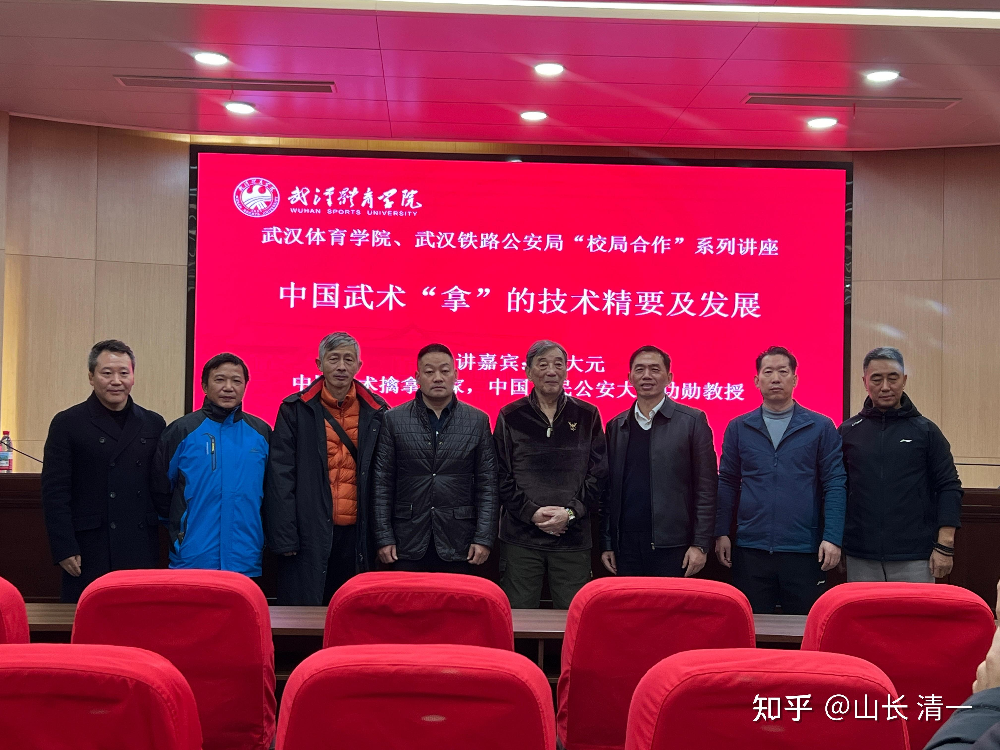

*讲座后合影*

演讲完后拍照留念：赵大师左边的三人，是赵老师的三个徒弟。是武汉公安局。铁路公安局的局长们。右边的几人，除了我之外。都是武汉体院武术学院的院长领导们。我这个山野之人，也很荣幸把拉到台上跟领导们一起合影！

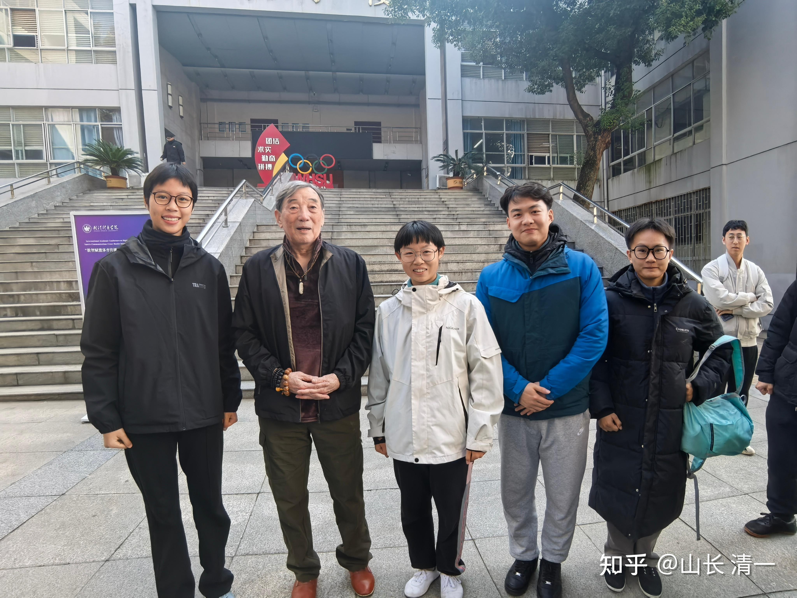

*三个木兰公主与赵大师合影留念*

她们三个，就是要和男拳手比赛的六名木兰的一半人。这一次来参加武汉的锦标赛，最低要求是银牌。输的对象，只能是自己队友，不能是外人！她们赛后还要和这次比赛的男拳手比武，然后打出世界赛的名额来。

清黑一直喜欢贬低我们，甚至还有我们的一些男拳手，喜欢找理由说：公主和木兰的女子格斗金牌含金量不高，女拳手的竞争实力差等等。也许我们的对手的确很差，所以我们拿金牌相对容易。并不是我们的太极格斗的实力强！男拳手竞争水平高，实力强，竞争激烈，因此清一武道的男拳手打不好，拿不到金牌！

这就是鬼话。我相信这一次武汉之行，我们的公主木兰，能够把同级别的男拳手都击败的话，我看男生和有屁话好说的！

如果这些说屁话的男拳手。自己打不出来，就是男拳手偷懒，藏奸耍滑。还找理由来黑清一武道。就是良心坏了！不信祖宗，当然得不到祖宗的护佑。

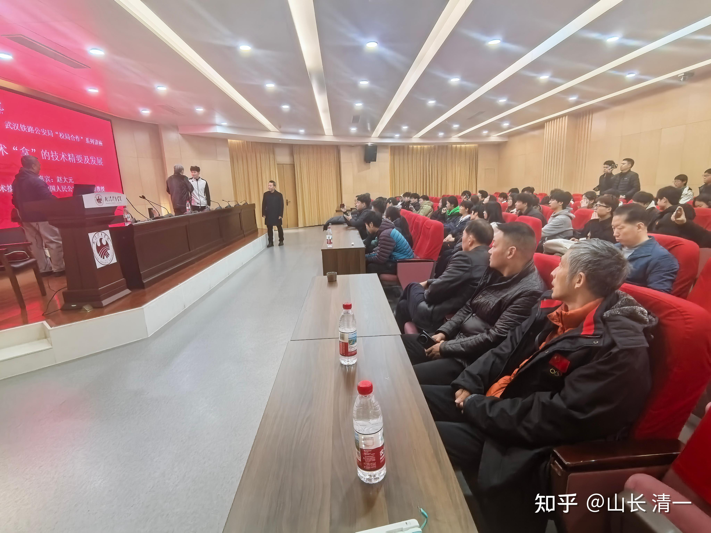

*交流会现场*

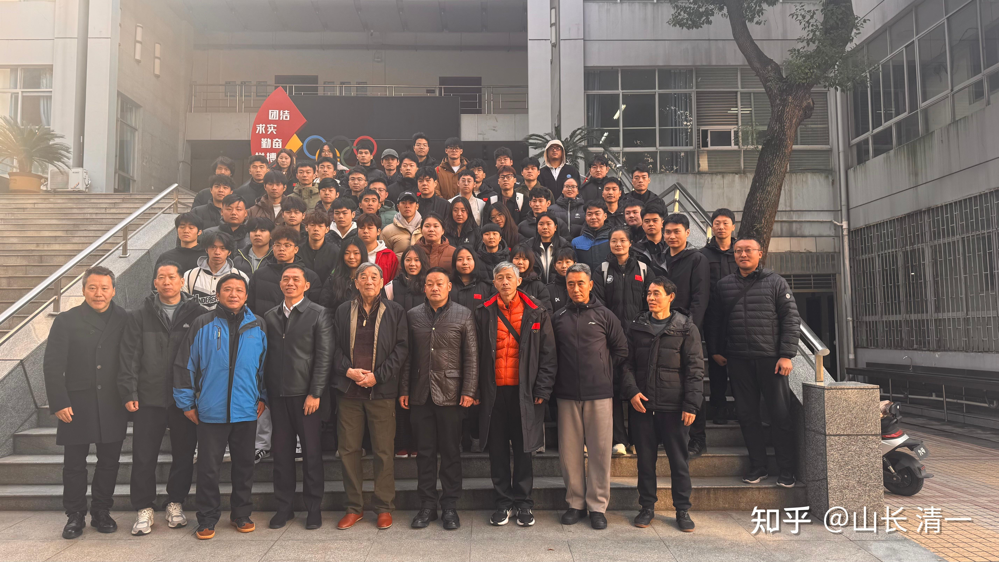

DAY1 中午，与贾老师一起吃食堂。下午和晚上，又是见朋友。喝酒。

这次见到的奇人，是东南亚洪门的舵主卞掌门。他带来的酒据说有特效，不过我还是只能喝啤酒。自家公司产的酒，怎么都好喝！

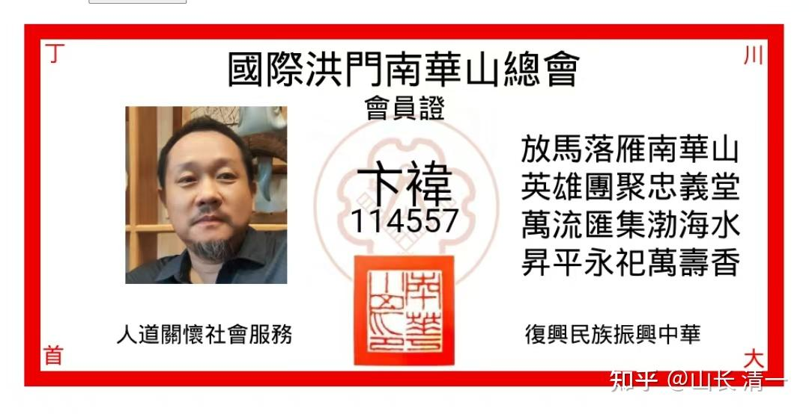

我去马来西亚的时候，才知道：原来天地会现在，还有一个朋友是天地会的舵主。也知道洪门在东南亚还很活跃。深入东南亚的政商界！跟这朋友一聊，更是大开眼界。他也很好奇，发现我们居然知道洪门36誓。差一点以为我们是同道了。不过道友切口我们就对不上了。

我提到我们拳手的成绩，有信心代表中华武术在世界上取得良好成绩。而且我们可以愿意帮助洪门兄弟的子女成为文武双全的世界冠军。也愿意为其他国家培养国礼的计划。他们对我们的这个项目，非常的感兴趣。我们清一公社，以武会友，广交天下朋友，这是必须的！

更幸运的是：酒席期间，国际洪门的总掌门刘先生，打视频电话进来，卞舵主让我也和总掌门视频说了几句话。我也表达了对海外洪门的支持，以及希望有机会，让我们的清一新教育，能够为洪门，为海外的中国人，做一些教育和文化上的贡献。让海外华人更受当地政府和民众的欢迎。

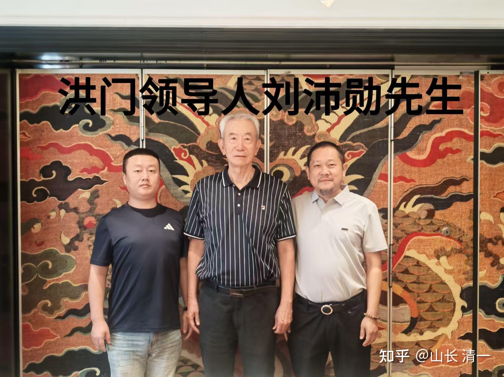

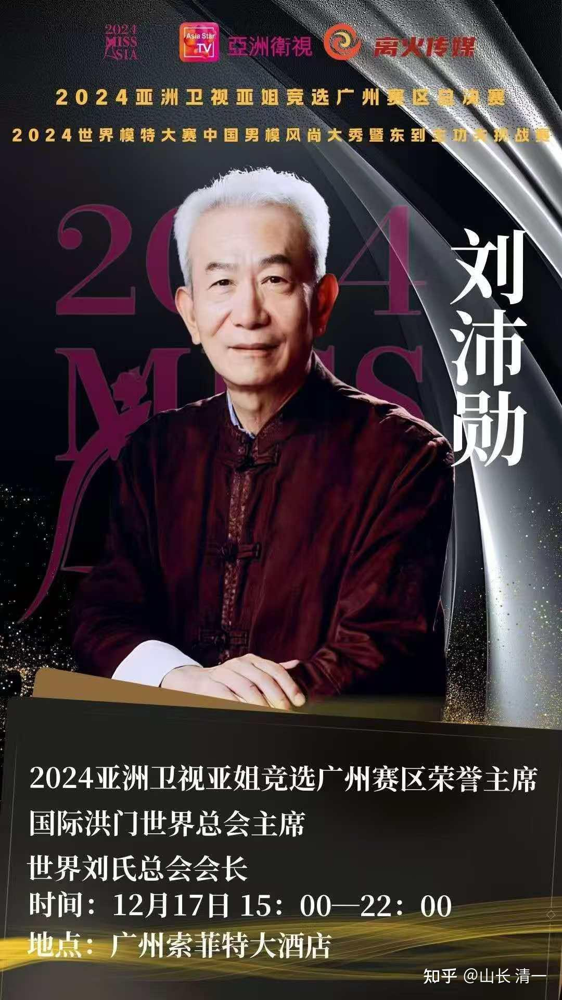

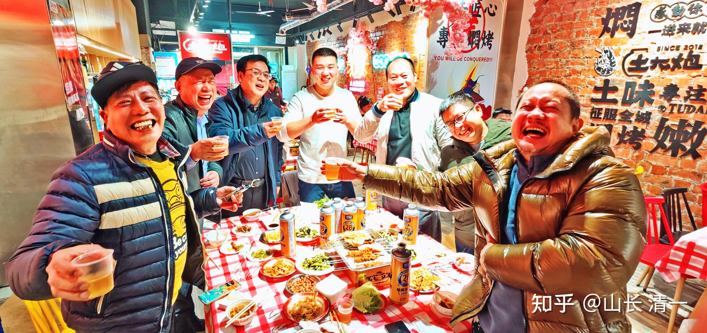

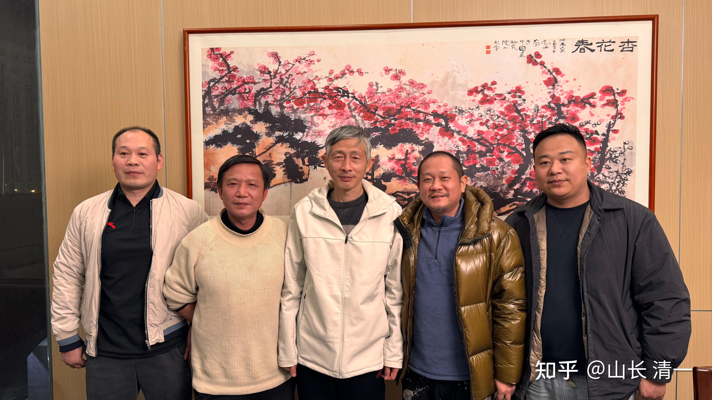

* 洪门 兄弟会*