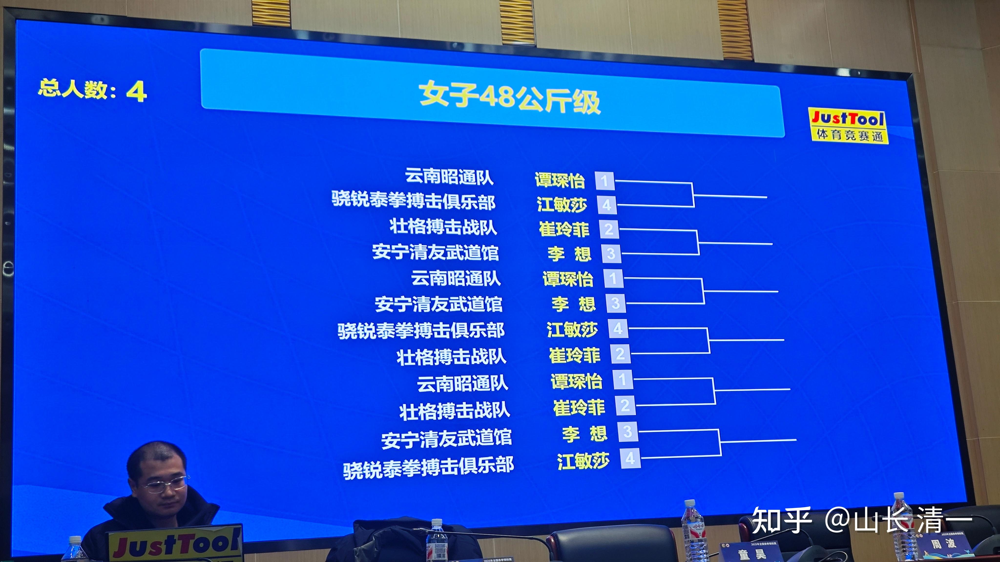
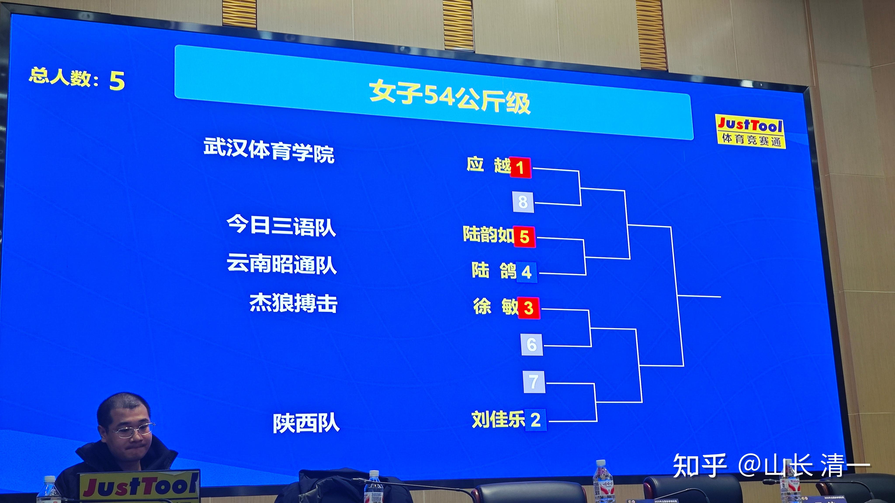
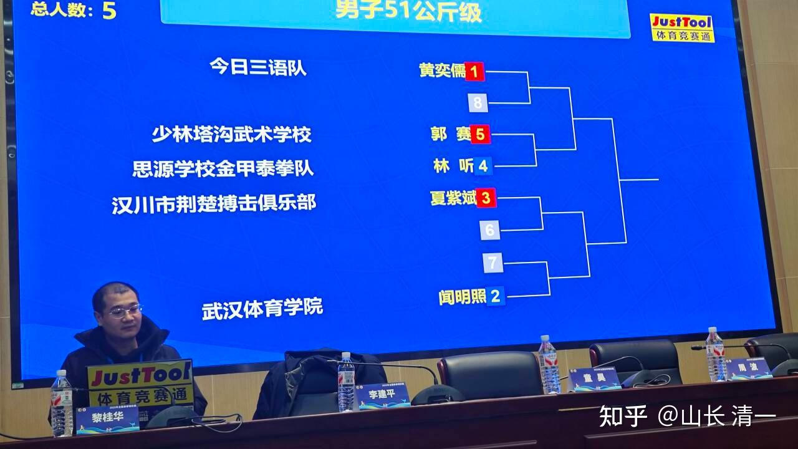
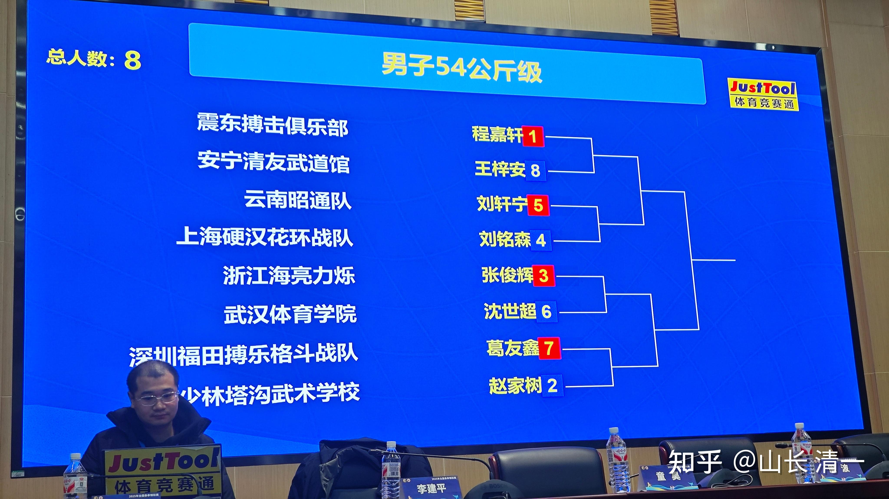

今天体重检查和抽签都完成了。这次赛事，虽然人数相对来说不多，但卷的还是很厉害的。可能是因为这次赛事，也是2026年的泰拳世界锦标赛选拔赛的关系吧？

比如谭木兰要打的女子48公斤，就有一个知名拳手，是从60公斤减下来参加比赛的。可能都觉得小体重的对手好欺负，真的现场见识到了中华卷王的厉害！谭木兰小小的身子，不知道能不能抗住这种压力了。

我就是不知道这种减重方法，会不会伤到心脏。但我们还是专心练技术，准备就算是48也可以打60的实力，不然真的卷不赢体制这群卷王，靠老祖宗的技术优势，我们真的少吃很多苦头，少受很多罪！

陆鸽，陆韵如要打的54公斤级，有多个高手参加。有昆仑决的资深职业拳手应越，还有一个从泰国回国打比赛的老拳手，已经30多岁了，多次上过仑披尼和迦南隆赛场，是水平很高的泰拳手，也很专业。这次带着自己的泰国教练一起来参赛。是想搏一回世界锦标赛的机会！

陆韵如首次参加成人锦标赛，却非常的不幸。第一轮比赛抽到的就是她和陆鸽“内战”，她肯定只能让师姐了。因此她成为第一个被淘汰的我方拳手。连上场的机会都没有，连铜牌都没有机会去拿。她很盼望和这些国内女子顶尖拳手一战的。却连挨边的机会都没有，实在遗憾。好在还有赛后的男女拳手大战，她有一个弥补自己遗憾的机会！

黄奕儒的对手，是实力强大的塔沟武校，还有武体的专业队队员。练了两年多的他，必须战胜这些从小练拳的专业武者，才有可能取得冠军资格。

塔沟少林，这一次来了四只队伍。这是中国搏击格斗界水平最高的队伍。我们的队员都要一路打过去，才能到达终点站。

