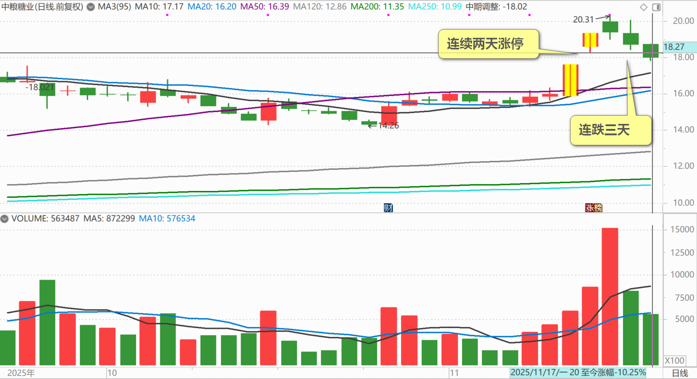

209篇.中粮糖业主力走势猜想

[清一山长](https://www.zhihu.com/people/shan-chang-qing-yi)[2025年11月17日20:11](https://www.zhihu.com/pin/1973842232374215210)

主力走势猜想

今天看到中粮糖业连跌三天，五天前连续两天涨停。

中粮糖业日线图（2025年11月17日至今日线图）

说实话，我怀疑主力被套了，只能往上做了。你们会笑话我持有近两千万股，却早早逃走了（最后几十万股是17元走掉的），我可从来不指望我能够在20元逃顶成功！如果我还在里面，肯定不会有这个高价！主力肯定不会拉高让我逃走的，我又不是他爹（他爹可能主力不会干这事的！）。

各位看我就知道了——我做大股东的股票，比如啤酒等等，就是死也不涨。我认为什么时候我彻底退出，消失了。啤酒就涨了，而且会大涨特涨。我不走，也许永远也看不到这一天！

最近五天的交易日，中粮糖业是前面两天涨停，但成交量不是太大，也没有啥消息面的跟随。我都怀疑是主力对倒自己玩。第三天开始放量，但都是跌势，追进去的全套牢了！

也许这个股票好到极点，主力现在是高价抢货！

要么就是主力被散户套牢了，现在只能往上做。这样的主力，好辛苦！也许他们在找下家冤大头接盘，看他们的本事了。

主力最怕的不是拉高，只要有资金，拉多高都不是问题。主力最怕的是出货！

我不是主力，但我也怕出货。手上我当十大的货量，一旦短期大量放出来，市场价肯定就会大跌。我可不敢影响市场，怕被证监会请去喝茶。所以我只能忍住，不影响市场价格的情况下慢慢地买和卖！

主力的货，比我多十倍、百倍，你说他们怎么办？拉高了出不来，多少市值都是虚的！

**（标题、图片为编者所加）**

文章音频：

[626篇.中粮糖业主力走势猜想](http://link.zhihu.com/?target=https%3A//www.ximalaya.com/sound/940513179)

**参考链接：**

[204篇.大跌和大涨，都是骗人的](https://zhuanlan.zhihu.com/p/1978516963094442584)

[205篇.惠泉涨停卖出300万股](https://zhuanlan.zhihu.com/p/1979518999168571200)

[206篇.燕京快涨了，12月的啤酒行情也许有惊喜](https://zhuanlan.zhihu.com/p/1981117920756142902)

[207篇.买回几十万股惠泉，比2天前卖价低了1元多](https://zhuanlan.zhihu.com/p/1982146009615333147)

[208篇.股市案例分析——主力操盘的周期有多长（配图版）](https://zhuanlan.zhihu.com/p/1982798321073533837)

[链接汇总（截止2025年12月3日）](https://zhuanlan.zhihu.com/p/621215591?utm_psn=1967007144831350474)

