清一战队参加了七个项目，总共有六个级别拿到了决赛权，今天有两人参加决赛，最终结果是都打赢了决赛的对手，拿到了6个金牌，成功成为全国第一格斗战队！如果刘轩宁不是被多次击裆且裁判没有干预的话，第七块金牌也能拿到的！

作为对照，同样是这支队伍，在刚刚结束的西安自由搏击全国锦标赛上，只拿到了一块金牌。我们队是“铩羽而归”。不知道是自由搏击锦标赛的格斗水平太高，还是我们练得太差。以后这个对我们风水不好的赛事，我们就不去参加了，让他们这些高手自己玩去吧！只是希望这些人出去打世界锦标赛，不要丢中国人的脸。长期以来，这个项目就是“一日游”，派出去代表中国队的队员，往往第一轮就被淘汰了！这次成都世界运动会，我们在家门口打比赛。淘汰了谭木兰，ELLA的中国自由搏击队，参赛人数比泰拳的更多。但就是这些人，第一轮就全部被外国人淘汰。这种丢人的事情，我希望以后还是要少一点。就算是丢人，也在家里面丢算了，就别派出去外国代表中国人去丢脸了！

另外一个最强战队是武汉体院队和浙江海亮力铄队， 两队都分别拿到了5块金牌。我们三个队，就把金牌基本上瓜分完了（16块就没了）。其他19个队，大多数队伍都无缘金牌。今天电梯里遇到一个队的教练，说他们拿到了4块银牌。其实能够打入决赛，就相当不错了，教练还是很高兴的。问我们的队拿到多少？我说六块金牌，还没来得及说---银牌也是4块，这个教练就马上脸一沉。说了一句：你们是今日三语的？然后就一声不吭，然后就走掉了！

肯定有很多队，对我们拿走了这么多金牌不满的。认为我们的技术乱七八糟的，不正统。打得这么难看，手都伸不直。技术也不规范，居然还拿了这么多的金牌，实在是不服气！这些都是老格斗人了，没有见过我们的新技术，看不起也是完全可以理解的。就像应越，哭得这么厉害。未必是打疼了哭的， 可能也是觉得一个昆仑决的职业女拳手，被一个技术不好，还是初出茅庐的小妹妹击败，心理上完全无法接受吧？希望国内的拳手们慢慢适应。

海亮有8个拳手进入了决赛，最终也拿到了5块金牌。世界冠军韩鑫就是这个队的。这是一个有格斗情怀的浙江老板，上市公司，花大钱来支持的队伍，只要是优秀的拳手，都被他网罗旗下。因此的确拳手水平都比较高，在场上拼得也很猛！不过这个队主要是男生，这一次没跟我们碰上！原来跟我们木兰打过多次的耿春蕾，也是这个队的。

老将军看了场上孩子们的表现非常开心。跟孩子们聊了很久，特别的喜欢孩子。特别是知道孩子们文武双全。懂三国，四国语言之后，老将军居然说：他要推荐这些孩子去做中南海女保镖，做大领导们的翻译，对外出访的助手，还可以胜任保镖人员。气质又好，中央正在找这种人，类似日本某个长得像是明星一样的女保镖，普京的女保镖也很亮眼。代表国家的武术和文化形象。遗憾我们国家就没有这种人，普通的格斗运动员缺乏文化内涵。我们的木兰看起来非常的文雅，一点也不像格斗拳手。我们的公主们，比国外的这些国家领导人的女保镖的文化水平更高，气质也更好，都很讨人喜欢！应该出国去展示一下我们的软文化。我相信去当中南海保镖肯定是国家的名片。

这真是一个好消息，不过我不确定木兰们是否已经决定去当中南海保镖了。她们也许更想去当世界冠军和文化大使！我内部说了，现在拿到全国冠军的木兰，都有资格申请这个机会，谁想去，我就推荐给将军！符合条件的人还不少。当然，最好拿到世界冠军，才更有说服力。

将军还说如果我们想要去公安和警察系统工作，他都可以介绍我们的拳手去。我们这种文武双全的人才，系统内非常受欢迎！不过孩子们表示更想当个教师，不太想去当警察。将军有点遗憾，因为公安系统的发展前途（仕途）肯定比去当一个教师要好。

今天的比赛，陆鸽打的很精彩。泰国来的30多岁的，长期在泰国迦南隆打比赛的拳手，是典型的泰式打法。她带了她的泰国教练来现场指导，这个泰国教练是原来的泰拳世界冠军。昨天的半决赛，这个拳手打得非常的猛，但显然今天她不适应木兰的打法，适应了泰式慢吞吞打法的她，完全跟不上我们连续攻击的速度。结果身高体重都要更优胜的她，居然被小个子陆鸽一路狂殴。体能耗尽，还差点被KO。实话说，我看她多次腹部被重击，换别人早就垮了。她居然还坚持下去了。还一直坚持往前冲，没有避战。这是几乎自杀的行为。更年轻的昆仑决拳手应越，就被打得弃赛大哭。现代格斗面对这种传武的格斗技术，真的很难赢。

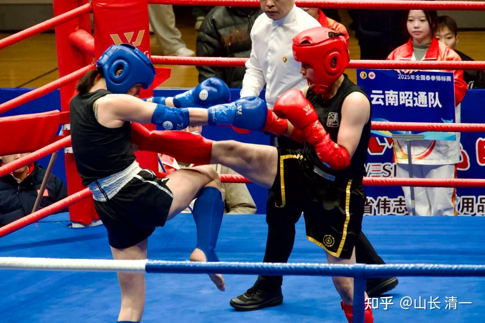

*陆鸽再近5厘米就更好了*

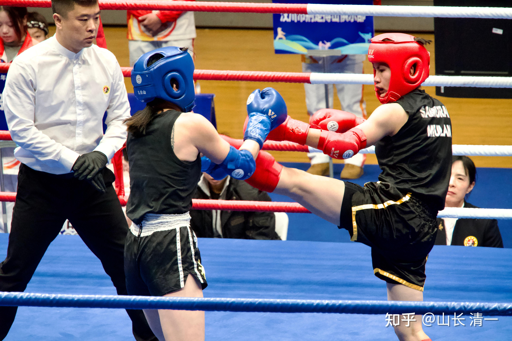

*陆鸽总算会用后退转换了*

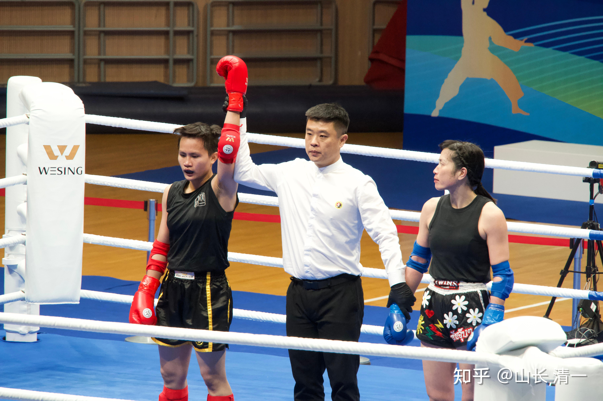

*陆鸽3:0获得胜利，夺下第五金。*

清一战队奖牌榜统计，妥妥的团队总分第一战队。比我预期的时间2026年登顶金牌榜第一的时间，整整提前了一年！

我们刚刚回国开打两年（2023年12月首次开打国内锦标赛），就成为了强手如林的武林界的一匹黑马。未来长期霸榜泰拳格斗全国第一，已经是必然趋势了。因为一年后显然我们还会多出一大批拳手，而现在的这批拳手依然不会退役！只会更加厉害。

当然，取得这个成绩，离不开武汉体院的裁判们公正的判决。我们跟武体的两名优秀拳手对战。应越就代表武体，被陆鸽打到两局就退赛，自己哭去了。黄武士的这一场比赛，没有打出压倒性的优势，双方打得比较接近，黄武士一直感冒，也没有打出他的最佳水平。不像陆鸽的比赛优势很明显。但最终裁判还是把胜利判给了黄武士。武体武术学院负责搏击这一块的黎院长表示---因为要替国家选拔参加世界锦标赛的优秀拳手，当然要让更有潜力的拳手上！

过去我们参加泰国和国内的一些赛事，长期被黑太多了，我们都习惯了。包括这支队伍刚刚结束的西安比赛，我们的拳手"惨败"而归，相反陕西的本地拳手，只要不被ko就一定赢。因此，原本我们是没有信心在武汉比赛中胜过东道主的。优势不大的话，准备判输也服气的！现在能够得到这样公正友好的保护，真的非常荣幸。感谢武体的主办者公正执法。

金牌（6个）

女子45kg 鄢佳彦

女子48kg 李想

女子51kg Ella

女子54kg 陆鸽

男子48kg 于均

男子51kg 黄奕儒

银牌（4个）（我怀疑银牌数量也是第一，至少是第二）

女子45kg 黄湘迪

女子48kg 谭琛怡

女子51kg 林佳惠

男子48kg 陈冠宇

铜牌（3个）

女子45kg 陈子阳

女子51kg 王静恩

男子54kg 刘轩宁

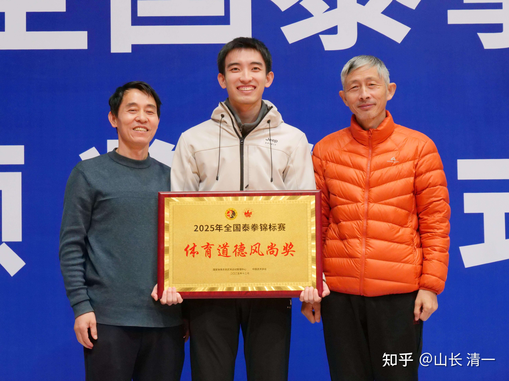

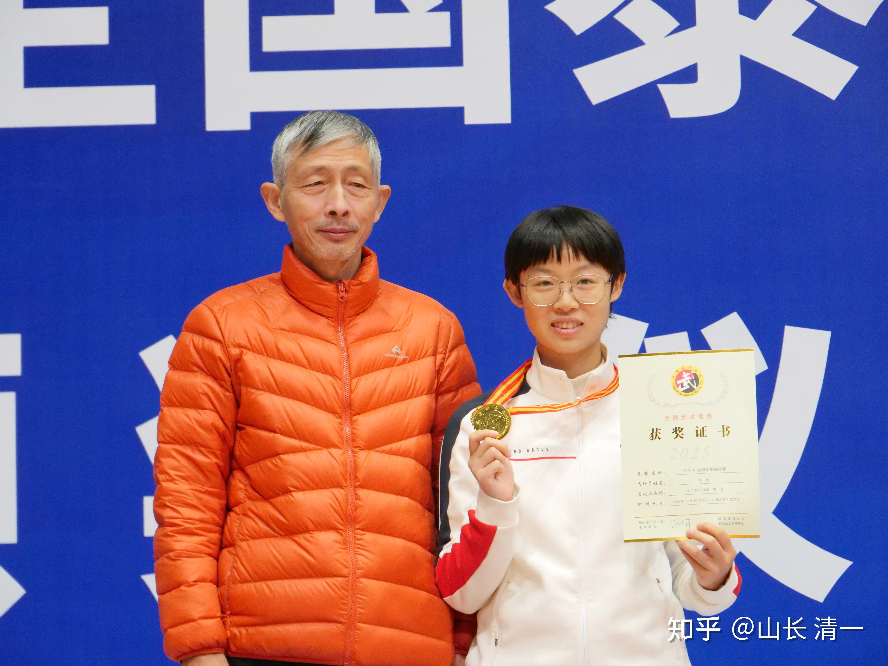

*李想公主18岁夺得成人赛金牌*

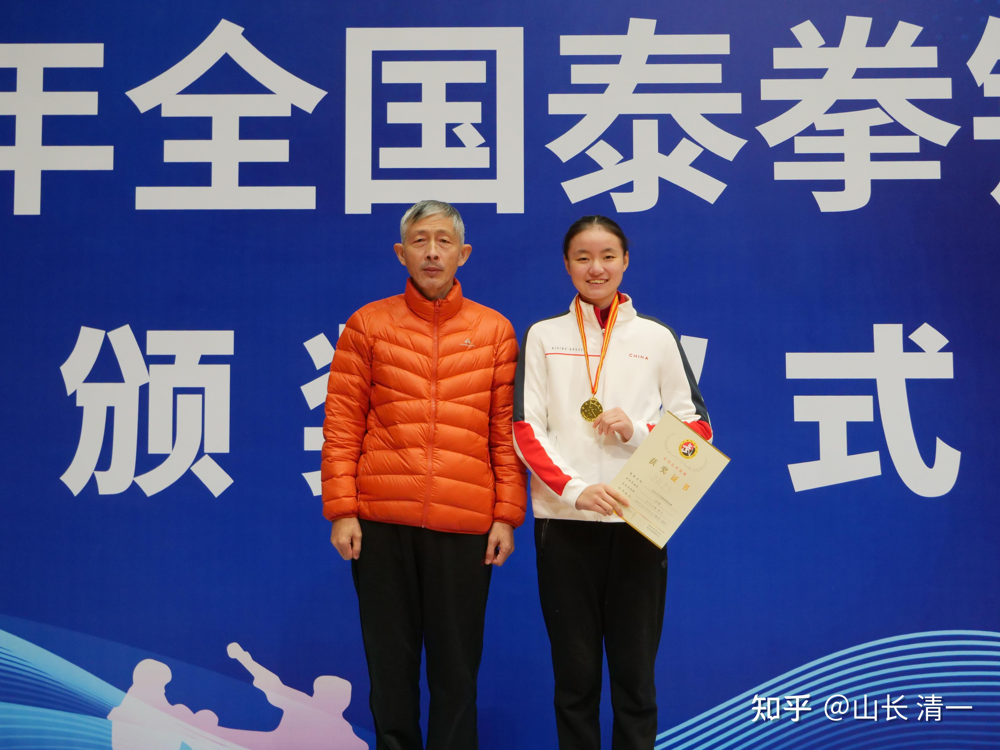

*ELLA公主总算拿到了自己的一枚金牌*

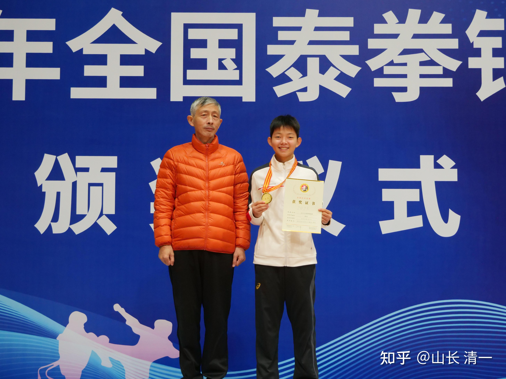

*木兰佳彦的首块成人金牌*

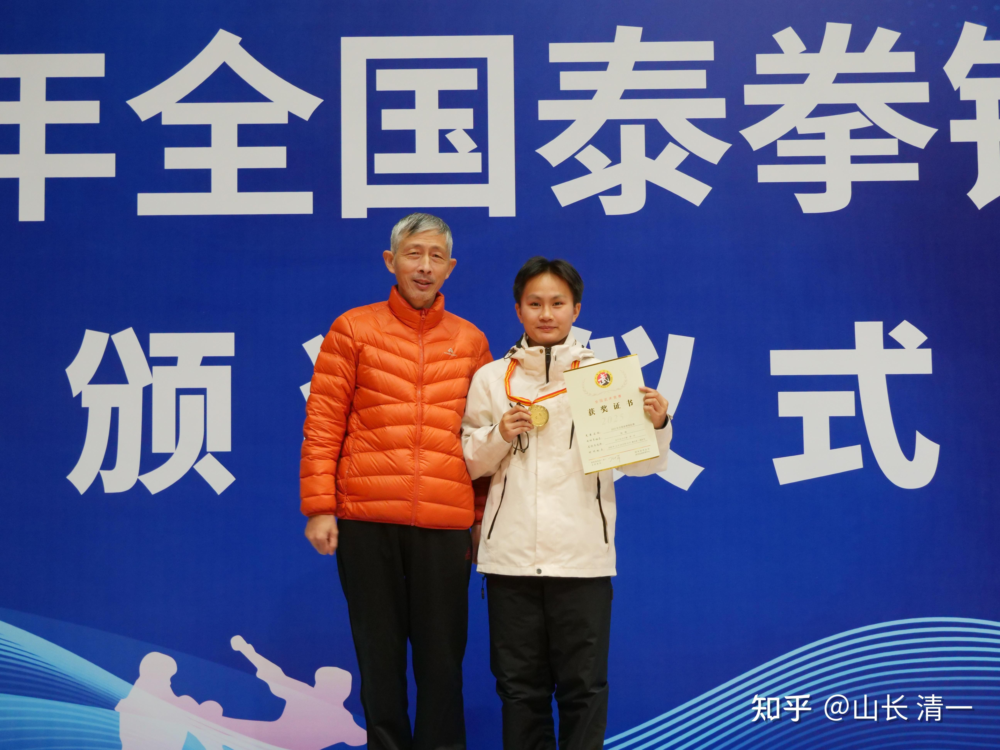

*陆鸽的这块金牌含金量很高*

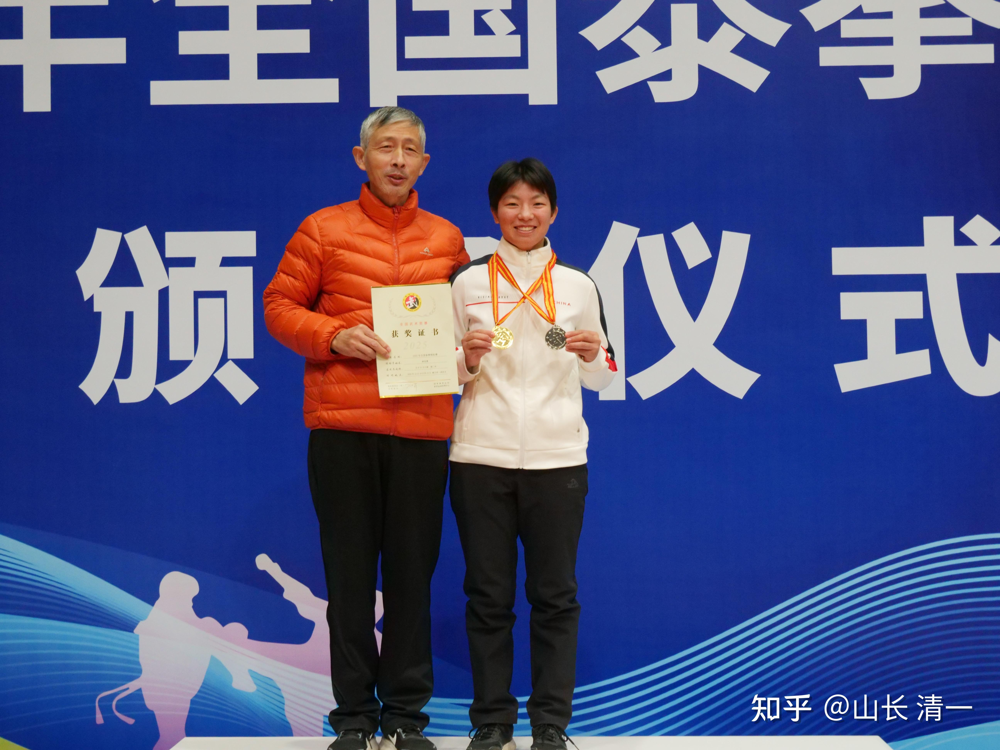

*佳慧的双牌金银更可贵*

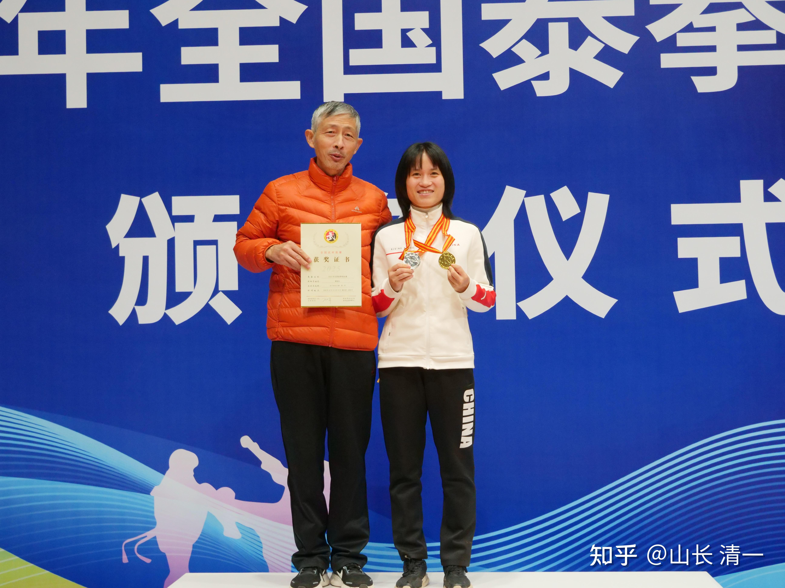

*谭木兰的金银双牌*

两个男生也拿到了金牌，不过---含金量不如木兰们的高！没有对对手造成压制性的打击！

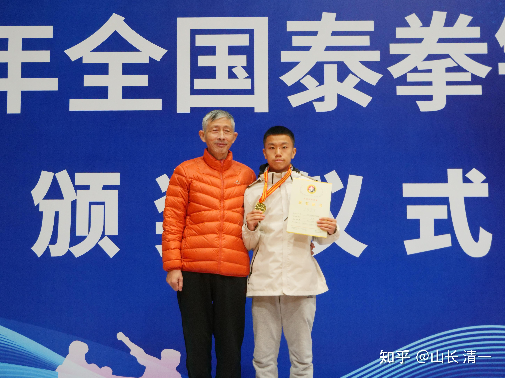

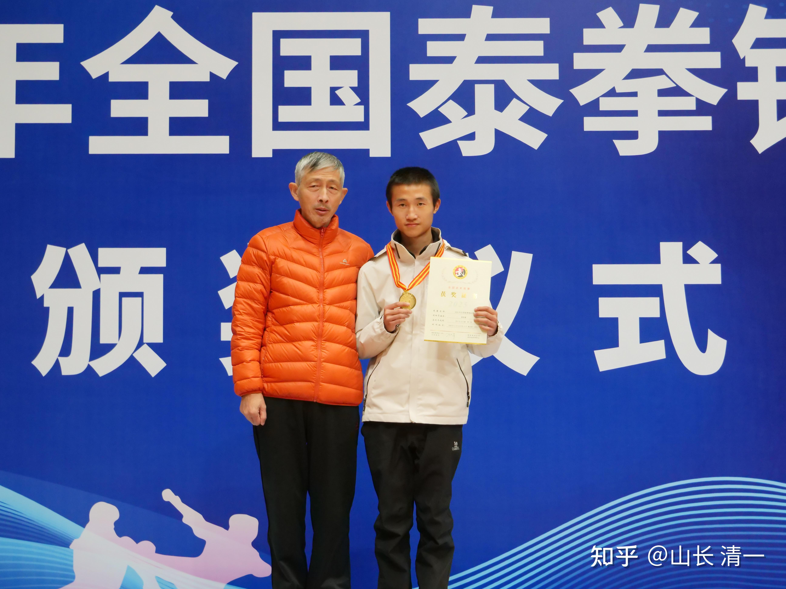