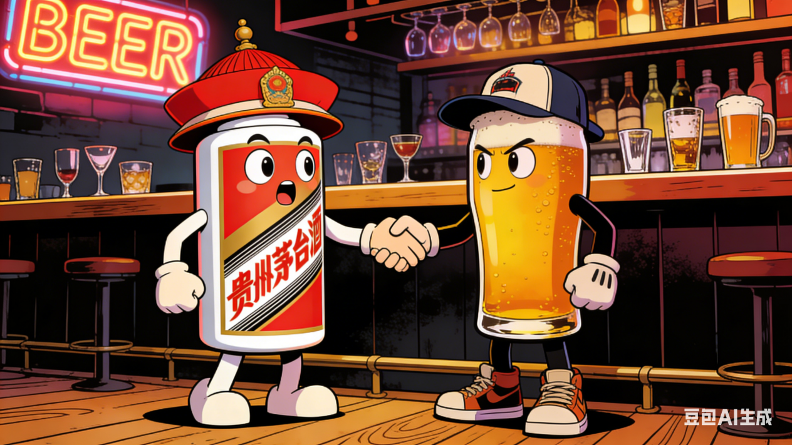
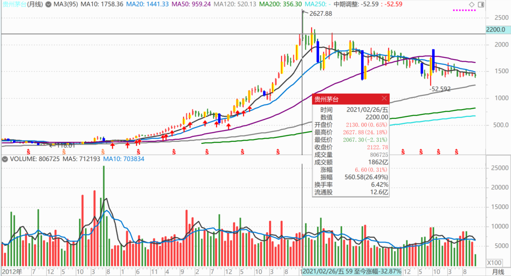
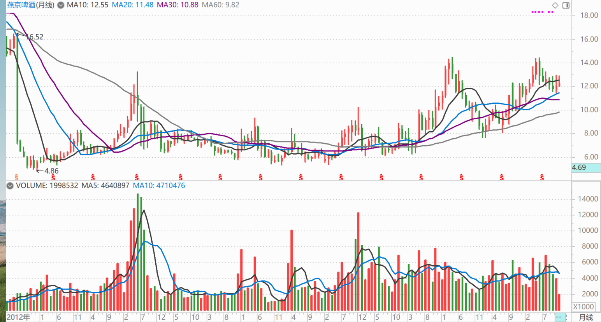
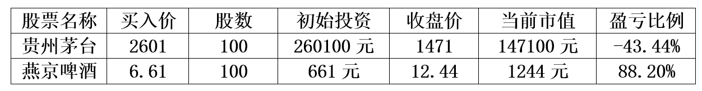
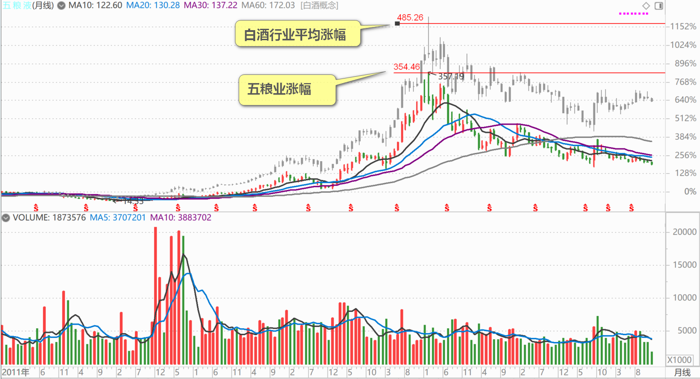
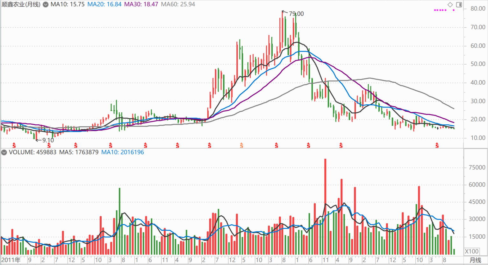

210篇.茅台换什么？

**[清一山长](https://www.zhihu.com/people/shan-chang-qing-yi)**[2025年11月17日21:10](http://www.zhihu.com/pin/1973858540151133400)

茅台换什么？

[若看懂英伟达，5年前愿意用茅台换！段永平持仓曝光：猛砍英伟达](https://zhuanlan.zhihu.com/p/1973561063543968469)

2021年茅台股价达2600～2700元时，曾因“觉得贵”想减持，但最终因“找不到更好的替代标的”选择持有。

**贵州茅台月线图（2012年至今）**

5年前，他换燕京啤酒的话，现在燕京涨了差不多一倍，茅台跌了一半。现在他自己的市值，差距是四倍！

**燕京啤酒月线图（2021年至今）**

“差距是四倍”的计算：

1、单只股票的初始投资与当前市值

**

**

2、市值差距计算

初始总投资金额=260100元（原买茅台的资金）

若全部买燕京啤酒，可买股数=260100÷6.61≈39349股

该持仓当前市值=39349×12.44≈489,501元

原茅台持仓当前市值=147,100元

市值差值=489501-147100=342,401元，

市值倍数差距=489501÷147100≈3.33倍

(以上计算过程为编者增加）

怎么能说找不到更好的替代标的呢？酒换酒，有啥不好？我就是白酒换的啤酒。

不过，五粮液没追上白酒的涨幅，但赚钱最多的顺鑫农业早就回到原地了，不换我就是找死。

**五粮液月线图（2011年至今）**

**顺鑫农业月线图（2011年至今）**

结论：我肯定是错的，别人老段肯定是对的。因为结果他赚钱比我多得多，结果说明他比我厉害！因此他的投资思维方式比我厉害，不能拿他没做好的地方来嘲笑他。别的地方，我更是一塌糊涂！

当年我知道应该买14元的五粮液，但我就是蠢到不知道满仓，更不知道应该拿住不放，涨了几倍就跑了。后来才知道有20倍涨幅。不然坚持下来，我的总市值比现在高，我还啥都不需要操心！

ε=(´ο｀*)))唉！还是需要继续学习提高。

现在跌了一半，我还是不敢买茅台，肯定是我的脑子有问题，理解不了老段，我肯定错了！

[若看懂英伟达，5年前愿意用茅台换！段永平持仓曝光：猛砍英伟达](https://zhuanlan.zhihu.com/p/1973561063543968469)

**（标题、图片为编者所加）**

文章音频：

[627篇.茅台换什么？](http://link.zhihu.com/?target=https%3A//www.ximalaya.com/sound/940840790)

**参考链接：**

[205篇.惠泉涨停卖出300万股](https://zhuanlan.zhihu.com/p/1979518999168571200)

[206篇.燕京快涨了，12月的啤酒行情也许有惊喜](https://zhuanlan.zhihu.com/p/1981117920756142902)

[207篇.买回几十万股惠泉，比2天前卖价低了1元多](https://zhuanlan.zhihu.com/p/1982146009615333147)

[208篇.股市案例分析——主力操盘的周期有多长（配图版）](https://zhuanlan.zhihu.com/p/1982798321073533837)

[209篇.中粮糖业主力走势猜想](https://zhuanlan.zhihu.com/p/1983556072204703566)

[链接汇总（截止2025年12月3日）](https://zhuanlan.zhihu.com/p/621215591?utm_psn=1967007144831350474)