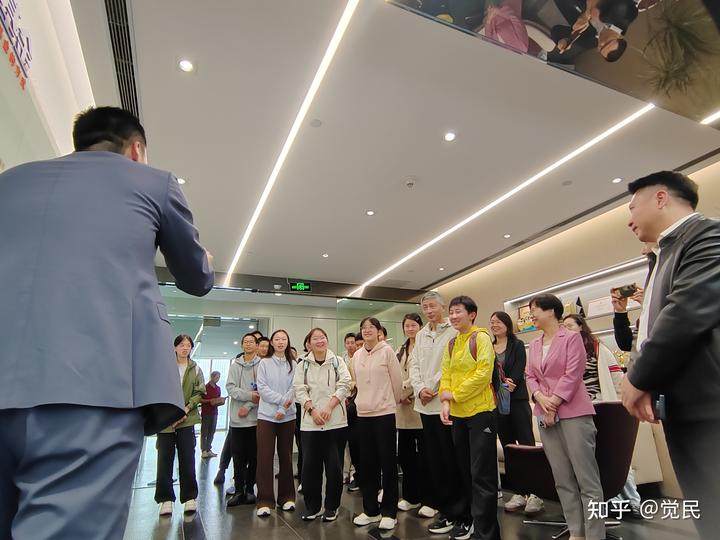
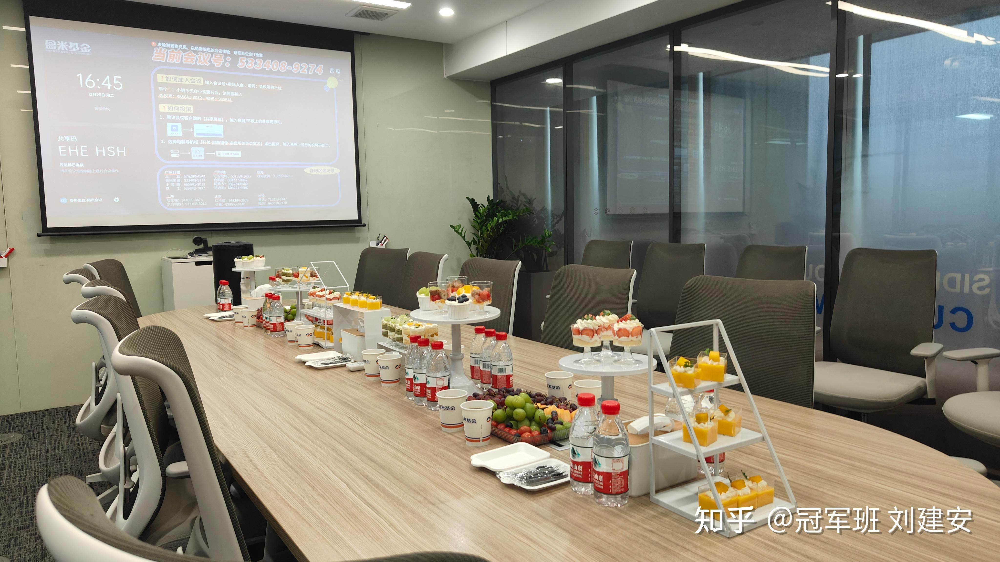
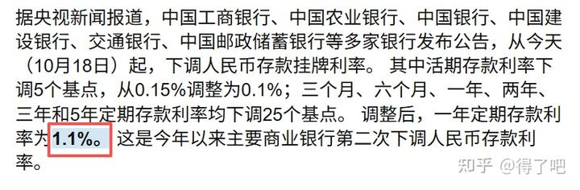

昨天，盈米基金的肖总告诉孩子们说：金融业是最好的职业。最有挑战性，回报也是最高的。认为孩子们从小学金融，非常的有价值！

她一开始就来到楼下，接孩子们上楼参观，我们的会议中间，还出去接待了来访的客人。我以为她不会回来了，没想到她接待完客户后，下午6点过又回来与孩子们交流互动。鼓励孩子们掌握金融知识。学会掌控和利用金融工具让人生更自由！

肖总提到的银行，保险，券商，基金，信托，都是金融业。最有挑战的职业就是证劵投资和基金投资行业。还有很大的发展空间，员工也会创造最惊人的个人收入记录。

肖雯提到的几个宏观数据，引起了我的注意！回来又继续查了一些资料，对于中国的金融市场增加了更新的理解。

**第一就是中国的银行业总资产。**截至2025年6月末，中国银行业总资产近‌**470万亿元**‌（即‌**470,000亿元**‌），位居世界第一

** 这是一个惊人的数据。**这说明国民很富裕，但很多人只把钱放在了银行存起来。然后这些人靠工作去赚钱，持续地创造价值。他们是人类社会草原上真正的创造价值的“牛羊”。（没有不尊重的意思，就是一种比喻）。

我理解为：后面的金融从业人员， 本质上都是通过在认知上超越了只会存银行的广大勤劳善良的牛羊们。从而取得高额收入的，包括我在内！

**排行第二就是“保险业务”。行业总资产规模是36万亿！**

中国普通人，基本上所有的金融资产就放在这两个地方“银行存款，理财”和“买保险”。

不过，中国人可能更多的资产，是放在“房地产”上了。中国房地产的总金额是65万亿美元---相当于450万亿人民币，比银行总资产还高（有人异议，认为只有一半），这个也相当大的数字了！

那么，相比以上资产，中国的保险就只有银行也10%的体量。而且---如果加上居民的财富分布总额来计算的话，就只有5%不到的份额了！

排列第三的就是证劵行业的总资产：

报道**【2025年9月底，中国证券行业总资产突破14.51万亿元，客户数超2.4亿。**一边是资产规模四年跃升，净利润累计超8000亿；另一边是市场对“自营业务占比逼近45%”的隐忧。】

这说明--**中国的个人，大概只有7万亿左右资产，是权益类资产。相比银行存款总额326万亿来说，是微不足道的数据！说明国人的投资意识很差。只会存银行！就像我的父母一样。**

**我父亲到死的时候，他这一生，总共存下来58万元。**

**而2006年，我妻子的账户开启了股权投资的财富之旅。当年的20万资金，在20年后，资产总额已经达到了千倍以上的增值，现在她已经成为了四家上市公司的十大股东。并成为网上热炒的神秘牛散。**

** 对比我们的父母，我们从靠劳动换取收益的牛羊阶层，进化成了食利阶层----金融食肉动物（小狐狸），跟随金融大鳄们，分享了股权投资带来的丰厚收益！**

盈米的肖总，不提倡个人炒股，她提倡普通人只能通过基金致富。她当年在广发证劵从业多年，她客户的生命周期，平均仅仅3.5年！99%的股民炒股以惨亏而退出市场。她在证券业得出的结论就是：普通人根本就不能炒股，只能买基金，依靠专业投资人的帮助获取金融收益！这可能也是她后来去从事基金业务，想要真正的帮助股民赚钱的原因。也是盈米基金成立的宗旨吧？

肖总的父亲，在2004年投资10万买了广发的基金，至今的收益达到了1400%。增值了14倍，比我父亲坚持存银行好多了。也许这就是普通人参与和分享金融收益的最佳渠道吧？毕竟过去20年千倍只是一个“幸存者偏差”。实际上99.9%的股民，早就在20年的周期内亏光了，退出市场了！

**四：基金业 截至2025年10月底，中国公募基金总规模为‌36.96万亿元‌，约合‌369,600亿元‌。**

这个数字比我想象的大一些，看起来比股民直接投入股市的资金要多得多。这样说起来，未来是机构的时代。散户的时代要过去了！只是市场行为上，中国的股市还是极度的不成熟，波动非常的剧烈。当然，这也带来了良好的博弈机会。擅长交易的人可以从中获取超额收益，而缺乏认知的散户，就成为了懂行的专业人士的“猎杀对象”！

**五：信托资管行业 截至2025年6月末，中国信托业管理信托资产规模余额为‌32.43万亿元‌，即‌324,300亿元‌。‌**

**因此，看出来金融行业，是银行一家独大！体量是其他金融行业机构的10倍以上**

这个说明什么？

说明了中国的大众极度缺乏金融知识，除了打工赚钱之外，根本不知道“钱生钱”的根本道理！因此，只能通过不断的劳作，打工来赚钱。

我在银行贷款，以3%的利息贷出的资金，是中国的这些打工人存款收取1.1%的利息，给我的资本！

我用这些资本，去买股息率5%以上的，而且长期稳定发展的股票，我等于是借用存款者的钱，去赚取了股权投资带来的收益。而且这只股票涨了之后，还可能带给我超额收益。这就是我过去30年投资成功的核心思维要素！

但这样的好事，捡钱的机会，大众的打工思维是不会明白的！

买股票的人只会炒股！

甚至买基金的人，也只会炒基金，实在是可笑至极！

我看到一个数据：【易方达蓝筹精选】过去一年的收益是100%，属于顶尖2%的基金收益。但可笑的是：过去一年买过这个基金的基民，却有83.9的人是亏损的。这说明什么？

我认为说明：牛羊的使命就是打工挣钱。他们的命运，就不能来金融市场挣钱。只能去打工。因为就算给了他们机会去买到一年能够涨100%的优秀基金，他们依然会亏钱。更别说去乱买一只差基金了！

所以：韭菜是不能教育的，只能被消灭！

通过金融市场，我们就轻易地判断出来：有些人真的不能进入股市，甚至不能买基金。他们就只能存银行，只能去打工赚钱。不能享受“食利阶层”带来的好处！

清一公社的社员，也必须修善修德，不然，人生的回报会很差的！也许只能造就一个压抑抑郁的躺平者！