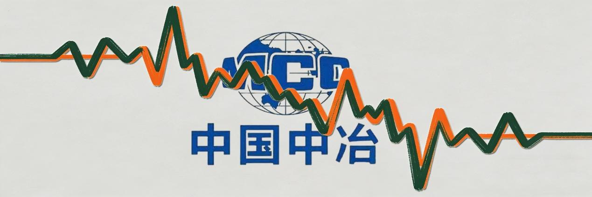
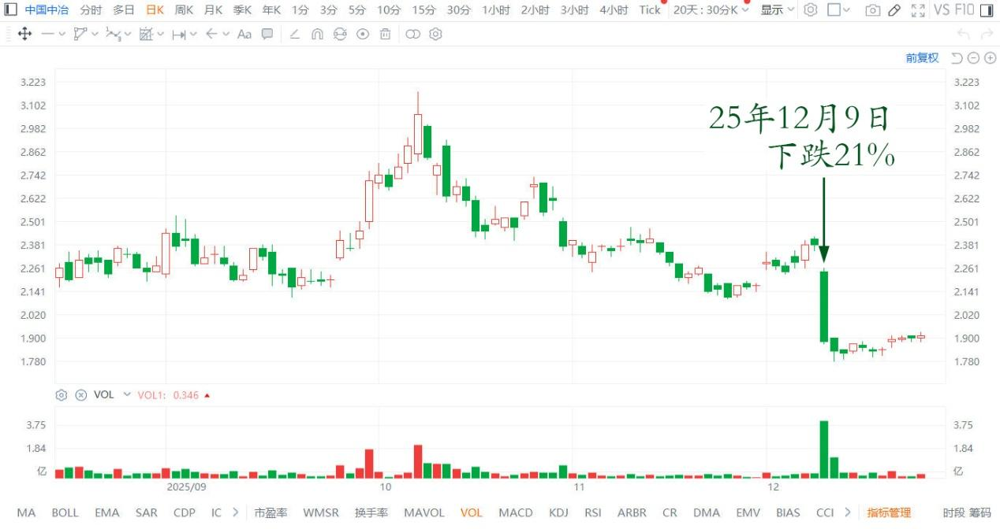
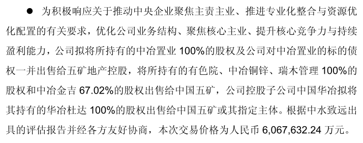
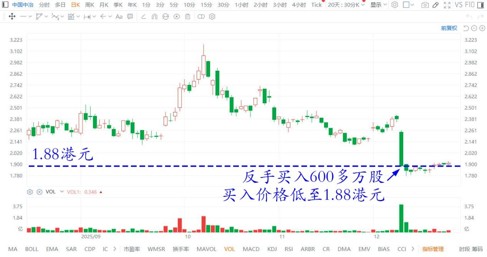
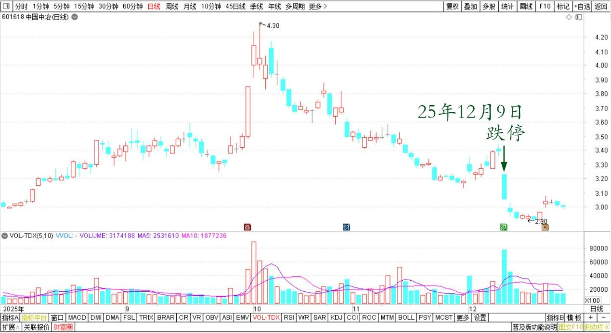
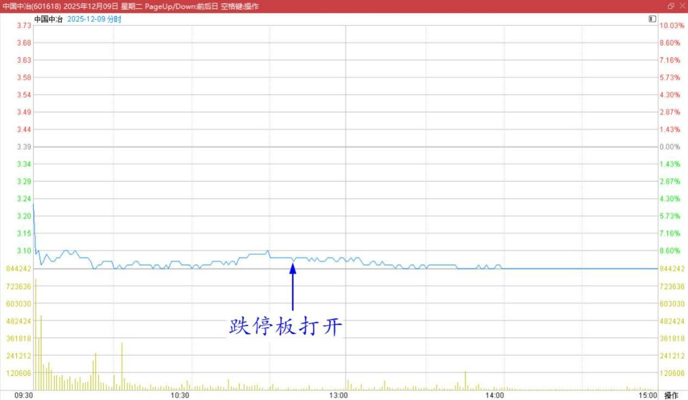

214篇.中国中冶下跌21%，买入600万股

**清一山长**[2025-12-09 11:19](https://www.zhihu.com/pin/1981681970560914212)

今天亏惨了。

突然发现：我的重仓股**中国中冶，今天下跌21%？**

亏惨了！

中国中冶港股2025年8月～12月日线图

据说，这个货，把自己最有价值的矿，卖给了关联公司。现在它就是一家建筑公司，不值钱了。

中国中冶关于出售资产暨关联交易的公告

[https://www.cninfo.com.cn/new/disclosure/detail?plate=sse&orgId=9900008087&stockCode=601618&announcementId=1224859771&announcementTime=2025-12-09](http://link.zhihu.com/?target=https%3A//www.cninfo.com.cn/new/disclosure/detail%3Fplate%3Dsse%26orgId%3D9900008087%26stockCode%3D601618%26announcementId%3D1224859771%26announcementTime%3D2025-12-09)

好吧，就算你说得对，我买中冶其实就是冲它的矿来的。现在矿都没了……我走？反正也没赔钱，只是少赚了21%罢了！

慢着……这货的市值才300多亿，不到400亿。它卖出去的资产，是卖了600亿。

这个剩下来的是负资产？

一个东西，原价是400亿，你卖了600亿。然后你说别人剩下来的都不值钱？你要赔钱卖出？你有毛病吧？

于是——**我反手买入600多万股中国中冶。**

**买入价格低至1.88港元**！跌幅21%。很遗憾最高3元多的时候没有卖掉它。

中国中冶港股2025年8月～12月日线图

然后看到A股的跌停板打开了，也不涨。

中国中冶A股2025年8月～12月日线图

中国中冶A股2025年12月9日分时图

那么A股显然，明天没法再跌10%了吧？

也许今天这些范跑跑，都走了，明天会有买入吧？

管他的，反正我拿股息就行了。

也许600亿卖掉后，会有惊喜呢……发特别股息！

我相信：**中国中冶是不会垮的，我长期持有不会亏的！**

**（标题、图片为编者所加）**

文章音频：

[631篇.中国中冶下跌21%，买入600万股](http://link.zhihu.com/?target=https%3A//www.ximalaya.com/sound/944403708)

**参考链接：**

[208篇.股市案例分析——主力操盘的周期有多长（配图版）](https://zhuanlan.zhihu.com/p/1982798321073533837)

[209篇.中粮糖业主力走势猜想](https://zhuanlan.zhihu.com/p/1983556072204703566)

[210篇.茅台换什么？](https://zhuanlan.zhihu.com/p/1984033552149545369)

[211篇.惠泉逆势上涨突破涨停价](https://zhuanlan.zhihu.com/p/1984031933164955450)

[212篇.惠泉主力已经成功撤退了](https://zhuanlan.zhihu.com/p/1985014426399691858)

[213篇.惠泉如此下跌，恐慌局面彰显](https://zhuanlan.zhihu.com/p/1986167584551356371)

[链接汇总（截止2025年12月3日）](https://zhuanlan.zhihu.com/p/621215591?utm_psn=1967007144831350474)

