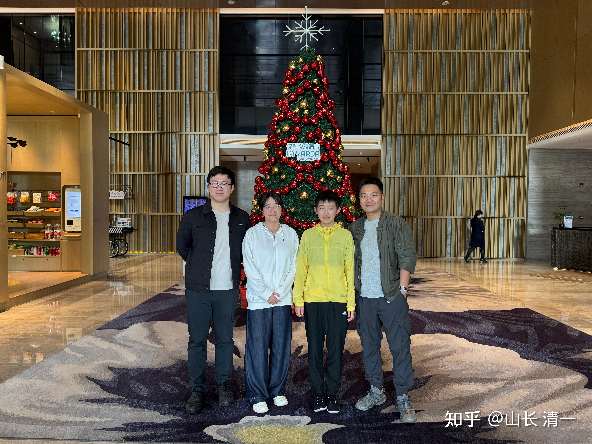

昨天16个来自全国各地的“富一代”家长，知道我回国，刚刚结束了广州的富二代游学之后，想要趁此机会线下找我现场交流和咨询，于是就约好了，在昆明的私人银行中心接待室，与家长们进行交流。大家的参与度都很高。原来安排的是两个小时，我正在奇怪为啥这两个小时怎么这么长，就抓过家长的手机来看时间（我身上一般不带手机），才发现不知不觉三个多小时已经过去了。

家长们普通的困惑，就是自己的孩子一堆的毛病。学习不上进，偷懒，消极怠工，还没脸没皮。一个家长的孩子更搞笑，班上是经常排行拖尾巴，挨批评的落后分子。表示不想上学，想要回家“享受家庭生活”，但家长就哄她说：只要你成绩上进去班级前三名，就让你回家。结果这臭小孩，下个月就拿了班级第一名。家长哭笑不得的说：是哄你的，第一名也不会接她回家。孩子就说，既然回不去，就继续躺平好了。家长哭笑不得。问我怎样处理？

类似的情况，在富二代家长这里是很普遍的：这些富二代孩子都很聪明，但聪明基本上不用在正道上。都用在吃喝玩乐，享受人生。与家长斗智斗勇上了。因此很多富二代小孩，长大后各种毛病，也接不了家长事业的班。家长花了大钱送出国，结果回来后成了一个对家族毫无用处的孩子。家长问我该咋办？

我说：别指望一个学校开个啥课程就改变了孩子。这些孩子都是你们家长从小宠出来的毛病。你们按照消费者的思维方式去培养孩子，却希望她长大成为杰出的人才？就相当于从小用养猪的方式来养孩子，却希望她长大后变成狮子一样。这就是所谓的世人“妄想颠倒”，把事情反着做了！

家长问我该怎样才能正过来？

我说家庭教育，是孩子一生的价值观养成的核心因素。学校的教育再好，如果与家长的教育核心理念是相反的，结果就是不会好的！学校教孩子付出，无私，成为经营者。家长教孩子吃喝玩乐，成为消费者。小时候，这孩子可能看上去还挺像回事的。但长大成人后，一定是家长从小植入的价值观起作用（比如公主班一些孩子。小时候看上去都很不错，积极上进。但到了青春期，就会出现种种问题）。因此，光靠学校教育，其实改变不了核心问题。

过去的学校教育，只是教知识。家长不懂得从小培养价值观和思维方式的重要性。因此也不懂得珍惜我们的教育。我们做价值观教育家长看不懂价值，我的孩子现身说法，明明结果很好，但家长就是看不见，就要反着做。逼得我们学校也只能改变原来的方法，也只能迎合家长，来抓知识教育，抓考试教育。家长对这样的结果还挺满意。但未来，家长肯定会被一群消费者孩子折腾死的。就像清黑学生一样，家长从小教的东西，骨子里面是自私任性。我们教的东西只在表面上做，还养成了虚伪的人格，甚至也不如普通人进取努力，远不如父母一代愿意付出和努力上进！但她们自视还特别高。看不起周围的一切，就是两种互相冲突的价值观，反而培养出了一群格格不入的人。

至于该怎么教育富二代孩子？

我认为家长对孩子，从小就是“倒过来教”才行。芒格说的，**反过来想，永远反过来想。**

核心就是：绝对不能从小就“万般宠爱在一身”。这会让孩子废掉的！爱孩子，也要藏在心里，长大了再去表现出来。

**一：从小开启艰苦训练，是教育的最佳时期。“少年不识愁滋味”**

千万不要以为孩子长大就自动好了，小时候养成的坏毛病，长大后往往一生都改不掉！

因此，家长在孩子小的时候，要当后妈，孩子要像灰姑凉一样严格要求和训练。这时候孩子给啥是啥。从小的严格训练，会让孩子长大后养成良好的习惯，特别是勤奋和努力，是一生成功最重要的素质，也是从小养成的习惯，长大后很难培养这种习惯。可惜绝大部分家长，都是从小培养“贪馋使懒”，以为会读书就好。结果长大后，不会读书也不会做事，更不会做人，成为了废物。更过分的就是成为害虫一个！家族的前途都废掉了！

**二：青春期，对孩子实行员工和伙伴模式---尊重和平等！**

一旦青春期开启，孩子跟家长开始逆反，教育的黄金时期就过去了！这时候，必须和孩子讲尊重，家长千万不能变奴仆，伺候孩子，这样下去，家长就会成为一生的老奴才！孩子很可能成为一生的消费者，废物！

** 家长此时，只能跟孩子“谈生意”，玩交换。植入“生意就是生意”的价值观。千万别讲感情，跟孩子玩感情互动，一定会输得惨惨的。因为孩子跟家长玩这个，是没有底线的！对外人还有分寸一些。**

家长此时不能讲感情，只讲道理---“你对我有什么用，我们怎样交换资源”？迫使孩子去创造自己的价值。成为有用之才，而不是用情绪来控制他人。

对于青春期的逆反情绪孩子，你去讲感情就输了！只能讲生意，互相玩交换！家长理性地要求--孩子想要的一切家长的支持，都必须付出努力来换取家长！双方平等交换。

这样培养出来的孩子，才是一个正常的“社会人”、才能正常在社会上发展成长。如果家长拼命去照顾孩子的感觉情绪，孩子就会成为一个自我中心的疯子，离开家就无法适应。只能在家躺平当消费者，当“抑郁症患者”，成为赶不出去的废物了！

正好就有一个现成的案例：一个企业老板的孩子，18岁，送来学校当旁听生（正常是不收的）。但孩子认为学习和训练很艰苦。就想逃避，想回去，说想考大学，这个很美好的借口，最容易骗过家长的借口来逃避训练。

我就问家长：能否接受家里拥有一个给良好的发展机会不要，只想在家躺平，享受生活的孩子？家长说不能接受，这种孩子还不如不要。

** 我说：家长如果内心这样想，就这样做。自己去告诉孩子家长的态度**：已经给你找到了最好的学校。如果你不想要也没问题，就自己离开学校，自生自灭，不用回家了。反正你已经大了 ，如果你没啥价值来帮助家庭发展，对家庭就是没用的废物，因此家庭也不需要你。你自己既然这么有主意，有想法，就去自生自灭好了！

结果这孩子马上就改变了态度，在学校就好好学习，再也不敢消极怠工了！也不再跟家长提要回去“考大学”啥的了！毕竟---学校和家庭相比肯定更难受。但她也很明白---去社会上自己闯天下，只会比在学校里面学习和训练要艰难得多。她自然要选择“更轻松”的选择。所谓的去上大学，无非也是海外大学其实很好混日子罢了，绝不是她真心想要学习提升自己的素质！

** 三：孩子长大：成熟期（相忘于江湖或者宠孩子，献献爱心）**

孩子长大了，成熟了，可以独立生活了。家长此时可以改变态度，来当：爱心爸妈了！或者对于顽劣不改的孩子，只能放手了。让社会去教育他去！

就像现在我母亲对我一样：小时候我对非常苛刻。弟妹干了啥不好的事情都收拾我，让我觉得自己是捡来的。现在完全反过来了。我做啥都行，干啥事情她老人家都顺眼，啥都不要求。就算我“干坏事”她都能找到正面的理由来理解和支持我。这样的亲子关系自然很好，“其乐融融”。

如果家长在孩子长大后，对孩子的选择与自己不一样，就挑挑剔剔的，想要去纠正孩子。最终的结果一定是亲子关系很紧张。双方就像仇人一样！何必在一起互相伤害呢？

我的选择就很简单：孩子长大了，如果与我的价值观不一样，我都尊重。孩子长大，不想帮助家族，不想为家族平台做事，想要自己去外面发展，走自己的路，也没问题。我不会说孩子不对。但也别指望让我用老脸去贴孩子的冷屁股，去继续为孩子自己闯社会去开路搭桥啥的！我们就“相忘于江湖”，彼此都自在。甚至可以“鸡犬之声相闻，老死不相往来”。这一辈子来看不看我都没关系！

我已经完成了生养的任务，我也不求孩子对我有啥回报，更不想被不肖的孩子气死，就彼此相忘江湖，各忙各的好了！

对于愿意亲近家庭，尊重家长，服务家族的孩子，小时候我可以很严厉，长大了就别继续绷着了。可以对这些善缘的孩子好一些，宠一些，甚至“过分的娇宠”一点都没事！让孩子可以回来跟家长撒撒娇，赖赖皮也没啥的！

现在的小明慧，就有点不习惯我对她态度的改变：说小时候这不许，哪不许的，要求很严格，为啥现在干啥都可以了？干坏事我也不骂她了？

我说你已经带班当老师了，我骂你干嘛呢？就算我不喜欢，也忍住一点算了。总唠叨你也烦！比如唠叨你早点嫁人，你就烦死了。随你便吧！

昨天定去磨丁的高铁票，我让孩子定一等座。孩子就说：原来从来都是普通座，现在干嘛要多花钱做一等座？车都不一样到吗？路上时间也不长。

我说：从小不带你们过这些“超过平常人的生活”，是不想你们认为自己高人一等。增长我慢之心，长大了就很难被人接受了！

但现在，你们已经长大了，就应该去体验不一样的生活。 你们连一等仓，一等座都没坐过，怎么像富二代的样子？怎么理解其他富二代的生活和出行方式？思维方式？比如老板前一天用价值高达300多万的豪车来送我们，我们也体验一下豪华服务好了。看个普通的车有啥不同！

孩子觉得我的理由很奇怪，不过说：反正爸爸花钱，爸爸说了算，换她自己，还是只会买普通座。因为认为没必要！豪车也体验过了，认为的确有点不一样，但不会去花300万买豪车。

静慧也说：自己从来没有坐过一等仓一等座。见过也没觉得有啥稀奇的。我说上次我出来，带公主们去武汉，妈妈买了一等仓。我还让同行的小公主去公务仓休息室，替我“体验”呢。你们是我女儿，更应该什么都体验一遍。以后自己决定自己喜欢什么样的旅行，自己安排！

我这样的教育，就不会让孩子成为纨绔子弟。也不会让孩子没见识。但如果小时候就让孩子只能住五星级饭店，只能坐头等舱一等座，从小只习惯豪车，孩子从小认为自己与众不同，与周围的人隔离开来，养成傲慢自负。骨子里面却很无能的个性和脾气，就毁掉了孩子的人生！

因此：养孩子，必须“先苦后甜”。这样的孩子才是正常人。

现在的家长，普遍是“先甜后苦”，都把孩子养废了。还把亲子关系搞得一团糟。家里关系乱成一团！这就是愚蠢的家长了！花钱买罪受。

*在广州某米其林三星餐厅，体验【富二代生活】*

上面是两个女儿和某金融公司总裁的孩子一起合影。偶尔体验一下我不会带她们去的米其林餐厅吃吃饭。吃完了， 认为也就是吃饭而已。关键是和有趣的人交朋友。