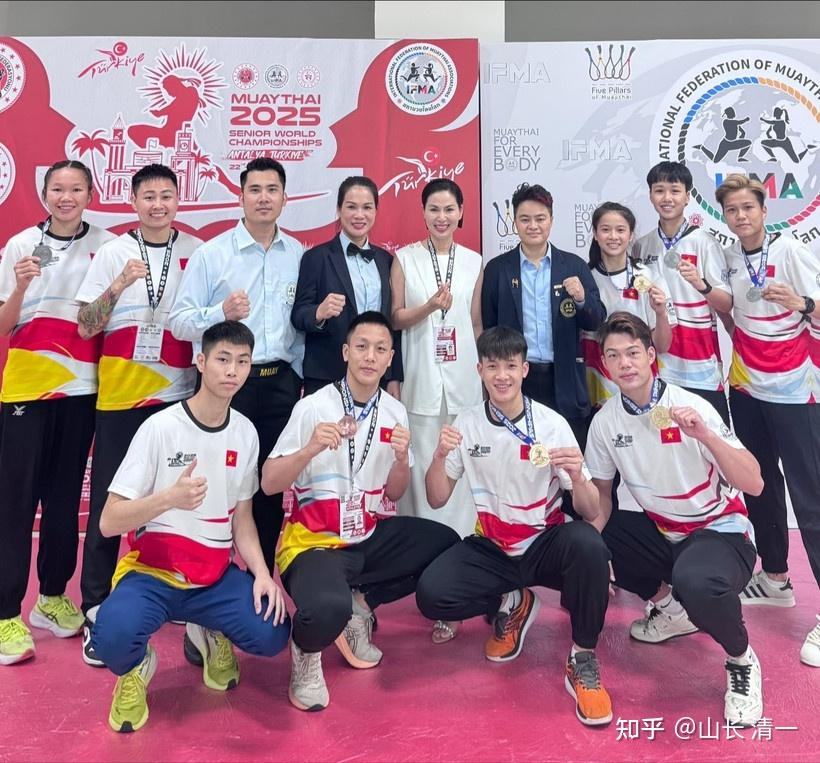
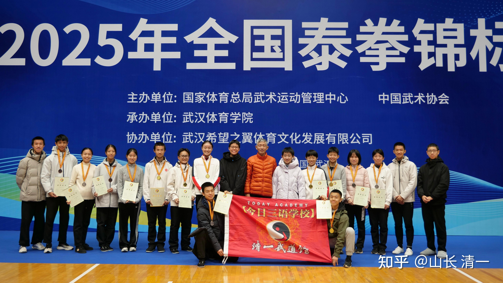

清一团队，正在清迈积极备战2026年世界泰拳锦标赛。我看了几个过去的消息，觉得非常的丢人。中国队连小小的越南都赶不上：

越南队在2025年土耳其世界锦标赛。派出了24名运动员。总共获得4枚金牌、6枚银牌、4枚铜牌，排名第五。

*越南队2025土耳其世界锦标赛合影*

中国队呢？是零记录。。一块奖牌都没有拿到。

虽然这次比赛，也给了我们两个名额去体验。但赛前集训就是鬼扯淡。我没有指导和随队的可能，无法近距离帮助孩子们比赛。孩子们的运气也很差。陆鸽首轮KO了对手，但第二轮就遇到了东道主。你们知道的----只要无法KO东道主，就会判她输了比赛。事实上也是。她打的并不差，但打满三局，最终失去了比赛！

刘晓慧也很倒霉，不让她参加她擅长的精英赛（无护具），要她去参加带护具的U23。要把精英赛让给耿春蕾。结果也一样因为优势不明显，技术上不被认可，而且对手是世界冠军，打满三局首轮就淘汰。还弄得失去了比赛的信心，觉得要去考大学才是出路。就算是后来我全力协助，帮她拿到了世界运动会的冠军，但她的脑子也改不掉退役上大学的概念了。

而耿内战内行。外战一样外行。她也是一轮游就被干掉了！因此，中国队2025年的世界锦标赛，就是全军覆没的结果！相比越南派出24个运动员，14个拿到了奖牌相比，我们中国队真的太落伍了。首先是派不齐队伍，只派了个位数的拳手去参赛！其次是一个奖牌都没有。反映了中国格斗界在世界上的地位，真的是被人瞧不起的！

今年6月的2026年吉隆坡的世界锦标赛。清一拳手首次得到了国家体育总局的重视，给了我们多个参赛名额！我们争取尽量打败越南的女队，不然真的太丢人，我们如果连个小小的越南都搞不定咋行呢？我能保证女队能够打垮越南，泰国等传统强队。我们的女队，今年有5-6人都有希望夺牌，只要现场发挥出正常水平。不被东道主黑，就有机会。马来西亚的拳手应该没有啥实力雄厚的种子选手。因此我们被黑的可能性不太大！

男生拳手暂时还不行，再等两三年，就可以出来了！今年的男拳手，只有黄奕儒很有希望夺牌！

我这个期待。是否有点盲目自大？

应该不是的。2023年，IFMA的东亚泰拳锦标赛，最强的香港队总共拿到了10块金牌。2025年，香港队也拿到了9块金牌。但2024年，香港队只拿到了5块金牌。为啥这么惨？

就因为我们清一拳手组队参加了2024年的东亚泰拳锦标赛，直接抢走了香港队的四块金牌！并创造中国队参加东亚泰拳锦标赛的最佳夺牌记录！

2023年和2025年，我们都没有参加这项比赛！香港队才能守住自己东亚第一的名号。等我们的拳手全面参赛，香港恐怕就守不住第一的位置了。

我们也有信心，在2026年的马来西亚，帮助中国队去创造历史最佳的锦标赛夺牌记录！

2025年的核心赛事记录：

[格斗昆仑决 天才少女应越击败世界冠军获金腰带](http://link.zhihu.com/?target=https%3A//www.bilibili.com/video/BV1wTG2zEEVY/%3Fspm_id_from%3D333.337.search-card.all.click%26vd_source%3Dbdd9abbaa088a96830ea41e59760839b)

这个昆仑决的中国女拳手应越。赛事中击败了伊朗的女拳手，这个伊朗女拳手，是拿过多次世界冠军的职业拳手。从小就参加泰拳训练。是个拳台老手了。应越作为新人。敢冲敢打，让习惯了泰拳节奏的老世界冠军拳手都不适应。最终打满三局，冠军输掉了比赛！成就了应越的新星---被媒体誉为格斗界的“天才少女”

她2025年12月，参加全国锦标赛，对阵身高体重都不如她的陆鸽！赛前志气满满，认为可以轻松拿到冠军，拿到2026世界锦标赛的参赛资格。作为昆仑决的签约职业拳手，她赛前根本就没把一个初出茅庐，从来没有国内职业赛事中露过脸的陆鸽放在眼里。估计也没有专门研究过对付我们的打法。以为和别人一样的。没想到，这次上场完全无法适应，根本还不了手，被陆鸽打惨了。勉强支撑了二局，全程被狂虐。完全就打不出她擅长的进攻型打法，被陆鸽完美克制！

最终打了两局，她就弃赛了，TKO结束比赛。我猜要么是受伤了、要么是教练员看她连丢两局，但第三局翻转的可能性不大。。反而有可能受伤。为了保护她而弃赛的。她应该很不服气，赛后应越一直在大哭。最后连颁奖典礼都没有参加，---她仅仅拿到铜牌。但对她来说，夺金肯定是她的底线。不过，等我们的木兰鸽以后拿到世界冠军之后，应越就会心平气和了。她输给未来的世界冠军，不丢人[表情]。

陆鸽VS应越 泰拳全国锦标赛

[https://www.zhihu.com/zvideo/1983617596071908555](https://www.zhihu.com/zvideo/1983617596071908555)

当然，曾经打赢了前世界冠军的她，肯定还是不服气的。不知道她5月份会不会来参加选拔赛。如果来的话，有可能她还需要跟陆韵如打一场比赛。这次如果再输了，应越可能就会哭得更厉害了！因为我猜陆韵如会赢她的！更有可能的是。她雨后根本就不会来参加泰拳比赛了。我认为她去打自由搏击应该更有机会。因为上次她打泰拳世界冠军---世界泰拳女王莎赫拉。但比赛的规则，并不是泰拳规则。是昆仑决采用的自由搏击规则。因此长期打泰拳的对手，应该不太适应这种自由搏击规则，泰拳格斗中 擅长使用的肘法膝法，内围战技术，都不能使用。因此输掉比赛也不奇怪。场面其实我认为是基本平手。只是由于在中国比赛----基本上平手就判中国赢了！应越去参加自由搏击世界锦标赛，未必会有很好的战绩。中国队一向就是一轮游的。

下面是陆鸽打全国自由搏击锦标赛的视频，第一局就是陆鸽明显优势，结果居然判对方赢了。第二局对方就快不行了，才勉强判陆鸽赢。算是双方前两局打成平手。第三局如果不是对方中途放弃，陆鸽TKO获胜。我都猜最终会判陆鸽输掉的。因为其他决赛都是这样算账的，因此才让我们决定以后不去参加全国自由搏击锦标赛了。如果陆鸽这个对手换用泰拳规则来打，第二局就会被KO的，但这次差点还赢了！这种比赛，限制了我们的优势。我们拳手场上击倒对手都不给分，说是我们的队员身体稳定性不足，因此不给分。面对这种比赛规则，我们还是弃权算了，或者练出一击必杀的KO技术之后再来。

因此应越，我认为以后还是去打自由搏击会更有优势。应该比泰拳更有控制力一些。我们太极派的人，更擅长内围战和肘膝连续攻击。基本上不会给对手发挥的机会！

[https://www.zhihu.com/zvideo/1978133517599798836](https://www.zhihu.com/zvideo/1978133517599798836)

清一大学武医学院的文章 - 知乎

[2025全国泰拳锦标赛简报7 | 最终篇-决赛日](https://zhuanlan.zhihu.com/p/1984010895286891507)

为了备战今年的世界锦标赛，为国争光。我们今年拿出了压箱底的好货。深化了技术训练。我们的拳手，目前都正在强化训练太极的旋身拳，旋身肘。左右式轮换使用。不在执着于左式！

李想公主今年早些时候，刚拿到自由搏击全国锦标赛青年组的冠军。去年12月刚满18岁才2个月，就拿到了全国泰拳锦标赛的成年组冠军。这个记录，应该很难被其他拳手超越了！一年拿了两个全国赛冠军。现在李想公主正在清迈强化训练新技术。同时也在和明慧一起带小班的学生。最近两个月，我看她的技术进步速度非常快。我指导新技术和药要求后，她跟进适应非常的轻松。已经和她在两个月前打全国锦标赛不一样了。取得了明显的进步。很有可能李想公主会在今年的世界锦标赛上爆冷门的！如果18岁就拿到了世界锦标赛的冠军，这样的女孩才能叫做天才少女吧？

下面是本次李想公主打全国锦标赛的视频。对手与应越是同一个拳馆的战友（壮格搏击）。据说该拳手签约了昆仑决。是个实力派拳手。出拳力道很大，而且身高个子都压李想一头。比赛前很傲慢，连碰拳礼都没有，可能对手自负自己的“实力”，有点瞧不起这个刚满18岁，第一次参加全国成人锦标赛的对手吧？认为是新手好虐菜的！

本次比赛全程都打得很激烈，主要是李想的进攻很激烈，对方其实没有多少还手的机会，都在抗击打了！对手被击中的次数，比陆鸽打应越的这场更多。腹部也挨了很多下李想的重腿。因此不得不佩服对手的抗击打力真的很强。这么连续被打击，都能撑得住三局打满！因此，这人应该实力很强。或者说：李想公主虽然腿拳结合的打法技术使用，比陆鸽掌握的更流畅，击中对手的数量很多。但攻击力应该不如陆鸽，所以造成对方还扛得住。李想公主的未来训练方向，就是要发出更大的打击力量！才有机会在世界锦标赛夺冠。

这个拳手后来与另外一名陕西的拳手打比赛。双方就打得有来有去的，最终点数取胜。我们还以为她会轻松取胜呢。因为陕西的对手对阵谭木兰，第一局就在读秒两次。还以为很差。看来是谭木兰实力碾压了让她无法发挥的。正常来说，最后的一轮比赛，这个对手应该与谭木兰打循环赛的，双方决定谁能争夺银牌（谭木兰上一场就弃权给李想了）。结果对方和李想的对手，却双双弃权。估计两人算了一下局面，她们两人，都完败给木兰们。特别是谭木兰的第一轮对手，被谭木兰打得毫无还手之力，第一局就被读秒两次，第二局就TKO退出了比赛！但两人之间，互相打比赛，双方还有来有去的，彼此实力差不多。所以她们两人，后来都不愿意继续上去继续挨打了，全部弃权了。因此我们白白的少了两场精彩的对外比赛记录！

[2025全国泰拳锦标赛：李想打满三局点数胜！](https://www.zhihu.com/zvideo/1982497573035075379)

[https://www.zhihu.com/zvideo/1982497573035075379](https://www.zhihu.com/zvideo/1982497573035075379)

现在的李想，再来看这场比赛，肯定是满满的遗憾---怎么打得这么笨。要换她现在的打法，第二局就结束战斗了！

大家就敬请期待今年的比赛吧。我相信太极旋身拳的强化练习，肘膝技术的完善，会给今年的锦标赛增加很多亮点。对手会更加的没脾气。

去年的全国锦标赛，我们参加了泰拳的七个项目，就拿了6块金牌！今年我们争取参加9个项目，拿到8块金牌。更重要的是：我们争取在国际赛事中，打出中国队的历史最佳成绩！

国内的水太浅了，已经容不下清一战队的身体了！我们的目标是星辰大海，是击败全世界的顶尖高手！