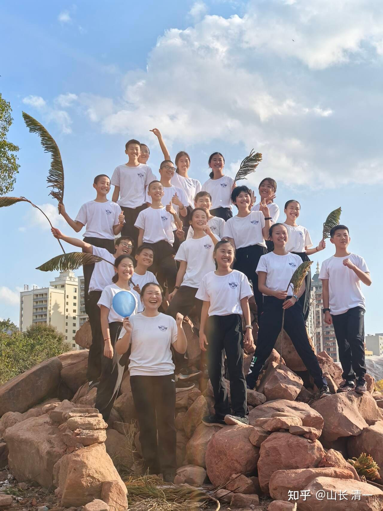
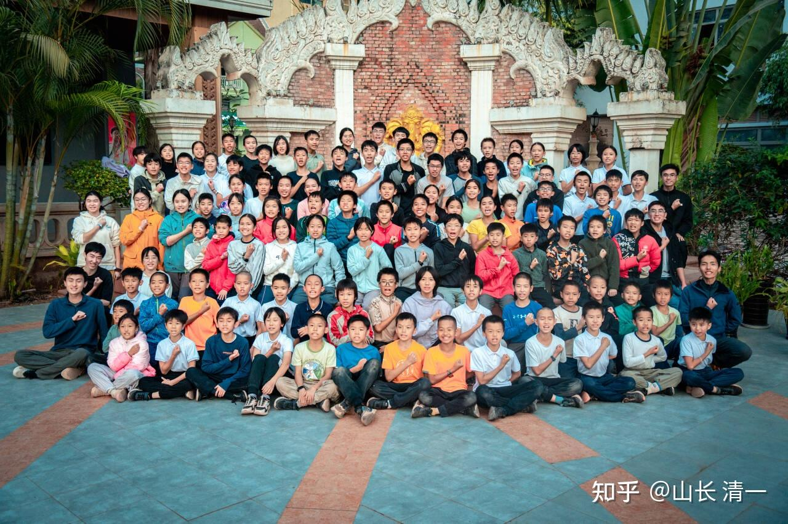

很多家长说：今日三校的考选比考大学还难！

这也不奇怪：因为今日三校仅仅只需要四年，就学完美国12年的全部课程内容。

还能让90%的学生，都能达到全世界学生中7%的优等生成绩（SAT1400分）。

更稀奇的是---我们有50%的学生能超过SAT1500分的分数线，达到常春藤大学的入学要求，成为1%世界级顶尖学生！

放眼全世界，还没有任何国际学校，能够达到这一卓越的教学水准。入学难度超高的，学费达7万多美金的美国顶尖私立高中，跟我们学生创造的学习成绩相比，也是相形见绌。

*照片背后就是磨丁--孩子们的生活区*

家长们都知道：**能够进入今日三校，就等于是进了世界名校保险箱！**

只要能够坚持学习四年下来，就能成为世界TOP50名校的“保送生”。

至于可以凭大学毕业文凭，就获得香港永居资格（价值达3000万元）的199所世界知名大学，对于我们的学生来说，想要入读就更是轻而易举！对今日三语毕业的学生来说，这些名校入读资格随手就拿到OFFER!

因此，相比普通人，只能拼命地去用12年的生命，去努力卷体制的小学，初中和高中，去考国内的高考，还要在大学毕业，去抢夺正在消失的国内职场机会，还不如去拥抱世界，去击败全世界的优秀学生，然后获取在世界上更加宽松的“蓝海职场发展机会”。

这就是今日三语学校，为何特别吸引中国的家长和学生，积极申请加入的核心原因。

这种热度之下，今日三校原来对学生的考选，自然是竞争非常的激烈！甚至今日三语每年都要开除一些不进取，不珍惜学习机会的学生，保证教学质量。

也因此，各外围学堂也普遍开设了今日三语学校的“备考班”。家长们为了获取更高的入学机会，往往要把孩子先送往一些外围学堂备考，争取获得更好的入选今日三语的机会！

那么：清一公社义塾在帮助完全没有准备，也不知道如何准备的学生，在备考今日三校上，有何特别的优势呢？

**第一个优势，就是“不卷”。**

清一义塾获得了清一山长的特批，可以**全员免试入学，还可以拥有“免末位淘汰”的机会。**要求仅仅是---学生和家庭，只要有良好的学习态度，一旦入读今日三校后，无论今后在校成绩优劣，都可以顺利的读完4年，不会在学习中途被开除！（当然，学生自动退学是可以的，不要求家长一定跟随四年）。

**第二个优势，就是备考期间“不学外语”、不折腾学习成绩。**

这是因为今日三校的教师发现：很多外围学堂，并没有按照【今日示范班】 的教学方式来教学生。而是乱教的。

[今日三语学校! - bilibili.com](http://link.zhihu.com/?target=https%3A//space.bilibili.com/487498588%3Fspm_id_from%3D333.337.0.0)

这些教师没有上过新教育的学堂，更习惯用体制教育的方式来教备考今日三语的学生，导致这些学生在入学今日三校后，对外语学习形成了负面的学习方式和心理负担，还厌学。表示“不喜欢新教育”。这种心理状态，严重影响了正常的学习，还不如不学呢！因此，2026年，今日三校招收学生，已经不再考察学生的外语成绩了。只考察学生的中文理解程度和学习态度，以及运动的态度和能力！

**第三个优势：考选方式简单，有效，还保证100%全员录取。**

清一山长给了清一公社义塾备考班一个特别优越的考选条件，**目前只对义塾学生开放**。就是只看学习态度，不看学习成绩！

要求是：只要在义塾备考期间（四个月内），相当于正常的一个学期的学习周期。只要成功地完成了3650公里的行脚任务（如果每天行走36.5公里算，只需要100天，还有20天的富裕时间用于“补考”）。参考外国学堂会要求学生每天走70公里的路，甚至有人玩90公里突破的。今日三语的入学要求实在是太低了！

一旦在备考期间，学生完成了这个相对“平庸”的指标，今日三校就同意：不附加其他考选条件，该生就可直接入学今日三校！而且一读就是四年。拿下SAT。

原来，因为新教育的教育要求和标准，与传统的体制教育对学生的要求完全不一样。所以很多家长，往往不明白该怎样上今日新教育。也不明白自己的孩子，怎样才能符合新教育学堂的入学要求，生怕离开了体制教育，又考不上新教育，就两头失踏了！导致很多家庭无法走出这一步，总担心没有退路！

这样，因为双方的信息不通，也导致一些从业人员，会去胡乱吓唬家长。会是今日三语要考家长，要通过难度很高的家长培训，才能过关入学等等，让家长更是一头雾水。

**现在，这个简明扼要的检验方法出来之后，想读新教育的家长们，全都松了一口气**-----现在，各位想要入学世界级最顶尖的新教育学校，也不是想象的这么难。其实普通人也可以做到！

不就每天走走路吗？--谁不会呀？真的连一天36.5公里都走不出来，你这孩子也真是废掉了。没看别人“跑马”的人，只要2小时就跑42公里呢！你用一天来走总没问题吧？又不要求你进度。

**第四个优势，是备考今日的学费很低廉！**

现在外面传言入读新教育的学费很高。在消费下行的情况下，让很多家长认为新教育，是有钱人家才能就读的国际学校！

的确：国际学校一般每年的学费都在20-30万元。如果坚持一路读下来，12年就要花费300---500万元，的确不是普通家长能读的。

但今日三语只需要4年就能读完，之后1400分还可以免费入读高中和清一大学，连食宿费和学费都全免了。相比正常的国际学校，清一**新教育其实是多快好省的教育方式！**

由于我们认为帮助学生备考今日三校，这个工作本质上没有啥技术难度，因此并不适合收高昂的学费。还容易被一些不懂的人乱加料，乱学习。反而破坏学生的潜能和心理。相比一些外围学堂，常常会以“备选今日三校的难度很高”为理由，胡乱收取家庭过高的学费。

作为对照：清一公社义塾，作为一个提供非盈利教育服务的学校， 将享受今日三校给以的特别选拔政策的补贴，还能够得到今日三校派出的有经验的教师现场参与指导，对义塾的选拔营提供无偿的教育帮助等等，大大降低了办学的成本。因此我们只对家长收取接近于基础成本的学费：整个备考期间（2026年5月--8月），全部的学费，生活费，以及住宿费等，加在一起一共只需要2万元！这个价格是非常的“接地气”，一点也不浪费家长的投资！也就是个大城市你请个保姆差不多的费用，就帮你培养出一个能够考上今日三校的好孩子。

我相信：清一公社义塾提供了这样优越的考选条件，如果您的孩子还是考不上今日三校的话，肯定是你们的家庭教育理念，出了很严重的问题**。**

**如果现在这种宽松的条件，还考不上今日三校的孩子，将来无论上新教育，还是体制教育，恐怕都是没有什么出息的**，家长还不如直接放弃算了！让孩子去打工，面向社会去教育，免得白白投资！

**第五个优势：备考期间强化思维能力培养，以及强化中文的阅读和理解！**

大家知道，要想学好外语，没有良好的中文理解能力也是不可能的！一些外围学堂就比较急功近利。为了逼孩子出英文的成绩，忽略了基本语言理解能力和思维能力的培养，学习能力的培养，天天逼孩子背英文。导致事倍功半。

但清一公社义塾，将在备考期间，先强化孩子的学习态度，以及在行脚之余，用中文经典作品来帮助孩子提升文化水平，以及思维能力，树立传统文化的基本价值观。让孩子们打好基础，这样才能够在正式入读三校后，顺利完成四年学完12年的体制教学任务，成为优等生！

**入学要求：**

2026年，已经年满10周岁（不是虚岁），但还不超过12岁的学生，都可以申请进入清一义塾的三校备考班！（特殊情况请找义塾相关人员咨询）

备考班的学费（四个月）将一次性收取。如果家庭中途自动退学，是不退费的。家长必须确定你真的需要才来申请，避免浪费宝贵的申请名额，如果让一些犹豫不决的家庭，胡乱来入选浪费名额，就会导致挤占了其他有愿心入学的家长的名额！这样是很不公平的。

如果考生在4个月考察期间内，用了120天，都完不成3650公里的行脚任务，学生不会考虑录取三校的可能性。义塾的教师，可能会帮助家长，推荐介绍其他的外围学堂去上学。或者家长就自己带孩子回家，自己选择自己喜欢的学校去学习！

[!\[image\](images/img_003.jpg)

今日三语学校「今日塾」部分学生的合照 https://www.zhihu.com/video/1996153720015171940](http://link.zhihu.com/?target=https%3A//www.zhihu.com/video/1996153720015171940)

申请联系人：清一公社义塾 英子校长

请联系她们的自媒体，确认你的申请。。。

英子QQ：347542232

安娜QQ：584835482

英子的知乎链接：

《金钱的艺术》第5课 | - 英子的文章 - 知乎 QQ号：347542232

[《金钱的艺术》第5课 | 世界遍地是赌徒](https://zhuanlan.zhihu.com/p/1994584771930654596)

义塾教师，北大才女易轩的链接

财商课 day8｜60岁的我，会是什么样子？ - 易轩的文章 - 知乎

[财商课 day8｜60岁的我，会是什么样子？](https://zhuanlan.zhihu.com/p/1995648226334889916)

义塾教师：武汉大学才女乔安娜的链接！ 安娜QQ：584835482

清一新教育| 世人皆苦-花花世界的众生相 - 乔安娜的文章 - 知乎

[清一新教育| 世人皆苦-花花世界的众生相](https://zhuanlan.zhihu.com/p/1994673950161121858)