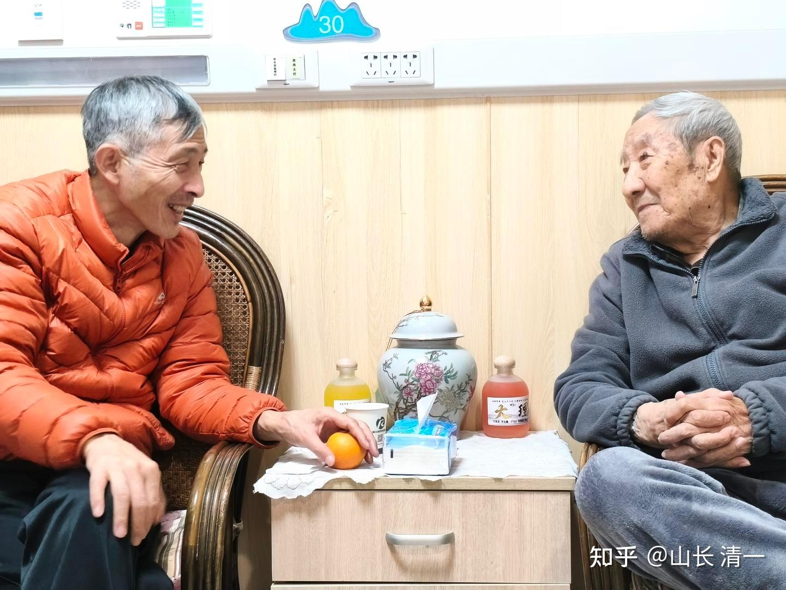

下面照片，是我在2025年全国泰拳锦标赛期间，去武汉的一家养老院，见到我大学时代的老师照片！老师今年已经93岁了！

曾老师93岁了。常年读书用功，现在的脑子依然很清晰！很有理性！也很有自尊！

他提到住在养老院的最大难受之处，就是虽然衣食无缺。就是找不到人说话。

其他一起住老人院的老人，往往失能，而且脑子坏了。无法交流！

护工一个人管四个老人。工资7000元。虽然态度好，但也无法交流。我们去看老师的时候，护工一直在旁边守着。就是一个只会干活的下层工人，照料老人也许行，但其他交流，理解，互动，完全就不行！

相当于老师就被圈养的宠物一样。所以，我理解老师肯定非常的不习惯。因为他有知识有文化，不会甘心想动物一样被养起来的！

老师特别盼望朋友，学生们来看他。因为他真的很寂寞。我常年不在国内，当然没可能常去看他，但我想：如果有个有知识，有文化的年轻人愿意来陪伴他。也许他就开心多了！

这个圈养的养老院，每个月的价格是1.35万元！每天400多元。也只能提供这个待遇，养起来就行了！

我们能不能做多一点呢？去提供更多的，帮助这种类型的老人，去解决心头最渴望的需求的养老院！

正好，我母亲现在快90岁了。我弟弟妹妹家里去年都添了孙子，有点顾不上老人。我想去接老人家来磨丁的酒店里面养老，有一堆人照顾她。可老人总说：我自己还可以动。等不能动了，再来找你。

说多了，老人说：我怕离开后，就再也回不来了！这才是她真实的想法，她不想“客死异乡”。因此想留在她熟悉的，生活了几十年的老房子里面过下去。老人家有这种想法，我怎么能去强行要求老人一定要来我身边呢？

刘老师甚至想：如果老人家不来国外，她希望去替我尽孝，去陪伴老人家！但她的工作任务也很重，老人家也说让我们自己忙自己的，她什么都能做，不要管我们！

我也想：我家老人的这种困境。也是很多家庭的困境！我应该想办法帮助这些家庭去解决！

老人需要的不是一个能够照顾她生活的护工，而是一个能力更全面的“陪伴者”。但这种人，可能没有现成的。我就想：我可以去培训一个，或者一堆这样的人出来。

主要是培养交互能力，理解能力，互动的话术等等。如果在我的亲自指导下，用一年的时间来做这工作，就可以带出真正的“养老陪伴高级助理”了，绝对比啥护工不知道强多少倍！

我用一年的时间，来带出第一批，懂得高端养老陪伴的年轻人。就可以让新教育能够为老人提供有尊严的，有价值的晚年生活服务！还可以担当老人教师。这在学习人学的新教育来说，也许只有我们能做好。

**老人的需要一：情感和陪伴价值！**
老人需要的不是活著，而是活得像人一样。有人陪伴，有人互动，她还拥有社会化的生活！而不是一个守着电视机的孤独灵魂！现在的大多数老人，就是这样一群被社会抛弃的孤独的存在。特别是一些孩子出国的高级知识分子，就更是这样了。活得很没有尊严！

我们的养老陪伴，就应该像是老人的“孙女”，“孙子”一样，能够给老人带来亲情的安慰。毕竟----大多数子女都在忙事业，顾不上去陪伴老人。总得有人去照顾老人吧？
老人最缺乏的，真不是吃的，喝的，而是----陪伴和亲情！但大多数人不理解这一点。老人家说：妹妹去看她，买了一堆菜给她就走了，连话都没机会多说几句话，因为妹妹要去照顾自己的孙女！老人家只能自己去研究新闻联播，国际国内要闻。让自己勉强活在社会上！

这种寂寞的老人，就会被一些利益集团盯上，去买各种保健品，其实买回来老人也不吃的。就是图推销们一口一个的爷爷奶奶。爹爹妈妈的亲热劲头，不忍心拒绝他们！
因此，如果有一个人，能够像自家的儿女子孙一样，在家专心的陪伴和照顾老人，跟老人交流，互动，才是老人最盼望的事情！

**二：家人对老人的安心价值：**
有些比较有理性和自尊的老人，是不喜欢跟儿女一家人生活在一起的。往往家人在一起都嫌烦。家庭毕竟有各种杂事，中年的儿女们都很忙，很卷。老人看到儿孙辈有苦恼，有麻烦，想帮忙也帮不上，还添乱。因此，自尊的老人往往图清净，愿意自己住。

但老人们毕竟年岁大了，万一有个闪失，身边没人及时照顾，损失就大了！儿女们也不安心！

如果有个知疼知热的人来长期陪伴老人，这个问题就解决了，家人也放心，老人也开心！

**三：帮助老人面对死亡，为下一世做好准备！**
很多老人，年龄越大越恐慌。特别担心随时到来的死亡！成天活在恐惧里面！这种对未来的恐惧，往往儿女也无法面对和帮助。
因此，养老陪伴的最大的价值，不是喂养老人，而是与老人一起，探讨生命与死亡，探讨人生的各种问题，也探讨自己死后的去向！
其实，我认为老人退休之后，最应该的做的事情，是上一个真正的老年大学！去重新认识生命，去理解人生，同时理解死亡。

我认为最好的老年大学的课程，就是【与神对话】。如果老人能够在很有思想的人带领下，去认真读和讨论研究【与神对话】。对老人的生命是最大的价值所在！

我要求的老人陪伴人员，必须是善于思考的学霸。就是要趁老人身体健康的时候，脑子还清醒的时候，和老人一起探讨死亡的问题，为自己的一生画上完美的句号！

因此我给母亲选出来的陪伴人员，就是我带出来的学生。她的任务，是要在哄老人开心的同时，与老人共读与神对话，去理解生命。还要去理解死亡----任务就是拿一本【与神回归】，与老妈妈一起共读。

**四：陪伴老人娱乐 游于艺**

老人们都被电视绑架了，脑子一塌糊涂的。我想给老人带回她们年轻时光的回忆，最好的方法，就是说他们带去他们年轻时代的歌曲，音乐，电影插曲等等，让老人的心灵，活在他们“最有活力”的时代，也是她最熟悉的时代！

也只有这个时代的人，才能选出这些老人们熟悉和亲切的音乐，一般人还真不知道。我们已经有一辈子的音乐玩家，选出了这些音乐作品。我也会帮助孩子们，去聆听真正的穿越时空的经典作品！

所以，我会让陪伴，先去教会老人使用“先进”的蓝牙小音响，用音乐帮老人“回到自己的年轻时代”。我相信这些重新制作的，音质和配置更好听的，50年前的音乐和歌曲，会让老人们特别开心的。而陪伴的年轻人，也能通过这个便捷的方式，建立与老人的文化情感链接。毕竟要当老人的“忘年交”，就要有一起共同爱好的事物，听共同喜欢的歌。这种经历，也会让陪伴的学生更加成熟，是普通的同龄人没法比的！

**五：为老人创造价值！带来成就感。**
一些老人，有一些是很有知识，很有文化的人，她们一生的人生体验和积累，都很想跟人分享。但家人往往没空去听他们的故事，也因为家人都太熟悉了。嫌弃老人家唠叨，让老人很失落。如果能让年轻人学习老人的人生经验，了解过去的社会历史，接受老人的教诲，了解老人家年轻的故事，也会给年轻人带来一些思考和帮助，让这些老人非常强大的价值感，让他们觉得自己不是废物！
上面的安排。对年轻人来说，也可以通过陪伴老人，获得一些人生有价值的认识和提高，这是很有价值的事情！说不定，还能写出一个老人的人生传记来。为老人出一本“回忆录”，也许是对老人最大的安慰！

当然，为了让年轻人，也不要陷入重复熟悉的故事和版本的困境，像家人一样最终不耐烦，我们可以通过平台，每两个月就换一个人去陪伴，用这样多样化的陪伴方式，给双方都带来新的变化，才能做到“相看两不厌”的境地。因此我们需要有一个陪伴人才库的预备！需要一个平台来维护水池！这就是我想要做的“高端养老”！

这份礼物，我将送给我的母亲，让她实现比我自己陪伴老人，有更大的价值！（儿女陪伴老人，很多话老人是不听的。比如我妈，就总觉得我就是一个小屁孩，需要她照顾。我回家看老人，她就总想怎么照顾我，让我吃点啥的！注意啥身体等等。如果换个人去，她就会“乖”得多。）！

为了让这份礼物发挥最大的价值，我会亲自指点这些小公主们，去学会“养老陪伴服务”。将来，也把这份礼物，送给其他需要的人！

**一句话：清一公社养老服务，从清一自己家的老人做起。**

**修之于身，其德乃真！**

一旦试验成功了，你们就跟随和模仿吧！

真正的让我们的老人【老有所养】。而不是被冷落和嫌弃！孤独的走完一生！

**让老人能够享受有尊严的晚年，能够有尊严地走完人生的最后一程！**

中国还有哪一所养老院，会选择一个年轻的学霸来陪伴老人? 去一起讨论人生和社会的问题？去讨论【与神对话】？【回归神】？以及讨论佛学问题的？

当然，我们的学生不是大师，肯定不可能有深入的理解，但如果讨论不清楚，理解不过来，老人的问题无法处理的，我的这些学生，马上就可以直接得到我的【一对一私人教练】指导。学生学习的思想深度，等于是我的私人研究生！我的东西，拿来对付一般的老人，还是绰绰有余的。

我将直接指导如何与老人进行高级对话，以及处理孩子们对付不了的老人话题！这就是【清一大学康养专业】的学生要去学习，要去做的事情了！

为了让这个好事能够普及到更多人，我决定开放一点，让清一大学康养专业，也可以面对今日三校高中毕业后，去海底捞打过三个月以上的工的，有良好成绩的新教育学生们！可以申请这个康养专业！我亲自指导。

而且---我保证未来实现就业的工资，不低于一万元每月！

当然，必须得到清一大学认可的，该专业的就业合格证。目前第一批学生两人，已经选出来了！现在开放第二批学生的申请！-------等一年后，学生培养出来了，你们可以申请得到这些毕业生的服务。开启清一公社高端养老服务！我们将会像【泰语管理班】一样，写出我们的服务过程和结果！让你真实体验---不一样的养老服务！【这种很有尊严的职业，肯定比海底捞更有价值，也比996职场更轻松，也比大多数职业更有提升自我的价值吧？】

如果只是让老人活著。这种养老服务实在太差劲了！跟养猪差不多！

更精彩的就是：我们三语学霸，还可以在当“老人陪伴”的同时，在老人家里去做老人们的孙辈学习的“专职家教”，为这些家庭带来更大的增值服务！这就太划算了！

把最优秀的学习培训和辅导带来家里去，同时解决老人和孩子的困境，是不是最个性化，最受欢迎的优质特种家教？

我这样培养出来的学生，与你们去高价上大学，四年之后培养出来的学生比比看，谁的竞争力会更强？

传统学校培养的学生，目标是学知识，学技术，和机器人竞争（AI）。

我们培养的学生，目标是学做人，学会与人沟通，交流，高度的理解和互动！我们不跟机器去竞争，我们选择做最好的人！最有教养的人！

这就是新教育的意义和目标！