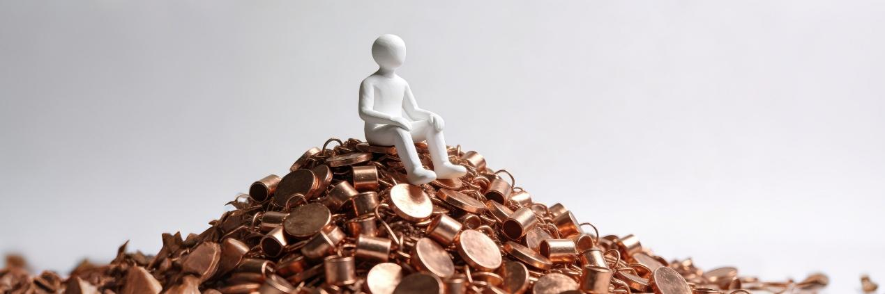
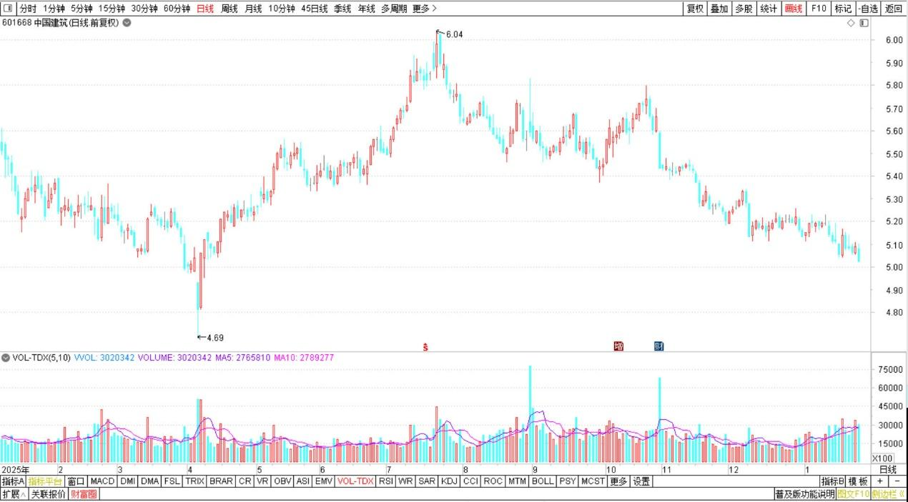
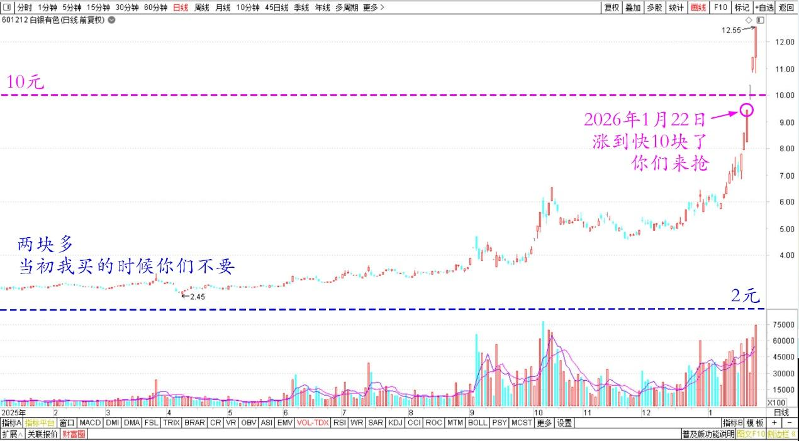
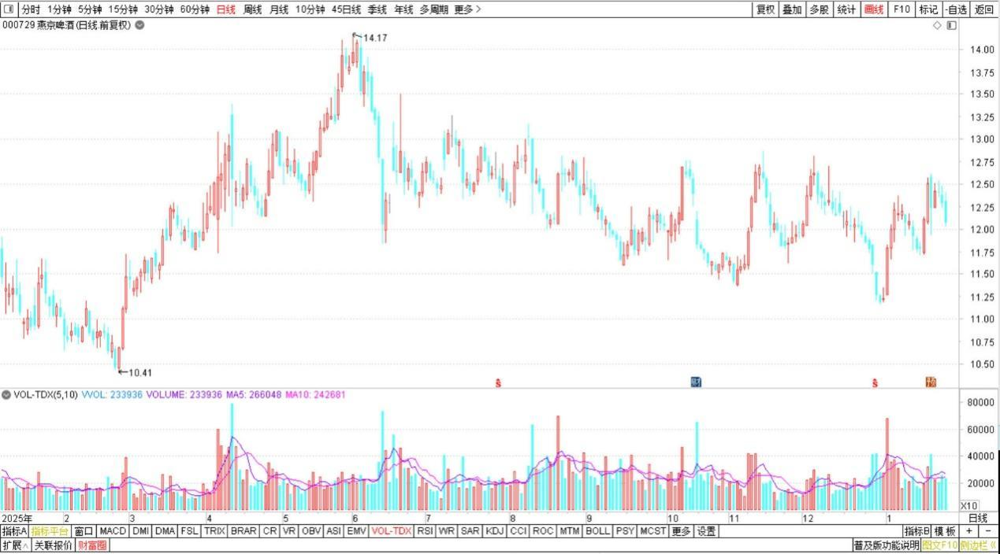

224篇.坚持有色不减仓，卖出白银换铜业

清一山长2026年1月22日

**1.坚持有色不减仓，只换仓**

清一山长[2026年1月22日8:23](https://www.zhihu.com/pin/1997584973738295930)

美国吃相难看，欧洲自保，电力投资需求大增，军备竞赛。钢铁、有色的需求也大增。**未来布局重点，依然坚持有色不减仓，只换仓的架势**。也许有色今年会涨疯了。**这样——大蓝筹，中建这些东西，今年都没希望**。[微笑]。**但有色大涨不敢跟之后，这些大蓝筹，分红股，就属于“保险、避险”的品种！**

中国建筑2025～2026年日线图

[欧洲崩了，黄金涨了！旧秩序坍塌后，大A会是最后的赢家吗？](https://zhuanlan.zhihu.com/p/1997355504519886503)

1. **啤酒不空仓，补铜坐等**

清一山长[2026年1月22日14:56](https://www.zhihu.com/pin/1997669597302773486)

白银今天连续第三个涨停，我都晕了。前两天还比较淡定，今天就忍不住了。刚把一个账户的白银都清掉了，9.43元涨停价卖出。

白银有色2025年11月～2026年1月日线图

不就两块多钱的股票吗？当初我买的时候你们不要，现在涨到快十块了你们来抢。

白银有色2025～2026年日线图

早知道把啤酒都换成白银好了！（**现在啤酒也不能空仓，因为去年一年没涨，也许今年也该涨了**，哈哈——）。反正涨了我会卖掉，不涨我不卖！

燕京啤酒2025～2026年日线图

我的其他账户上，还有M级的白银持仓，守了两年了。我觉得：明天也许还会涨停的！管他的，跌停也没事，反正我早就是负成本了。所以明天涨跌都不管了。

**我认为有色的行情，也就是刚刚开始，所以我也不敢空仓。我卖出的头寸，马上就补了铜业股。不都说金银铜吗？都在排队呢。也许等黄金白银都涨完了，下一个就该涨铜了。**我现在提前一点，先坐在铜山上好好的等着！

也许大家玩累了，就会来铜业上找我了。现在你们不要的东西，我要！

**（标题、图片为编者所加）**

文章音频：

[641篇. 坚持有色不减仓，卖出白银换铜业](http://link.zhihu.com/?target=https%3A//www.ximalaya.com/sound/953126887)

**参考链接：**

[215篇.差价3.14元卖出燕京买入珠江](https://zhuanlan.zhihu.com/p/1988669857282140083)

[216篇.白银换铜业，惠泉换燕京](https://zhuanlan.zhihu.com/p/1991242970293352126)

[217篇.相比上次，原价卖出珠江、便宜7毛买入燕京](https://zhuanlan.zhihu.com/p/1992280288085156435)

[218篇.今天的燕京总算涨了](https://zhuanlan.zhihu.com/p/1992385943613744206)

[219篇.燕京开年首日交易涨了5%](https://zhuanlan.zhihu.com/p/1993717323442431455)

[220篇.冠农果然启动了](https://zhuanlan.zhihu.com/p/1996318789797691507)

[221篇.冠农在洗盘，看着不做T](https://zhuanlan.zhihu.com/p/1997433535749981954)

[222篇.牢牢守住手中的有色筹码](https://zhuanlan.zhihu.com/p/1998832938889020019)

[223篇.AI智能测算我的投资](https://zhuanlan.zhihu.com/p/2000092630047031860)

[链接汇总（截止2026年1月16日）](https://zhuanlan.zhihu.com/p/621215591?utm_psn=1967007144831350474)

