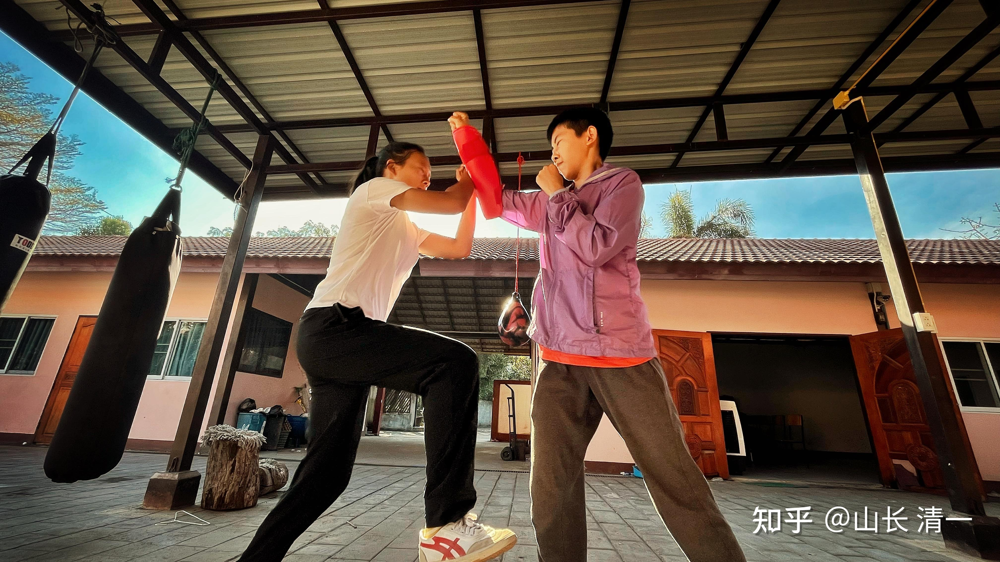

泰式扫踢的威力（用小腿胫骨攻击对方），不仅可以把敌人的腿和脚打断（我在泰国就见过被扫踢击断了手臂骨头的泰拳手），也能把自己的腿打断！

我没想到的是---鼎鼎有名的康纳·麦格雷戈，也走上了自己踢断自己小腿的路。被拍四年前在巅峰期（33岁）就直接退役，留下了他人生最大的遗憾。我猜他已经不太可能重新走上赛场了！

[嘴炮康纳断腿之战](http://link.zhihu.com/?target=https%3A//www.bilibili.com/video/BV1zN4y1B7Z8/%3Fspm_id_from%3D333.337.search-card.all.click%26vd_source%3D4cbc89574f9d1d5fdaaf7ba0be8d9083)

**别人的教训，就是我们的经验资粮！**

这场比赛，赛前康纳一切正常，甚至他还不断用自己后来断掉的左腿，多次用力扫踢对方的大腿根部部位，没有看出有啥不对劲的地方。

而且他是久经沙场的拳手，训练肯定是到位的。因此，不能说他的赛前准备不够充分！我们要从中反思出来有价值的部分。让我们的拳手不至于重蹈覆辙！

我们也要好好想想：我们的木兰拳手们，怎样才能防止这种情况极端的出现，不要在赛场上受到这么严重的伤害！

**第一个教训---泰式扫腿的威力强大，我们真的不能硬抗。**因此，遇到泰式扫腿，绝对不能站原地去接腿，只能拼命的往前，快速的攻击前进。用移动攻击来让对方的扫腿无法使用出来。就算对方勉强用出来了扫腿，也无法发挥最大威力！这样才是最安全的做法！

**第二个教训：硬碰硬，互相交换打击，不是我们要做的事情！**

外家拳就是同质互相卷的比赛。没有啥差异化，双方技术都差不多，打法也差不多，因此就是卷“交换伤害”。互相比拼谁更耐揍！

这场比赛，赛前康纳一切正常，甚至他断掉的腿，此前还几次用力扫踢对方的大腿和小腿部位，没有看出有啥不对劲的地方。他击打的部位，是用自己最细的小腿胫骨部位，去击打对方的大腿和小腿根部，这种交换打击，其实非常的划不来。属于自伤1000，伤敌800的手段。当年西方人不懂这个技术，面对泰拳手，没有防范胫骨扫踢，结果导致被踢伤后无力再战而落败，但现在，技术已经普及，胫骨踢只有对没有训练过的人才有压制性的威胁了。对于彼此知根知底的专业拳手来说，这种技术其实伤害有限！

有时候，不仅仅没有踢伤对方，反而把自己踢坏了！已经有多名拳手，比赛的时候，自己把自己的小腿踢断了！可见这些“训练到位”的职业拳手，重击踢出来的力量会有多大！真的是可怕的力量！

我们的拳手，习惯用正蹬来交换扫腿，就是避免了这种互相交换打击的做法，最终基本上成功地把对方逼得只能用拳和内围战来打比赛。对手也无法发挥扫腿的技术，导致泰拳手最依赖的技术作废，因此我们大大提高了胜率！

**第三个教训：生活方式对于骨头的硬度和密度非常的重要！**
我认为：康纳的训练没问题，但因为生活方式问题，肯定骨密度是有问题的。小腿的骨头其实非常的硬，要想踢断是很难的！但西方的生活方式，就会导致骨密度降低，最终赛场上出现这种情况！

1:牛奶和激素含量高的动物食品，会导致骨质疏松！

这一点和大家的“常识”相反，因为医生常常会说让老人多喝牛奶，防止骨质疏松。但我们不谈理论，只说事实就是：美国人就是把牛奶当水喝的。当美国人骨质疏松的程度，全世界第一！证明结论和你们的常识相反！

当然理论也是有的，有一本法国人写的书：牛奶的真相，就是有科学家检验的结果，证明了牛奶的确导致骨质疏松。但真正揭露真相的科学论文是不可能被大众知道的，甚至这些教授的言论还会被封杀，因为牛奶市场涉及的利益集体实在太大了！

** 2：晚睡会影响骨质密度！**

这个---就涉及复杂的中医养生方法了！就不多提了！

** 3：性活动频繁，严重影响骨质密度！**

玩武术的运动员，都特别有女人缘，我相信康纳也一样！很多拳手玩得很花的！但他们想不到的是---这会严重影响他们的格斗生命。如果康纳知道我说的这些道理，会不会后悔，会生活方式收敛一点！毕竟--断腿之后的康纳，大概率身边的女人都会跑光了！

原因就是骨质密度是骨髓决定的，如果性活动频繁的话，严重伤骨髓。骨质密度就一定会降低！当然，西方根本不相信这种理论，认为性是上帝的奖品，应该尽情享受。不知道付出的代价有多高！

我判断康纳，应该是最后这个原因的影响很大，才导致他断腿的！毕竟他原来就一直打格斗比赛，原来并没有出现这种情况，他现在37岁，四年前在33岁的时候比赛断腿的！因此，证明他的身体机能在下降！骨质开始疏松！这和性活动的关系肯定最大！

为了增强骨密度，我们拳手的做法，就是在食物上尽量的清洁，不需要吃不良好的各种身体不需要的东西，吃菜都不多！更不需要吃很多的配料！

另外训练上，也要强化抗击打训练。经常互相磕腿，磕手臂，增强骨质密度。或者用擀面棍击打身体各部位！但我在泰国拳馆，没有发现泰拳手有类似的抗击打训练。他们反而嘲笑我们的拳手有“自虐狂”。自己打自己！不过我说我们不能学泰拳手，他们从小就打很多的比赛，甚至每天一场比赛。因此是用几百场比赛熬炼出来的钢筋铁骨。

