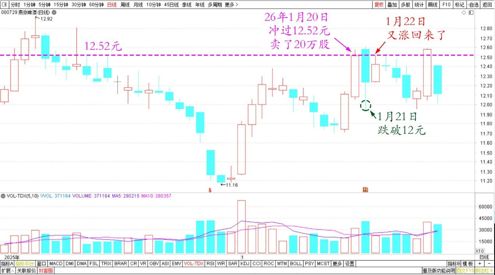
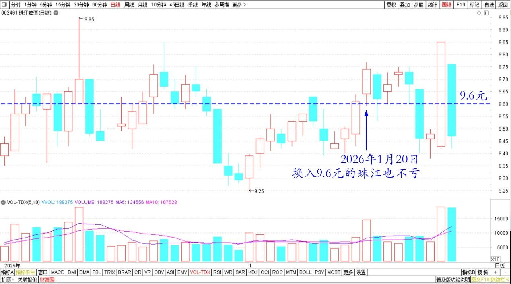
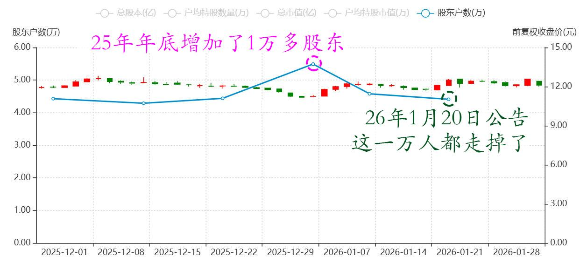

225篇.燕京的猜想

清一山长[2026年1月22日14:32](https://zhuanlan.zhihu.com/2026%E5%B9%B41%E6%9C%8822%E6%97%A514:32)

燕京的猜想：

燕京前天冲过12.52元，我卖了20万股。没多想，就是想换入9.6元的珠江也不亏。

昨天跌了，还跌破12元。本来想买回来的，不过我在上课，错过了！今天又涨了回来了。

燕京啤酒2025年12月～2026年1月日线图

珠江啤酒2025年12月~2026年1月日线图

我的猜想：燕京洗牌洗得漂亮。认为往年燕京出业绩利好，就要跌一波。昨天也一样跌一把，让这群聪明人赶快逃走！

然后，今天就拉回来了，彻底洗掉投机客。

燕京去年年底增加了1万多股东。20日公告这一万人都走掉了，洗得真漂亮。照昨天今天这架势，这两天恐怕又洗掉了上千人！也许股东人数会跌破4万，走到3字头的。燕京此时的股价也一定是新高了！

燕京啤酒2025年12月～2026年1月股东人数

等待答案揭晓！**我不聪明，不知道后市咋走。但我只需要耐心，慢慢等就行！**

**（标题、图片为编者所加）**

文章音频：

[642篇.燕京的猜想](http://link.zhihu.com/?target=https%3A//www.ximalaya.com/sound/953883604)

**参考链接：**

[218篇.今天的燕京总算涨了](https://zhuanlan.zhihu.com/p/1992385943613744206)

[219篇.燕京开年首日交易涨了5%](https://zhuanlan.zhihu.com/p/1993717323442431455)

[220篇.冠农果然启动了](https://zhuanlan.zhihu.com/p/1996318789797691507)

[221篇.冠农在洗盘，看着不做T](https://zhuanlan.zhihu.com/p/1997433535749981954)

[222篇.牢牢守住手中的有色筹码](https://zhuanlan.zhihu.com/p/1998832938889020019)

[223篇.AI智能测算我的投资](https://zhuanlan.zhihu.com/p/2000092630047031860)

[224篇.坚持有色不减仓，卖出白银换铜业](https://zhuanlan.zhihu.com/p/2000104725555736998)

[链接汇总（截止2026年1月22日）](https://zhuanlan.zhihu.com/p/621215591?utm_psn=1967007144831350474)

