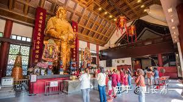

看到一个故事，笑死我了：真的反应中国人的核心价值观。

易中天讲过一个非常有意思的故事，辣味十足，又讽刺得恰到好处。
他在四川看到一个人，为了孩子考大学，跪拜文昌菩萨。
文昌菩萨嘛，国人眼里的“学神”，主管读书和考试前途。
烧香、磕头，样样齐全。
拜完以后，然后那个人就嘟嘟囔囔，一脸纠结，用四川话讲：
“哎呀，这个拜对了没有。”
易中天就问他：“你要干什么？”
他说“我的娃考大学。”
“你拜对了，文昌菩萨就管高考。”
“你不晓得，我的娃考的斯坦福，文昌菩萨懂得英语不？”
“那你拜圣母玛利亚吧，她懂英语。“
那人更纠结了：“我晓得，但是玛利亚他懂不懂四川话噻？“
这场荒诞的故事，不就是许多人信仰观的缩影吗？不就是很多人对信仰的态度吗？

作者：书海探读

我发现：中国人的这种“信仰”，基本上会用类似的方式来对待一切他们需要的资源

就是我装乖，给你磕头跪拜，认你做“大人”，然后---你需要去满足我的一切要求。这是投入最小，回报最大的工程！

但：他们很少考虑---自己到底应该真正付出一些什么有价值的东西，去换取他人的支持--如果别人真的有资源的话！

简单一点。白嫖的习性，似乎藏在中国人的骨子深处！

他们不习惯的方式，就是我需要付出什么实际的价值，去换来我需要的东西！

他也不考虑：如果聪明正直为神明的话，这些神明，为啥就这么低贱。他啥都不求，就求他来个跪拜！装乖！他就稀罕的不得了，就去帮你干脏活去了，啥事都可以搞定！

-----比如去帮你升官，发财，去帮你逃避进监狱，去帮你治疗绝症！

把本来根本不可能考上名校的你家的龟儿子，走后门，安排进斯坦福上大学！

把本来考不上公务员的你们姑凉，弄去当个官！

国人完全忽视别人要勤奋努力10年，20年才能实现的目标，就被你这些一个善于投机取巧。会拜佛的人给“感动”了，你膝盖一软，就轻松地成功了！

这些国人认为：装乖，就是他们唯一能够，且愿意付出的东西。

其他要费力去思考和行动的事情，都是他们不愿意。也不能付出的！

如果你给我的东西我不满意，我就骂你！以后我就不理你了！

谁让你不满足我的要求的，哼！

这种国民，你好打交道吗？

当然装乖的方式，有各种各种

去庙里就是跪拜

一起吃饭，喝酒。就是“我干了，你随意”，“我是你的人”。

见到高人，领导。就是无脑捧场！说好话！

然后---索要资源！

如果没有满足，就翻脸！或者另外换个菩萨去拜！

哈哈，这样玩，不累吗？

真想问问他们！世人颠倒