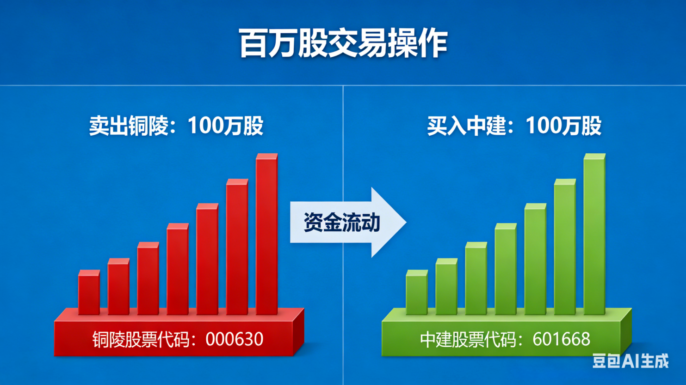
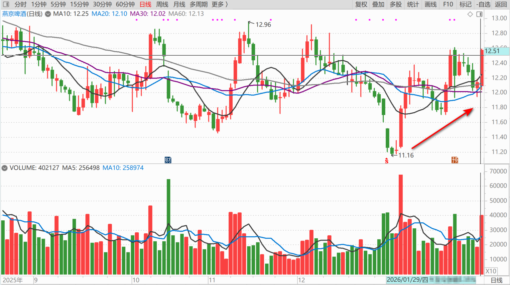
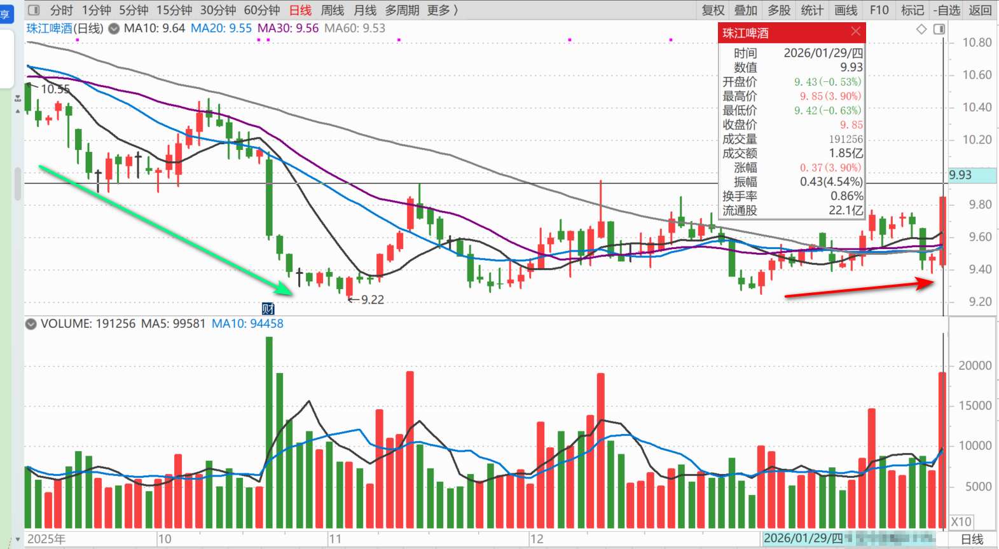
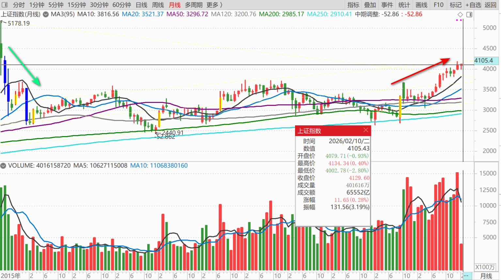
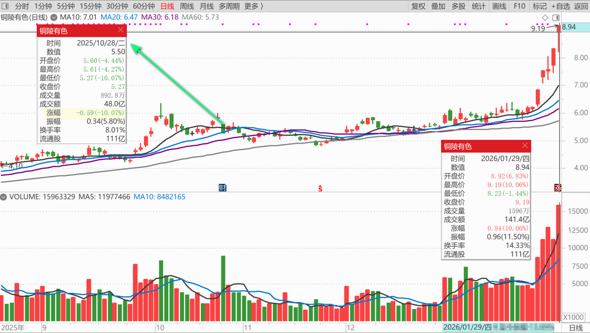
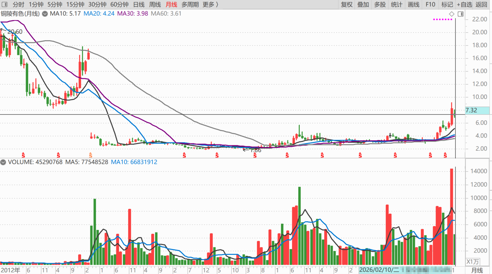
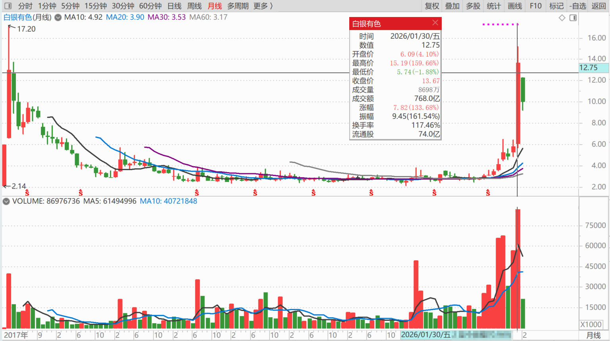
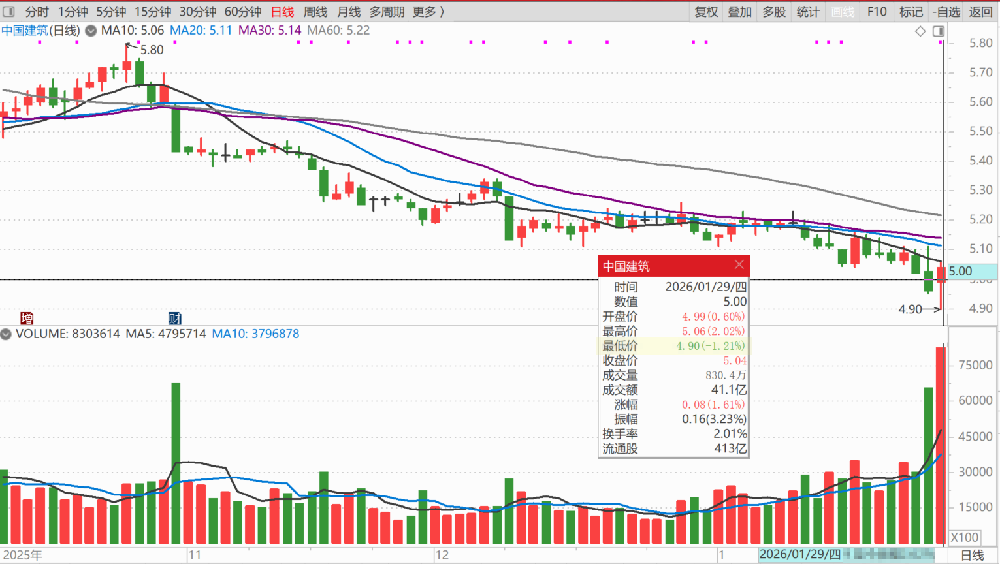

233篇.卖百万股铜陵，买入百万股中建

清一山长[2026-01-29 20:59](https://www.zhihu.com/pin/2000253769439545008)

牛市真的来了吗？

刚刚意外发现——燕京和珠江都偷偷上涨了，我都差点忘了这几只没有颜色的票了！

加上其他的股票又涨停多家，让我今天的账户再创新高，再次地刷新我的投资历史了。今年1月的收益，已经超过过去很多年我的年收益了。“度月如年”，让我有点不适应！正在调整中！

2015年以来，市场就没这样疯狂过，一年一年的都很难熬。据说守股票如守寡，现在有点像逛红灯区一样，到处都是打扮招摇的妖女，似乎全世界的钱都在不计代价地冲进来。我买股的时候，冷冷清清的，公司像要破产了一样！

我都担心市场这样疯，下面怎么走？

**铜陵今天涨停价卖了100万股出去**，因为大多数的铜陵，是上次跌停5.22元抢进来的，我的良心有点不安，所以就今天先让一点出去了！**主仓保持不**动！等它疯。也许又是下一个白银有色呢？

今天140亿的成交，我觉得已经疯了。但没觉得像出货的样子，倒是像抢盘的样子！到底是啥我也不知道，觉得市场上的钱太多了。

管它的，反正我5元多的成本，谁怕谁呢！有本事跌回五元去！

原来铜陵3元多的时候，中国建筑还卖5～6元呢！比铜陵贵不少，现在的中国建筑才四元多不到五元，铜陵居然9元多**。差不多一股铜陵，可以换两股中建的样子，**真是物是人非！市场先生总是疯狂的！

今天中午看中建跌得爹妈都不认了，挺惨的样子，**就4.91元挂单，买了百万股回来。**相当于用铜陵换的股。我不贪铜陵明天的涨，只求中建给我个机会，我拿着老实吃利息就好了。我不去赚非分地上涨交易的钱，我就卖出，给点机会让别人也赚钱去！我喜欢这样的股市，一方面涨疯了，一方面跌惨了，如果全体一起涨疯了，我就没脾气了！

只能含泪降杠杆了，要彻底丢掉筹码，真心不忍！

**（标题、图片为编者所加）**

文章音频：

[650篇..卖百万股铜陵，买入百万股中建](http://link.zhihu.com/?target=https%3A//www.ximalaya.com/sound/956337508)

**参考链接：**

[225篇.燕京的猜想](https://zhuanlan.zhihu.com/p/2001294008115287766)

[226篇. 设定“止赚线”](https://zhuanlan.zhihu.com/p/2001908287390650417)

[227篇.昨天补仓的铜陵今天涨停](https://zhuanlan.zhihu.com/p/2002022964682568534)

[228篇.白银第四个涨停，铜业第一个涨停](https://zhuanlan.zhihu.com/p/2002506915129880752)

[229篇.观察两年之后，再买白酒](https://zhuanlan.zhihu.com/p/2002828781535118919)

[230篇.白银继续涨停，中金岭南涨一倍](https://zhuanlan.zhihu.com/p/2002834813908963593)

[231篇.1499元的茅台酒与1360元的茅台股票](https://zhuanlan.zhihu.com/p/2002832147816413177)

[链接汇总（截止2026年1月24日）](https://zhuanlan.zhihu.com/p/621215591?utm_psn=1967007144831350474)