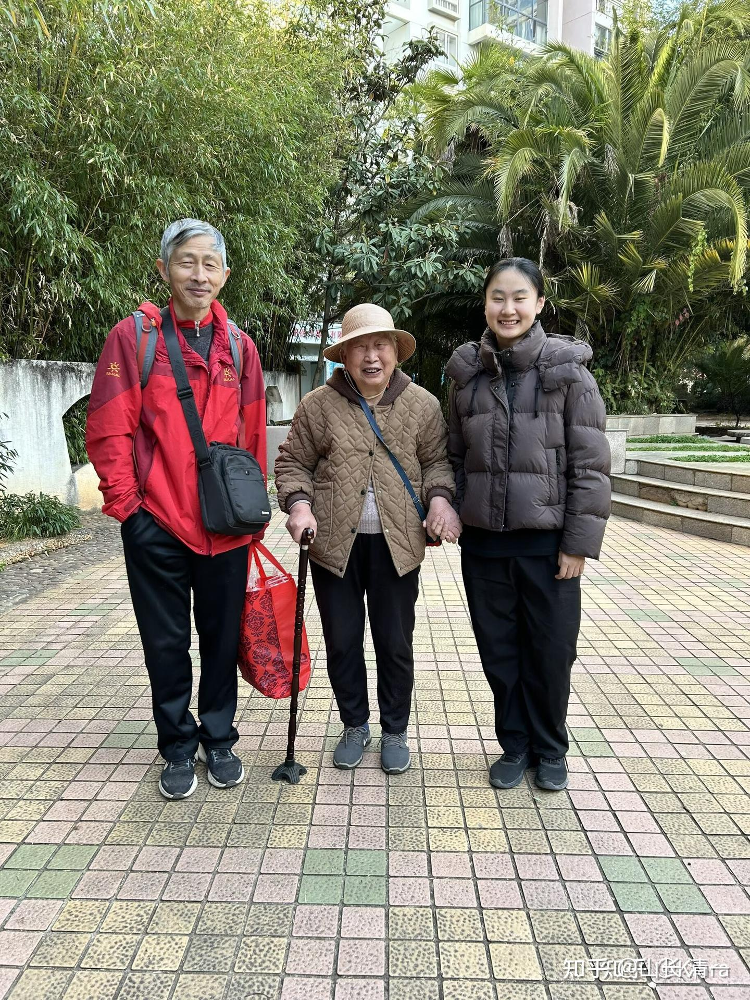

日本的今天处境，就是我们的未来，大家好好想想自己老了咋办吧

我过的总合生育率，已经低于日本了！ 这些日本老人面对的情况，就是20-30年后我们必然要面对的情况！别以为跟你无关！

[日本千万人的噩梦：有房有子女有存款，老了之后却被逼破产](https://zhuanlan.zhihu.com/p/1929531137019065199)

今天我给养老实践小组，和清迈闭关营。都布置了一个非常现实的思维提升任务：去见众生，见自己！然后将对学生们进行一对一的思维辅导，让他们提升自己的思考力和观察力！见众生，也见自己！

下面是小戴公主正在昆明做90岁老人陪伴“孙女”的照片！小戴正在顺利开展她的老人陪伴工作。老人家很喜欢这个“天下掉下来的孙女”！前天还在小戴同学的陪伴下，去了她多年没有去的母校云南大学去走走，回忆了她的年轻时代。当年老人家还是云南大学校队的队员，代表云大，出省去打过比赛的！（篮球项目）。当然，老人家的主业是教师。云南省的数学专业特级教师！

每天，小戴都要记录每日情况，并汇报到群里面！有啥不对劲的地方，我会线上指导！

转：2026年2月11日 陪护情况

一、三餐情况

早饭：青菜汤+包子

午饭：和姑姑她们去吃了西餐

晚饭：一锅炖+面条+杂粮饭

二、奶奶活动情况

1、早上7:50起床，看着我做了会儿饭后，回去按摩

2、早上9:09至9:40，看手机等着姑姑来接

3、9:50上车去逛云大校园，途中遇到了徐主席，给奶奶发了个慰问红包

4、11点半到12点半用餐，回来大概13:00

5、13:00至14:30，奶奶看了会手机，然后回去睡觉

6、14:30至17:00 睡午觉，这两天有点累，所以奶奶睡得沉了一些

7、17:10至17:40 下楼遛弯

8、17:40至18:30 看手机等饭吃

9、19:30-21:40 用完餐后看手机

10、21:40至22:10 和我聊天，然后睡觉

今天奶奶比较喜欢在手机上看国际形势的解说，没有开电视。

另外今天奶奶的咳嗽情况好转了很多，上午有点咳，下午和晚上都没有咳嗽。

三、我的工作情况

1、早上开窗通风

2、早上和晚上的洗菜切菜做饭，洗锅洗碗抹桌子。

3、和奶奶去云大，拽着奶奶在云大多走了一段路，当天中午也晒了很久的太阳

4、搀扶奶奶外出行走，上下楼梯、上下车

5、和奶奶聊了她以前在云大上学的情况、年轻时的故事，以及晚上聊了一些中医保健知识。

6、扶奶奶遛弯

7、中餐在外面吃，照顾奶奶用餐

8、打扫浴室

下面是我布置的课题，小戴同学需要用10分钟的时间。来梳理下面的真实案例思考，提升自己的思维和理解能力。

一个网络的真实案例。来自天地侠影的网文：【我很反感高端白酒所谓的金融属性和投资价值。这次回国，家中堆满了母亲从网上购买的所谓的“投资白酒”，数数有四、五十箱，一箱6瓶，都是所谓的茅台镇的白酒、五粮液股份公司旗下的二线品牌、杜康、假XO，假法国红酒，数不胜数。我们回家之前，母亲还送给我那些堂哥、表哥们每人两箱。一切都是网络诈骗的结果。开了一瓶五粮液养生酒，没法喝。母亲是彻底被骗子们的情绪价值给洗脑了。白酒还是很小的损失，还买什么“原始股”、翡翠玉镯（假的）。现在的网络骗子，真是大行其盗，老人又往往退化成婴儿的智商，极端固执，而又没有一点的常识，偏偏智能手机、网购又玩得特别溜。

一个不喝酒的老太太，一年都能买上400瓶的白酒当库存，我不知道这世上，存量的白酒，到底有多少。】

思考方向。。。。请分析这个老太太为啥成为这个样子？她的心理人格是什么？请问如果是你的母亲，你怎样才能解决这个问题？帮助老人不乱花钱，同时获得心理健康？【这个老人的年龄。大概是80岁左右】。然后你们每日的10分钟交流，就和学生来聊这个问题，帮助学生树立超级的眼光和思维能力，“见众生”。

将来，如果我们做【投资闭关特训营】，也可以用这种方式来做！

一：主力是这样让不懂，也不需要这些东西的老人买入这些“财产”的？他们是在怎样推销出去这些产品的？

二：老人买这些产品的理由有可能是什么？你怎样理解和掌控老人的这种心理？来实现你的目标？

三：实着去找这些专门定向对老人推销类似产品的直播者。去学习他们的话术！然后找到他们的核心推销模式。掌握这些人在满足老人的心理需求上下的功夫！成为一个洞察人心的聪明人！

四：投资思考-----投资就是投资人性。这种乱买东西的人格，也会出现在投资市场上。怎样去提前布局，站在风口上，等待这些猪飞上天？（小戴同学可以忽略此题）

五：从文中看到的作者天地侠影对他母亲乱买东西的思考方向是什么？他落入了怎样的思维陷阱（本质是是与他母亲一样的思维陷阱）。他应该怎样思考和理解此事，才是正确的做法？让他可以从这个事情中跳出来。成为更加卓越的投资者？