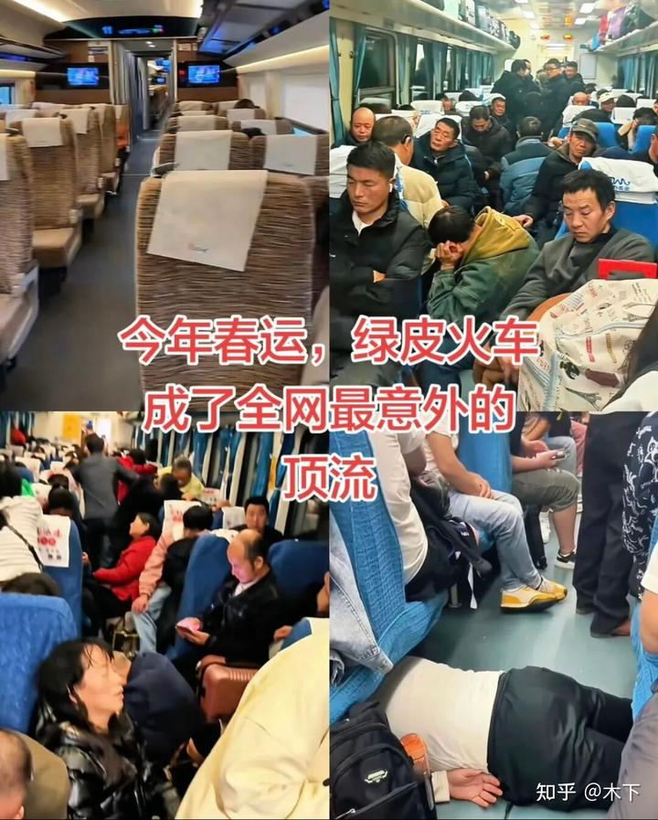
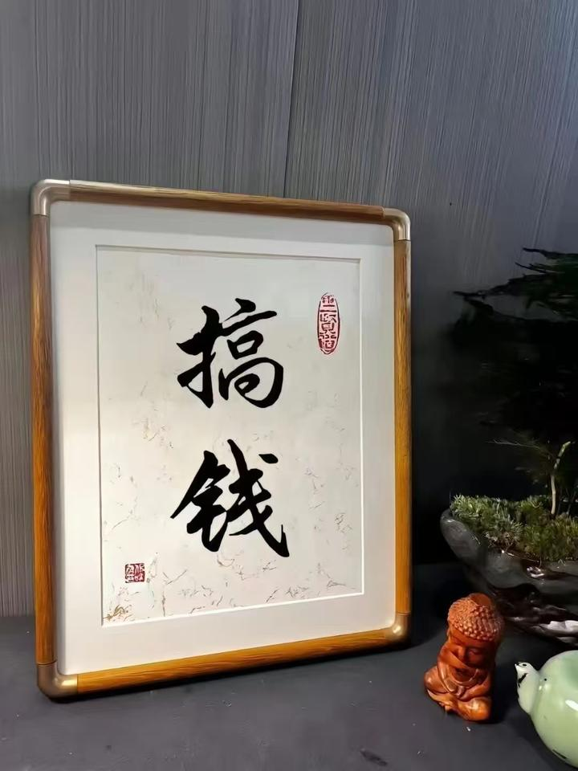

今晚好像就是“春晚之夜”了，我突然想：小女应该从来没有看过春晚。

也许小女创造了一个“中国之最”：作为正常的中国人，长到18岁，居然都没有看过一次春晚。这样的人，在中国可能是找不到的吧？也许她就是中国18年不看春晚的第一人！

我猜：就算是监狱的犯人。这一天都会让他们看春晚的！我们家有电视机，但没有电视节目。这个已经有快30年的历史了！因为我的原则，是不被动接受媒体的灌输。很早就把这个信念教给了孩子！

记得上一次我们家与春晚发生关系，是她的姐姐才13岁的时候。大概是2010年的样子，我们一家在会泽过春节，她申请想看春晚，自己一个人自己看的。我要求她要看完后，要写一篇春晚的文章作为交换。之后，她就再也没有看过了。

至于小女明慧，当年是两岁吧？肯定没有看过的。

今天问了她，原来看过春晚没？她说对春节没兴趣。我问她看过没？她说，不就是春节晚上吗？我说不是---是除夕晚上，全体中国人全家在一起一起要看的一个东东！之后很多天，大家在一起要互相讨论评点，里面的节目好不好。享受自己的审判权利！这是一种仪式性质的东西。

小女就表示：她不知道春晚是啥！

好吧，我觉得我应该给她补上这一课，中国人，怎么能不知道这个文化现象呢？

于是：我让助教们下载了2024年的春晚。今天晚上，我和留在清迈的一群人。大家一起看。至于今天白天，所有人都一起照样的训练，泰国的工人。今天也照样上班。工作。我看到他们正在给新楼建第二层！

为啥我们不看今晚的现场直播？而是找一个往年的旧节目看？

第一，反正没看过，看哪一年的都一样。都是新的！

第二：下载2024年的春晚，是因为方便随时停下来讲解。讲解什么？是从春晚的组织者的角度，上帝视角，来帮助大家理解，春晚的主办人，想要让你怎么看春晚。引导你该怎么想！怎么乐。以及上面的人，怎么抚慰下层民众的！还要“雅俗共赏”。

我会告诉大家：我们都习惯出外坐飞机，坐高铁。知不知道：现在春运期间，最难买的火车票，是绿皮车。就因为车票特别便宜！即使绿皮车需要运行的时间，是高铁的一倍。但回乡的民工会清两分钟之内就抢光绿皮车的车票！中国最广大的劳动大军，会尽量的省钱，他们不在乎时间，不在乎拥挤。不在乎舒不舒服。它们就像牛马一样的生活和工作。

*春节坐绿皮车回家的底层群众！*

我就说：大家各位，家庭经济条件， 都是社会上top10%的家庭。基本上生活轨迹，和这些底层90%的人是不一样的。虽然我们生活在一起，但我们的思想和观念，基本上都是完全不一样的！

春晚，本质上就是给这些90%的底层群众看的东西！

但由于中国的前10%的民众，也没有啥文化素质，因此也就和底层一起享受一样的文化大餐！这一点，和西方不一样。

过去的时代，西方人上层社会欣赏交响乐，室内乐，看歌剧等等。下层人是不懂这些东西的。

但在中国，慈禧太后和穷人都看的是基本一样的京剧！基本一样的节目！

所以，中国其实都是草根阶级，本质上大家一样。因此都一窝蜂的看春晚！

在西方社会，基本上找不到大家全国共同的文化节目！西方的新年，贵族们去看维也纳新年音乐会。穷人们去广场喝喝酒。乐一乐！阶层之间是没有交集的！

既然春晚，就是给下层群众看的东西，就要迎合底层群众的思维和价值观。底层人关心什么东西呢？

自然就是下面这个全民图腾了！搞钱！

底层人，基本上只关注这个东西，只关心这个东西。

其他的一切-----都是为了这个东西服务的！所以春晚就要突出这个东西！让底层人开心！

底层人还有第二个关注点：就是被看见！

因为这些牛马们，都是机器零件。平时是没有人看见他们的。

春晚，就要制造一个"我看见了你，你很伟大”的信号！让他们满意！

还要装傻。让这些下层人觉得自己很聪明！心满意足的点点评论。感觉自己很高明的样子！给他们话题！

让这些牛马觉得自己才是主人！

原来很多年，赵本山就是装傻哄人的最重要的一颗棋子。最能让大家开心的！

现在--不知道是谁了！

反正：坐一台春晚扎实不容易，我肯定玩不来了，但我看得懂主办人的心意！

方方面面，都要照顾到。让大家都开心！

这些手法，我都会尽量还原导演的意图！毕竟--孩子们将来想要做文化上层，就需要明白如何满足下层群众的需要。不能自己根本不懂。

我们自己可以不过春节，但一定要把春节安排的好好的给底层民众，只有这样，他们才会高高兴兴的去工作。做事！

如果我们不能给他们太多的物质利益，起码要让他们开心一点！

如果我们不能让他们天天都开心，起码让他们春节期间开心一点！这就是奥秘！

好吧，反正你们自己也去看春晚吧。有觉知的看春晚，与无觉知的被诱导，完全是两种境界！

我就不多写了！