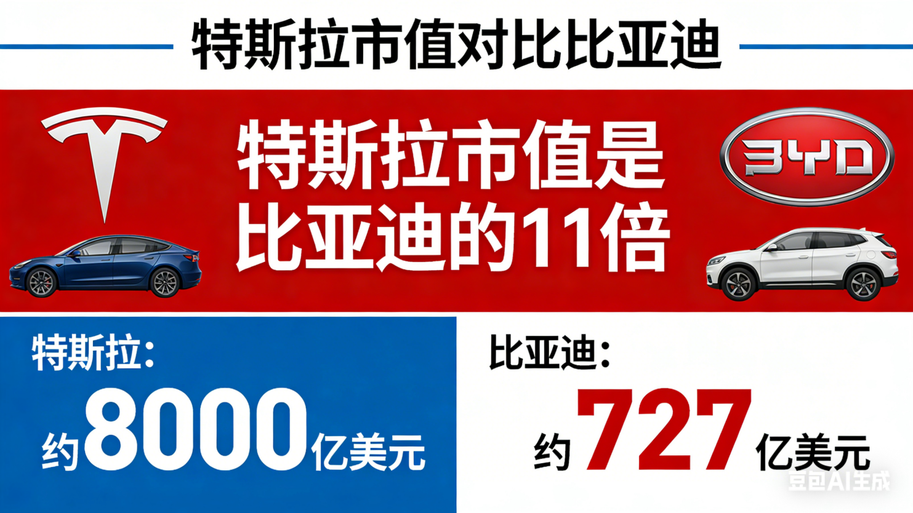
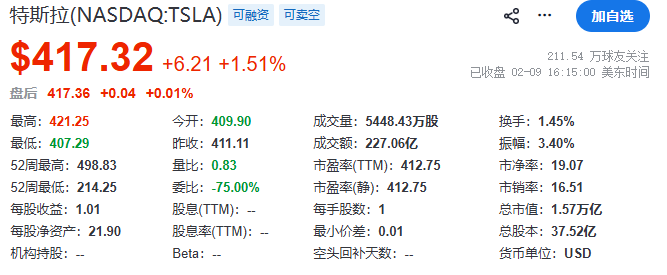
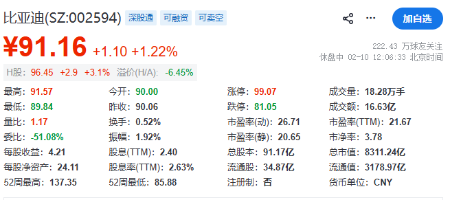

**

**

236篇.美元霸权消逝，意味着比亚迪会涨33倍吗？

[清一山长2026-01-3019:58](https://zhuanlan.zhihu.com/p/2000604573644112807)

别误会我在推股票，我没有买比亚迪，未来也没打算买它。这只是我的一个思维模型和举例。

汽车行业，在我看来是个苦活，充满了不确定性。就像小米都能做汽车，还能畅销，证明汽车行业就没啥护城河，好像谁都能做的样子。将来，说不定冒出一家“高粱”公司，还会推出比小米汽车更畅销的汽车！

因此，我是不会买汽车股票的，我总觉得它活得不容易！丰田活到现在也不容易，但打倒它，似乎并不难！比亚迪已经做到了！

我提到比亚迪，只在设想这种可能性是否存在——**但我相信中国资产将来有一天一定超过美国。**同样的企业，中国的一定比美国企业贵，就是不知道啥时候！

**我两三年前，就重仓布局有色，但当年大家看我像个傻瓜一样。**

直到今年，我的账户迭创新高，让人回想起来，我原来说过的话——“重仓有色才是未来”。

也许将来有一天，我判断中国资产超越美国的时候，真的实现了，你才想起我早就说过了！早就在等这一天了！

2025年，比亚迪全球销量达到460万辆，远超特斯拉的163万辆。目前已经是全球第一的车企了！

按道理，按照市场的价值来算账的话，比亚迪的市值应该比特斯拉高三倍才对吧？

可是有趣的是：特斯拉的市值，是比亚迪的11倍！两者用汽车销量来比较市值的话，这种差距是33倍！比亚迪相比特斯拉是严重被低估了！

**

****

**

这是什么原因呢？技术？制造力？产品力？

不，现在这些产品上的优势，都在比亚迪，不在特斯拉这里了！**核心原因，就是美元的世界霸权——美元资产，它就是比中国资产高，大家都觉得很正常！**

一旦有一天，人民币资产被世界的资金追捧，比亚迪的市值超过特斯拉三倍，股票涨33倍的时间，会不会到来呢？

我认为必然会到来的！就是不知道什么时候。也许五年，也许10年，但最终一定会到来的！

现在一些异常的情况，说明这种趋势正在形成！

美国拥有的世界商品和金融的定价权，目前正在消失中**。而未来的定价权，很可能会交给中国！**

换句话说：美元很可能要崩，不过在崩之前，美国会拼命来维护美元的霸权的。一旦特斯拉的市值，只有比亚迪的10分之一，甚至30分之一？真到了这一天，美国人可能就太穷了！中国就会是世界上最富裕的国家了！

现在看来，这种霸权已经岌岌可危了！也许，3月份就可以看见端倪了！

下面是我们内部讨论这篇文章的思考！

华尔街见闻的文章-知乎：[白银面临“交割失败”危机？3月或成贵金属“关键时刻”](https://zhuanlan.zhihu.com/p/1999952486304330489)

白银涨到每盎司300美元或600美元的话，将直接导致西方金银定价权的消失，西方货币信用倒塌。

中国多年前就开始储备黄金，建立黄金交易权，当然价格以人民币为锚。如果西方美元定价失败，美元狂泻，人民币崛起，人民币资产可能会暴涨！

2025年10月我国白银出口达660吨后，2026年1月我国全面禁止出口白银，不再为欧美的期货做担保！

中国在香港建立黄金仓位，目标储量2000吨！看样子真的在用金银本位来确立人民币的地位。

一旦用美元买不到金、银、铜，买不到大宗商品，美元不就是一张纸吗？不贬值才怪！美元的泡沫就破掉了！

**推导1：港元将暴跌。因为港元绑定的是美元！**

**推导2：港元资产暴涨，未来的香港市场的股票，会比A股的溢价更高！**

如果我的逻辑真的实现了，A、H股倒挂现象，将出现在香港！

**目前，明显低估的A、H票，值得提前介入！**

[伦铜单日飙涨10%突破1.44万美元，与沪银齐创新高，大宗商品是否面临巨大流动性危机或逼仓风险？](https://www.zhihu.com/question/2000330938584933849)

这是昨天的消息。今天空方强劲反击，股票大跌，但我们没必要在意一时之涨跌！

只要知道：**金、银、铜、铁的制造主导权，在中国手上！**

美国的资本当然可以“卖空”，但中国只要不供应给美国的交易所实物进行交割，最终美国资本的发言权就被夺取了！实际上，中国政府已经宣布银、铜限制外销了。这一招——将成功地击爆美元。原来美元主要都是靠大宗商品来支撑的！

实际上，今天铜期货大跌，但中国的实物商品交易价格却在大涨。今天长江铜大涨了1420元一吨。吨价曲线一直往上走，已经超过10万元一吨了！走势完全无视西方的铜期货价格大跌的局面！这就是中国正在用实物来作为武器，跟西方的期货叫板！

现在大量的交割单要求实物交割，对伦交所是巨大的打击，继续玩期货的高杠杠空转已经骗不下去了！

一旦西方的期货空单，无法买到实物去交割，大宗期货交割违约，最终美元的信用会丢失。

未来的国际资本，想要争抢的就是中国人民币资产了。这时候比亚迪市值超越特斯拉的时刻，就来到了！

我们当然不必去买比亚迪，但只要你持有中国的实物资产，你就是赢家！

因此**，请大家选择好有价值的中国资产，未来10年、100年都不会垮掉的资产，坚持不放手，我相信未来的回报会远远超过你的想像！**

**我正在偷偷买入证金公司正在抛弃的中国核心资产。**这些资产，其实都是未来的金子！现在冷落它们，是不应该的！

因为证金想要低调吗？不是，我认为证金是在腾出大量的资金，准备在世界金融危机带崩中国股市的时候，出来救市的！据说证金已经卖出了上万亿的资产，这些资产，将来会重新回到高位的！证金会重新买回去的！

所以，我现在先替证金保管一下，将来挽救市场的时候，我再还给他们算了。也许我就拿着，永远不还了！吃利息就够了！

**（标题、图片为编者所加）**

文章音频：

[653篇.美元霸权消逝，意味着比亚迪会涨33倍吗？](http://link.zhihu.com/?target=https%3A//www.ximalaya.com/sound/957641685)

**参考链接：**

[230篇.白银继续涨停，中金岭南涨一倍](https://zhuanlan.zhihu.com/p/2002834813908963593)

[231篇.1499元的茅台酒与1360元的茅台股票](https://zhuanlan.zhihu.com/p/2002832147816413177)

[232篇.连续两天重仓大涨的复盘思考！(配图版)](https://zhuanlan.zhihu.com/p/2004623291822932869)

[233篇.卖百万股铜陵，买入百万股中建](https://zhuanlan.zhihu.com/p/2005054869774541276)

[234篇.我认为有色还没有走完](https://zhuanlan.zhihu.com/p/2005494857267946428)

[235篇.今天又再次为国接盘了！](https://zhuanlan.zhihu.com/p/2005417198714394453)

[链接汇总（截止2026年1月24日）](https://zhuanlan.zhihu.com/p/621215591?utm_psn=1967007144831350474)