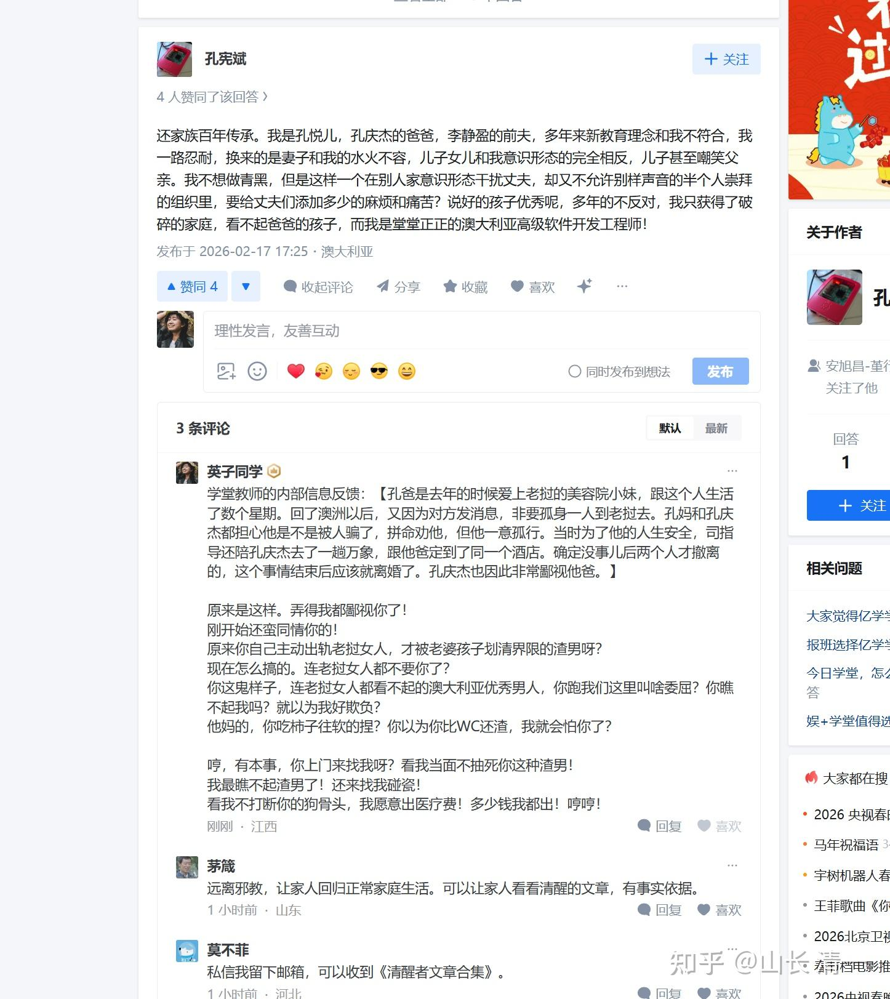

**今天讲讲儒家的哲学【君君臣臣。父父子子】！还加一句话----夫夫妇妇**

很多人读不懂这句话，觉得孔子像个结巴，说话都要这样重复！君臣，父子，夫妇不就完了？

其实这句话，第一个君，是名词。

第二个君，是名词动用，是动词。

其他三个字，也是一样的。都是名词动用，这是一句话，是一种理论。而不是八个名词！

因此，孔子的这句话，其实含义很深。深到大多数人都读不懂！

孔子的意思，不是君就是君。臣就是臣，父亲就是父亲，儿子就是儿子！哪有这么简单的！

**孔子说：拥有君的身份，就要做国君该做的事情。**

** 拥有臣子的身份，就要去做臣子该做的事情！**

**拥有父亲的身份，就必须去做父亲该做的事情！**

**拥有儿子的身份，就要去做儿子该做的事情！**

** 这样的社会，才是正常的社会，不然就完全乱套了！**

意思，人的身份地位， 不是理所当然的。而是需要是适配的。大家明白身份后，要去努力学会适配自己相应的身份地位的！

不是你当了爹，就自动是爹味十足了。什么才是爹，你需要像个爹的样子！好好的去用行动表达出来！

如果你当上了“君”，不要认为理所当然地认为：你作什么都是对的，都是君应该做的。你做啥别人都必须认同！

你要去学会怎样的行为举止表现，才符合“君”的身份。一切都就要像个君的样子，不然就乱套了！

**这里讲个故事，古代朱温的故事，充分体现了【君臣父子】的含义！**

朱温是唐之后，五代十国时期，创立【后梁】王朝的创始人！这就是张艺谋的电影【满城尽戴黄金甲】描绘的这个时代。当时的社会，真的乱极了，完全不是正常人能呆的地方。

朱温特别喜欢玩女人。他贵为开国皇帝，找什么女人不行呀？却特别喜欢找“熟女”。儿子们在外打仗，他召儿媳们入宫侍寝。他要考验儿子们的“孝心”。而且--是公开的。

儿子们对自己父亲的乱伦行为，也不敢愤恨。但心中，肯定是压抑的， 有意见的！

朱温，连自己的儿媳都不放过，更别说其他大臣的妻女了！

他到下属（河南尹张全义，相当于洛阳地区最高长官）的别墅避暑住了十来天，竟把人家妻女全部奸淫了一遍。

这种行为当然很过分了。不过：由于他位高权重，下属们一时也不敢有啥表示！只能忍住！

他的运气实在太好了。本来这张市长家的儿子，气得想要杀他的。但被自己父亲拦住了。这可以理解。当时一时生气，真的可以杀了朱温的。但朱温的势力权力还在。其他手握兵权的人，肯定会借此机会，以报仇，叛变的名义来杀掉这一家人，当上新的皇帝。毕竟这人，只是洛阳地区的市长。他的手上也没有兵权，只好使劲忍住了！

但曹操，当年就吃了大亏。当时打了胜仗，他就去睡了下属的女人。结果导致下属反叛，自己差点被杀。虽然最终在身边人的保护下逃了一命。但自己的大儿子曹昂，以及自己最得力的助手，就在这一次替他死了。后来还惹起了一大波的战事，死了很多人、也差点弄到自己事业失败。

因此： 男人真的要管住自己的生殖器。不然---就是找死的！

**你当皇帝，下属的女人不能随便玩。儿子的老婆，你更不能随便玩！这就是孔子的君臣父子的教诲！**

简单地说：朱温违反了孔子的教诲。

**他作为君，行为就不像君的样子。他违背了君的身份定位，注定会给自己和家人带来灾祸的！**

**他作为父亲，也不像父亲的样子。**侵犯儿媳，本质上是去羞辱自己的儿子。让儿子一点面子也没有，将来怎么面对他人呀？

你们说：这种糊涂蛋，怎么可能有啥好结果呢？

他对对手李克用的儿子赞誉有加。却骂自己的儿子是猪狗。他还公开发言说：“生儿子就该像李存勖这样。至于我的那些儿子，不过是些猪狗罢了！”

ε=(´ο｀*)))唉。**骂自己的儿子是猪狗，你自己也好不到哪去吧？基本上不就是猪狗不如了吗？**儿子们在他的这种猪狗不如的教育下，怎么可能成才呢？

最终，朱温真的就死于自己的儿子之手。被他羞辱很深的二儿子、找个机会，带禁卫军闯进宫里面杀了他爹，自己当了皇帝。

朱温的儿子们。最终也都没好结果，除了自相残杀。也被敌手斩杀。最终，后梁王朝被李存勖击败，儿子们全都被杀死。后梁王朝终结，之后创立了李姓的【后唐】王朝。但已经不是原来唐朝的李氏皇族了！所以是“后唐”。

**这就是孔子的【君臣父子】没有好好学的下场。**当上了皇帝，都守不住位置！

凡是身份地位行为搭配，没有守好的结果，都最终注定会失去自己应有的身份地位！

因此，简单地说：孔子的教诲，就是不要认为自己拥有的身份，就是理所当然的。每一个身份，都要认真去践行，以求符合这个身份的行为。否则这个身份，就不会被认可。就会出问题！

孔子的这个观点，其实和现在的秘密法则，非常的相似！

更加简单的解释，就是说：

如果人，真实身份活得只是一个动物，我们就只能按动物的标准来对待他了！

如果一个人，真实身份，连动物的标准都配不上，我们也只能按“禽兽不如”的标准来对待他，别把他当人看！

只有一个人，真的行为举止，都做得像个人的样子，我们才能按照人的样子来对待他！

**同样的，一个父亲，就应该像个父亲的样子！**

**一个儿子，就应该像儿子的样子！**这样的家庭关系，才是正常的！否则就要乱套了！

所谓的父慈子孝，只有父亲行为像父亲的样子，慈爱有加。这样儿子才有可能像儿子的样子，才会孝顺。双方的关系，才会正常发展。

**父亲如果像朱温一样，丧心病狂的对待儿子。你怎么能指望儿子尊敬你，孝顺你？**

最终朱温死于儿子之手，可以说是他自找的不幸结果。

但儿子也结果不良。儿子行为上不孝，但老子不良作为在先。这就是天下下大乱的结果！

**最终的结果，自然是双输。关系错乱，谁都没有好结果！**

昨天，大年初一，我们的新教育圈，就出了一个这样的笑话：父亲不像父亲的故事。

一个父亲，自称自己是小人（我看的确是），他看样子很享受这个小人的角色。清黑们也很喜欢他这个角色，赶快就跳出来点赞，我看清黑都想叫他爸爸了！

刚开始我也不知道这个孔宪斌是谁！ 后来才知道，这人一年前，去万象找情人的时候，虽然他儿子非常鄙视父亲的行为。但作为儿子，还是担心父亲脑子坏了，被人忽悠，或者被人割腰子了。还找了朋友一起，去万象他父亲见情人的宾馆，去悄悄的当保镖。后来看安全了才悄悄的回来了。

**说实话：此举，倒是像个好儿子，烂人也能生好儿子，可惜烂人不认为他是好儿子。**

不过站在母亲的立场上，此举也不像好儿子。因为他去帮助出轨的父亲，不就是背叛母亲吗？在母亲这边，他的行为又算啥呢？**所以，当父亲不像父亲的时候，儿子无论怎么做，都不可能像儿子了！**

当然，我知道孔庆杰的母亲，不会去怪罪儿子，她会去理解儿子的一切，并宽容孩子的一切。

但是，这个家庭要面对这样无厘头的老子，孔庆杰这儿子，也真的不好当呀。太煎熬了！

就像朱温的儿子，面对父亲要求自己的老婆进宫去伺候老子，这儿子当的也太戳心了！他怎么做，都不可能是好儿子。

**不肯送老婆去给父亲，违背父亲的旨意。肯定是不孝！**

**送老婆去进宫，帮助父亲乱伦，肯定也是不孝！**

**不仅不孝。还不仁（没爱心，不爱妻子，也不爱自己）。**

**不义（不公平，不正义）。**

**不礼（这种事情。帮老爹扒灰，怎么可能符合社会的价值观呢？）**

**于是这孩子，有这样的父亲，怎么做，都不对，都毁了！**

所以，我能理解，遇到了这样一个变态的父亲，孔庆杰一家人这一年来，肯定特别的煎熬！

这孩子也给了我私信，对父亲公开出来当清黑，当小人的行为表示抱歉。为了帮助这孩子厘清思路，从这个父亲制造的垃圾坑中爬出来。我给孔庆杰写了这封回信！

既然这个老子，跳出来公开当清黑，他就是来新教育圈挑衅和惹事的话，我就公开把给这儿子的回信贴出来吧。他自己是家事非要闹到全网公开，我也只能陪太子读书了。

**清一新教育秉承公开，公平的原则。是是非非，都交给公断。让读者们自己来评价吧！怎么说，你们都是对的！**

我给孔庆杰的回复信件

我真心希望，孔庆杰能够从一年来的极度困扰中走出来。

** 你被困扰，无非是你心中的父亲的理想身份，与你眼前父亲的真实身份，几乎是完全的冲突！**

你必须要认清。你没必要去怀疑你心中正常的父亲身份角色定义。也没必要去要求你父亲现在不正常的身份，必须与你心中的理想父亲身份一致！

** 也许这两种父亲的身份，就是风马牛不相及的。**你要知道：同样是“父亲”，内在的定义是完全不同的。你将来，可以去做你认同的父亲的身份，去友好慈爱的对待你的孩子。

但你没有必要纠结，你父亲做的身份，几乎与你的期待完全相反！与主流价值观完全对立！

动物性质的父亲的定义，就是含有父本基因的孩子，就是生物学的父亲。

人类**父亲的定义：就要复杂得多。但肯定不仅仅是生物基因！因为人，不仅仅是动物。**

如果有人想要用动物的基因来定义自己。他成功地传播了基因，就认为自己是父亲的话，也对的。这不过是生物学父亲罢了！

这种类型，就按照生物学的父亲榜样来对待他就行了。就是动物界普遍的行为--彼此相忘于江湖！

但这人，如果同时，却要求孩子要用人的要求，甚至要按照圣人的最严格的要求来尽孝道。让他来享受所谓的“父亲的权益”。这基本上就是耍流氓。

** 因为---凡是不肯承担责任，却要求享受权利的事情。统统就是耍流氓！**这是牛二们的逻辑。不是正常人的逻辑。甚至---不是动物的逻辑！

你年纪小，看不破这种无良的行为。但千万不要被这种流氓人的双标给绑架了！

一般坏人，都喜欢这样玩双标，用来控制别人。也用来逃避自己的责任！清黑就很典型。

你不要理他们就行了。坚持你心中认可的标准就好！

**如果有人就只是用动物的标准来衡量自己，你要学会尊重！把他们当动物看就行了！**

** 如果有人不肯承担自己应尽的责任，你不能要求他们改变，只能学会彼此相忘于江湖。**

如果有人，自己做的事情，甚至连动物都不如。他还用自己的特有身份，还有内心满满的恶意，来试图驾驭，控制，对你进行情感绑架，来公开的欺负你的母亲和妹妹，公开的伤害你的家人。

** 你至少要学会如何保护好自己，如何保护好母亲！保护好自己的妹妹、不让她们受伤害。**

你还要感谢这种人，让你机会，让你来呈现男人的勇气和责任！

当然，你绝对不要狗咬狗，你不需要直接的对抗，不需要打回去。

但你自己，至少应该学会有效隔离伤害的能量，要学会远离对你，对你爱的家人有恶意的人！

你要学会远离这些，利用你的善良和道德心，借此来绑架和侵害你的正当权益的坏人。不要与他们纠缠在一起！
有一个哲学家，说过一句名言：**人与人之间的差距，比人和动物的差距还大！**

因此，你需要明白同样的字眼下面，有可能是完全不同的内容含义。

父亲的身份和含义。不同的人有完全不同的定义和要求！
** 1：世界上，没有一个真正的人类父亲，会对自己的孩子充满恶意。不**会特别的跑到公共场合，公开去点名道姓的攻击和指责自己的孩子。即使父亲对自己的孩子有些不满意的地方，也会悄悄的去私下沟通处理，或者选择尽量隐忍。因为无论如何，作为真正的父亲，就算是不高兴，不认同孩子，也是不忍心去伤害孩子的。**甚至动物世界的父亲，都做不出伤害自己孩子的事情。所谓的虎毒不食子！**这种大年初一就公开出来，点名羞辱孩子和家人，全网指名道姓去攻击自己孩子和妻子的人，绝不是啥正常人，不是啥良善之辈，也不是真正的人类父亲该有的所为。

**2：世界上，一个真正的父亲，不可能看不见自己孩子的努力。成长和优秀的表现。**我们只看见很多的父母都很傻，会过高的评价自己的孩子，父母往往更容易看不见自己孩子的缺点。即使我们看来满是缺点的孩子，在父母的眼里，这些孩子们依然是天使。我们虽然对这种父母的眼光哭笑不得，我们每天都在跟这样见不到孩子毛病的父母打交道。但心中，我们理解和认同这些父母对子女的这份深情愚爱。

我们还从来没见到一个父亲，面对自己儿女各种努力，以及优秀的表现，居然全都视而不见。不会为孩子感到骄傲。反而跳出来公开做各种的抱怨和指责！贬低和羞辱孩子。还对外界宣称自己的孩子很糟糕，人生很失败，我们真的开眼界了！我们都没有想到，在我们眼里优秀卓越。上进阳光，友好关爱，善良有趣的你，在你父亲眼里居然是失败的无良孩子！

**3：一个真正的父亲，会尽量照顾孩子母亲的颜面。**即使这父亲与母亲的感情已经消失了。但父亲为了孩子的感受，夫妻两人也会在孩子的面前，假装他们两一切都好！就是父母都不愿意让孩子伤心，宁可自己受委屈！像你遇到的这种，公开在网上，提名道姓的面斥母亲，是对母亲的羞辱，更是对孩子最大的羞辱！我们也是第一次遇到这种情况！

真正的父亲，一定会理解儿女对于母亲的深情。即使母亲有万般的不是，儿女也会天然的捍卫母亲！不会接受他人，即使是父亲对母亲的羞辱。

**4：一个真正的父亲，也绝对不会当作孩子的面，去公然的招摇。去找其他的女人偷情。**因为这样行为，不仅仅是对母亲的背叛，更是对自己家庭和孩子的背叛！这种行为，无疑会对儿子和女儿造成终身的困扰。这种公然的，无耻背叛家庭的行为，会让儿子失去父亲作为榜样力量的支撑。会让女儿，陷入对男人不信任的终身阴影，更容易造成婚姻的失败。所以，很多男人的确会去找情人。但都不想让孩子知道。因为他们本能的还是想保护孩子。

而我听说，你在去年父亲公开找小三，他背叛家庭，不听劝阻。坚持要去万象公开跟情人会面。这时候。你还在司指导的陪同下，去万象你父亲找情人的酒店，偷偷的去保护你父亲。因为你担心父亲被割腰子了，直到看见你父亲还算安全。你们才回来的！

**你的确尽到了儿子的责任，但他呢？他的行为，像个正常的父亲吗？**

你今后再也不需要这样做了。你只是儿子，你不是你父亲的爹妈，你不是他的监护人。他早已成年了，也不需要你去监管保护他！你也不负责去教育和纠正他。你更不应该在他找情人，背叛你母亲的时候，还去费心费力的维他操心，当他的私人保镖！

你只需要与这种无情地伤害你和母亲，你妹妹的“生物学父亲”远离，与他相忘于江湖就好！何必这样自作多情呢？你还觉得你多管闲事呢！

他现在回头来找你们，无非是被他的老挝小情人抛弃了，才想起他原来的家！原来的好。

他这时候，乖乖的认错，回家尽责。也不是没可能修复感情！起码你们儿女，原来并没有排斥他。没有打算在母亲和父亲之间选边站队，你们只是心疼母亲。想要不介入父母的私事罢了！

但他现在的做法，却是跳出来，在网上公开指名道姓的攻击和贬低你们两个孩子和母亲，还去攻击谩骂培养你们的平台。他想用这种方式，来迫使你们在他需要你们的时候，乖乖的回去他身边，被他控制下生活。

不过，等他啥时又找到一个小情人了，他发现不需要你们了，相信他会再次一脚就让你们离开！

您认为这是正常人做的事情吗？

小明慧两年前，才16岁，都会私下告诉我：如果我敢去找别的女人。她就算再喜欢我，也会离开我，去陪母亲的！以后我就再也见不到她了！这就是她做儿女的原则。你也应该有你的原则！

这就是明慧的自尊尊人的示范！

作为父亲的女儿，她认为她不应该干涉父亲的自由选择。因此她不会说：我不许你去找别的女人！我不喜欢你就不能做。这样子，就是她想要控制我的选择。她允许我自由选择。

但同时，她作为母亲的女儿，她也认为，她需要用实际的行动，来捍卫自己深爱的母亲！如果我选择了背叛。她就会离开、即使不舍也会坚持她的选择！

我认为小明慧的这种表达很明智。也很有理性！让我看结果。然后自己决定选择！

**5：一个真正的父亲，一定会对帮助和培养过自己孩子的一切人，一切事情充满感恩。**因为【子不教，父之过】。教养孩子，本来就是父亲的责任。如果有人来替他承担了一部分父亲的责任，自己作为真正的父亲，一定会非常的感恩这些人。因为这不是别人的责任，而是别人的善良和友好。如果这个父亲，甚至为别人的付出连一点费用都没有出。他更会惭愧和感激不尽。

因此，一个真正的父亲，绝对不会来咬帮助和培养过自己孩子的人。即使结果不是很理想，也绝对不会有啥意见。因为这只能证明自己没有教养。

就像是你饿了，去别人家吃饭。饭菜不合你的胃口，你会去指责别人不会做饭吗？自然是有啥吃啥了。无论别人给你吃啥，即使你认为很难吃，不合你的胃口，你都要感谢。这才是正常人！

我11岁，曾经在我的姑妈家寄养过几个月。她是我父亲的姐姐，替我父亲养了一段时间儿子。我父亲当年是给了生活费的。 据我母亲后来说，他们拿了一个人的工资给姑妈家养我！但即使是这样，这件事情，也成为我父亲对他姐姐家终身感激的一个理由。也是我多年后，为姑妈的重孙女，提供了来今日学习两年的供养。以此来偿还姑妈的养育之恩。如果这孩子后来，不是自己要离开学堂，也许我现在都还在养她。我当然要替我父亲还当年寄养我的几个月的人情债，用10年甚至更长的时间，来还这份情谊。直到她和明慧一起长大（她是明慧的同龄人）。这就是“人与人”之间的交往模式，这才是有情有义的正常人！

我亲姑姑养我，我们家都不认为理所当然。我父母就算给了钱，也不认为别人就是应该的。我们家一直都对姑姑都感恩不尽！也尽量回去帮助她们家的后人。

我与你父亲素不相识，他凭啥就认为，我理所应当的应该替他养儿子呢？

我养了几年，他不但对我没有一句好话，大过年的还出来当清黑，骂骂咧咧的。真不知道是谁，才能教出来这种没教养的人？是你奶奶的吧？

如果是动物的话，当然就没有这套模式了（人，才会懂得互相提携照顾），动物是相忘于江湖！

**动物不施恩。动物也不需要懂感恩！不需要去报恩**

**不过我也听说了。一些动物也懂感恩的故事。**

**比如有人帮助猫猫后，猫猫会去抓老鼠来送给恩人，虽然人不要老鼠。但老鼠是小猫最爱的东西，会非常用心去捕猎拿到的宝贝拿来送给帮助她的主人。可见连猫都懂得感恩。**

** 可见，真的就是有人，连动物都不如！**

至于有人，就是喜欢恩将仇报，就是恩怨颠倒。这种事情，肯定是连动物都做不出来的了！

只有清黑才做得出来这种事情！清黑们，我看就是一群连动物都不如的垃圾人！

** 6：一个真正的丈夫，会去尽量照顾妻子的颜面。**因为给妻子面子，也是给自己面子！照顾不了里子，也要照顾面子。就算很多男人会去偷情，也只是会偷偷摸摸的去做。不会大张旗鼓的公开去找女人。更不会当做自己的孩子面前，去公开找小三。只会心生惭愧，想要掩盖。特别在自己的儿女面前尽量掩盖起来，装也要“装深情”！

这种背后偷情的男人，也许很虚伪，但起码他还要脸。不像有些人，脸都不用了。公开偷晴。

也许他认为自己就是皇帝，想干啥别人都应该配合！这种人。脸太大了！

别忘了前面讲的朱温的例子！就算你是皇帝，也要记住，别去侵犯自己的家人，别去羞辱自己的儿子！因为你总有老去的一天。一切行为都有回报的。

正义只会迟到，不会不到！

**因此：上面这六条，关于人类父亲的身份定义，希望你好好的研读思考！将来你可以去做一个真正的好父亲！懂得自尊尊人的父亲！**

**自尊就是：如果别人不把我当丈夫（妻子），我也不会死皮耐脸的，非要把她当妻子（丈夫）！**

**尊人就是：如果我的配偶要去找别人，我会放弃。给他自由！从此相忘于江湖！**

我作为孩子们的父亲，我的尊人就是：

如果我的儿女，在需要我教育帮助的时候，我会提供力所能及的帮助。但子女一旦表示，他独立了，不再需要我这个父亲的帮助和提携。我会祝福他们天高地远，允许他们自由的飞翔。

我绝对不会死乞白赖的，非要去绑住子女起飞的翅膀！强迫孩子去走我选择的道路！

我的自尊就是：如果我的儿女，就是不愿意来帮助我，不愿意照顾我。我绝对不会用“我是你父亲”的身份，去强迫儿女必须来服从我的意志。我不会这么自私的！

我创建新教育平台，自尊尊人的态度，就是

我建设平台的理想，是我自己的理想，不是我儿女的理想！

因此，我的子孙后代，如果不想与我一起建设和维护平台的时候，我会尊重儿女的愿望！我不会因为他们是我的子女，就强行要求他们必须加入他们不喜欢的事业！

我作为父亲，我会给她们行动的自由。想做什么，都随他们的意思去做！我只跟愿意和我一起创建平台的伙伴一起工作创建平台，而不是只和我的子女共振！

但如果我的子孙后代，需要我创建的平台帮助时候，来找我的话，我的平台会提供可行的帮助给他们！比如说给子孙后代的七大礼物！

但这些礼物，也会给和我一起共建平台的伙伴，以及其他有缘人共同享用！这就是我的自尊尊人！

清黑的逻辑，与我不一样。就是----清黑们作为父亲，可以不承担自己作为父亲的责任！

但作为他们的子女，就必须成为他们意志的奴仆！服从他们哪怕是荒诞的行为。比如去给自己找情人当助理，把自己老婆送给父亲之类的！

就因为这种人，在某时某刻，提供了廉价的精子。因为他们就有权利要求一切回报！

对这种人，对这种逻辑，我非常的鄙视！

你们清黑喜欢这种人，恭喜你们。自己玩你们自己的游戏去！

抱歉，我不会陪你们玩的！

另外附录。我对孔某人的回信。

所谓的马不知脸长。有些人，真不知道自己有多丑！偏要跑到我这里来秀

好吧，大过节，我陪你！

---

孔先生您好：
大过年的，您公开来我这里拜年留言，还是实名。我要不回复你，实在是不礼貌。
毕竟:今天大年初一。我怎样都要给面子的。是不？

我才知道你们家是离异家庭呀！我一直都不知道这情况，你夫人够给你面子了！从没在我们圈子里面说她孩子爹多渣。

你来对我嚷嚷---【说好的孩子优秀呢？】。好像我欠你一个好儿子一样。好像把你儿子怎么弄坏了一样，培养成了问题学生一样。。

我奇怪，你儿子哪里不优秀？我们最重视的人缘伙伴关系，你儿子很好。在学堂的同学伙伴很都喜欢他，个性也积极阳光，自立自强。在成绩上，他去年的SAT考了1570分，是今日学堂的最高分之一。马上就要要去世界顶尖大学上学了！这么好的结果，您这父亲都不觉得优秀，那么怎样才算优秀呀？

而且：你儿子来今日上学这几年，获得了这么优秀的成绩。以及获得了一批好伙伴的认同。但这几年，你们家根本没有为他付过学费吧？他来今日这几年，都是我在供养的吧？您难道不知道这个情况吗？

我这样了，不但没收你们家学费，连食宿费都给全包了，居然您还觉得我对不起你家？你还要来这样吵吵。，，，您难道不怕东北人出来问你一句：大兄弟，还要脸不？

如果您儿子看不起你，你是不是该想想，你这个父亲，是不是做了让家人看不起的啥事情呢？而不是跑来责怪我，似乎是我让你妻离子散的。您是说笑话吗?

比如您公开拿妻子，儿子的实名来这里公开嗮出来攻击？您这手法，恐怕就没法让家人“看得起你”吧？还用我教唆她们吗？

至于您很优秀，你是【堂堂正正的优等澳大利亚公民】，是高等华人。我很佩服，且敬仰！你肯定比我优秀。因为我就不是高华，我就是一个土包子！大家俗称的“土鳖”吧？

不过：我也怀疑---如果你真的一个优秀卓越的男性，你老婆都40-50岁了，差不多都老太婆了！她愿意还你一个自由身，老女人自动退位离开。按道理，是你们这些中年的优秀男人求之不得的好机会吧？据说【中年丧妻】大福气。主动让路。儿女还不用您操心，您播完种子就走了，这种男人的福气，不是更大吗？

我就是40岁才发现：原来想嫁给我的女人超多，选择范围真大。我20岁的时候拼命追都追不上的女人，愿意在我40岁的时候嫁给我。又年轻，又漂亮的！这样才是优秀的单身男人该有的结果吧？

您有这么好的机会，不去赶快换一个年轻漂亮的女人，甚至换个您崇拜的，澳大利亚的年轻白女人。或者可以来国内，勾引一个慕洋的，想当海外高华的年轻女人。应该很容易吧？

怎么会大过年的，哀哀的来我这里哭诉，还指责新教育让你“获得了破碎的家庭”？连个女人都找不到，看不住。这是不是说明，你儿子看不起你，也可以理解吧？

毕竟：你儿子这方面的竞争力，比你强多了。他要想找女朋友，很容易的！好多女孩都喜欢他呢。

你也别伤心了，别惦记这个老女人了。实在找不到女人的话，改天来泰国，我帮您，找个泰国老婆。免得你这么可怜，家庭破碎的确很令人同情！

我送人送到西。救人救到底、不但帮你教儿子，还帮你找新老婆。够意思了不？

就算您实在不懂感情！找不到女人愿意嫁你的话，我还可以帮您租个泰国妻子。在泰国这是合法的。

据说泰国女人，还特别喜欢中国男人。说中国男人的租金，还可以低一点。因为会疼人！

不过您是高华，肯定不需要优惠了！对吧？