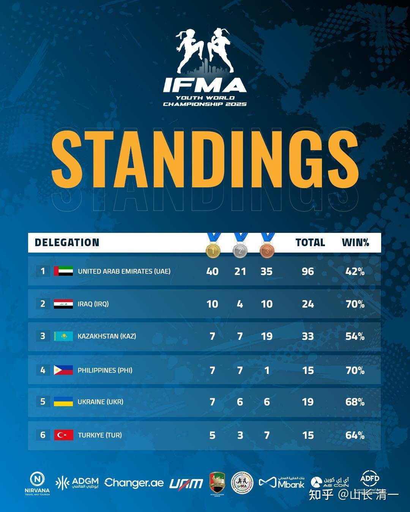
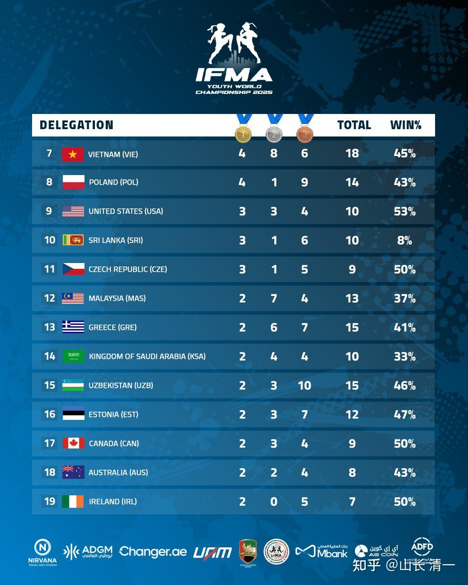
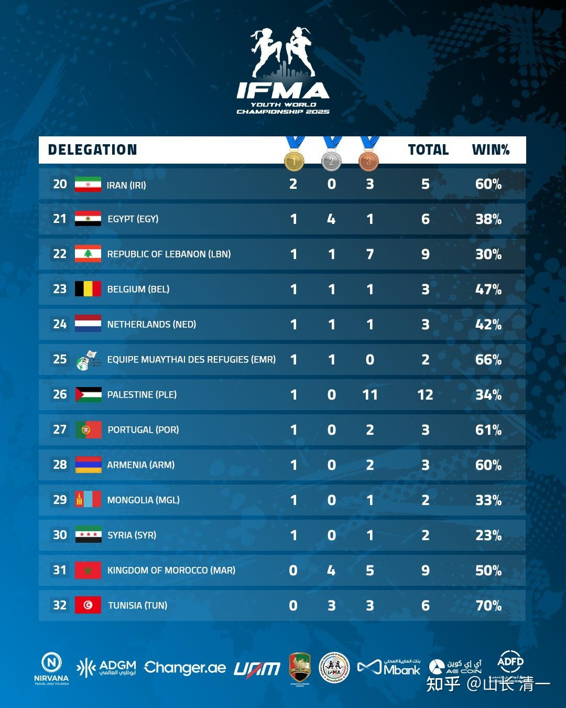
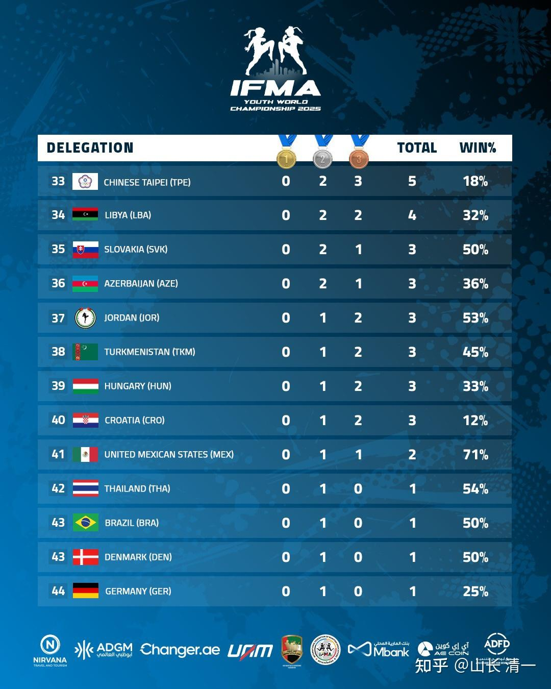
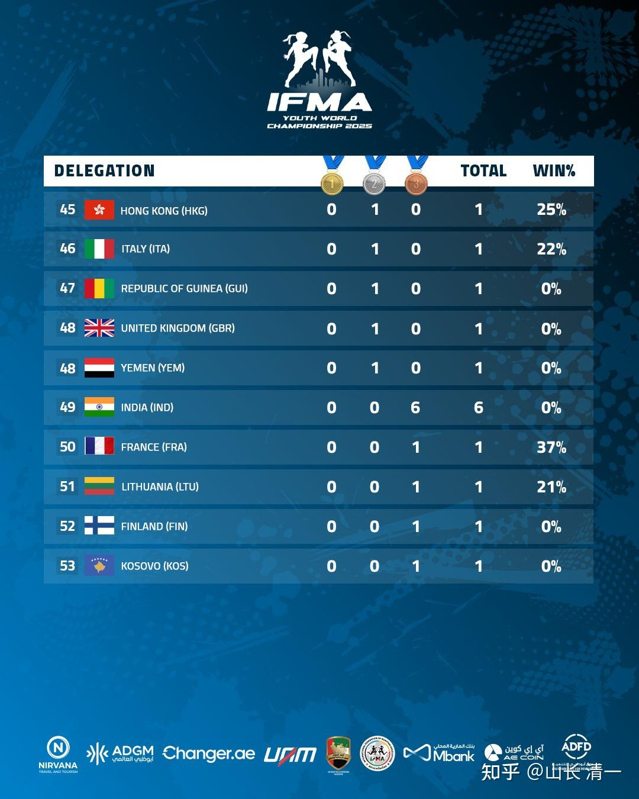

我正在研究泰拳全世界最厉害的国家是谁？我没有找到成人赛事的奖牌榜，但我找到了2025年10月举办的世界青年泰拳锦标赛的榜单！但结果让我大吃一惊：

总共有53个国家拿到了至少一枚铜牌。

中国----自然是零记录！我们真的好丢人。。。。如此堂堂大国，连排名榜都上不了！蒙古国都有一枚金牌，一枚银牌呢。我们木兰在2024年东亚锦标赛和蒙古交过手，TKO了蒙古队员。

但是，让我惊讶的是：泰国居然排名第42名，总共只拿到了一枚银牌而已！

现在的泰国，我记得几年前的一个榜单，泰国是高高在上的第一名！（题图就是几年前的世锦赛奖牌榜，当年泰国还是第一名）

怎么到了现在，2025年，泰国居然连金牌榜单都排不上来。难道真的是泰拳的职业赛事，和IFMA赛事难度不一样？其实我们认为职业赛事更容易一些。因为没有护具，我们更容易KO对手！

我们看到阿联酋居然是第一名。拿到了40块金牌，完全不符合我的猜想。我估计是富裕国家，特别有资金来支持体育文化事业发展的关系吧？否则真的难以想象阿拉伯人这么霸气的！

另外，也发现了菲律宾，土耳其在泰拳世界上的地位很高。怪不得刘晓慧打KO的菲律宾拳手，拿了多个世界冠军。亚军和铜牌拳手。2025年世界锦标赛，菲律宾就拿了7枚金牌，总共15枚奖牌！排名世界第四名，的确厉害！陆鸽遇到土耳其选手就判输掉。因为土耳其也是泰拳IFMA强国

奖牌榜

【IFMA 主席 2025 年度回顧與 2026 展望】

（本文整理自 IFMA 主席年度信函
〈End of Year Message from the President〉）

發文緣由

國際泰拳總會（IFMA）主席 Dr. Sakchye Tapsuwan 於歲末向全球泰拳家庭發表年度訊息，回顧 2025 年的重要成果，並分享 2026 年的國際發展方向。我們特別整理重點，與所有關心泰拳的朋友分享。

重點摘要（快速看）

*泰拳持續走向 國際化、多元化與包容性

*正式納入 亞洲青年運動會、伊斯蘭團結運動會

*巴勒斯坦、阿富汗締造 歷史性金牌時刻

*2026 年將首度進入 Masters Games，多國主辦世界級賽事

*IFMA 持續作為 IOC 唯一認可的泰拳組織

全文譯文

親愛的 IFMA 家人，以及來自世界各地的泰拳鬥士們：

隨著一年即將結束，這是一個讓我們停下腳步、反思並回顧共同成就的時刻。
2025 年再次證明，我們的全球泰拳大家庭始終團結一致 —— 擁抱多元、展現團結精神，並以堅韌與力量迎接每一項挑戰。

今年，我們的社群變得更加包容、更加緊密。我謹向所有國家總會、執行委員會，以及辛勤付出的各個委員會，致上我最深的敬意與感謝，正是你們的努力持續推動泰拳向前發展。

在 2025 年眾多亮點之中，有兩項歷史性里程碑特別值得一提。
泰拳正式納入巴林舉行的亞洲青年運動會，以及伊斯蘭團結運動會，這是我們發展道路上的重大一步。
巴勒斯坦首次在亞洲青年運動會奪得金牌，阿富汗也在伊斯蘭運動會上贏得歷史性的首面金牌——這些都是運動所能帶來團結、希望與機會的最佳見證。

我們同樣為精彩的年度賽事行事曆感到自豪：
包括世界運動會、五項洲際錦標賽、在阿布達比舉辦的傑出青年世界錦標賽，以及在希臘舉行、令人難忘的成人世界錦標賽。
泰國主辦的東南亞運動會，充分展現了泰拳的根源與進步，而這僅僅是我們共同努力所完成的眾多賽事之一。

泰拳的包容性——透過帕拉泰拳、特殊組別，以及拜師舞（Wai Kru）與傳統技藝（Mai Muay）等文化項目——再次證明，泰拳是一項真正屬於所有人的運動。

展望 2026 年，我們已能感受到令人振奮的未來。
泰拳將再次參與多項綜合運動會，並迎來歷史性的 Masters Games 首次亮相。我們也將成為 FISU 世界大學格鬥運動會 的重點項目。
此外，泰國將主辦 CISM 軍事錦標賽，馬來西亞主辦邀請制世界錦標賽，科索沃主辦全包容性的成人世界錦標賽，希臘則將舉辦青年世界錦標賽。

在 WMC 架構下，今年全球舉辦超過 300 場賽事，頒發世界、洲際與大陸級冠軍頭銜。我們持續作為完全符合 WADA 規範的簽署組織，並進一步鞏固我們在奧林匹克運動體系中的地位，作為 國際奧會及所有奧林匹克認可機構唯一承認的泰拳組織。

我也要向 IFMA 行政辦公室表達我由衷的感謝。你們的奉獻，確保我們能夠作為一個團結的大家庭持續成長。

對於慶祝聖誕節的朋友們，祝你們佳節愉快；對於整個 IFMA 家庭，我送上最誠摯的祝福，祝大家在新的一年裡健康、幸福、持續成功。

誠摯感謝。

敬上，

Dr. Sakchye Tapsuwan
主席
國際泰拳總會（IFMA）