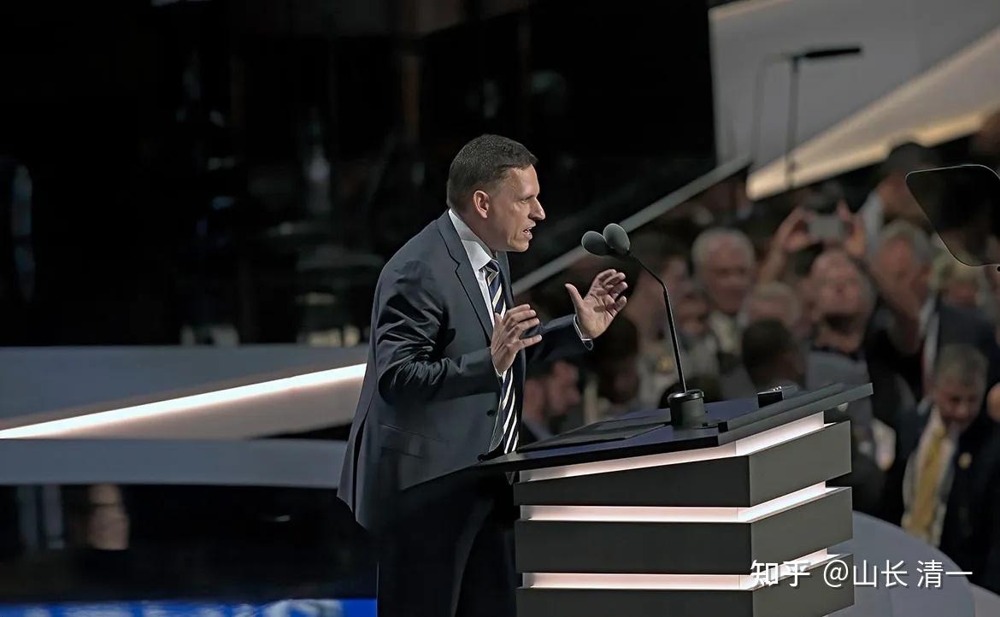

**給你 10 萬美元，條件是輟學兩年──矽谷傳奇「提爾獎學金」。**

最初名為「20 Under 20」的提爾獎學金，是矽谷傳奇創業家[彼得提爾](http://link.zhihu.com/?target=https%3A//books.cw.com.tw/author/653)（Peter Thiel）於 2011 年創立的一項獎助計畫。每年，此項獎學金會在全球申請者中選出 20名 20 歲以下的傑出人才，鼓勵他們「走出傳統教育體制（stopping out of school）」，並提供提爾本人及其基金會擁有的資源及人脈，將入選者的「創新」想法化為現實。

这个就是硅谷的创业家提尔！

被譽為矽谷傳奇創業家的提爾，在企業、新創界可說是無人不知的傳奇人物。**大學畢業於斯坦福大學法學院的他，順利進入知名律師事務所就職。他的经历，让他认为：大学就是个浪费生命的地方。只适合平庸的人去读。**

** 真正富有才华的学生，应该在20岁之前就离开学校。免得受学校的无效教育的毒害，毕业之后变得平庸。除了当打工仔之外，别无出路。**

** 因此他想找出这些最有天赋，最有愿望的大学生，支持他们去自由创业！他的团队还会给予辅导和帮助。退学两年之后，还给现金奖学金，让这些学生自由创业！起步是10万元，最高会给200万元。**

** 这真是一个好办法：的确，最杰出的人真的不需要上学，最蠢的。最懒的人，也上不了大学！**

** 这个计划，居然已经从2011年开始，已经推行了15年了！ **

**我真的最佩服美国人这一点：太有创意的！**

**如果在中国，谁敢鼓励清北最优秀的学生退学去创业，还给钱。我看官方肯定要封杀这种疯子的！但创业真的需要疯子！**

2024 年 10 月，Tesla 執行長馬斯克於個人 X 上轉發自己對「傳統教育價值」的演說影片，並寫下：「大學教育被高估（College is overrated.）」。儘管他本人擁有物理學和經濟學的學位，他仍堅定表示：「四年制大學學位，並不是成功的必要條件。」

这一点上，我是非常的佩服美国人的，他们很真实，也敢于表达自己的真实意见。起码敢于表达对大学已经无用。对真正的天才来说反而是一个负面的限制的看法。

在中国，连我都不敢这样说。我只敢让自己的孩子不要去读大学了！因为我当过大学老师，我太知道大学是什么东西了。反正就是一个我绝对不愿意送给孩子的东西！我宁肯让孩子在家读书，练武，没事情听听音乐。都不愿意让孩子去上啥这些混日子的大学！大学我怕我认为唯一的价值是交朋友。不过，如果我能创立自己的朋友圈，她们又何必去交朋友呢？

另外：**真的还有一个【清一大学奖学金】。专供证明已经证明了自己很优秀，而且有理想，有追求的学生来就读。**

首先就是清一大学会按照最顶尖的大学标准来培养学生！

另外：清一大学将按照美国私立大学的学费标准来收取学费。

不过：学费不是我们的目的，只是提供一个观察清一大学办学水平的尺度！也是我们自尊的标志，如果提供了世界最顶尖的教育，也应该收取不比这些没有提供真实价值的大学学费更低，我们不想贱卖自己！

清一大学同时，也给经济条件不够好的家庭的学生，提供全额奖学金，帮助优秀的、有理想的学生入读！

比如本科阶段的【清一国学国术专业】，专门给今日三校已经拿到了SAT1500以上分数的学生提供为期四年的全额奖金学！这个分数，就是美国常春藤大学的录取分数线。因此显然清一大学，是按照全世界最顶尖大学的标准来录取学生的！这种学校，怎么可能不是世界顶尖学校？

申请国学国术专业的学生，只要15岁取得了SAT等级1%的优等成绩，就可以入学了。在校学习四年之后毕业。 学习内容有第三国外语学习，学生必须达到外国语大学小语种专业的中高级水平才算合格。 中国大约有8-10所核心院校（常被称为“八大外语院校”），但若包含各省属外语院校、应用型外语类院校及民办本科，数量则更多，一般公认的专门类外语院校有几十所。

**清一大学本科学科教育的成绩，是完胜这些全国最顶尖的外国一大学的！以教学结果来论的话，清一大家就是外国语教育的世界第一。**

比如，某知名的顶尖外国语大学的宣传：【2025年全国*西班牙语专业*八级考试成绩正式揭晓，我校西欧语言学院2021级*西班牙语专业*学子以64.7%的优异*通过率*再创佳绩！】

专八大概是相当于DELA的B2水平，阅读和词汇量略高于B2。但听说的难度，还不如B2。综合难度全面不及C1！

对比清一大学的三语专业学生，我们不考专八。我们的西语直接考国际标准的DELA。很多国内语言大学学生望而生畏的考试。我们的B2通过率是100%，C1的通过率也高达35%左右。这个成绩，肯定是全国大学的第一名！

** 清一大学的国术专业课程，水平更是【世界第一】了。**因为我们认为：语言类的知识技能，只是一个最基本的工具，不构成真正的技能。因此清一大学的学生，不仅仅要学语言，还必须学一门硬本事。成为文武合一的专业人才！四年内成为双学位人才！

在文上，清一大学本科学生，需要超越全世界任何外国语专业的大学毕业生标准，要通过国际标准考试才能毕业！清一大学要成为全世界最优秀的“外国语专业大学”！

在武上，清一大学专业要求，是必须超越全世界任何体育大学的武术专业。用真实的教学成绩来检验学生的学习情况！因此，清一大学本科生，需要通过第三语考试的同时，还要用大学四年的时间，学会中华武术和格斗技能，所有学生都要去参加全国格斗锦标赛，面对真实的全国级别的顶尖赛事的竞赛，来获取毕业成绩！

清一大学的本科学生，三语成绩优良，只是“勉强合格”。要拿到全国格斗锦标赛的前三名成绩，才算“良好”。拿到全国格斗冠军，才算优等生！才有资格申请清一大学研究生！

** 我们国术专业水平成绩的参照对象，是全国的体育大学！总共有62所！**

资料：《2026 年普通高等学校运动训练、武术与民族传统体育专业招生院校》

武术与民族传统体育专业招生项目为： **武术套路、武术散打、中国式摔跤。 **

武术与民族传统体育专业招生院校共有62所：

北京体育大学、上海体育大学、武汉体育学院、西安体育学院、成都体育学院、沈阳体育学院、首都体育学院、天津体育学院、河北体育学院、吉林体育学院、哈尔滨体育学院、南京体育学院、山东体育学院、广州体育学院、河南体育学院、河北师范大学、山西师范大学、晋中学院、内蒙古民族大学、沈阳师范大学、东北师范大学、哈尔滨师范大学、苏州大学、江苏师范大学、浙江大学、杭州师范大学、阜阳师范大学、集美大学、江西师范大学、山东师范大学、鲁东大学、菏泽学院、河南大学、郑州大学、河南理工大学、洛阳师范学院、商丘师范学院、黄河科技学院、湖南师范大学、吉首大学、广西师范大学、海南师范大学、贵州师范大学、云南师范大学、云南民族大学、西北师范大学、宁夏大学、青海师范大学、青海民族大学、山西大学、西华师范大学、三亚学院、呼和浩特民族学院、邯郸学院、沧州师范学院、武汉体育学院体育科技学院、湖南工业大学、长江师范学院、长治学院、河南师范大学、齐鲁师范学院、内江师范学院。

** 这么多的大学，这么多的武术专业，培养出全国格斗冠军的比率是多少？**我们也查不到。

我们只知道：世界泰拳锦标赛，以及世界自由搏击锦标赛。有53个国国家都能拿到至少一块奖牌。中国在53个奖牌国家之外。我们是“零记录”！格斗弱国！

我们只知道：在全国锦标赛上我们遇到的对手，的确会遇到一些体育大学的武术专业，格斗专业的学生。只有全校最优秀的学生，才有机会和资格参加全国格斗锦标赛。但这些专业拳手往往是清一大学的手下败将！因为我们的学生，有三分之一能拿到全国冠军。剩下的人，基本上都能进入全国前3名！

2025年全国泰拳锦标赛，我们的团体是全国第一，是拿到了全国最多金牌的战队！

因此：**清一大学本科阶段的专业教学成绩，毫无疑问是全国，甚至是全世界文武双双第一名的水准！妥妥的世界名校的范儿。**

清一大学还提供【研究生阶段的教育服务】。提供了除了国术方向的，更多的专业选择给学生。比如历史专业，文学专业，哲学专业，心理学专业，以及教育学专业。这些专业都开放给合格的优等生申请。我们也提供了全额奖学金给学生！

全奖入学对象有两类：第一类，就是拿到了全国锦标赛冠军资格的清一大学本科毕业的学生。可以申请全奖入读清一大学研究生！获取三年的奖学资格！【这个入读标准，恐怕比世界顶尖大学的要求都高】

第二类，就是上面的【提尔奖学金】重叠的范围了：凡是世界顶尖名校的优秀毕业生，可以申请全奖入读清一大学研究生！

**清一大学还设置有国术国学专业博士生的学位。要求就更高了！待遇也非常的优厚----**

入学要求是：清一大学研究生毕业，并拿到了格斗项目的世界锦标赛冠军的研究生，才有资格申请入读【清一大学博士生】。

入读待遇是：取得终身奖学金。学生从入读之日起，就享受“带薪学习”的博士待遇。还可以在毕业后，终身享受【世界冠军清一博士终身津贴】待遇。

注定将来的【清一奖学金】比【提尔奖学金】更加的有影响力。因为我们的起点更高，而且：提供的奖金更优厚。还不带任何创业的回报条件。

提尔奖学金，培养的是物质世界的创富者。是硅谷未来的科技合作伙伴！

而清一奖学金，培养的是这个世界的精神创富者！是我们未来的文化合作伙伴！

也许，清一大学，才代表世界文化，世界教育的未来！