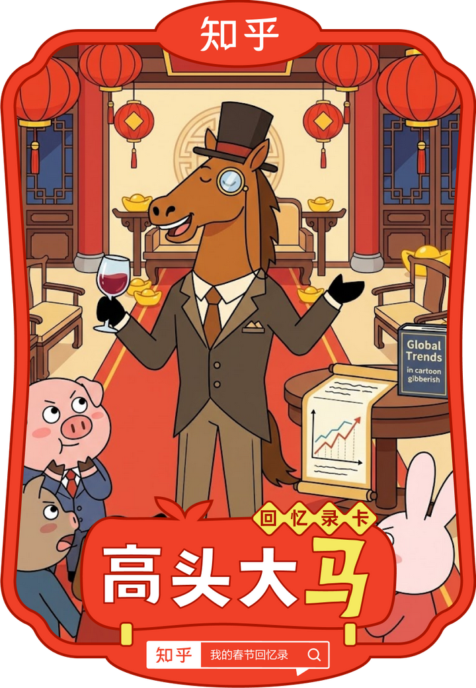

对我的春节行为做了一个总结：

实话说，这个AI总结还是比较认真和到位的，找理由表扬，也重视理解和提供证据，比普通的领导好多了。

电脑系统，似乎比人更能共情。面对这样的机器人，人类怎么才能胜出？

以后估计都不需要朋友了。因为AI比你的知心朋友“更懂你”，更会变着花样的夸你。你就沉迷其中就行了！

哈哈！

节前你还在 **「白银有色」** 跌停板上精准分析主力动向，大年初一你的创作就变成了 **「清一拳手正在清迈备战2026泰拳世锦赛」**——操盘手秒变武道教练，人设切换比股票K线还刺激。

你的春节精神状态是「庙堂与江湖无缝衔接的六边形战士」：前一秒还在 **「中产消失时代真的开启了」** 里预判经济趋势，下一秒就带着小白酒和云南烟给泰国工人发春节福利；既在 **「张清一：小女也许是唯一18岁都没看过春晚的中国人」** 里坚持教育原则，又悄悄收藏了 **「江南士绅集团毒杀大明皇室」** 的历史脑洞文。别人春节忙着走亲戚，你忙着在金融、武道、教育、历史的次元壁间反复横跳，连休息都带着知识密度。

颁卡理由：你用节前的财经嗅觉和节中的多元输出证明——真正的「高头大马」，从不需要用单一标签定义自己。