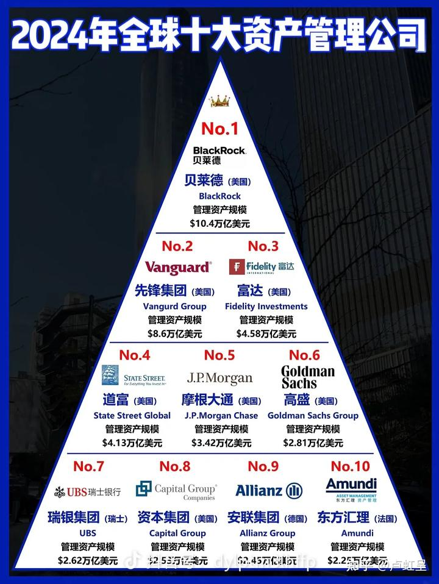

在海灵格家族系统排列中，有一种说法：就是“遗产是诅咒”，凡是承接祖宗遗产的孩子，总是有各种病痛，灾难和不幸！最终找到海灵格老师处理问题时，总会发现家族的遗产，导致了这种灾难的出现！

**一：这种诅咒，来自于灵魂对公正的追求。**

首先是自己的灵魂，也就是当事人的真我，对于并非自己的创造和努力得到的财产，是不认同的！因此是持否定态度的。虽然在“假我”的层次，这个占有了遗产的人，可能对自己能够占有遗产感到沾沾自喜！但他的真我，是排斥这些财产的，因此会用各种稀奇古怪的方式去“败家”！去自毁。

**二：就是其他有关的灵魂，对于某人不公正当地占有遗产有愤怒**，这种愤怒就会成为一种诅咒，从而对当事人的生活产生不利的影响！

因为你得到的每一份财富的背后，都是社会资源的重新集中。我股市上赚到的每一分钱，都是其他人输掉的钱。这些人在低价的时候，因为恐惧而低价卖给我筹码。他们还会在高价的时候，因为贪婪而高位买进筹码。因此，资本来到世界上，每一个毛孔都带着别人的血汗！

当你明白这个道理，你就知道：你把自己赚到的钱，直接交给自己没有对社会做任何贡献的子女去消费的时候，你就会把他人的诅咒带给子女！最终，你的财产会丧失，所谓的富不过三代，你的子女会倒霉！甚至断子绝孙。

因此，为了匹配你得到的财富，富人必须公正地对待其他人。你必须让所有人都有机会享受你赚取的财产。而不是只让你的子孙后代独享财产。这样，你的后代才能安然发展。

最好的方法，自然是设立公益基金，让自己的子女后代，可以和其他人一样也享受财产带来的各种机会。这才是最佳的财富长治久安之道！

**三：财富是一种高能量，会吸引来巨大的负能量!**

如果你是一头大肥猪，相信你吸引来的可能是狼群！他们都想要你身上的肉！

如果你是一只狼。你身边的伙伴，大概率也是狼。

你的实力，决定了你的社会地位！

各位娇生惯养孩子的家长，是在养猪呢?还是训练狼？

你认为你对孩子无条件的爱，对孩子没有要求，你每天只会带孩子吃喝玩乐，不去培养她的眼光和能力。将来你老了，你培养出来的孩子只是一头养得肥肥的大肥猪？你认为他长大了自动是一只老虎吗? 你有无信心让她去面对残酷的，饥饿的野狼群？

因此，古人说：惯子如杀子！现在刚刚富裕一点点的中国家长，不懂古训，就在拼命的娇惯孩子。可见的将来，他们会被社会残酷教训的！

社会上，有一大批高智商的人，身披合法的外衣，天天谋划如何抢夺愚蠢的富人，特别是二代们的财产。他们会披上各种高级的身份，以高级医生，律师，金融家，银行家，理财专家，以及豪华奢侈品的卖家等等专业的身份，目标就是转移和夺取富人的财富！张兰的两百亿资产家族信托理财就骗光，就是金融大鳄的惯用伎俩！

政客也一样。他们不创造价值，他们只分配价值！如果你无法权贵们分享权力，总有一天，权贵们会分享你！商人的命运，只是有钱，历史上没有几个有好下场的！即使是红顶商人胡雪岩，也是黯然离场。

富人就是白道的人想要分食你，黑道的人，也要抢你。甚至白道的人会伙同黑道的人一起来算计你。如果你只是有钱，没有地方势力保护你的话，真的会很惨。莫名其妙的事情都会降临身上。因此，富人的孩子，其实面对的是比穷人的孩子更加凶险的社会。但蠢货家长往往以为别人笑脸以待，就是我牛。根本不给孩子教这些，结果孩子离开父母的保护之后，种种笑话！

当年我看传记，世界首富希腊船王的妻子，死之前财富被身边的人抢的很多，身边的管家都是骗她的。她也很无奈。家里如果没有厉害的如果迈克尔这样的孩子，大概率只会当消费者弗雷迪的孩子，一生是很凄惨的！

我带孩子出去见人，长见识。因为我的关系，孩子见到的都是笑脸。但我总是提醒她：笑脸的背后，很多都是利益的算计。我们必须守住我们的根本，不要被他们带偏！

**四：灵魂的使命是创造。资本的使命是吸引你堕落！**

灵魂的使命是创造，而非“不劳而获”。

因此，家长的财富，最应该用来让孩子获得最好的创造机会！

比如我：愿意帮助我的孩子来获取世界冠军的荣耀，让她去当国礼。但我根本不在乎她是否会赚钱！我也不培养她去赚钱。只让她去帮助世界。但我认为她不会缺钱的，因为基本的财商我从小就教了！目的不是赚钱，而是守住钱！

资本的使命，是创造欲望，吸引人堕落，这样才能让资本赚到钱！

他们会用各种手段来包装。让人建立“得到”的人生价值观念。这样，资本就能把各种东西卖给你，掠走的你财富了！

最典型的案例就是泰森。当年他打一场比赛就是数千万美金，富的流油。正常情况下，他几辈子都用不完这些钱！周围一大群“代表上流社会”的人都围着他，各种名车，美女都围绕着他。据说豪华车他买了十几辆，都没怎么开过！

后来老了。突然发现自己是穷人。只好出来打工赚钱。出来拍电影，被中国人打， 赚点小钱养家！跟他当年完全没法比了！

各位家长觉得：如果泰森这种底层爬出来的人，都守不住自己的钱。你们怎么能够指望自己的儿女能够守住你一生赚来的钱呢？

其实我都没有这种信心。因此我更愿意把一滴水放进大海。让我选出的十大公主们来管理我的财富。让她们使用这些财富，去为社会服务！我的后代，也可以得到一个机会！

我当年送给100年后子孙后代的七大礼物，我就必须送给十大公主和她们的后人。然后我的子孙才能得到这份礼物！如果我只想全部留给我的子孙后代，大概率是做不到的！至少历史上就没有人做到过。

** 这就是天道：一滴水，只有放进大海，才不会枯竭！**

我希望富人们，懂得这个基本的道理！明白我们在世界上，都只是一滴水，我们不是世界。

10月1日。鹰粉节，我将在磨丁慧兰大酒店分享七天的财富课，电影课，其中最重要的，就是帮助家长了解现在的财富世界！

（这不是广告，名额早就已经满了，只是通知一下罢了）