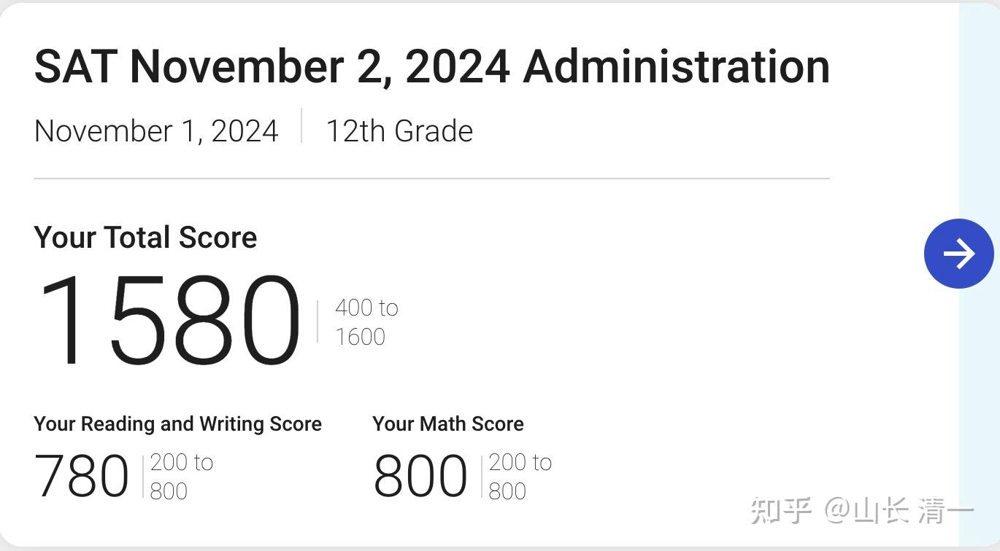
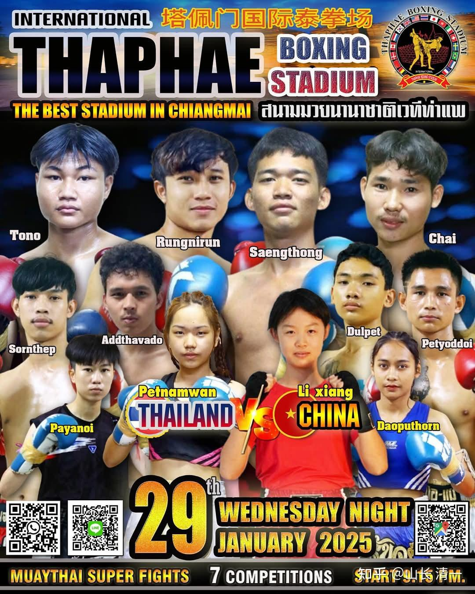

2024年，我们圆满结束了这一年的挑战。一共培养出了15名全国冠军，三名东亚锦标赛冠军。文科成绩上，我们的学生50%达到了超过SAT1500分的优等成绩（常春藤入学标准）。最新的成绩单，有学生创造了1580分的算是满分的记录！2025年将有更精彩的记录出现！

这一年，文武双全的清一武士们，正在走向世界！2025年，预计我们将要培养出更多的冠军，以及培养出更多的学霸，预计2025年今日三校考过SAT1500分的人，将要超过60%，绝对的创造世界第一的成绩！

*最近一期的学生SAT考试成绩*

这批文武学霸，在接下来的寒假和春节，他们会如何度过呢？

一：在惠州的全国泰拳锦标赛结束后，公主班的四个冠军拳手，约好了去上海的海底捞工作。利用假期去见识社会，服务社会。我相信这种经历，比简单的回家过春节，大吃大喝，对自己的提升更大。更重要的是：学会了做“服务者”，也可以看到大城市的消费者的生活。如果自己不需要。不喜欢这种生活，就没有必要重复这些人的生活和职业选择！

二：留在清迈，计划冲刺2025年亚洲和世界冠军的拳手们，特别安排在春节期间参加泰国的职业泰拳赛。用比赛来训练自己，发现自己的短板。

大年三十，冠军陆鸽打南邦府的优秀拳手，用打满五局获胜的成绩来为自己的春节献上一份礼物。

大年初一，公主班小公主李想，首次走上泰国的职业擂台（之前只打过国内的锦标赛），用一场胜利来记录了自己的首战-----全身无护具去面对强悍的泰国职业拳手，的确需要强大的心理素质！

大年初一，四冠王明晓也走上了清迈的拳场。她用一场KO对手的胜利，记录了她已经最近6场都以连续KO对手的战绩，捍卫了她在这个级别的王者地位！

当全国人民正在吃吃喝喝玩玩的时候，清一战队们正在用自己默默无闻的努力，一点一滴地捍卫自己的理想。同时，也在一点一滴地捍卫中华武术的荣誉，捍卫国家和民族的荣誉！

转文，冠军的思维模式：

**那些你早早爬起来学习的日子，那些你熬夜刻苦工作的日子，那些你累到站都站不起来，你明明不想逼自己，却依然撑起自己的夜晚，才是真正的梦想所在。梦想的意义不是到达终点，而是在追逐的过程中，找到真正的激情和幸福。**
**追梦的路上会有高光时刻吗？当然。追梦的途中会有低谷吗？一定的。但如果这一路上你不断观察自我，积累各种经验，你一定能抵达那个能让你施展才华的地方。不是听从别人的安排，随波逐流。而是跟随内心的声音，找到一生之热爱。**

**三：三语学校放假了。父母们开始操心孩子的学习和进步了。**

**一些家长，担心孩子过春节后状态变差，所以特别安排了不一样的春节。少年军校的家长们，集体商议让孩子从泰国走回家去---跨国长征。然后计划在收假的时候，再让这些孩子们走回学校去。家长们认为：这批孩子们一定会发现---原来在学校读书上学的时候，才会最快乐的时候。如果每次放假，孩子们都有走回家，我看孩子们更喜欢呆在学校学校。这样培养出来的孩子，起码不会躺平吧？**

**当然，更多家长，更希望孩子回家享受家庭的温馨。结果当然就是：每年的寒假过完，都有一批孩子状态严重下降。把孩子的前途未来作为赌注。换取今天的一点吃喝玩乐的快乐。这么做的人，不知道是太聪明了，还是太笨了！**

**每个人都想要出人头地。**

**但是：很多人选择用平庸和大众的方式，用随波逐流，找享受的方式去“出人头地”，这怎么可能！**

**想要成就一番功业，自然要做不一样的事情。包括过节日的方式！**