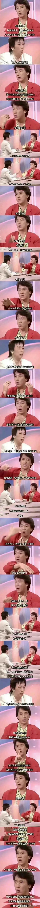

古人说：兄弟如手足，妻子如衣服。这话无情，但的确很有道理！女人如果不能成为男人事业上的伙伴和助力，注定会被冷落和抛弃的。聪明的女人必须知道这一基本常识！

男人们在事业追求面前，女人卿卿我我的感情世界，其实对男人根本就没有吸引力。本质上，男人对女人的追求，只是一种征服欲望的体现，并不带太多的感情。男人选择女人，有很强烈的功利色彩。反过来女人也一样，只是女人会把功利的目标，隐藏在感情的外表下面！越有心机的女人，其实越看中功利。否则为何一些年轻女子，会嫁给70多岁的老头？她表面谈的是感情，骨子里面满满是功利！

偏偏女人都想要用感情来驾驭男人，基本上是做梦。只有最傻的男人，才会屈服在女人的感情世界中！正常的男人，一定会为了追求事业而放弃女人。因为男人知道：**只要自己有成功的事业，女人就不会缺少。但----男人就算有了女人，但没了事业，女人也会跑掉的！**这就是社会现实！

下面这个成龙这个访谈很有意思。他是邓丽君想嫁的人，但他却不愿意进入邓要求的二人世界，不要放弃自己的兄弟。如果邓愿意放弃自己的追求，愿意成为他的助理和影子，他们肯定是可以成的。但因为邓自己也有自己的事业，当然，她也有自己的傲气，因此两人当然只能分手，各自过自己的。最终，邓是独身去世的。

我猜对于女人而言，仅仅事业的成功不能带给她满足，女人其实是依赖感情而生的。偏偏感情又特别的靠不住！不是你投入了就有回报的！女人如果在男人上没有得到自己需求的感情安慰，就会把全部感情放在孩子上。如果也没有回报，就会放在孙子上，因此一辈子就过去了！死了还不开悟的，就下辈子再来一遍。这就是轮回！

男人的事业，就不可能像女人这样不断转换对象了！男人永远在奋斗中！

婚姻就是一方必须服从另外一方，两人如果有两个方向，注定一方必须牺牲自己的方向，来成就另外一方。如果做不到，就只能分手了！

聪明人，可以在事先就确认好这一块取舍。而傻瓜们。会用自己的婚姻大事去尝试。最终一地鸡毛！

