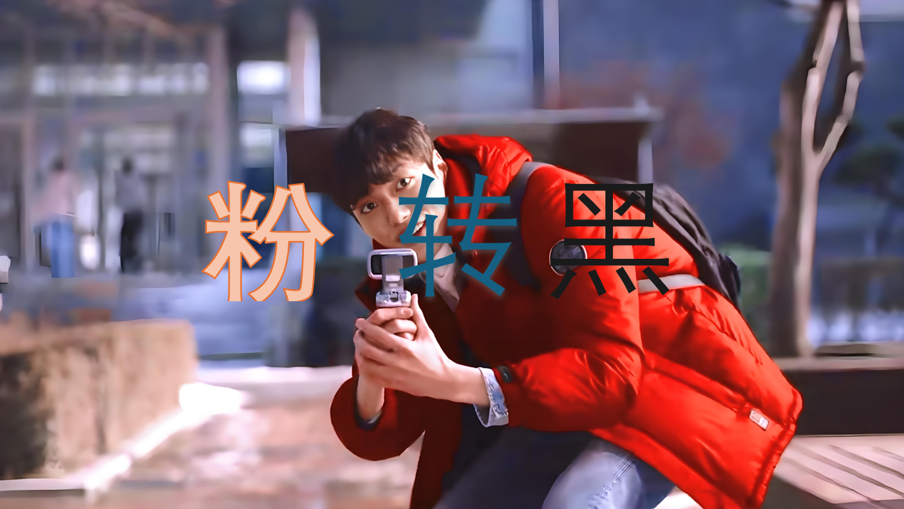
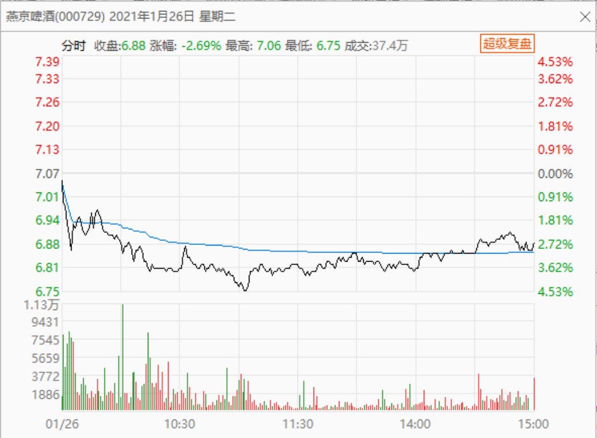
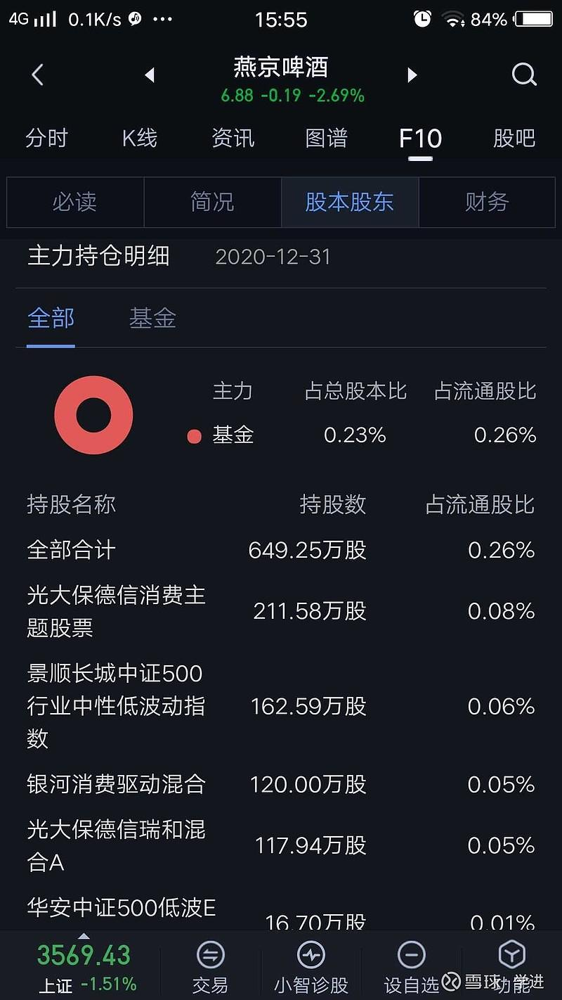
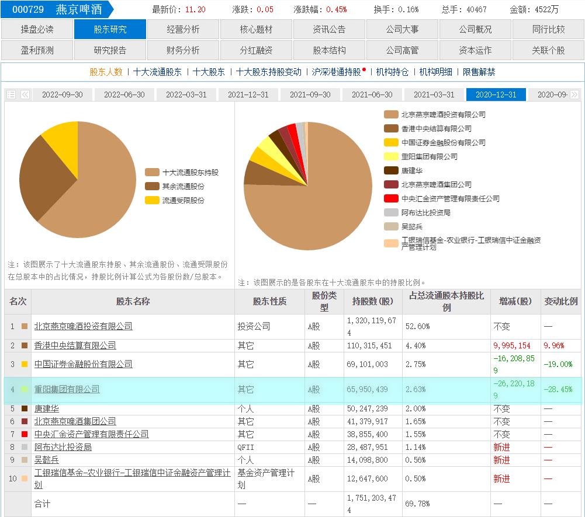
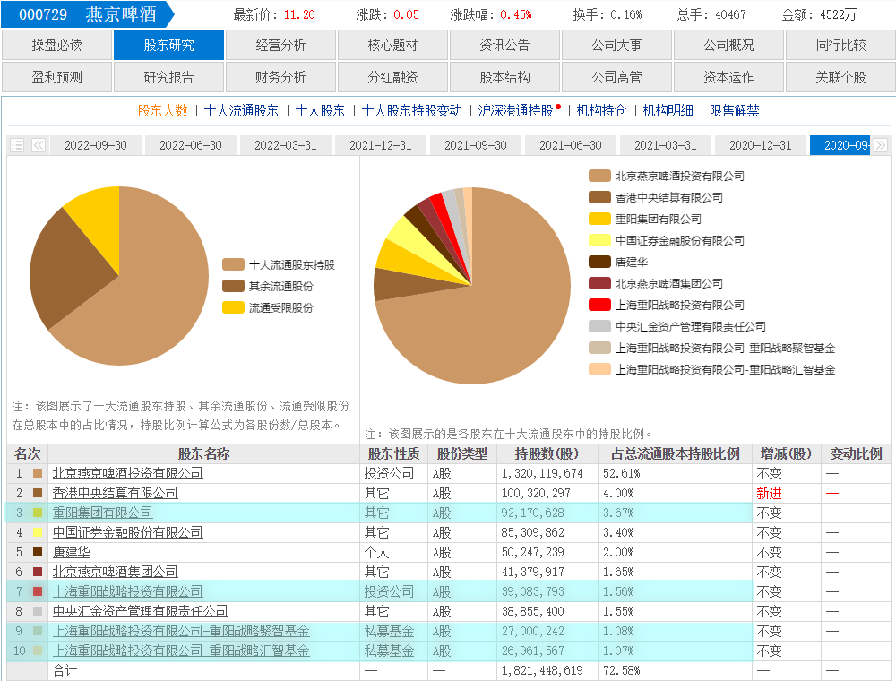

97篇.借燕京看粉转黑有多快

清一山长2021年1月26日

[清一山长](http://link.zhihu.com/?target=https%3A//xueqiu.com/9310099567)2021-[01-26 13:43](http://link.zhihu.com/?target=https%3A//xueqiu.com/9310099567/169946316)(主贴1)

[$燕京啤酒 (SZ000729)$](http://link.zhihu.com/?target=http%3A//xueqiu.com/S/SZ000729) 燕京跌得真惨，继续破位，指标空头排列。昨天说主力出货，看得真准。可惜我看空没做空，遗憾错过了下跌赚钱的机会。我的燕京账户，现在一片绿油油的，生机勃勃的韭菜田！

今天补仓了，买入价格是6.81元。我看空不做空，继续花钱买套。没想到这个世道，还可以买到6元的燕京。下一次，应该是五元的燕京了吧？你们都走吧！我掩护！破5了你们再来[加油]。

今天，又转了一笔钱进账户，明天才可以用。燕京加油，明天继续跌，最好明天破六向五。

[感知**](http://link.zhihu.com/?target=http%3A//xueqiu.com/n/%25E6%2584%259F%25E7%259F%25A5%25E6%2584%259F%25E6%2581%25A9)回复[清一山长](http://link.zhihu.com/?target=http%3A//xueqiu.com/n/%25E6%25B8%2585%25E4%25B8%2580%25E5%25B1%25B1%25E9%2595%25BF)：（跟评主贴1）

继续买也不知道真买假买，不像51姐每天买[信立泰](http://link.zhihu.com/?target=https%3A//xueqiu.com/S/SZ002294%3Ffrom%3Dstatus_stock_match)每天晒单[@51nxp](http://link.zhihu.com/?target=http%3A//xueqiu.com/n/51nxp)。

[清一山长](http://link.zhihu.com/?target=https%3A//xueqiu.com/9310099567)2021-01-26 14:53回复[感知**](http://link.zhihu.com/?target=http%3A//xueqiu.com/n/%25E6%2584%259F%25E7%259F%25A5%25E6%2584%259F%25E6%2581%25A9)：

您这么聪明，居然看出我是假买了？您真太牛了！

第一、既然您都看出来了，我建议您反手做空。跟我吹的反向，您就跟上步伐了。

第二、既然我说话特不靠谱，建议您拉黑。要不我帮忙一下？

祝您吉祥如意[献花花]。

[感知**](http://link.zhihu.com/?target=http%3A//xueqiu.com/n/%25E6%2584%259F%25E7%259F%25A5%25E6%2584%259F%25E6%2581%25A9)2020-10-29 18:30回复[清一山长](http://link.zhihu.com/?target=http%3A//xueqiu.com/n/%25E6%25B8%2585%25E4%25B8%2580%25E5%25B1%25B1%25E9%2595%25BF)：

**遇到山长真是几辈子修来的福报啊！**

[清一山长](http://link.zhihu.com/?target=https%3A//xueqiu.com/9310099567)2021-[01-26 16:26](http://link.zhihu.com/?target=https%3A//xueqiu.com/9310099567/169970070)回复[@感知**](http://link.zhihu.com/?target=http%3A//xueqiu.com/n/%25E6%2584%259F%25E7%259F%25A5%25E6%2584%259F%25E6%2581%25A9)：

粉转黑有多快呢？

“感恩”的心，多久会变恶意抹黑的心？

答案是。一个季度就够了！

啤酒看样子还会继续跌，估计这种人就越来越多了。所以，我建议你们都去买茅台去，啤酒也只买重庆啤酒。别再关注我，免得我还要一个一个人地拉黑，太费劲！[俏皮]

**贴出来这些记录，让各位看看人性的有趣之处。**很有意思，我早知道是这样的，并不意外。所以，我对粉丝们，都不报任何指望的。也不喜欢回复上涨后粉丝们的赞美、不搞粉丝线下会面，只跟知交论酒。因为分分钟粉就转黑！

[心如何止](http://link.zhihu.com/?target=http%3A//xueqiu.com/n/%25E5%25BF%2583%25E5%25A6%2582%25E4%25BD%2595%25E6%25AD%25A2)回复[清一山长](http://link.zhihu.com/?target=http%3A//xueqiu.com/n/%25E6%25B8%2585%25E4%25B8%2580%25E5%25B1%25B1%25E9%2595%25BF)：（跟评主贴1）

山长大佬，估计4季报你会显示在十大里面了[笑]。

[清一山长](http://link.zhihu.com/?target=https%3A//xueqiu.com/9310099567)2021-[01-26 14:58](http://link.zhihu.com/?target=https%3A//xueqiu.com/9310099567/169958271)回复[心如何止](http://link.zhihu.com/?target=http%3A//xueqiu.com/n/%25E5%25BF%2583%25E5%25A6%2582%25E4%25BD%2595%25E6%25AD%25A2)：

真出现这种情况（我进了燕京十大），你们就惨了！原来的十大都跑光了，燕京不跌到5元去才怪！

我现在最关心的是：唐建华四季报还在不在？如果在，**我就太佩服他了。涨到10元都没走。他一直稳稳地守住他的股！几年来就一股不动。**

[心如何止](http://link.zhihu.com/?target=http%3A//xueqiu.com/n/%25E5%25BF%2583%25E5%25A6%2582%25E4%25BD%2595%25E6%25AD%25A2)回复[清一山长](http://link.zhihu.com/?target=http%3A//xueqiu.com/n/%25E6%25B8%2585%25E4%25B8%2580%25E5%25B1%25B1%25E9%2595%25BF)：（跟评主贴1）

也没啥惨的。从2019年底的时候开始关注您，看了您的分析开始买入，那时燕京就是现在这个价格徘徊。2020年疫情来了个黄金坑，3月份的时候最低5.3几元，无非再次跌到这个价格。我浮亏30%那说明燕京这两年赚的是假钱，销量增加是假的，那我就只能陪它共患难了，然后深深地弯腰捡点大家不要的筹码，我认为唐建华大概率还是在的，从他进来燕京后就有过**9块几**的价格都没动，离10块就一个涨停的价格，难道他这两年来就为了等10块吗？肯定不止，但是唐建华的持股精神多年来一丝不动是很值得我这类小散学习的，也非常感谢您时常分析[献花花][献花花]。

[清一山长](http://link.zhihu.com/?target=https%3A//xueqiu.com/9310099567)2021-[01-26 16:50](http://link.zhihu.com/?target=https%3A//xueqiu.com/9310099567/169972911)回复[心如何止](http://link.zhihu.com/?target=http%3A//xueqiu.com/n/%25E5%25BF%2583%25E5%25A6%2582%25E4%25BD%2595%25E6%25AD%25A2)：

[献花花]明白人，现在的价格，是低于唐建华建仓价的。更别说时间成本了。

[学进](http://link.zhihu.com/?target=http%3A//xueqiu.com/n/%25E5%25AD%25A6%25E8%25BF%259B)回复[清一山长](http://link.zhihu.com/?target=http%3A//xueqiu.com/n/%25E6%25B8%2585%25E4%25B8%2580%25E5%25B1%25B1%25E9%2595%25BF)：[查看图片](http://link.zhihu.com/?target=https%3A//xqimg.imedao.com/1773db9df6f4c72b3fd3b3b9.jpeg%21custom.jpg)（跟评主贴1）

[刚在大智慧手机版上看到的，十大流通股东都更新没了，什么情况？\[大笑\]\[大笑\]\[大笑\]](http://link.zhihu.com/?target=https%3A//xueqiu.com/8374069528/169967414)

[清一山长](http://link.zhihu.com/?target=https%3A//xueqiu.com/9310099567)2021-[01-26 17:06](http://link.zhihu.com/?target=https%3A//xueqiu.com/9310099567/169974645)回复[学进](http://link.zhihu.com/?target=http%3A//xueqiu.com/n/%25E5%25AD%25A6%25E8%25BF%259B)：

这张图好有意思呀！仅仅一个季度之后，主力持股就从17亿，减到了600多万股。七家主力的持股，只有唐建华的八分之一。甚至还不如我一个人的持股多。我太牛了，我都在想象：也许我现在已经是燕京的“三大”了[俏皮]。唐建华当然是“二大”！

一大堆的散户名字，将出现在燕京的年报十大名单中。最低只要100万股，就入门十大了。

看了这个数据，你们不怕得要死吗？赶快逃，燕京的主力全都走光了，现在都是散户在持股了。

**你们信吗？反正我是不信的**。这个“主力”数据，鬼知道是什么鬼人制造出来的假消息。起码9月份的三季报，就是鬼扯蛋！主力持股有超过62.69%？流通股的70%？拉倒吧！大骗子！燕京集团的57%的持股，你算到什么地方去了？你把剩下的股票全买光了，也没有这么多的。如果你非要说11家主力机构已经包含了燕京集团公司，它也是主力之一。那么，为啥12月给出的数据，就不包括燕京集团了？甚至——你包含唐建华没有？

(标题、图片为编者所加)

文章音频：

[534篇. 借燕京看粉转黑有多快](http://link.zhihu.com/?target=https%3A//www.ximalaya.com/sound/805019588)

**参考链接：**

[91篇.如何看进出时机？](https://zhuanlan.zhihu.com/p/16488305045)

[92篇.珠江投资的反省总结](https://zhuanlan.zhihu.com/p/17164493123)

[93篇.揭开燕京的奥秘](https://zhuanlan.zhihu.com/p/18185937465)

[94篇.短期来说珠江和惠泉的趋势良好，股性更活](https://zhuanlan.zhihu.com/p/1960281323)

[95篇.燕京的经营很稳健](https://zhuanlan.zhihu.com/p/20722962985)

[96篇.啤酒的人均持股](https://zhuanlan.zhihu.com/p/21559367964)