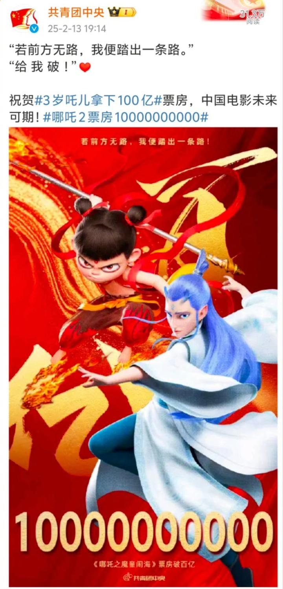
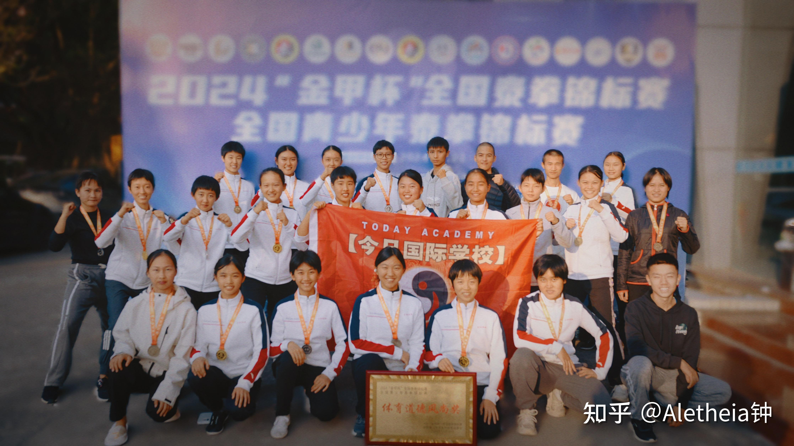

有时候：真不知道咋去想我们的“专业人员”，“职业团队”到底在干啥！拿工资的时候，这些人都很牛。但关键时候，要创世界纪录的时候，“专业人士”就消失了，强调种种理由和困难。给钱都不行。这时候，就全靠“业余”出来支撑天下了！

当年明朝的时候---打仗居然要靠一个书生王阳明自学成才，来支撑明朝的天下。

清朝的时候，一个乡村出身的教书先生曾国藩，又是靠自己“自学成才”，学会带兵，从太平天国手上，挽救了大清的天下！

今天，我们看到一个学医的书生，也是用自己的业余爱好，自学成才，自己来玩艺术，玩动画，玩中华文化输出。大大方方地在世界电影历史上创造了崭新的中国记录，让中国文化符号成为今年最响亮的明星！票房突破一百亿，实在惊人！目前是世界票房第17名。我相信很快就会成为第一名的。上升趋势还没有停止的迹象。

这一个【世界第一】，估计是跑不掉了！

关键是：这部影片，赢得了全世界各国人民的喜爱和欢呼！可能是中华文化首次以这种令人喜悦的方式去走向世界。影响世界！

总结：四川人 杨宇 饺子导演 1980年出生！这年我刚好考上大学。

他985大学医科毕业，却不想去医院当社畜。啃老在家三年自学动画，做动画谋生。然后用了14年的时候，才迎来了一个可以做长篇动画的机会！

他用了2年来完善一个剧本，再用三年时间来制作一部电影。5年之后，他拿出了自己导演的【哪吒1】。首战惊艳！

当年，他说“宣传期过后，我要去“喜马拉雅山”写剧本了，下部作品再见！”。接下来就消失了，似乎他就没有存在过一样！

再过了5年半，我们没看到他再次的发言，但我们看到了他新拿出来的剧本创造的 【哪吒2】。一出山就创造了【中国第一】的票房纪录。也许—-它还会创造世界第一票房记录。尽管---这还需要一点时间！看样子很有希望！

都说【十年磨一剑】，他的剑，足足磨了24年。看样子还在继续的磨剑。也许还有 【哪吒3】。五年之后会再度让人疯狂。

他不需要社交，就有最多的朋友。他不需要宣传，就有众多的粉丝。因为：他只关心自己怎样创造卓越，只要超越了平庸，就能得到一切，包括他最不在意的金钱。因此，令人羡慕的结果，来自于他内心不屈的对于极致的追求。

我挺羡慕他的：才40多岁，就已经成功地走向世界的！可以想象的未来，他的后半生，还有更多的故事可以创造！会给我们带来更多的惊喜！

从中国的产品冲向世界，现在到了中国的文化产品走向世界的时候了。---比如电影。饺子导演让我们有了更多的信心。

我最希望的，是什么时候中国的教育，能够像电影一样火出圈子，走向世界。中国的大学，如果什么时候能够让全世界最聪明的人都来申请入读，这时候的中国，才是真正的强大了！毕竟电影---只是一时之光。而教育，才是百年之光。

我不敢期待中华教育走向世界。火遍世界的日历表。但有可能先走一步的是中华武术。她走向世界的时间就快来了！将来总有一天，世界最顶尖的格斗手，都会谦虚地来跑来中国，向我们请教武术和格斗技术，承认自己的“现代格斗技术”与古老的传武相比，实在是太年轻。需要学习和进化了！

也许，过几年突然震惊世界，让全世界最迷恋的对象，会是中华武术，会是美妙的实战太极！会是我们的公主木兰。

下面这些拿奖牌的姑娘，也许就像10年前饺子第一次，单人匹马制作了一部动画片，就拿了全国动画制作奖的饺子导演一样。这仅仅是她们崭露头角的一刻。当年的饺子，自学了14年的动画，刚刚出头拿全国奖！谁能想到---10年后，他就爆出了全世界最大的冷门？开始冲击世界第一？

*五年后的画风会如何？*

**再过五年，十年后，万一全世界的职业武术人士，都认为自己需要向中国学习武术格斗，中华传武才是全世界最厉害，最迷人的武术。这是不是就是中华传武，中华文化弘扬世界的一天？**

也许：这些用文化来改变世界的人，就是她们---上面这一群小女孩。可能10年后，擂台上打得男子世界冠军满场跑的，也是她们中间的谁呢！

我们也和饺子导演一样：我们也是用业余爱好，用自学成才，去挑战了这个世界的职业饭碗，颠覆了格斗世界的“专业技术”。而且---我们都还赢了！

孩子们正在积极备战今年8月的全国自由搏击锦标赛，这一次，会拿出新的格斗技术的。因为我们也在升级！未来半年，孩子们正在练的功夫，就是【太极开合旋身拳】（肘）（腿），打起来会比原来的野马分鬃更好看。当然也更有威力，练起来也更难一些！但我相信半年后，足够她们大量去击败对手了！甚至---可能冠军班的一些人，都可能提前上场去试图拿全国锦标赛的大奖了。

2024年的清一战队，应该是饺子当年【打，打个大西瓜】级别的技术和表现。虽然一共取得了19个金牌。但---还不是爆款！只是初露头角！技术上，也是粗糙的，缺点多多的1.0版格斗技术。

2025年，正在升级成2.0版野马分鬃！不知道啥时候练出来，更不知道啥时候成为爆款！一旦成功，我们就是无敌的存在！

也许还要等三五年！我们会有耐心的。我们也会慢慢的去打造爆款！