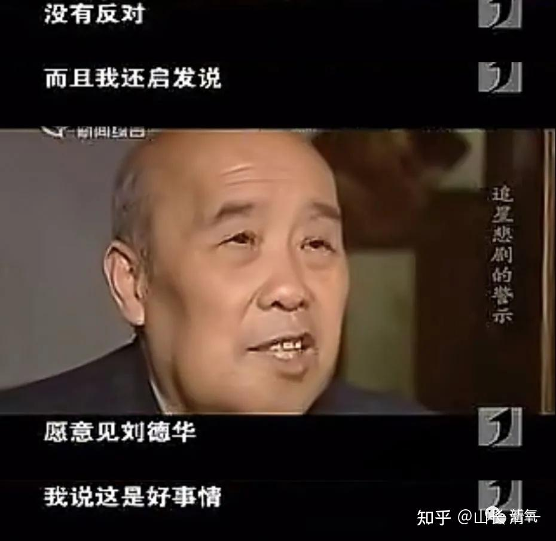
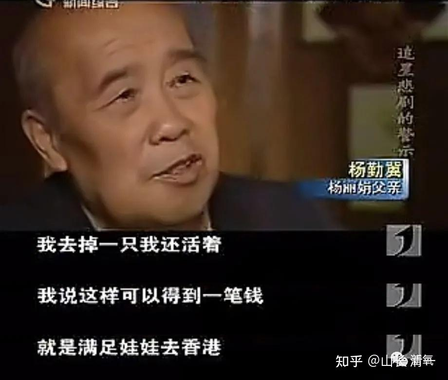
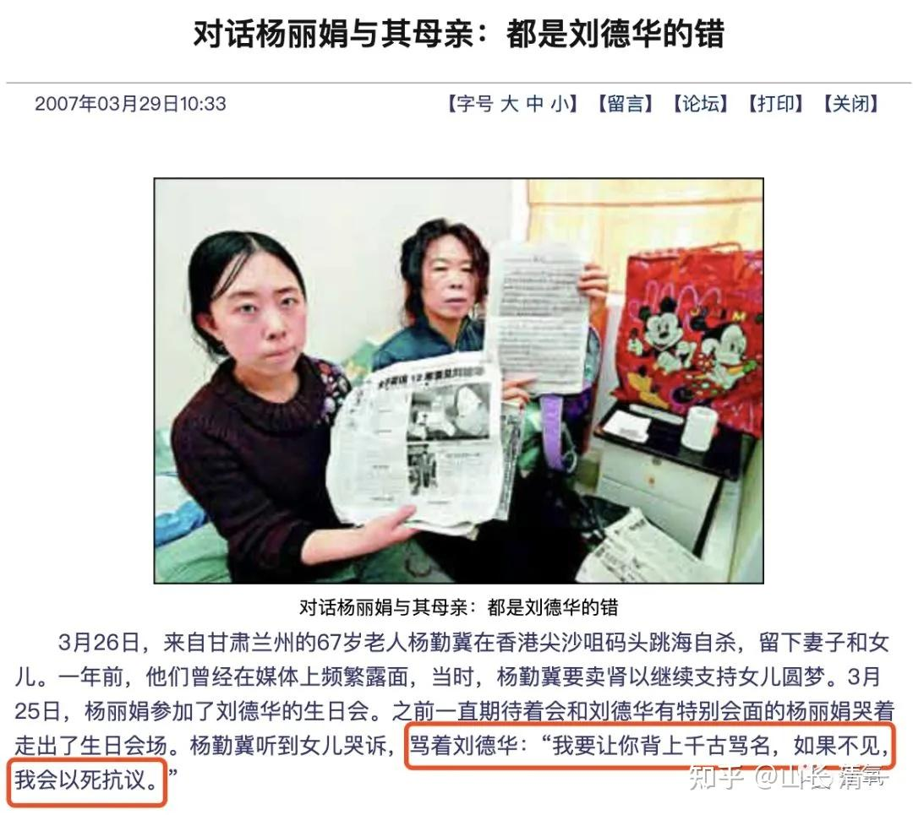
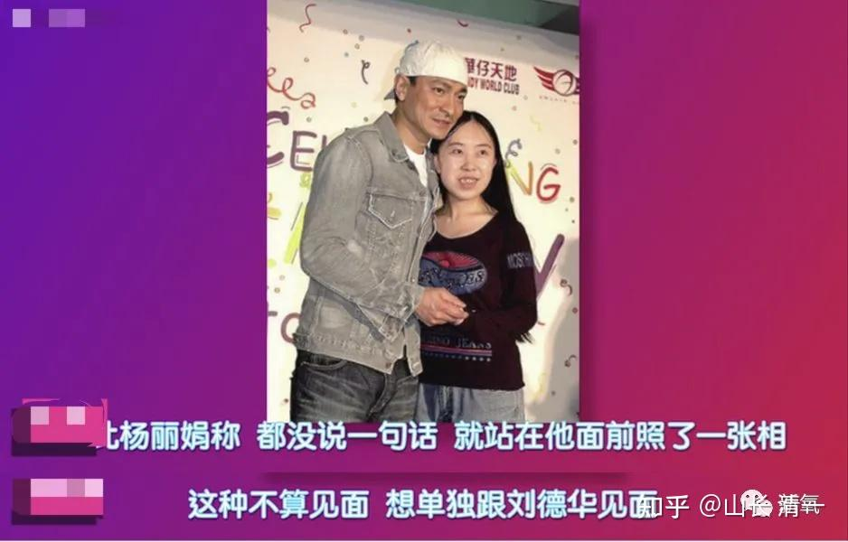

** 今日三语学校，拥有超高的教育成功率。**

**1：学术成绩上，可以让50-60%的学生，SAT（美国高考）取得超过1500分的成绩，这在世界范围内只有1%的优等生才能实现这档成绩，已是常春藤的入学成绩要求。这项教育指标比较，今日三校是世界第一！**

**2：学业效率上，今日三校可以让学生，只需3-4年，就把传统体制学校12年的课程内容全部学完！这项教育指标，今日三校是世界唯一！**

**3：跨学科综合教育上，今日三校可以让学霸变身运动员，仅需训练三年，就可以走上全国格斗锦标赛，击败从小训练的职业运动员，拿到前三名的奖牌。这项教育指标，应该也是世界唯一！**

** 三项教育指标加起来，培养文武合一，中西合一的高素质综合人才的水平，让学生年仅18岁，就在三语专业和武术专业上，达到和超过专业大学生的毕业水准。这些大学专业的终点站，却只是我们学生上世界顶尖大学的起点。可以说----今日三语学校已经创造了世界教育界的新纪录！**全世界任何其他学校均望尘莫及。即使是新教育的外围学堂，一直在努力跟随学习和模仿，但教学效果也远远地落在后面。2024年考入冠军班的正式生中，只有一名是外围学堂的学生，而且还超龄了，是我特批入学的。其他正式生，全是今日三校自己培养的15岁毕业生。

** 这些硬实力，毫无疑问证明了今日三语的教育水准！这种级别的学校，放在全世界任何地方，都是极其珍贵的教育资源，是花钱，花关系都买不来的宝贵的稀缺资源。美国最顶尖的私立中学，居然要学生刚出生就预约申请入学才能排上队，只有非富即贵的家庭才有希望入学，往往比常春藤的入学要求更难，特别拼爹！但在中国，我们这所已经超越了美国顶尖私校的水平，也依然有一些家长根本就不懂得珍惜！**

美国最顶尖的某名牌高中，因考入藤校人数最多而驰名！学业要求极其严格。但学生也因为压力过大，最多有一年，就有6个学生卧轨自杀（学校附近正好有火车道）。即使有“死亡威胁”，但因为学习成绩实在太好，家长们依然趋之若鹜。但这所顶尖私校的学生平均成绩，以及优等生的培养比例，还拼不过我们作为外国人的今日三语学校。而我们的学生，相比之下，学习要轻松快乐得多，课外活动也更多！ 这已经是不可思议的教育成绩了！

实现上面展示的，不可思议的教育成果，我们依赖的并不是学生的“智商”。毕竟让50-60%的学生，都能取得1%的顶尖成绩，肯定不是靠智商的原因。我们是用了真正提高学生能力的教育方法！我们认为---智商不是学习成功的最重要因素。相反---**拥有愿意努力学习的决心和毅力的学生，再加上良好的教育方法，才是取得优秀成绩的核心要素！**

因此，我们的教师最关心的任务，就是**去发现这些愿意努力超越自己的人，选出来，我们来帮助他们获得学业的卓越和成功！**

但大多数家长的想法，往往与我们相反。**家长们往往更关心孩子的吃喝玩乐，更像是养猪一样养孩子，根本不在乎孩子的未来。**学生如果考入了我们学校，学习了一个学期，放假回家家长就赶快“养猪”，让孩子回家“乐不思蜀”。开学的时候孩子当然就会表示：猪窝里面呆着真的很舒服，我现在不想去上学了。然后还找出种种貌似有理的借口，来为自己退学找理由，甚至还会编排一下学校的种种“不好”，“不适应”，“不喜欢”的地方。但肯定不会老实承认说---我就是贪图享受，喜欢猪窝里面被父母豢养的幸福生活！

家长于是----就非常关爱地把孩子接回家了！完全不考虑这样放纵不懂事的孩子。可能导致的严重后果！

家长不知道——今日三校选进来入学的确不容易，但轻易退学，后果也很严重！此举很容易让整个家庭开启走入炼狱的路径！

** 一：光环效应，让孩子在今日三语上学后，退学回家后，更难以适应体制学校的教学环境**。别忘了今日三语的教学效率，是50-60倍优于传统的应试教育的。加上培养周期更短，其实整体的学习效率大概百倍于普通学校。小孩子回去之后，一方面瞧不起普通体制教育的低效学习模式，以及更加无趣的学习内容。另外一方面，这些学生也不如体制的优秀学生更勤奋，更努力（因为我们的退学生，肯定不是三校最优秀，最努力的好学生），因此即使转学去了普通学校，最终未必能够取得良好的学业成绩！这就让这些孩子心态更崩了！

**二：虚荣心会让孩子青春期出现严重问题！**这种孩子退学的核心原因，往往是两个：一个是贪图享乐生活，恋家不思进取。**另外一种原因，就是排名靠后，无法接受自己不如别人。**因此想要通过退学来逃避压力。或者同时具有这两个原因。退学回家后，一旦不能取得光环效应，如果发现自己还是不如一些同伴，就会陷入标新立异，到处找感觉的模式而不能自拔！甚至造成彻底的学业和人生的失败！

家长在这种情况下，往往不会反思自己的教育原则和方法的错误。往往会归因于“今日学堂把自己好好的孩子教坏了”。因此家长也会变成清黑。把自己对孩子教育失败的沮丧和怒气发泄在攻击我们身上。家长去当清黑的模式攻击贬低甚至编造谎言。用这种方式来维持家长内心的平衡！

可惜---今日三语一直在用越来越好的成绩，和学生良好的状态回答这些清黑家庭的攻击。我们在争议中不断快速成长，甚至我们在清黑环境中更加努力精进，目前教学效果从学生的成绩和表现来看，已经是全世界第一了。清黑家长继续黑的话，也只能黑自己的了！

这里就有一个令人痛心的案例！

五年前，一个小女孩得到了我特批的全奖入学机会，她与小明慧同龄，当年才11岁。她在原来的班级是第一名，各方面表现良好，倒不是她特别聪明。主要是因为她入读今日之前，就用我们的方法在家长的辅导下学习了外语，而她的同学入学的时候没有学外语。因此当年她在班级上显得很突出，成绩是当时她班级的第一名。第二个学期，她就被特批进入了被选出来的正式生班。后来我又让她进了全校选拔的最优秀学生汇聚的公主班（就是现在清迈小女上的这个班，去年年底公主们拿到了很多的奖牌）。可以说：她一开始，就站在了三语学校最高级的班级，拥有最好的学业前途和发展的空间！因为这是我为自己女儿创建的班级，肯定是我最关心，最支持，资源给于最多的班级。

可是，才学了一年多，她在12岁的时候就非要退学。她的理由很搞笑：就是说：当时的公主班学生第三语言是学泰语（因为计划来要来泰国的），她认为泰语太LOW了，没档次。她要学法语，因为将来她要去法国当外交官。而要去当外交官，就要考中国的外交学院。因此就要参加国内的高考。因此她坚决要退学，回家读书去，不肯在公主班继续学习了。其实班主任和同学都很喜欢她，认为她各方面虽然不是最优秀，也是很不错的学生，都劝说她多次。说她的想法不太现实。但-----偏偏家长却愿意“理解和支持”她的决定。我们说啥，自然都不起作用，当然就只有让她回去了！

其实我知道真实的原因。深层上，是这个孩子发现：班级开始学泰语之后，她的成绩就比不过别人。运动等项目也比不过别人。毕竟公主班的学生都很强悍。当然，她倒也不是最差的，只是中等水平。公主班都是来自全国的家庭，而且是全校内选出来的优等生，当然学生普遍都很聪明，很厉害。她能够排名中等，也算不错了，甚至排名靠后，也算是很优秀的学生。小女的排名，就常常是中等甚至还会有点靠后的。甚至有一次还排名班级倒数前三名，被要求出去流浪24小时不能回校！但小女一直很喜欢这个班。反而对我说：谢谢爸爸给她的这个班，因为同学们都很优秀，她很喜欢这些小伙伴！如果小女的妄心大，想要在班上什么都当第一名，她就真的要自己进入“比较心地狱”了。我都没信心在这样的班处处当第一的！公主班谁也做不到综合素质全面第一。但如果你心态好一点，愿意与优等生们当朋友，伙伴们互相珍惜，一起进步，这里其实就是天堂。因为我们鼓励h合作共进！

但显然，这孩子是看不得别人的好，她只要自己好才算数。体制学校的教育，基本上是宣传“一分压千人”，他人就是地狱。可我们这里不是这样的，更强调伙伴共进的关系。她显然受到体制教育的影响很深！这种深层思维价值观，我们短期内是无法改变的！

离开就离开了，我们也没多想。因为这是我们的尊重！也是我们的自尊---你看不起我们就算了，我们自己还要看得起自己。其实我还认为：这孩子在我们这里学了一年多，英语应该很强，自信心也很强，应该回到体制，学习成绩也差不到哪去！我们的退学生，回体制当学霸的也不少（当然，放纵堕落的学生也不少。毕竟林子大了，什么鸟都有——）

过了几年，因为我们认识这个家长。我和小女回国后，家长希望我们帮助去引导一下她们的孩子（还是独生女）。才知道这孩子回体制后，一直过得并不顺利。她除了外语好之外，数学和理科的成绩都极差，偏科很严重！要参加高考就很难取得好成绩。其实我认为这倒不奇怪，因为这孩子心高气傲，又超级的爱面子，很喜欢逃避困难。因此她一旦发现自己不能超越别人的学科，就会放弃，假装这么学科是自己不喜欢，不想学的。因此她的科目，会强者可能越强，一旦遇到学习困难，就会成绩崩塌。倒不一定是她的学习能力和智商不行，女生就真的学不了数理科。而是心态上的排斥导致的成绩巨差！因为她的智商只是正常吧，还谈不上超常，不是有一些不努力，随便学学也能取得好成绩的天才学生！

再次见到这孩子的这一年，孩子已经15岁了， 班级排名靠后，考高中都比较困难（国内的高中入学率大约是50-60%）。她也知道这一点，她告诉父母她要去读艺校（不是要去当外交官的吗？现在改了？要去当演员了？）。把她父母急死了！知道这条路就是死路一条！才来找我帮忙劝诫她的。让她不要去读艺术学校！所以，我就与小女明慧，原来一起玩的小伙伴一起，去见过这孩子一面。没想到我没教训她，还反而被她教训一顿，说我们的今日学校，除了外语好，别的科目也不咋行。她回到体制学校后，才知道体制内的学生人才辈出，啥天才都有。今日的学生，就是喜欢自嗨。自以为自己了不起！

我知道青春期的孩子，就是逆反。我也不跟她对抗，就承认的确今日也有局限，也不是全才。老师也不是都好，也有一些老师是不合格的。她看我还算谦虚，就放过我了！说今日也还是有一些优点的，比如我们用表演的方式来学习外语，别人就赶不上。她就是因为上过今日的表演课，所以回体制学校后，父母报了校外培训的兴趣班，她在表演培训班上是第一名，别的同学怎么努力也赶不上，老师特别喜欢她。说她很有天赋。因此她认为自己有当演员的潜能，因此她要去上艺校，要考北京艺术学院！将来要去演音乐剧！当演员。说她知道我们学堂，对于“学艺术”的一直有偏见，今日的学生都不让学艺术，所以她不想听我的劝告。

我只能告诉她：我不反对艺术，甚至我喜欢艺术。我只是反对我的女儿去学艺术罢了。因为我认为我女儿不是啥天才，而艺术特别吃天赋，特别拼运气。她学艺术，再努力也未必成功。不像学我教的东西，只要愿意努力，基本上都能成功。而且女儿要去学艺术，我也帮不上她啥忙，因为我没有艺术圈子的资源，这个圈子还特别吃人脉，不是靠本事就能上位的。

另外---我还特别强调：普通人家的女生，学艺术的结果往往特别惨，几乎必然要遭遇各种潜规则。成功之后，几乎就是权贵们的地下情人。我还把早期的影后刘晓庆，当年就是因为不接受某人的潜规则，结果被贪官（后被查处）找个理由（偷税漏税）弄进监狱去了。因此，我认为普通人家的小孩，真的不要去学艺术。水太深了。但这孩子坚持认为：这些情况，她都知道。但她相信，她就是能走出一条路来！因为她就是不一样的人！爷爷奶奶也表示支持孙女，认为她很有想法。

后来，我私下对她的父母说：这孩子天赋资质其实都一般般，做啥都不太可能出大彩的。想要什么都做到顶尖和可能性不大，不服气也不行。自己很累，还可能过得很失败！父亲其实很认同这一点， 认为她只是中等资质，只能当普通人。家长也没指望她有多大的出息，只希望她一切正常就好！

我继续分析：她考高考，要想跟其他人拼成绩，这条路你们看到已经失败了。学业成绩上也只能上最普通的大学。对她来说，拼理工科肯定是不行的，她最好的路，其实就是靠自己的外语能力，三语能力，去东南亚国家读个一流大学，这其实也不难，费用也不高。毕业后靠三语能力，在海外找个体面一点的工作，做点事情，其实也不卷。

相反：在国内她这种中等资质的孩子，加上偏科，基本上不太可能获取大的成功。甚至勉强上个一般大学，出来找工作都找不到的！因此，家长要引导她务实一些，不要去做艺术梦。她就是因为表演看起来比周围的人强一点，以为就是自己最厉害了。其实真去了北京（未必考得取），可能才发现：比她表演天赋好的人，实在太多了！但能出名的演员，有实在太少了（其实很多做演员梦的小女孩，在北京往往卖身度日，活在最底层）。家长也认同这个观点，认为她要去学艺术发展，基本上不会成功！还是希望她务实一点学点实在的东西！

该说的我都说了，我也是问心无愧。后来我就走了！但一年多以后，今年我还没有回国，家长就私下联系我，问我啥时回国，想找我聊聊。我猜肯定问题更严重了！去年年底，我带公主班回国比赛，赛后就回老家，去见了一下这个家长。两夫妻是一起来见我的，一脸的忧虑。果然被这个16岁多不到17岁的孩子，把家长都快逼疯了！这一年多来，她的学业更失败，成绩更差，脾气也更大，想法更无厘头了。她想要正常的通过考试，考上北艺完全就没希望。但孩子依然死心不改，还是坚持要做演员。甚至想要自己跑去做北漂，做外围。父亲不让还跟父亲吵架。我猜是不是要去做横店的群演啥的？以为有轻易出名的机会？

关键是：家长现在已经完全对她失去控制力了。平时女孩回家后，也根本不理人，锁在自己屋里不出来。跟家长动不动就发脾气，还很会嘲笑家长，可以把家长气的说不出话来！家长问我现在有啥办法?

我说：当初，她12岁要退学的时候，你只要说一句话就够了，就说：**这所学校，是我作为能够找到的最好的学校，能够让普通人都能考出优等生的成绩来。如果你自己要离开父母为她选择的学校，其他学校肯定还不如这所学校更懂教育，未来她就更不可能取得学业的成功。因此，家长将来只能不管她了，自己想去哪就去哪。既然她不尊重父母，不服从父母的安排，你就不认这个女儿，以后就不见她了！就当没有这个女儿了，彼此两清！**

这时候，她才12岁，翅膀还不硬。你这样威胁她，她会很有压力的。就会收心，老老实实留在学堂跟著学。起码有个收留她的地方。她老老实实的跟个两三年，到了15岁，已经学出来了成绩，也更有自信，更有理性了。16岁左右，就不会胡闹了。做什么决定，家长尊重她，也就没事了！就像现在的公主班学生，家长都很开心，也很放手。孩子们会自己假期去海底捞打工锻炼自己，回去打冠军证明自己。都不会出啥幺蛾子！因为更理性，更成熟了！

但现在你女儿这个样子，特别固执要去当演员。目前已经是油盐不进，好歹不分！甚至是几乎有点疯狂了。现在我们说啥都没用。你们现在剩下的也只有一条路可以走了：就是尊重她，彼此都放手，彼此相忘于江湖。你们老两口，今后肯定也靠不住这孩子了。将来也只能互相珍惜，互相照顾，过好自己的日子就够了。至于孩子，就别去跟她斗智斗勇的，还伤感情。她不听，不如就放手，将来成龙成凤，还是成虫，你们都随她去。真的管不了啦！

** 各位，你认为这个家长，是不是才过了几年（五年），就已经生活在炼狱中了？**明知孩子在一步一步的走进深渊，但自己却毫无力量去改变。这种绝望我能理解，但我也帮不上忙，只能让她自生自灭了！总比一家人“相濡以沬”， 一同疯狂赴死更好吧？

父母爱女心切，但也不要与女儿一同自毁！我告诫父母，我们当然要尊重女儿，但也要尊重自己。为了女儿的疯狂愿望，妄想，父母就动用自己的一切资源，牺牲自己的一切去“帮助女儿”，其实是完全失去了理性的表现！父母也有尊严，也有捍卫自己理性和选择的权利。这才能培养心智健全人格的孩子！否则只能是培养疯子！

正好有个正面的故事：现在的冠军班，有个学生在他13岁的时候，非要跟家长说，要退学回家去踢足球，想当足球明星，因为这是他的理想。家长就跟他说，要等他15岁，考过SAT1400分了，家长就支持他，让他去踢足球。如果现在13岁就要去踢足球，或者没有考到1400分，想要去踢足球，家长就不认他这个儿子了，就让他自己自生自灭去！他一看不对劲，就只能老老实实的考SAT，结果现在考上了冠军班。我问他现在还要去踢足球不？他不好意思，说不踢了，很不现实。不如打格斗锦标赛，去拿冠军更现实！这就是明智的家长，成功引导年幼无知的疯孩子，最终取得正常良好的结果！反过来，这孩子其实非常感恩父母，当年没有支持他去踢足球。否则现在肯定一地鸡毛！

但愚蠢的家长，在中国似乎太多了。结果不良的故事，比好结果的故事多太多了！一个最典型的案例，就是：多年以前，一个还是当高级教师的父亲，为了支持16岁的女儿一时兴起的妄心，要去追星刘德华，就拿出了全部的积蓄，还卖了房子，让女儿“实现梦想”。（2005年，杨丽娟的父亲一度决定卖肾筹款，支援女儿去香港追星。结果让女儿去了刘德华的歌友会，见到了刘德华！但刘德华没有答应“单独私会”她女儿，为了给女儿争取机会，父亲跳海自杀。死前留下遗书，谴责刘德华不见他女儿。想用自己的死亡，给孩子创造最后的机会！）

上面这个故事，是很多年以前的故事了，很多家长应该都知道，显然：这是一个悲剧。

**但这个悲剧的起点，就是16岁之前家庭教育的失败。**这个家长，从小根本就没有去教孩子责任和荣誉，更没有教她自尊和自强，不教她追求理想和志气，只是一味的跟著感觉走。

我们理解他中年得女珍惜过度，一味的娇惯，穷家养娇儿（富人家往往也会更娇惯孩子）。但从来没有考虑为孩子谋求长远！所以，孩子才会在16岁的时候，出现这种奇怪的局面----居然要求辍学去追星。居然家长还表示“支持”，家长真的疯了！

就算教育不良好，到了16岁这一年，其实这个家长还是有最后的挽回余地。比如像我教上面这个家长的-----既然孩子大了，管不了啦，就只能随她去。这孩子其实16岁毫无经济能力，没钱啥事都干不了，最多疯狂一段时间，要么乖乖的回来继续读书上学，要么去工作，找个职业，然后就基本算是正常人了。

但这个家长，居然还拿出全部的资源来支持孩子的妄想和疯狂！家长认为为孩子付出一切就是好父亲，甚至家长还卖掉房子，拿钱给孩子追星。最后看孩子失望，因为没有与刘德华独处的机会而哭泣。甚至家长要付出性命想要换取女儿与刘德华单独见面的机会】，家长都这么疯，女儿当然不疯也不行了。因此，这女儿此后走上这条路，与这个【大爱无疆】的父亲，其实有非常直接的关联！

其实在父亲死后，失去了支持自己疯狂行为的金主，杨丽娟还真的慢慢成了一个正常人。现在在一个超市当导购员，一个月拿2000元的工资，与母亲在一起过着一个普通人的生活。**我相信：16岁这年，如果父亲根本不支持她，她应该很快就能恢复正常的生活了。因此--这个悲剧的导演，其实并不是女儿，而是父母！**

说实话，现在的小孩子并不难教。最难的是父母，愚蠢而且固执。因此今日入学，一定要考父母。甚至将来会出台政策：未通过家长营面试的家庭，我们根本就不录取！要一个一个的过家长。避免浪费我们宝贵的教育资源给疯子家庭！也避免清黑继续出现！

我不知道我今年教家长的【自尊尊人】，上面的家长能否做到，但家长如果就是做不到自尊尊人，就是要【自毁毁人】。要跟随孩子一起去心灵流浪，纠缠到死的话，我也只能随缘了！叹息，但我无能为力！

写这篇文章，是我叹息这种故事，依然在不断出现，今年开学后，果然出现了我们预料的，每年都会出现的案例：孩子突然退学，要回家“过更好的日子”！

清迈的小公主班，是圈内人人羡慕的班级，但----今年第一个学期，寒假过后，依然出现了学生不想返校。要退学的案例！

这个班的教学实录，各位可以通过这个微信公主号看到，这是每周的解学情况总结！

[【公主学堂·突破班】第20周 周报](http://link.zhihu.com/?target=https%3A//mp.weixin.qq.com/s/zOlFBz6bQp0Nv6opNM3rnw)

寒假结束之后，一个小公主班的学生，与上面的我说要大公主班学生，当年要退学去学艺术的这个故事非常的相像。这个孩子，今年也是12岁不到，她说她的梦想是【要当导演】，估计是回家看了【哪吒2】，受到了饺子导演的激励，想要做饺子第二了！她认为：今日学堂现在的班级，都是要考大学的，她认为读大学没有意义。不想去读大学。所以她要退学回家，在家自学当导演，学画画等等，以后要去拍电影！

带班教师就劝她：理想需要一步一步的走，当饺子这样的导演，是亿万分之一的卓越精英。她需要先战胜自己，先成为班级的前列，然后15岁成为1%的优等生，18岁战胜更多的同龄人，成为千分之一的精英。然后再继续努力，去上电影学院，读个导演专业啥的，再去做职业导演。可孩子表示：她已经想好了。她不需要去读大学，照样当导演。因为----饺子就是自学成才的！

带班教觉得孩子的想法太奇怪了，就与家长沟通。但家长的最终回复是觉得：“孩子的理想也不错，家长会理解和支持孩子”。因此-----我们只能放手了！希望将来，不要出现公主班原来出现的---几年后让该家庭一步一步走向炼狱故事！

另外一个小公主班（公主塾突破班）的退学故事，就更加狗血了！ 由于这孩子的排名靠后，加上年龄偏大一些，13岁左右，已经有青春期迹象了！其实这就是最危险，最需要学堂帮助调整度过青春期的时候。本来，这种情况，家长最应该做的事情。就是严格要求孩子专心学习，锻炼，尽快的出成绩。考SAT。跟上班级，用学业目标强化来冲淡青春期的躁动。考出了成绩，将来怎么也差不了。特别是将来这个班，肯定是很优秀的（我认为会超过现在的公主班）。将来她女儿与这些注定是全球级的优等生为伍的校友，也是她一生的资源和礼物！

但这个家长却这样来教她女儿：说她现在在班上的排名也不高，恐怕也学不出来，还浪费学费。还不如退学算了，家长就可以把学费留给她，将来嫁人买嫁妆给她更好。正好这孩子的年龄有点偏大，也有点青春期的想法了（成绩不太好，就是因为不太专心的缘故）。她就想：这倒是一个好主意。因此给她的老师说，要退学回家，准备拿嫁妆去了。她说：反正她自己也不像其他同学一样，她就是不想当精英，认为自己做个普通人就好！

这一些家长，真的是很善于给【给孩子削弱能力的帮助】。我都觉得太搞笑了。你们这些家长们到底在怎样教孩子呢？你们想要孩子去到何方呢？做个普通人？恐怕做个普通人都难。

这些狗血的家庭退学理由的故事，弄到当带班教师的小尤公主很头大，很自责，认为自己带班没有教好孩子。她跟我说为啥会这样？她很喜欢这些孩子，一直在沟通交流。但看着她们一副油盐不进的样子，觉得很受挫折。我告诉她：不要勉强，道不远人，有缘者得。这些家庭，内心深处其实不尊重学堂。不想当精英也就罢了，甚至不想当精英的朋友，我们根本就不是一路人，何必陪她们玩？让她今年暑假的时候，对新生认真选材。不要因为认为孩子当时的表现还不错，就选进来当学生了。因为长期发展来看，家长才是教育成功的关键！

所以---压力现在是给到了暑期选拔营的家长了！家长考核，只会越来越严格的！大家都自尊尊人，家长如果只是把我们学堂当游戏打卡的地方，我们也觉得太不受尊重了！

家长们想去炼狱打卡和游玩，我们不反对。但很抱歉，我们就不陪你这样瞎玩了！我们最好提前说好各自要去的地方，你们不想要精英，就不要跑来选择精英教育。选择你们自己的家庭教育就好！双方都别互相纠缠！