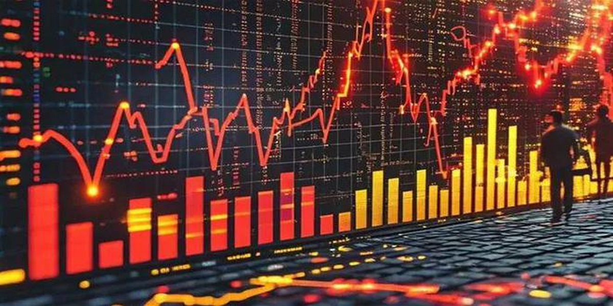

109篇.国庆长假后第一天A股是否开盘就是收盘？

清一山长 2024年10月7日

明天A股，大概率很多股票都是开盘就是收盘吧？港股这几天一直在涨。

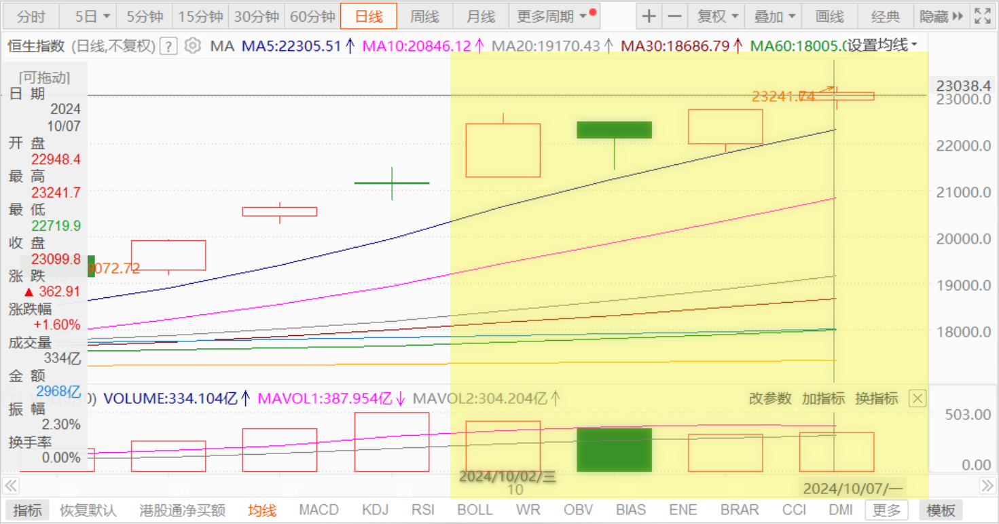

今天几大建的涨幅都超过10%，中铁从底部已经上涨快60%了。

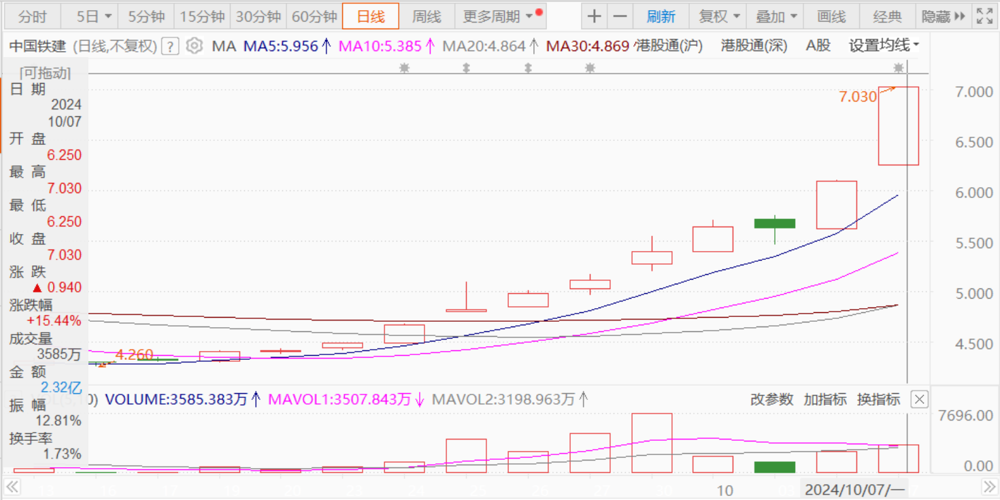

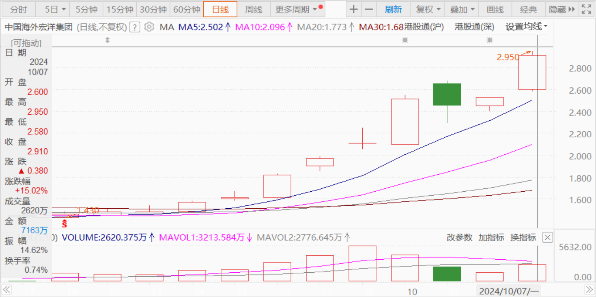

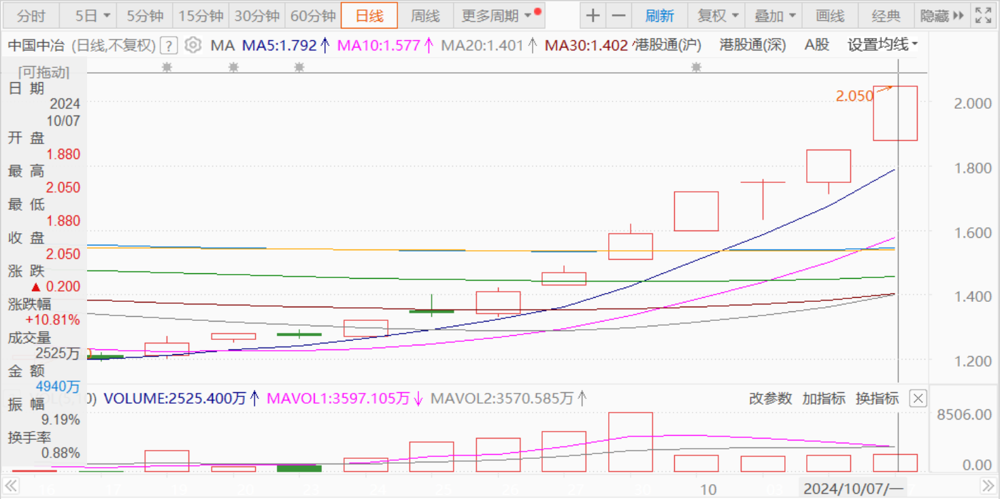

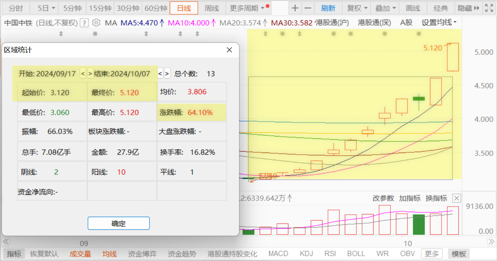

一些港股的价格已经反超A股了。华融等金融股涨幅更为巨大。

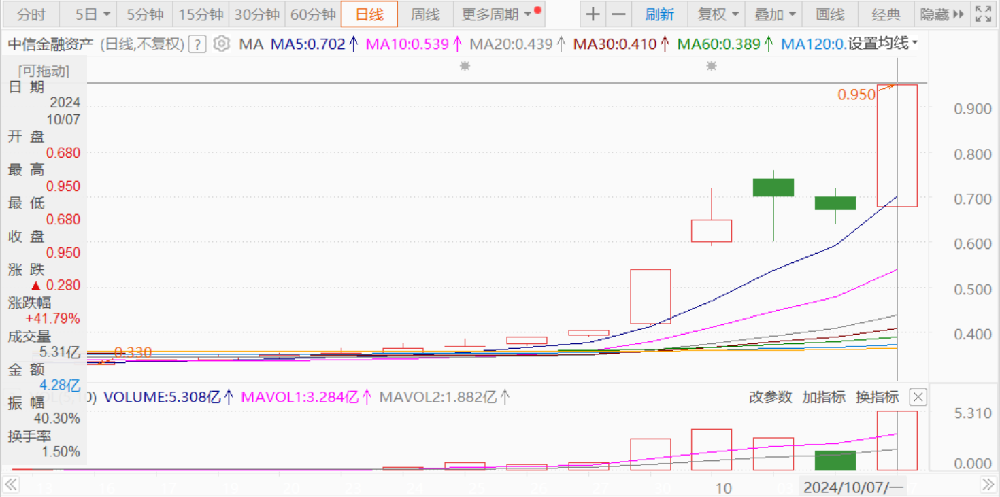

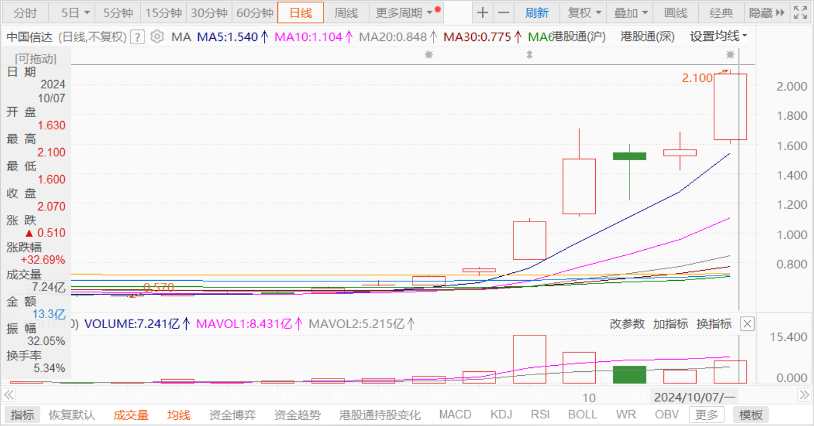

保险股也涨幅巨大，我原来买入的人保，居然都创新高了，不可思议。

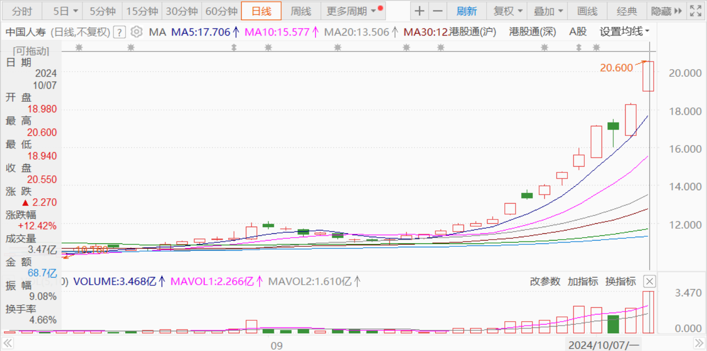

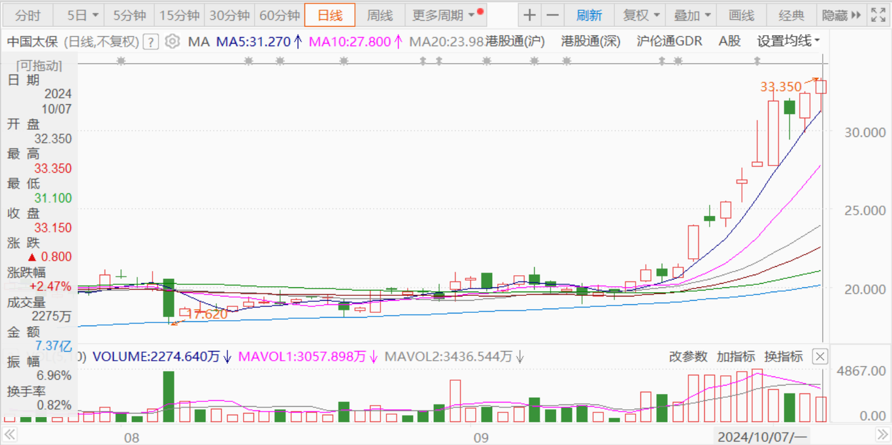

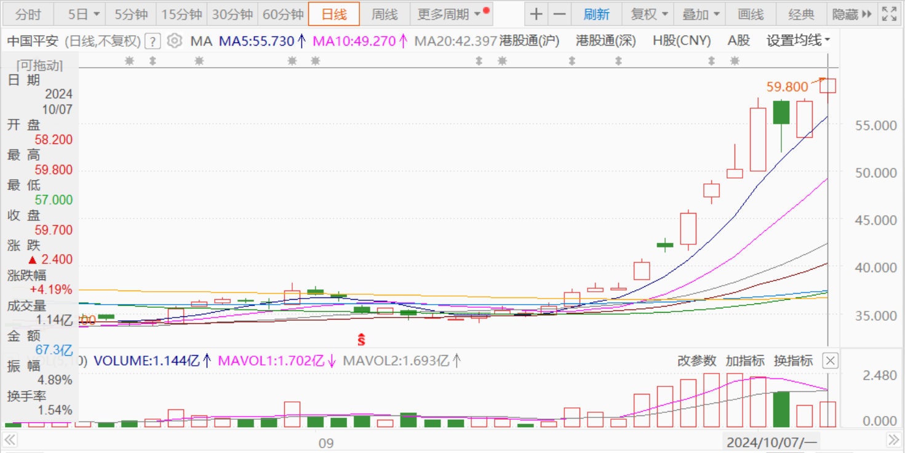

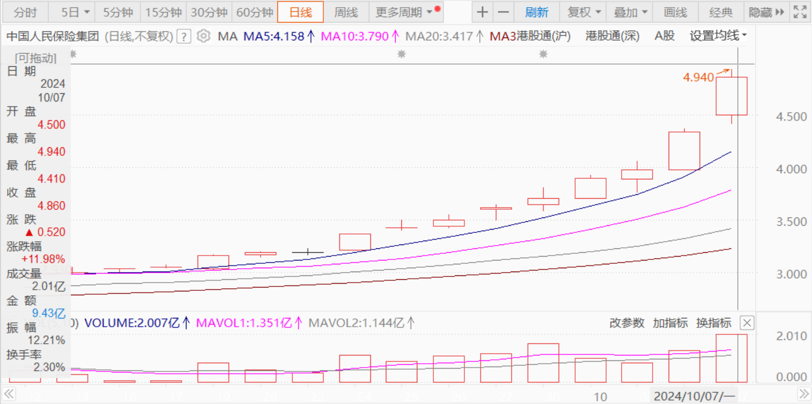

**这种外围强势买单的示范之下，明天多数股票应该都是涨停开盘直到收盘，大幅跳空上涨成为必然。**应该创造我30年入市以来的“活久见”大幅上涨纪录，也必然创造我账户上的最大单日盈利新记录（肯定会刷新9月30日的记录）。这肯定是一个值得纪念的日子！

这么多年（2018年以来），我一直在等这一天。也一直在想：**中美金融对决会怎样开展？我怎么都想不到会是这种大幅反转的样子。我很庆幸我坚持了看多中国，买入中国，低位的时候满仓满融。现在满满的仓位，不用担心踏空，只关心怎样兑现。**

看行情这么好，我居然生了一点小贪心——**不太想明天涨停就大量出货，还融资也不急于这一时。A股的子弹，让它多飞一会**——我还是计划把港股通里面一些涨幅较大的股票卖掉部分，或者换换股，把质地不够好，涨幅也过大的股票，也拿来换一些市场不看好的股吧！或者观望一下也行。

不管怎么说，感谢市场给了我一个还融资的资金，不然，每年背负上千万利息也还是有点负担的。还掉融资之后，将来就是老老实实地持股吃息，不再看市场涨跌了！所以——**投机股换红利股是必然。降利息的背后，长期稳健的利息股我认为会是可以拿10年以上的股票。**原来在9月30日，**我卖出燕京的同时，也买了一些当时没涨的水电股**，就是计划长期吃利息的，高负债的水电股，降息背景下是利好它们的，是傻瓜都能经营的正现金流企业，长期持有很好。

但我怀疑：我已经失去这个机会了。明天没机会继续买入这种优质水电股，明天——注定啥破股都会涨停的！这就是牛市给价投带来的困扰——拿着钱都不知道该买啥？**熊市价投的困扰就是好股票太多了，手上没钱，所以我大量借钱买股，不惜背负巨额的利息也要买买买。**我的行为，恰好与现在的股民相反。现在我看很多韭菜，没钱上杠杆都要来买股票，甚至卖房子来买股票，还什么股都敢买！真佩服他们，他们的心态好！

（标题、图片为编者所加）

**文章音频**：

[494篇.国庆长假后第一天A股是否开盘就是收盘？](http://link.zhihu.com/?target=https%3A//www.ximalaya.com/sound/768093846)

**参考链接：**

[100篇.股市不景气，但一股没少](https://zhuanlan.zhihu.com/p/722064096)

[101篇.珠江合理、惠泉低估、燕京未来可期](https://zhuanlan.zhihu.com/p/846471968)

[102篇.股票大涨，平掉一些融资仓位](https://zhuanlan.zhihu.com/p/987269048)

[103篇.仓位管理的奥秘：燕京浮盈已回到2023年3月高峰！（配图版）](https://zhuanlan.zhihu.com/p/991766711)

[104篇.股票意外上涨，中建涨幅居前](https://zhuanlan.zhihu.com/p/2114948739)

[105篇.青岛涨停，重庆、燕京封单少](https://zhuanlan.zhihu.com/p/2115518194)

[106篇.2700多点居然有人敢大肆做空](https://zhuanlan.zhihu.com/p/2117255489)

[107篇.用高价卖出的燕京换9元多的中糖](https://zhuanlan.zhihu.com/p/2118297575)

[108篇.节后港股分析：昨天抢筹行情、今天日内调整](https://zhuanlan.zhihu.com/p/2118297575)