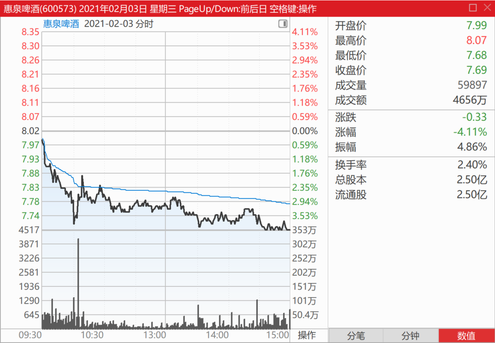
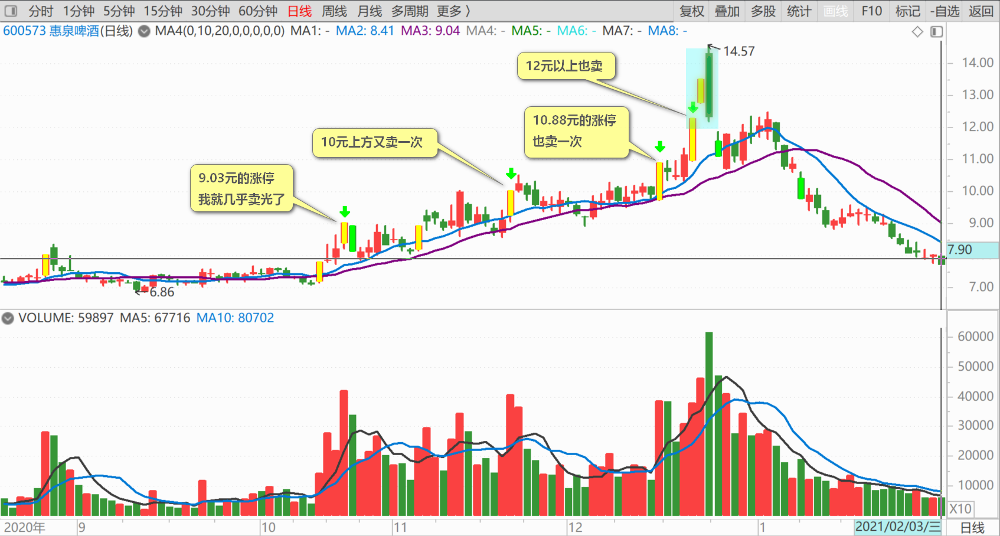
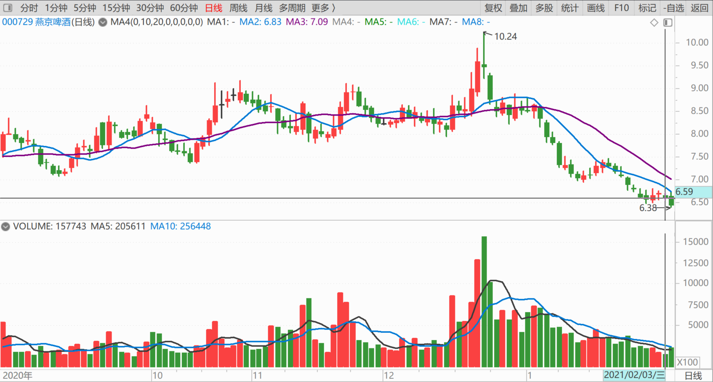
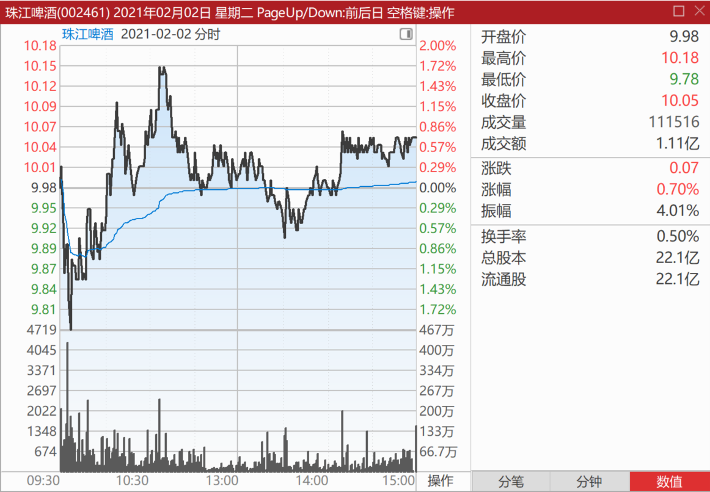
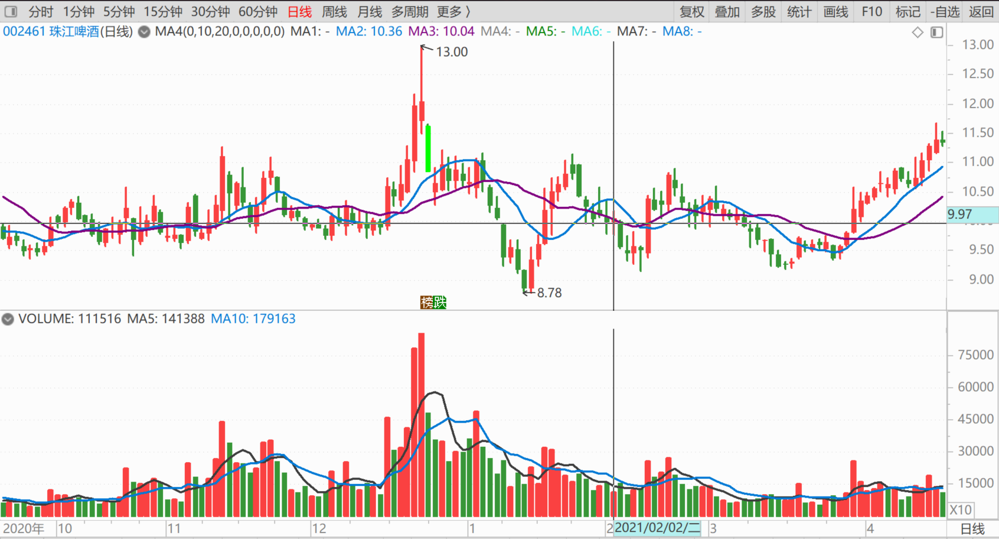
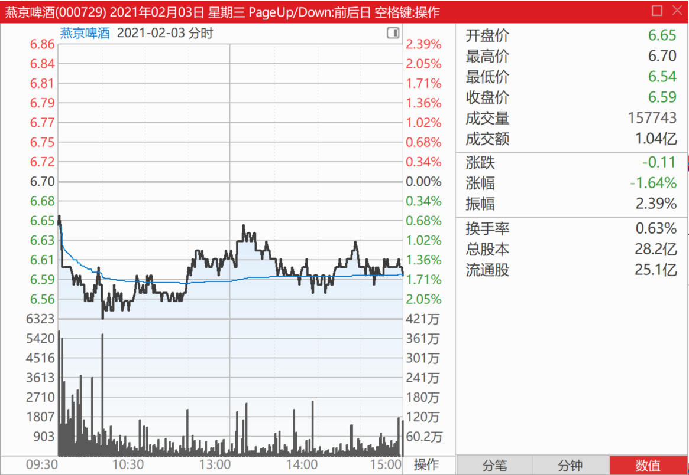

99篇.避免涨停动作，消极以待

清一山长2021年2月3日

$惠泉啤酒(SH600573)$ 今天7.73元，最低7.71元，再度买进惠泉啤酒，仓位补到2.2M了。计划慢慢的继续补，有钱就加一点。

实话实说：现在补仓惠泉，应该不如补仓燕京更明智。因为我看到的是：**惠泉啤酒最近半年，是明显的拉升出货走法**，跌到现在，说明主力已经基本上出完货了，获利应该在一倍左右，大约拔走了3亿元韭菜。现在跌回来，虽然已经到了可以再度吸入再做一波的空间，但主力手上的筹码是严重不够的。所**以需要的底部盘整，吸筹的时间会很长，震荡会很多**。不排除进一步下探制造恐慌震仓的可能。所以，时间上，应该会磨叽得比燕京更久，空间也有进一步下降的可能性。现价买入，不是很明智。**对我来说，还没有补到去年三季度的仓位，所以就不计较这些了**。就当一直持有没卖出过好了（9.03元的涨停我就几乎卖光了，10元上方又卖一次，10.88元的涨停也卖一次，12元以上也卖，一路卖卖卖的。现在一路重新买买买，逐步恢复原位，也是应该的，目前持仓成本1.94元）

但**燕京就不一样，没有拉升出货的动作，只是借势出货，甚至燕京刻意的避免了涨停动作，一直消极以待**（这个动作，让我燕京就没有舍得大出，是我操作上的一大败笔，如果燕京玩涨停，我会出掉不少的，我有见涨停就跑的习惯）。所以，燕京现价，应该基本跌透了，跌破5元的可能性并不大。不过，我说的这些都不算，市场先生说的才算！

当然，保守的，无法接受下跌的股民，建议还是去买中国建筑、江苏银行等。买了睡觉去，不要来天天看盘费精神。我如果已经没钱可以动用了，我也不看盘的。现在还腾挪了一点钱出来，是昨天10元以上卖掉珠江的，腾出了100多万元资金。

永耕明a回复清一山长跟评上贴：

请教山长老师，为什么要卖珠江？不是说珠江控盘很好，很有前景吗？

清一山长回复永耕明a：

我这操作，**不叫“卖珠江”，叫做“换啤酒”**，好不好？把10元出头的珠江，换成6元出头的燕京啤酒，我以为从比价上算，更划算罢了。仅仅在一年多前，珠江价格是低于燕京的。现在反过来，珠江倒贴换燕京，不行吗？[俏皮]

我的期待**是换到更多的股票，不是赚到更多的钱。**

路在何方的傻猫回复清一山长跟评上贴：

老师，惠泉10元可以回本吗？

清一山长回复路在何方的傻猫：

我不知道。我不会预测股票涨跌的，没这本事。我10元多，也买了一些惠泉回来，都在手里没动呢！但我根本不关心是否回本这种问题，我只是买回我12元以上卖掉的部分罢了。现在买的，是我11元前后左右卖出的部分。要我**额外的加仓惠泉的话，安全护城河，应该是7元左右**。还看与其他啤酒的比价再决定取舍。反正——我不会根据会不会涨的判断，来买股的。也不会根据我判断会不会跌，来卖掉股份的。

andy闯股市回复清一山长跟评上贴：

说实话，你何必和一帮庸人分享你的操作呢，赚了就是自己牛逼，亏了就说你在收割韭菜，看他们的评论，我就为你不值。

清一山长回复andy闯股市：

谢谢关心[献花花]。我说话，是说给人听的。至于狗，本性就是要叫的，你说不说，对不对，它都要叫。何必理狗！只跟人玩就行了[赞成]

清一山长2021-02-03 14:49:11

$燕京啤酒(SZ000729)$ 今天的燕京啤酒买入价是6.59元，记录一下。

(标题、图片为编者所加)

文章音频：

[538篇.避免涨停动作，消极以待](http://link.zhihu.com/?target=https%3A//www.ximalaya.com/sound/809203368)

**参考链接：**

[91篇.如何看进出时机？](https://zhuanlan.zhihu.com/p/16488305045)

[92篇.珠江投资的反省总结](https://zhuanlan.zhihu.com/p/17164493123)

[93篇.揭开燕京的奥秘](https://zhuanlan.zhihu.com/p/18185937465)

[94篇.短期来说珠江和惠泉的趋势良好，股性更活](https://zhuanlan.zhihu.com/p/1960281323)

[95篇.燕京的经营很稳健](https://zhuanlan.zhihu.com/p/20722962985)

[96篇.啤酒的人均持股](https://zhuanlan.zhihu.com/p/21559367964)

[97篇.借燕京看粉转黑有多快](https://zhuanlan.zhihu.com/p/23176487676)

[98篇.我比唐建华还要保守](https://zhuanlan.zhihu.com/p/23175736428)