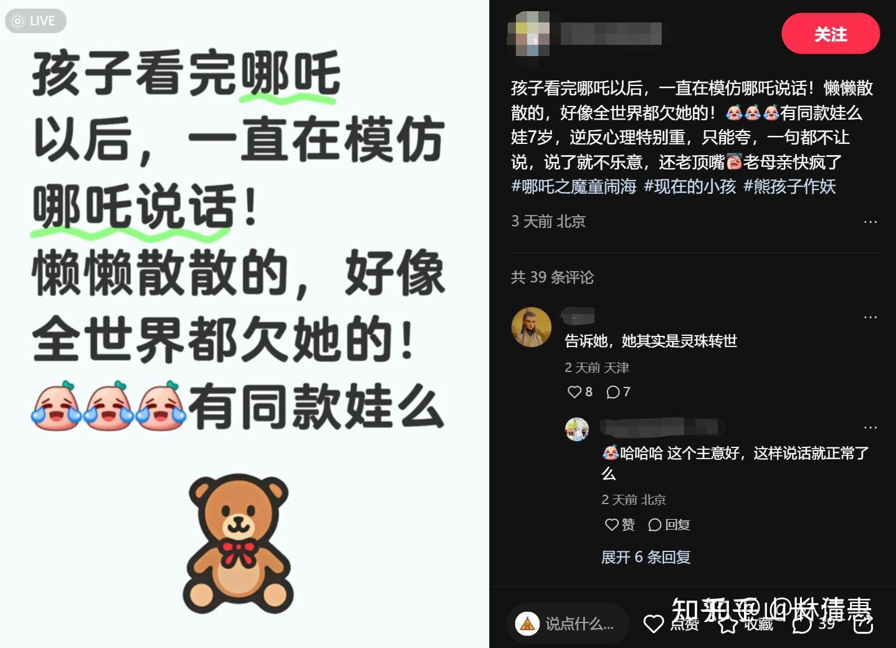

昨天，在陪小女去看云南革命历史馆的时候，看到了有很多优秀的追求理想的人，被捕，被杀的记录。我党在1921年一路走过来，革命志士真的是生命和鲜血来捍卫自己追求和理想的。所以，我告诉小女，不要认为你有理想，你是为了大众，为了民族的大义而奋斗努力，你是在做好事，别人就会支持你。相反，很多人可能因此还要来杀你。不平庸，就意味着你必然面对强大的压力---无论有人拥护你，还是反对你，都会给你带来很大的压力！甚至生命的压力！就像当年的革命党人一样。（拥护你的人，你要给他们想要的东西。不然就会黑化。反对你的人，无论你做什么他们都要找理由来攻击你，因此都是压力）

然后，我就问小女----你看展览馆里面，这些烈士们被抓，被杀的大量的故事，你认为是谁出卖了他们呢？谁才是他们最危险的敌人？

她很敏感，马上说应该是内部的人！我说是的，就是这些烈士身边的“伙伴”。外面的人，其实并不了解他们，很难对他们造成真正的伤害。真正对这些烈士造成最大危害的，其实是他们身边虚伪的“伙伴”，伪装革命的投机分子，勾结敌人一起，才能给这些烈士造成致命的打击！这些人，就像现在的贪官一样，当年加入革命，并不是为了造福人民。嘴巴上说是追求共产主义的理想，实际上是想要更多的功名利禄和好处。所以，一旦外面有一点点诱惑，就会为了利益而出卖自己的伙伴。所以，我要小明慧：一定要学会识别人，要当心身边的心机茶，当心身边的人来出卖你！

她说：怎么认出这些人，才是出卖伙伴的坏人呢？能否通过看过去未来，来防止这种事情给我们造成危害呢？

我说：如果我们只是相信她们说话，她们都会说的很好听的。甚至你只是看她们行动，她们都会做的很漂亮的，甚至会超过一般的学生。因为心机茶们，肯定都比一般人聪明，也比一般人更会动脑子，玩心眼。更会装乖讨巧的！我们会忍不住去相信她们，以及信任她们！我们也有人性的弱点，我们相信什么，就以为别人也一样！我们相信善良，就相信别人也是善良的！

小女不甘心：但总有办法鉴别吧？

**我说唯一的办法，就是看她平时的生活中是否自私，是否贪婪，还有是否诚实守信。**有信用的人，说过的话就会兑现。但有人总是出尔反尔，违反自己的诺言，还总是有理由，借口还特别的多，事情永远是别人不对。这种人，基本上就可以判定为心机茶了！

贪婪之人，只要能够得到一点私人的好处，甚至是自以为会得到一点好处（其实可能是坏处），甚至就会出卖自己的亲人伙伴。如某茶，当年还是十四岁学生的时候，我提醒她，说她母亲是小市民，思想观点做法都有一些问题，格局境界都很小。要她注意别去跟母亲精神共振，会影响她的进步和成长！结果她马上就说：她要跟母亲断绝母女关系。我大惊，说只是提醒她不要去跟母亲寻找情感共振，不要去认同母亲的低俗思想和行为。因为一个市井气十足的母亲，会让她无法成为精英人才。但并不需要两人断绝关系，尊重他人想法，做好自己即可。何况母女关系岂是说断就断的？

但此事在我心里就对她留下了阴影：不清楚她当时是真心还是假意，是否故意迎合我说这种话。她是否真的不认同母亲（其实我观察她跟母亲的共振一直很强）！但无论她是怎么想的，此女绝对是个心狠手辣的人。她居然会说出这种话，绝对是个冷漠无情之人。如果她居然表达会对自己的母亲下手，什么人她不能下手呢？只要挡了她的路，恐怕什么人她都要“干掉”了！（后来也果然发现，只要伙伴中谁比她表现更好，她就会把她当敌人。各种小手段去对付她人，很多同伴都吃过她的亏。）

当然，由此也能看出：此人的心机也有限，脑子其实不太好用。往往很急于表现自己，属于急功近利之徒，不是深谋远虑之辈，总有一天会让自己处于不利地位的。也因此疏远了此人！我就告诉小女这个过去好多年的故事！

其实，现在茶的所做所为，就跟当年她要跟妈“断绝关系”一样，是没脑子的行为。如果她真是高配版的心机茶：她就会到处打我的牌子去忽悠家长：“我是山长的优秀弟子和学生，从小得到山长亲自指导，得到了山长的教育真传，甚至是不传之秘，我一直衷心感恩山长教导，愿意把山长的教育方法，都贡献出来竭尽全力帮助家长们”。教好了，就算没有今日三校教的好，家长也自然会感恩不尽！万一做的不好，就说山长当年就是这样教的，所以装无辜，说自己继续努力学习改进，家长估计也没脾气。如果她这样玩，挂羊头卖狗肉，绝对财源滚滚。毕竟能够上今日的家长只是少数，这些大量上不了今日的家长都会去找她的。外围学堂招生都搞不过她的，家长们还以为得到了一个送上门的大宝贝。这样玩，我真是气死了还没脾气！

可惜她就是低配版的绿茶。只会自私加上自大，居然去贬低和攻击自己最不该攻击的对象！去故意和清一新教育唱对台戏，彰显自己的卓越之处，这真的是太高看自己的实力了！这就相当于要提起自己的头发来想要离开地球一样可笑！

小女就说：**刚才说的是自私之人，为了自己好处会六亲不认。没想到世界上还真有这样的人。不过---贪婪之人，我们怎样认出来呢？**

我说：贪婪之人其实比六亲不认之人更狡猾，更难辨别。比如熊妖就是贪婪之人。他表面上装的要比绿茶有面子多了。但骨子面他是为了金钱，也是个啥基本道德和原则都不认的人。认出这种更狡猾的人，的确难度更大。但可以通过一条，来防止这种人混进我们的队伍！-----就是看他们是否贪图吃喝玩乐。贪图享乐之人，虽然这些人在我们面前会表现清廉，装的很淡薄物质的样子。但他们私下里面的生活方式，她真爱的东西，才是真正能够体现他们内心世界的。因此，要看这些人真正关心的是什么！所以，你跟任何人相处，都要看她们是否对身外之物“贪婪”。烟酒之徒，好吃，好玩，好名好色之徒，本质上就是靠不住的！这些人都不是啥有理想的人！

还要就是“自私之人”！凡是只想到自己，自私自利，一切都只想到自己，不顾及伙伴之人，就要设置防火墙！我让小女暑假选公主班学生的时候，也要特别注意这些人。看出她们的“贪婪之处”在什么地方！尽量只选真有理想和志气的人，这种人才能打冠军，将来才能为国争光！才能成为社会的有用之才！

当年记得对明一班，对公主班，我都说过，新教育未来会改变世界，大家都会成为历史人物，会被记录进历史书籍的。

没想到：现在有些人，居然成了类似我党发展历史上的“反派人物”了。这种身份，就是她们自己选定的！不知道她们想到我说的事情，会想什么？

我永远想到要为历史负责。下面 这些记录，也是历史的一页。我们就保留在这里，以正视听吧！不然以后我死了，还不知道心机绿茶们，会编出怎样的故事来呢！就像当年的叛徒，让他表述过去的时候，居然成为了伟大的革命战士！

以下就是我记录的历史资料。供未来的有缘人参考。

很难想象： 家长们难道都很喜欢自家拥有这种孩子，超级宝贝吗？你喜欢没啥的，但我们肯定不会喜欢的。我们承认自己 真的没本事教这种孩子。似乎心机茶的学堂，就是喜欢这种人，你们就送去吧。连这种人都收，不知道是本领通天，拿着金刚钻，不怕没材料呢？还是金钱导向，赚钱第一？只要家长交钱，就啥都没问题？

【山长，不清楚发生了什么事，但是群里有些发言，让我心里有些堵。

您是群主，您的德行、威望对大家有非常大的影响，但如果因为您的否定之词，大家都这样的表忠心，群还是您想要的新教育理性、文明的场所吗？】

这是说的啥话？“大家都这样表忠心？”。你这是啥意思？是说大家都是奴才，在巴结讨好我吗？只有你才是独立和清醒的君子吗？

你说我们的群里不文明，不理性。真这样认为，你自己退群走路不就行了？没人拦着你的。如果你就是要拿这话堵我的嘴巴？你不如让你“为此堵心的”某些人，先收拾好她自己的嘴巴再说。

我骂她心机茶，你认为我过分了吗？干嘛你不去看她做事有多过分？骂她茶是最轻的了！

2016年的清黑事件，就是这茶带班弄出来的事件。当年的群黑事件源头就是她。让明二班的学生走了一半，前几名优等生也走了。最终是我出来背锅，替她挡下了子弹！她在后面装无辜，装清纯。

明二班带班失败之后，今日还把小西语班交给她。结果她信誓旦旦的“要捍卫自己的荣誉”，但最终结果，是她带出了今日历史上的状态最差班级。甚至家长都很不满意，一次就有七个学生退学离开去上国际高中去了！也创了今日建校的最丢脸的记录！因为此茶当年带班，根本就不负责任，心思花花的玩感情，玩内斗，玩心机。造成了学堂教师的种种矛盾！

当年带西语班的失败，钱莉赵刚就很生气，认为她就是烂泥扶不上墙。不断给学堂惹事，让钱校赵校不断帮她收拾后路，帮她挡枪。但凡她有一点点感恩之心，都不至于做出后面更令人不齿的事情来！

她当初信誓旦旦的说：哪里跌到了，就要哪里爬起来，因此今日再度给她一个新班来带；给她机会证明自己的实力。毕竟她很聪明，真想做事，是能做好的。但为了防止再次带班失败，因此今日也留了一点心，把新生分了两个班，新教师郭指导与她同带这一级的班。彼此有个对照，避免自说自话。绿茶的学生整体素质更高一些，因为很多家长还是更信任她，由此选择学生上她更有优势。但她仅仅只带了一个学期之后，放寒假回家，快开学的时候突然就甩班不带，以身体不好为由要“回家养病”。弄到赵刚校长气死。因为很难给家长一个交代。当初她的班级，就是家长挑她带班，选的都是优秀学生。突然辞职，怎么交代给家长？

真实原因，应该是这个年级的两个班的互相pk，郭指导所带的班级比她的带班学生更有优势。因此她怕失败，就寒假回家后突然提出要请假休养身体（养成了个大胖子——）。后又要辞职！招呼都没有跟我打一个！但我们没有对外公开这些她不断带班失败的事情。就是给她一个面子，让她出去之后办学，也可以顺利开展！创新开始来证明自己！

但我们的好意，换来了什么？

绿茶开学堂后，就私下找她原来的学生，找她带班的家长，以她三寸不烂之舌，说得家长们纷纷转向，投入她新办的学堂，一次就弄走了6人！其他班她也在努力，只是成效不大，也有人去！

家长如果就是信任绿茶，我们也没啥好说的。家长选谁做自己孩子的老师，是家长的自由。认为她更好也没毛病。只要为自己的选择负责就行了！但我们的教师也要争气，就努力提高自己的教学水平就行了。但没多久，她带走的学生，就要离开她的学堂。因为对教学质量不满，说她根本就不管这些学生，学不到啥东西！

你说这人茶不茶？你把学生弄走了，你就好好教出来。免得你招不到好的学生，教不出来成绩来证明自己！你就弄走我们的今日招收来的优秀学生，拿去直接享受，教出至少不比我们差的成绩，你认为你更牛，就教出比我们更好的成绩，让家长来拥戴你。你就一炮打响名声，也算你是一个曹操一样的“乱世奸雄”了。我们虽然对此很生气，也不得不服你手段高强！

但这茶做了什么？她居然没做什么。你不是误人子弟吗？

我为啥骂人？就是直到不久以前，她还在找今日原来的学生“沟通交流”。忽悠学生去他们学堂。说今日两校的学习压力大，如果SAT考不好的话，可以去她的学堂上学，轻松愉快。

她如果自己有骨气，就自己拼本事，凭能力来招生，天天来今日忽悠学生，造成心理浮动，你是啥意思？

现在更好了，我们在教学生认真反思哪吒的形象，不要被娱乐界带歪了方向。她就出来装茶，装圣女，说要给学生无尽的爱，弄得自己好像更爱孩子一样。恐怕她只是更爱钱，更爱生源罢了。爱钱其实也没啥，君子爱财。取之有道！就老老实实的教学，带好学生，金钱自然滚滚而来。以她的聪明和能力应该不难！结果呢？她根本就不是用心去带好学生！而是到处忽悠人，口是心非，胡言乱语，只管忽悠家长来上学，但不管上学的结果！我不骂人，还等谁来骂？等家长将来骂我---居然教出这种害人的混蛋来吗？

做教师，本分就是应该好好带班，好好教学生。偏偏此茶心思不在教育上，特别喜欢到处弄各种八卦故事，还特别喜欢编造今日的各种“内幕消息”吸引家长！绿茶嘴里面，啥胡话都说得出来。刘老师去年为了照顾磨丁校区的需要坚持在磨丁顶了半年。我为了不影响清迈校区的练武，我们不得不两国分居半年多。在绿茶的嘴里面，传出来的“内部消息”，就是我和刘老师在闹矛盾，两人在争家产。刘老师在磨丁是为了争酒店资产。我们今日自己内部都闹翻了，各种抢财产的故事。直到有家长跑来磨丁，问我们是咋回事，才把我们都气笑了。当然她还有其他的故事，我就不多说了。给她留一点面子吧！

因此，你就别拿道德形象的大帽子来给我装了，让我忍。什么德行，什么威望，这都是屁话！我不是无量金仙，我不装高大上，我也不要什么形象，我民间草民一个，**我只要快意恩仇。我有恩报恩，有仇报仇！有话我就直说。**你如果看不上我的德行，就自己走路离开！我们各自坚持自己的真理，彼此相忘于江湖就好。总比在一起同床异梦更理性！

至于你说：【不管仙和魔如何斗，受苦的是陈塘关的百姓和万物。】——-你真是太抬举绿茶了，她也配跟我斗？她算什么？算仙还是魔？她根本就不配做一个教师！她做学堂的水平连我现在的学生都不如，有啥资格做我的对手？如果不比心机，只比教育结果，带班水平，她连我现在培养出来的年轻的新学生都比不过。你还把她抬举得“我要跟她斗”，似乎我在眼红她的光彩事业一样！你真是太高看她了，也太看不起我了！我的骨气就是：要说我不好，我发光亮瞎了你的眼睛来看我的光彩！

我为啥出来骂人？我就是看她装圣人，装模作样出来讲经论道。就是在借我原来白白送她给的名誉和身份，来对我们的新教育家长们指指点点的，乱讲她自己所谓的“教育心经”，完全就是误人子弟、跟我讲的基本教育原则就不是一回事。她就是在胡乱忽悠人，故意去迎合家长的心意，讲什么父母就应该给孩子无条件的爱。就算是哪吒这样胡闹的孩子，家长都要给于无尽的爱和宽容。还有她说太乙师父才是最好的师父，带徒弟就应该这样带等等，认为太乙是最值得学习的教师榜样等等，简直是胡说八道！我就是见不得这种人出来装模做样，误人子弟。

如果她不是打着我过去学生的名义，不是来装新教育的教师，她说啥，我也不会管的。她完全可以换个平台，换个身份，以全新的身份来自己打天下。现在打着我学生的名义，出来说跟我的教育理念完全相反的东西，这就是欺师灭祖！我不出来骂人，谁出来骂？我就是见不到这种人瞎忽悠人，才出来正本清源的。此举是为了保护一批没脑子糊涂蛋的新教育家长。这是我关爱孩子们未来的心意。居然被你说成是我们神仙打架？你受伤？

你不如说我们就是狗咬狗算好了！我们为了争夺你们家长手上的学费，地上的炒羊肉而来闹的。让你有成就感！

你真是不识好人心！

至于她自己的家长，只要不是我群里的人，你们相信什么教育理论，关我屁事！我在我的地盘上，对我的家长说话。又没去她的地盘上对她的家长说话，你来打啥抱不平呢？

至于其他不是我的家长，不信我的新教育的人，只是信她开创的绿茶新教育的人，你们就自求多福！你们自己的孩子，将来死活都找她负责去，你们也最好永远不要知道我是谁，别将来自己的教育失败了，来推锅新教育，怪我我没教育好你们！因为你们大路不去走，偏要去走小路，走了死路就别怪我！

你们这些家长，如果崇拜绿茶，想要跟绿茶学本事，你们就自己学去！只是就别在我这里装公正了。我们如果目标不一致，不是一路人，彼此各走各路，相忘于江湖最好！别混在这里背后搞小动作！还让我装彼此无事。

只要她别继续用我的新教育名义来忽悠人！忽悠家长，你们知道我们是两条路就行了。如果你们是太乙派的人，就去入你的太乙门。我没有意见。我有意见的，是你们来冒充正宗豹子门，干的却是偷偷摸摸的自己藏的私货。买私货也都没问题。只要你们不打我的名头，不去说啥新教育的是是非非，你们说啥，做啥，我都不在意，也管不着，只是别在我这里装圣母！

最后申明，我骂人心机茶的原因说清了。我就是看不得别人不好好做教育。骗人骗到新教育群里面了。当然，我不一定是对的，如果我错了，请用事实来证明我错了。不要在这里装圣人。几年之后，心机茶如果带出来的学生，超过了今日三校带出来的学生（直接比SAT成绩好了，比别的心机茶也不服气，总不能跟她比武术成绩吧？）。无论是平均分，最高分，还是优等生比例等等，只要她带班成绩赢过今日三校，我就公开为今天的事情，全网公开给她道歉！

我会自己骂我就是老糊涂。我就是有眼无珠，不识少年英才！我无德，也无能。我给所有被我误导的人都正式道歉！

你们也可以骂我，骂啥我都认了。谁让我今天乱发脾气呢？

绿茶带的班，两年后就要考SAT了。两年后，她拿得出成绩不？

要不给你们四年也行！

如果你拿不出来。活该我今天骂死你！

如果我的教师，明明是用心把孩子教的更好。但你非要去投靠绿茶的家长，两年四年后，你们孩子成绩出不出来，也活该我今天骂你们有眼无珠！不识好人心！

转 磨丁何：前几年，多位从我们学堂去今日的学生向我们反馈该老师的问题，比如被歧视，不公平，对学生没有爱心。出于对今日信任与维护，我们在孩子来反馈的时候，尽量劝说他们尊重和理解老师，也让家长理解老师，配合老师。现在回头看，一个对学生没有真正爱的老师，靠忽悠人是走不下去的，能力越强，祸害越大，对这样的老师，及早发现，及时处理是非常必要的。 [我前天在看“心机茶”公众号文章里面分享的，做好老师的基本要求就是不压抑学生。

就从压抑会增加内耗来说，我听着还觉得非常有道理。

为此我还认真看了他的关于哪吒2的影评，我看着也觉得好像有道理。

今天山长贴出艾拉公主分享的哪吒2影评，是非就非常清晰。]

【为啥叫她心机茶？就是她真的很聪明，很会说话。但永远不说真话，因为她就没真心！但你们的思维能力大多数不如她，被她忽悠很正常。因此在大是大非的问题上，我才不得不出来说话！因为你们真的太容易被骗了。哪吒的130个亿，不是因为画画精良，而是对中国人人心的把握到了极致。把角色设定做到了极致。绝对不是照搬古代的书本的（我是看过【封神榜】的，哪吒与父母的关系，是非常僵的，几乎就是敌人一样）。但饺子认为这个形象，对电影的推展不利。强行把哪吒父母改换成”慈父“的形象。又觉得还不够好，就加上慈母的完全包容的形象。父亲改成外冷内热的形象。这说明饺子把握人性真的是高手。他拉动了亿万中国人的G点。你们哪里能够对抗呢？但你们与心机茶不同。她不是糊涂，不是不理解，她是利用这个角色和形象来推广自己的学堂形象，就是要吸引这批认同哪吒父母的的糊涂蛋家长，把孩子送给她。因为正面拼成绩，拼声誉，她不是对手，所以拼这种弯路----其实是死路。当年很多投机取巧的学校，比如2016年撬走今日很多学生的华夏学宫。玩这套比心机茶更玩得滑溜。但几年后还是垮掉了。因为短期忽悠容易，时间一长。教不出成绩单，就彻底完蛋了。当然，她们会换个地方，换个名字继续骗人。但他们真的不是做教育，只是在做骗子！家长应对其实很简单----死认一个结果----谁的带班成绩更好，谁的学生精气神更好，而不是听她说什么！

**【做好老师的基本要求就是不压抑学生。就从压抑会增加内耗来说，我听着还觉得非常有道理。】**。这话当然对---但是------可笑的是，心机茶当年带班的小西语班，是今日最压抑的班级！-----这就是结果。公主班你们看起来好像压力最大，但公主班是最灿烂的，最不压抑的班级！冠军班来清迈的感受就是看到公主班的学生很享受学习和训练！比他们的心理精神状态更好。

合肥陈：偶尔会看到心机茶的小视频，发现她的身体逐渐变的臃肿，和之前她判若两人；

在今日是受山长培养，享受着新教育平台福利，应当心存感恩，想着如何报答教育之恩才对；

现在听她分享的内容，发现和她在今日名师会讲的是相反的，特别是哪吒2的分享，就是在扰乱人心，这样的人背叛师门，是叛变者，做教育会误人子弟。

日照迟：山长在群里公开的表态对我来说太及时、太必要了！我最近看了心机茶的哪吒文章，还点赞了。看到山长说出骂她的原因，心惊不已，赶紧取消点赞，取关，迷途知返，以免害人害己。感恩山长大爱指路

F敬东：谁的精气神更好。说实话，外面分学堂的人我很少关注，这次被逼的去看了看，一个中年油腻大妈的形象，我要是不是知道她是当年那个我非常喜欢的今日小老师，我的天，我一口老血喷到屏幕上。胖，代表控制不住自己的食欲，缺爱，这有什么问题，我天天就面对这样的念头。整体感觉就别说了。看前面风调雨顺，看后面大胖二十年。

李泉州：赞同！我就是看到她胖了那么多，就是油腻中年大妈形象，我就认为不对劲了，真正学习道家智慧的人一定不会是胖子。

冯：山长有一事不明，既然都说开了，山长能否继续开示[表情][表情]。虽然自己水平一般，但还是冒着风险去多看了两篇她的文章，如果不是有山长的讲解，我只是看不下去她的文章，感觉说不透？——反正看不下去，但是又觉得有些地方有点道理。再看下面的评论，第一位的竟是某蓝。昨晚还想某蓝只是蔫了，没干太出格的事，这真就不理解了？她们这是为什么？这就是山长有时候没说太破的，只重视思维能力的学习的结果？所以现在强调读与神对话，沉思录？

回复@1640 敬东 你说的这种事情，其实也不奇怪的。人性就是喜欢”物以类聚”的。一些人，离开了我们的团队，自己就会去找自己的伙伴，就会自己去“报团取暖”。如果不去”粉团“了，就会去”黑团“。独立人格的人，开创性的人，毕竟是少数。因为这些人，离开学堂之后，也感到自己与周围的凡人们格格不入。一方面她们看不起周围的低俗人群，一方面也不认同我们的理念。结果两方面都不讨好，往往夹在中间很难受。另外这些人，因为没有文凭。周围的人也会视她们为另类，也很难融进其他圈子。她们也不愿意放下身段去实实在在的工作，因为她们本质上就是一群更喜欢不够踏实，更喜欢玩聪明，喜欢投机取巧的人，而不是踏踏实实干活做事的人（因为光学文，不练武，往往就是这样结果）。因此她们出去之后，其实也很孤独，但又故作清高，就只能互相抱团取暖，互相安慰了。据我所知----心机茶自己专门建有一个“退出今日抱团取暖群”(她们的群名字我不知道，也不关心，这是我给取的名[表情]）。一些因为各种原因离开学堂的学生，都会被她拉到这个群里面一去共振，她们日常最喜欢的就是叽叽歪歪今日的各种八卦故事，各种小道消息。“自己人”一旦发了什么文章，自然她们就会最快时间看到并去点赞，评论！她们最盼望的，就是“现在已经过了好多年了。怎么还没有再来一次清黑事件呀？”。很想看看今日的笑话。对我们取得的成绩，过去同学的卓越表现，反而是各种的质疑和吹毛求疵，以此来平衡自己的失落！去年的熊黄闹妖，她们也很快乐地吃瓜了一阵子。她们还会尽量想各种办法扩大影响，会通过各种联系手段，掌握到原来的同学朋友的信息，如果这些还在我们圈内的人，有啥失落的时候，不如意的时候，情绪起伏了，她们就回去主动拉这些人入伙。比如武道馆的林佳慧，有段时间她的比赛状态很不好，被停赛，期间，她们就以为佳慧被"打入冷宫"了。就赶快热心地去拉她入群，说各种温言软语来安慰她，还会找各种理由来促使她早日离开学堂。比如说”学堂这个地方都没男生，找对象很困难，因此要早点离开学堂去大城市发展。免得耽误自己的人生等等“。完全不顾大城市其实剩女更多的事实。杨卓蓝本质上与心机茶不一样，她只是没啥志气，只是想过自己的小日子，因此出去后并没有给黑今日。她与心机茶抱团，也只是孤独之人的”取暖行为“罢了，其实她们两人，原来上学的时候是”政敌“的，心机茶花了很多精力来对杨，搞一些小手段。但现在因为两人都离开了学堂，就”同病相怜“，互相抱团喂养也很正常！杨应该是最想”追求幸福小女人生活“愿望的人，她的确一直想嫁人，也是因此离开武道馆，放弃【全国第一个太极冠军】的身份去当普通小女人的（她的武功悟性很好，我指点她也最多。如果当年留下来了，绝对是太极女子格斗第一人。要比现在的木兰们的光彩大得多）。但她回到大城市多年，听说也没嫁出去。原因就是她在圈子里面，因为我的缘故，很多优秀的男生家庭还是很看好她的。但她离开圈子之后，就失去了这种光环，外面的家庭，也没把她这个没文凭的人看得有多高。特别是男生的家长，更是看不起她的身份。她现在属于”没有娘家背景“的小女人，当然想要嫁入上档次的人家难度就很高！因此后来她高不着，低不就。差的人她也看不上。这个结果，恐怕她很难想象---原来要嫁人，像嫁的人家社会地位高一些，她也最好留在圈子里面！因为在这里，我是她们的”娘家“！她们因为我的关系才会有更高的社会地位。想但她们往往过于自负，以为离开我之后一样”光彩“，结果原来一些好家庭的男生看她们走后就不理她们了。就算是男生愿意，但男生的家长也会坚决反对的！这就是圈子平台的价值。可这群自私自利，眼里只有自己的人，怎么会懂得尊重他人，尊重她们的赖以生存的环境呢？她们就算是离开了今日，最好的方法依然是做清粉。借助我20多年来创造的生态环境可以过得更好，这才是正常人。原来一些离开学堂的教师，当正常人，结果家长和原来的同伴都很好，互相协同发展。但这些蠢货，就是要去当清黑，自然就与清粉圈的高能量隔离，自己想要发展起来就更困难了，更冷了。所以----这种心机茶们边在我们的锅里面吃饭，边往锅里面撒尿的行为----【哪吒式叛逆】，她们认为是看别人的笑话，自己很快乐。其实最终是自己看自己的笑话的！

其实，对于【退出今日--抱团取暖群】的这些前学生们，一方面我认为她们太浅薄，太自恋，太自私，自以为是还不争气。一方面我也同情她们的处境。由于教育背景过于超前，让她们与现在的社会还格格不入。这群人，一方面当不了精英，没担当，没理想，没荣誉了！但她们也不甘心做普通的凡人，夹在中间的确很难受。毕竟---这群小孩，11-12岁就在我这里教【资治通鉴】，会让她们更聪明，肯定瞧不起周围没啥文化的普通人！但也让这种德行修养就不太好的人，也不尊重周围的普通人，瞧不起周围的伙伴，也瞧不起普通的工作职位。这些”前学生“们，由于只学文，不练武，不做事，眼高手低，反而不如普通人踏实用功，反而成为社会的飘一代。原来，我认为从小去学高考应试内容毫无意义，是负资产，不如学这些更有价值的东西。所以我给我孩子安排都是有价值的经典内容。但现在，由于有这些”粉转黑“的家庭现象存在，我认为没必要提前让小孩们学这些古代的高级智慧课程。所以，现在公主班已经虽然快17岁了，也没有开始学【资治通鉴】等。我告诉她们要等22岁，上清一大学研究生了才需要学。现在她们要去学更重要的【考大学，读大学】的本领，起码拿到名牌大学的入门证。就让这些公主们，想要即使想要离开今日平台，也随时可以融入世界和社会的平台。只要她们有大学毕业证，就不会孤独地去抱团取暖做黑团员了！起码有自己的大学同学圈。所以，即使有一些家长找我抱怨，说现在新教育成为了”新应试教育体系“。让这些家长想直接读传统文化内容都不教了。甚至还有人污蔑我们”和体制学校，应试教育“也差不多了，不算真正的新教育了。但我依然要逼孩子们15岁去靠大学，18岁去读大学。说起来，也是拜这类【心机茶黑】所赐。我不再相信她们的”理想志气“，只相信她们也是【世俗之人】。既然人是世俗之人，就先学世俗的学问，做好世俗的事情。等世俗的人做好了，再来学超凡脱俗的本事。所以，冠军班的学生，现在想要申请留校学习，将来不去上大学，我就是不松口。说他们就算拿了全国冠军，也要去读大学，不能直接留下来做老师。虽然孩子们很失望，但---总比将来留下来也不好好干，反粉为黑更好，会让我更失望。现在去海外大学读书，将来大学毕业后，如果还是想来学习传统文化的学生，可能才是真心热爱传统文化的人。现在12岁就去读资治通鉴？实在是高抬这群人的理想志气了，我必须明白---大多数其实就是俗人，是跟我不一样的人。我不要指望她们都跟我一样纯粹！因此，以后家长们就叽叽歪歪的怪我，说我现在不教高级智慧课程了，不是我不想教。恐怕是某些人真不配学。只有实干家才配。将来，如果还有学生，就像是心机茶一样，虽然聪明伶俐。但学不好武术，打不了海底捞的工，不肯踏实做事，不尊师，不敬道，就别指望能够在我这里得到进一步的学习机会了！

---------------------------------------------------------------------------------------

新补充信息：

郑州陈姓家长： 当时我们两校转去磨丁的时候，我还是清一塾挑战班的班长，有家长问我说有人给她们打电话联系，说今日的几个孩子不去磨丁，看看我们班上是否讨论一下。我直接就拒绝讨论此事，说不要去参与这类游戏，我们班一起去磨丁，如果谁想离开去她那，是她们自己的选择，自己去承担后果，不要在班级里说这些事情。后来我们班没有家长上当，倒是比我们高一级的有一个家长退学去她那里了，这次在惠州听说非常痛恨这个绿茶，说耽误了孩子，很多家长纷纷要求退学，说只顾谈恋爱，根本不管教学，我们班的很多家长庆幸不已。但是绝对没想到不仅不感恩山长和刘老师的栽培之恩，反而倒打一耙。到时候就会真正应了：不敬师长，天诛地灭！

我的回复说明：

@1753Q陈 郑州家长 这种事情，你们家长既然知道了，早就该公开说出来了。我很早就听说这种事情了。我还知道这批被她拉走的家长，后来领头的家长私下跑来找郭指导（她溜走后，接替她带班的教师）说要请郭指导去办学堂，当校长。所有的学费都交给她，比她在今日的工资高几倍。说因为心机茶在学堂教学很不负责，她们后悔了，要郭指导去办学堂当校长去！她把学生都转到郭指导这里来。郭指导认为这个家长就是在侮辱她的人格！也在侮辱学堂（家长算的是小商贩的小账，以为带班老师就是学校的一切，把老师弄出来教学，自己剩了一半的学费，还得到了更加浓缩的小班教学。完全没有意识到平台的价值，伙伴的价值。更没有想到未来的发展空间和荣誉）。这家长居然拿郭指导当心机茶一路人了，所以郭指导很生气，根本就不理家长。郭指导的学生后来也来找她，说了他们实际上在心机茶这里的学习状况，就是混日子。刚开始没有压力，还很高兴，后来就都后悔了。所以我知道心机茶很早就失去了家长的人心，只是不知道她会不会改。

不过此女做事的做派，也完全出乎我的预料之外。我认为心机茶一直要从今日忽悠一批学生过去她的新办学堂右，除了能够收一笔学费外，更主要想要利用这批学生来打名头。毕竟今日的学生综合素质高。她重新招新生，肯定招不到类似今日的优秀学生。她第一批只要利用这场学生拿出好的成绩来，她的学堂就站稳脚跟了。外围其他学堂拼成绩骗不过她，她在外围虽然还是拼不赢今日，但在外围绝对独树一帜。11岁以上年龄段的学生会以她的学堂为首选择。 当时赵刚，钱莉还有负责的郭指导，都非常的生气，特别是当时这六个孩子过去她新开的学堂后，还得到心机茶的授意，常常过来拉郭指导的学生，让他们去心机茶的学堂上学去，说多自由，多快乐，比今日好多了！还侮辱过郭指导是新来的，根本不会教学等等。郭指导当时特别的生气。我还教她对应方式，就是引导学生和家长的目标，是怎样才能考上常春藤。而不是现在去快乐享受，以后受罪！然后我教郭指导，如果她很生气心机茶的所作所为，就要她认真带班，做出优良的成绩来，用成绩来打脸心机茶！郭指导也很争气，学生带的很好，家长也很满意！

现在今日三校的常春藤成绩，全国锦标赛的冠军成绩，全都出来了，外围学堂都在按照这个目标来教学。我以为她聪明一点就应该赶快跟上这股潮流，毕竟这个结果呈现出来后，马上就有大量的生源会涌来。因为很多家长是“不见兔子不洒鹰”的，一定要健真章。没想到绿茶居然还是死性不改，居然还是坚持以忽悠家长为主，不抓学生的教学质量（按道理她是知道如何教学的，只是认真的教学和带班，教师会很辛苦，需要负责任。如果打着“自由和爱”的名义，天天放纵学生，做啥都行，跟家长说这是"尊重孩子，给孩子充分的自由"，就是为了自己偷懒，而放纵孩子偷懒。这种行为，就是【误人子弟，男盗女娼】。2016年的清黑事件，当时作妖的就是华夏学宫。堂主就是这种玩法，用自由和爱的名义，以鼓励教育的名义，其实是放纵学生。学生喜欢玩什么都行，学不学都可以。堂主号称是张之洞的后人，是国学大师，让教师带着学生玩琴棋书画。还不要求结果。当然学生当然觉得好玩了！每天开开心心的，堂主和教师就是围着学生当服务员！我就对家长们说，说这个学堂就不是啥教育机构，只是一个高价的“疗养院”，“养老院”，说它根本就不懂教育，只懂忽悠！但有一些影视明星还为她站队，今日就有家长被该学堂吸引，说不喜欢今日的排名制度，让孩子有压力。当年据说政府还支持她们。他们也瞄准了我们的生源，2016年还吸引了不少今日家长退学去该学堂上学，当时清黑事件流失的生源主要就去了这个学堂！没想到也就是三四年后这所学堂就彻底完蛋了，这些孩子就全毁了。真心可惜。后来该学堂突然垮掉之后，家长们去找某外围学堂的堂主，说没脸回今日，想送孩子去他们哪里上学。但该学堂堂主真心被这些家长的疯狂吓坏了，都不敢收她们的学生，说连今日你们家长都瞧不上，华夏也不行。我们这个小学堂哪里敢收大神？后来不了了之！大概是家长们都送出国去了！

我只是我特别奇怪---这些都是历史教训，明明家长吃了亏，现在还这么蠢，还不断的冲上去。想用家长期待的躺平的方式培养出精英来，不就是妄想吗？

但是，过了半年多，我怎么也没有想到---我得到的消息，居然不是心机茶把心思用来哄家长，得到了学生和家长的拥戴。家长看中了学费打折，教师还“小班教学”收到特别的关注待遇，特别开心！心机茶得到了比在学堂当教师更多的收入，也非常惬意。反而是双输的结果！家长居然在吐槽心机茶不管教学，平时基本不去管这些被她忽悠过去的孩子，心机茶每天忙于谈恋爱，过日子，吃吃喝喝长肥肉。学生基本上见不到她！而且，居然她自己不去实际带班，只负责去做宣传，抛头露面的场合去忽悠家长，居然随便找个不入流的，其他学堂都不要的人来帮她带学生，这不是拿自己的前途和命运开玩笑吗？

在今日的时候，我们给她带班，一直都配有专职的助教，结果她把事情大量都丢给助教去做，赵刚和钱莉经常还要为她擦屁股。因为学堂的荣誉，其他伙伴们不得不集体合作，帮助她的班级事务避免出现教学事故。现在她自己来办学堂，自己大量的收钱，居然还是这幅游手好闲的德行，只是在家长面前装乖，表现的行为。过两三年不就暴雷了吗？居然-----你们吃了亏的家长都不吭气。就让她不断忽悠新家长去！真是断人慧命！

家长补充信息：@山长 清一 之所以没有反馈，是因为我咨询了当时在大理的好多清粉到底怎么回事儿，她不是说休假吗？还说紧张了这么多年，要好好调理一下，准备去南极探险三个月。这些清粉告诉我她不准备办学堂，只是成立一个家长研讨班，把自己的心得体会分享给大家，绝对不会招收学生，特别是从今日出来的孩子一个不会要。因为这些清粉都是我财富、清心 [@清一山长](http://www.zhihu.com/people/319ae4dd4851c822917320b9ca0eb98d)、慧心和江湖课的同学，所以我就没有再关注。只是过了几个月才得知她收的都是从今日忽悠过去的孩子，真是服了她的心眼太多了，叫她心机茶一点儿也不亏[表情]

**群发言：家长卢 东莞：@山长 清一 请教一下山长**，有个别今日家长认为出现清妖、绿茶等事件，是平台能量不好吸引而来的。我知道南怀谨老师能量很高，他也面临过类似的问题。但我暂时理不清个中缘由，望指教[表情]

**我的回复：@190623卢 东莞 **我挺同意这些“个别家长”的判断，她们很简单就看透了事情的本质，真的很优秀，家长显然是很聪明的人，明白事理，最能理解人。可能他们的孩子也教的很好吧？

我也请教一下您，我不太了解女人。但我发现：美女比普通的女子，更容易吸引来骚扰和强奸她的无耻流氓。我认为美女被这些流氓骚扰和强奸的原因，是因为这个女子身上有强烈的负能量，否则怎么可能吸引这些无耻下流的流氓呢？普通的女子负能量就很少，甚至丑陋的女子肯定没有负能量。因此，越美丽的女子，吸引的流氓骚扰越多，身上的负能量肯定就越强。您是女人，您肯定了解女人的事情。您认为，我说的这个道理对不对呢？

另外，原来的银行，负能量也是很强的，不然为啥这么多人想去抢银行呢？银行的安保都是一流的。不过---现在由于银行没钱了，都可以网络付账了，小偷强盗们不太想强银行了！所以现在的银行负能量比过去的银行负能量好多了，您说对吧？

**群发言：武汉家长陈，有些事憋在心里很久了，**一年多前我亲眼见证了此茶以及他的家人为了自办学堂是如何对其他人（我信任的朋友)背信弃义和过河拆桥的。整个事件大毁三观，只有电视上才可能出现的剧情，居然让我亲眼目睹了。

此事件曾一度让我陷入自我怀疑，她到底是不是新教育出来的？到底是不是我敬爱的山长培养出来的？我先生在大学就有幸跟着山长学习了，为什么她们一家人的呈现和我们心目中的新教育这么不一样？这种人也好意思打着山长的旗号出去办学堂？这不是打山长的脸，打新教育的脸吗？谁敢把孩子送给如此素质的人去教？先不说教学能力如何，首先人品这块就不过关。

万事万物都是有因果定律的，没想到短短一年时间就塌方了。原来此种做派不是偶然，而是惯用伎俩。虽然我不是上面事件的直接受害人，但看到这么多人深受其害，我必须站出来发声！说一套做一套就是此家庭的一贯做派，山长用“茶”来形容此人，所言真实不虚！

看到山长清理门户，看到山长说“对不起，请原谅”，打心里感受到山长的慈悲和担当。感恩山长还原真相，让更多不明真相的清粉免受其害！】

**回复 190729 陈 武汉：为何不把你亲眼目睹的事情写出来让大家知道呢？**虽然我了解这人家庭的一些特点，做出一个越轨，侵害别人的事的确很可能。但如果你不写事实出来，就是发表你的结论和感想的话，不就是像清黑们攻击我们的方法一样吗？拿不出可靠的，有逻辑的事实来，就是一昧的不喜欢。这样会容易让一些强调逻辑和理性的人，认为你是跟他们有私人仇恨！借题发挥。不如你把当时发生的事情写出来，让大家更多了解茶会怎样做事的！

**群发言：长沙侯晓燕**
深入接触过山长，就知道，山长是极其自尊尊人的人，也是超级慈悲的老师。

因为自尊，无论发生什么事情，山长只会反省自己，让自己变得更好，让今日变得更好，结果也证明了这一点。

因为尊人，山长尊重身边人做任何事情的权利，因为我们无法替别人背负什么，每个人只能，且本来就应该为自己的行为承担责任。

但很多人并没有学会新教育的这种核心价值观，反而借用山长的这个特点，自己做了不好的事情后，不愿承担责任，就推到山长身上。这就是在欺负山长，因此山长其实默默的背了太多的锅。

就像利用人的同情心来谋生计的乞丐一样，最终带来的，是大家强烈的反感。

利用山长的宽容和自尊，利用平台，诋毁山长的人当然会引起大家的公愤。

不说别的：

山长无偿资助十多年，学费和生活费全免。

山长亲自带，不知道多少个日子和机会，甚至比山长带自己的孩子都要多很多，是山长造就了其卓越的能力，口才，思辨等。

曾经都是籍籍无名的，因为新教育平台，因为山长的栽培，所以才有了流量。是整个平台拖起的。

其恋爱对象，也都是新教育出身，受益新教育的人。

山长的栽培，不是父母，却胜似父母。

滴水之恩，当涌泉相报。对这样一位给了自己能力，流量，未来，家庭……乃至一切的人，如果没有感恩，这真的是很遗憾的事情。

对于成就了自己的平台，不知道珍惜建设，反而消费索取败坏，是很痛心的事情

“名可名，非恒名”，是否是新教育人，不由经历和名份决定，而是由一个人的心念和行动体现出来。

饮水思源，如果一个人无法尊重新教育的源头——山长，当然不能被称为新教育人。

如果教出来的学生，没有在朝着新教育的核心指标靠近，自然也不能被称为新教育。

如果孩子没有变得越来越好，更不能称其为新教育。

我们每个人秉持这些原则的时候，自然可以去伪存真。

虽然新教育这盘菜是山长所创，但山长把它端出来与我们分享，这是山长的大度。我们喜欢这盘菜，自愿加入共建共享，也应有我们的自尊。那就是对破坏新教育的人说不。

新教育不是山长一个人的新教育，而是我们所有人的新教育。我们喜欢新教育，敬爱山长，捍卫师门最好的方式就是把山长的教导做出来，不让好人被欺负，不让老师寒心，也不让自己的良心受昧。

能够做山长的学生，实在是三生有幸！感恩山长 】