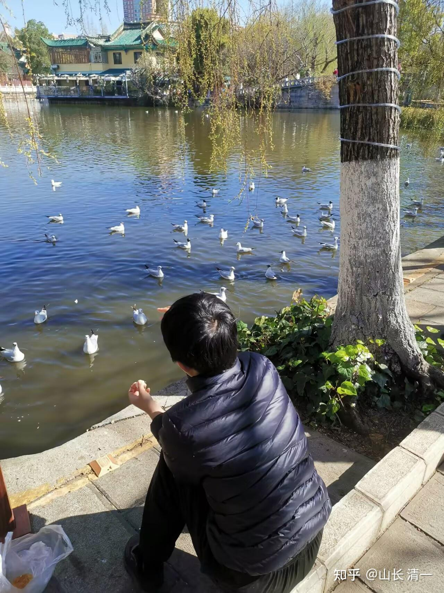
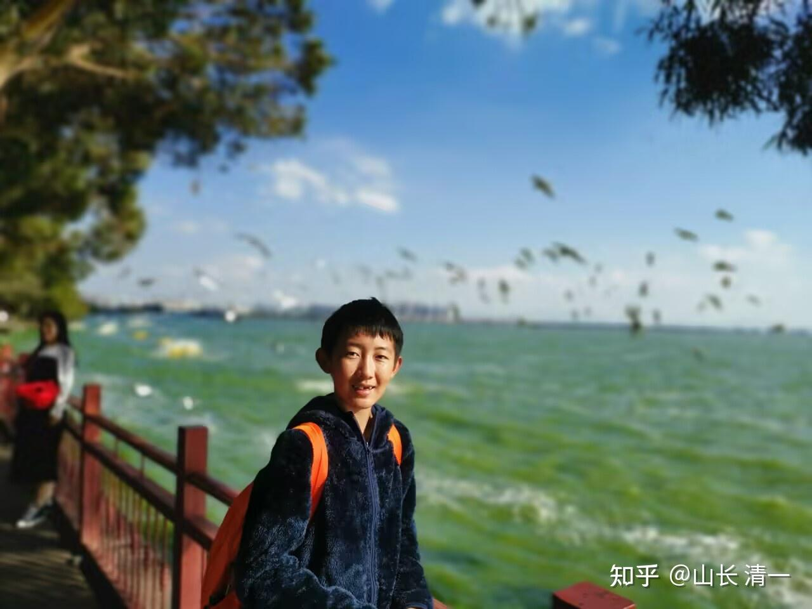
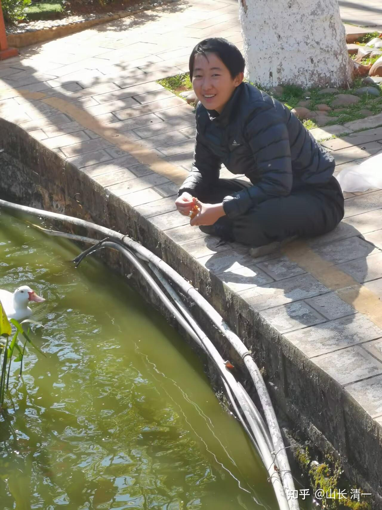

慧芳是很多年前，一个很有名的电视剧里面贤惠的女子形象，对周围的人一直是不计回报的付出。常常被人冤枉，利用，委曲，而始终不改初心，当年赢取了无数大妈同情的眼泪！也有很多人质疑她太傻了，太苦了！要跟她相反，要当捞女。

捞女，是现在我们这个社会上典型的精明女子的形象，中国似乎比较盛产捞女！这些家长们，培养出捞女的妈妈，教孩子的全是与“慧芳”的妈妈教的相反，是让她们学会心机，利用他人，学会各种手段技巧，不择手段的捞取好处。成为精明的利己主义者，有便宜就占，有好处就捞。不要面子，也不在乎原则。以为捞到就是赚到！她们的逻辑是：“捞的越多，就越有本事！越值得自豪”，没捞到，就一副不甘心的样子！怪东怪西，就是不怪自己！

看起来，这个社会上，老实人很吃亏！实干的人，总比玩虚假的人利用和诱骗。

那么：宇宙是公平的吗？付出真的会吃亏吗？我们应该学习捞女吗？

**付出和给予？谁更有福？**

**施舍和得到，谁更快乐？**

**投资和享福，谁更富足？**

我一直在教学生要做“付出者”，不要做“捞女”。而且**要她们“全心付出，不考虑回报”！我认为：只要你一直努力付出，宇宙自动会给你回报，不要自己去斤斤计较回报和结果的！宇宙会非常公平的把你该得的一点不少的送给你！当然---以你想象不到的方式！**

我一直在教学生要“学会吃亏”，而不是“会占便宜”。更不是“有便宜就占个没够”！**我认为占便宜就是吃亏，而且是吃大亏！**

我不仅身体力行，也把这个观念和行为教给小女。她三岁多我就教她“付出”，我当年，每周都会请她在明珠班上的小朋友来家里玩，让她来负责接待小朋友，把家里她最喜欢的食物水果玩具等等，送给她的伙伴----甚至是送给在班上欺负过她的小伙伴。让她从小就习惯“给与和付出”，而且是不带任何回报要求的给予。她的哥哥姐姐，从小有其他问题，我的要求会更严格一些，这种“温柔教学”就要少一些。因此，小女相对她的哥哥姐姐会更大气一点！现在她长大了，出去做事很受人欢迎。这次回老家“省亲”，亲戚们对她都特别喜欢！说气质特别好，很讨人喜欢。

**而我自己也在做这样的事情---不计回报的投入和付出。**从我办学一开始，就是不断的给予需要的人，送给他们想要的东西。我不仅仅对教学条件大方地投入，不计回报。而且，从开办学堂以来，我招收的第一个外来学生就是全免费教学，全包食宿，不考虑回报的付出！刚开始办学的阶段，收取的学费连保姆费都不到（一万五一年）。现在我每年，都在供养几十人，甚至是上百人。因此，我开办学堂十几年之后，依然是负现金流。就是最近这几年，现金流才开始回正！目前在清迈学习武道的数十年，全都是我供养的，而且也不要求学生一定要回报我。他们是自由的，自己想做啥都行（甚至想黑我也行）。

这不是我想当圣人，有啥图谋。或者我有道德洁癖！或者我要用来装面子，换取某种社会好感和好处。其实我根本不在乎别人怎么看我，理不理解我。我在乎是我怎么看自己！也许对别人来说，做好事是一种人前装模作样，捞取名利的工具。但我不计回报的做好事，是一种深思熟虑的“功利考虑”，是为了让我在社会上更成功，更富足，实现自己目标的必要手段。

**老子的道家哲学，就是强调“欲取先予”------将欲取之，必先与之！**

一般人会把这种思想和行为视为“阴谋论”，以为是一种算计。相当于钓鱼的时候，先给鱼饵一样。先用小恩小惠收买人心，然后捞一把大的！有些捞女，学老子就学成这个样子了！

其实还真不是！曾国藩说：“只问耕耘。不问收获”，就是这种道家的大智慧。不是为了“收获”的目标，才去装模作样的“耕耘”。而是把“耕耘”视为日常的功课，不去斤斤计较回报和结果，甚至不去期待会有回报。因为他们都相信：宇宙是公平的，宇宙会自动给你的付出以足够的回报！

我把这些思想和行为教给小女，就是我知道这是宇宙大道，她将来依此而行，人生就是轻松愉快，大富大贵之人。如果相反，她注定人生失败，潦倒终身！只能在下层社会苦战一生！

女儿如果被我教了斤斤计较，去当捞女，终身她一定会活的很苦，很累！很紧张，很烦恼，也会真心的朋友。如果我爱她，当然更喜欢她“大富大贵”，轻松简单受尊重了。只有蠢货家长，或者是不爱孩子， 把孩子当工具的父母，才去从小就教孩子斤斤计较，算计他人，导致一生受苦受累吧？

只是中国普通的市井小民，哪里懂什么宇宙大道。她们也不学习，甚至根本就不相信圣人的语言！她们只相信自己身边的“生活常识”，当然只会教自己的孩子处处斤斤计较了。这种父母会教孩子有便宜就占，没便宜就骗。甚至不惜装神弄鬼，坑蒙拐骗，捞钱捞好处。因为市井小民的内心价值观，就是没有荣誉，没有责任，甚至没有面子的。认为“只要捞到就是赚到”！会不计代价，不惜一切的去“捞世界”。我看她们活得真累，真苦！也真的活该受罪！

一个人学会“不计回报的付出”非常的重要，是将来成为精英的必备前提条件。自私自利的人，成不了真正的精英。

什么是不计回报的付出？其实很简单，就像是你喂养野生动物一样。这种付出，与养宠物，饲养家畜不一样的就是：你绝对不期待你喂养的动物，它给你什么回报，你不需要物质上的回报（有肉有蛋），你也不要精神回报，给你摇尾巴装萌。你只是接受它自然的一切，纯然地去做付出。然后你就满心欢喜！之后你就忘了，就像下面这种情况---喂海鸥！

昨天，我带小女去昆明的翠湖公园喂海鸥。这是她十岁这年，跟我在昆明闭关学中文的时候，留下她的美好记忆，现在让她重温旧梦。因为我们马上就回泰国了。我买了一大堆几十个沃尔玛的优质面包，让她尽情地喂了一上午！还有知名品牌【潘祥记】的手撕面包，给她喂海鸥，她边喂边吃，还送给周围的一些孩子去喂海鸥。我告诉她：很多年前，她妈妈第一次来昆明，我也带她喂海鸥，妈妈很开心！明慧也很开心！将来，她有女儿了。我相信也会带女儿来喂海鸥的。会说很多年前，她父亲带她在这里的故事！

花个几十元的面包来喂海鸥，无期待海鸥回报的付出。也不去秀啥形象和摆造型，完全无求！各位看她是不是很快乐？

她这次来昆明之前，是作为旅游的领队，带领泰国格斗队8人去北京，长春等地游玩，一路花钱招待泰国队，最后来昆明游玩几天，把泰国队送走之后，她再留下来做点自己的事情！这次的全国泰拳锦标赛，我也给她示范了不计回报的付出。我们给全国各地来参加锦标赛的格斗队员，以及泰国来中国的拳手都发了奖金，总计超过三十万元，甚至是匿名的。很多国内拳手都不知道是谁给的钱！其中三分之一，是小女亲手付出的。

春节前，我给拥有学位证的朋友们，送出了几百万的现金作为礼物，这是我付出的快乐！

春节后，我还发动了“团长计划”，这是给新教育的朋友送出的价值每年数百万，甚至价值数千万的礼物。这些人，我其实可以不送。这不是我的责任和义务！但我更喜欢送人，因为我喜欢成功！也喜欢拉着朋友一起成功。不喜欢成功的人，就离开我好了！我不勉强任何人加入我的团队！精英不缺人。这个社会只缺社畜！越多越好！

昨天晚上，我告诉钱校长：今年夏天，今日三语学校要给新学生们颁发更多的奖学金。还要特别给予原来没有给出的优越条件----允许11岁的孩子家庭，今年就可以正式申请全额奖学金了（原来是15岁才能申全额奖学金）。只要家长教育理念考试及格，就有资格申请奖学金。如果家长理念排名是前10%，孩子的班级考核也是前10%.。这些“双优家庭”，就可以申请学费和生活费钱全免的全奖待遇，这些就是每年几百万的礼物！

今年9月份，预期有四五十个新生会考入清迈新一届冠军班。我在清迈供养的学生，将超过一百名！每年又是数百万的开销！

这些付出，我期待什么回报吗？没有---这些收到我送出的礼物的学生，不需要对我做任何回报。他们是自由的，想做啥就做啥，感不感恩，是他们自己的事情。我不需要！不因为他们拿了我的钱，就要为我做点啥事！我什么都不缺，我只是纯然的去做这些付出！

你们认为我每年花这么多钱投入付出，我图啥？

我不图啥。更不图将来这些人回报我啥！该给我的宇宙会给我的！有情之人会感恩我，无情之人会利用我。不管有情无情，反正我功德都是一样的付出！

我只是专注我的目标-----创建世界名校！我知道，我付出越多，我就越容易实现这个目标！我做的事情，都是为了创建世界名校，至少我认为是！所以，我就只管做，只管去为此目标付出。说不定，有一天我想不到就成了呢?

就像2019年，我决心不计回报的去做武术格斗，自己花钱培养传武拳手去打现代格斗，去捍卫中华传武的荣誉，结果——五年后就取得了远远超过我预期的回报---现在已经成为了创造奇迹的“一代太极宗师”。我相信后面还有更大，更不可思议的回报。但我不去期待有啥具体的回报，依然专心的付出，继续支持更多的拳手们去训练，去比赛！去拿奖！

今天晚上， 三个清一拳手就要去外府打比赛。几天后，陆鸽要去国外（中国和泰国之外），与高棉拳的主场最强对手作战，捍卫国家的荣誉！这种比赛，我们外国人只有获得大幅明显的优势，压倒性的优势，才有可能取胜！但我们不在意最终结果，我们只是做好当下的每一步！今年我们注定会创造更多的荣誉和奇迹！

为了这些荣誉和奇迹，我们会不计回报的投入，专心的付出。我们其实啥都不需要操心，宇宙会自动回报给我们一切---我们需要的一切，发出信息后，宇宙都会给我们的！

穷人穷的原因，真不是没有教育，没有文化，没有知识，没有机会，而是“心穷”！导致给多大的机会也把握不住，一身穷忙！

这些注定一生穷忙的捞女，真不是没有快速富裕的机会。相反每个人都有机会获得超级的成功。

特别是我身边的弟子和公主，因为我们圈子能量场提升的原因，如果真的想要当“亿万富姐”，真有“嫁给亿万富豪家庭”的机会。但有趣的是----一心想要傍大款的女孩，别人家真的不想要，也不敢要。谁家的脑子抽了，会想娶个心机女回家，祸乱家人？这些有钱人也不是傻瓜呀？

但我们平台上，就是不想嫁大款的公主，这些富人家庭却争着要。其实这就是秘密法则的现实体现----只能拥有富裕之心，不求金钱，才会有富裕的结果。捞女，就是穷人之心的女孩，就算我把当亿万富姐的机会，亲手送给她们的手上，她们都会拿不住，或者会自己丢掉！因为她们就没有积累啥福报，给啥机会都没用！

**相反：拥有富裕之心的女孩，视金钱如无物的女孩，很可能自己啥都没期待，就嫁给了好人家，一生备受宠爱！**

当付出者，真的不会吃亏的。相反---宇宙会给付出者十倍，甚至万倍的回报！这是宇宙规律！

但你用“心机”来付出，有目的来付出，就像你钓鱼一样。这就没用了！宇宙是你无法欺骗的。只有“无心布施，无住相布施”，才能有最大的福报和回报。

在中国这样捞女偏地的国家，当一个付出者，你们认为会很倒霉的吗？

其实相反---因为宇宙是平衡的。付出一定有回报，而且是超级的回报。但不一定是你想到的回报。如果中国如果捞女捞男最多，中国的发财，成功的机会就会最多。因为捞女捞男，其实就是各位成功和发财的资源！要珍惜这种资源！

你们可能都期待你付出的对象，能够给你相应的回报。甚至更高的回报。其实你眼界太狭隘了。宇宙规则是付出一定会有回报，宇宙还会加持你，给你更多的回报。但不一定是要强迫你付出的对象，给你相应的，可见的回报！---甚至有可能，你付出的对象根本就没有能力，也没有愿望给你任何回报。但冥冥之中，你依然会有不菲的回报！你付出的对象越高级，你得到的回报倍数就越高。甚至最高可以达到完备！因此，我基于投资效率的考虑，我更愿意为聪明人，层级高的人付出。

大多数国人，思想极其的狭隘。她们其实也愿意付出，甚至是他们不付出就难受，因为这是灵魂的追求。但这些蠢货，宁肯天天去种菜，种花，也不愿意把时间精力付出给更有价值的对象。就像是炒股只买没有啥价值的股，当然最终的回报就很小了。因此，你把生命用来无私地付出给植物，给动物（宠物），给乞丐，给普通人。中国人甚至狭隘到------只愿意为自己的家人付出。即使家人不需要她做饭，她都要强行去做。但外人没饭吃，她却毫不关心。甚至不愿意喂鸟！这种人，你能说有多大的福报吗？再勤奋，也只有最普通的回报吧？也只是让你能够做一个普通人罢了。

但如果你的付出对象，是有社会价值的，是有功于社会，于人民的高人，你付出帮助给圣人，给聪明人，给社会的精英，给上层。你得到的回报，就是社会高层和精英的回报！因此，愿意为谁付出，为什么等级的人付出，也决定了你事业和生活的高度！

所以：我才说--就算死也要和高手在一起！你所在的圈层能量级别越高，你的收益和档次就越高。因此千万不要放弃高级圈层，去进入低级圈层！

我发誓要捍卫中华武术的尊严，要为传武正名，我愿意为这个目标无条件付出，不计回报的付出！你们看到的，只是得到了奖牌。而且奖牌我还不要，都让学生自己拿着给家里人! 但各位应该知道：传武的宗师，大德。中华民族对于中华传武的感情很深，捍卫他们共同的理想，肯定是有巨大的价值回馈的！因此，我的事业，我的财富，我的健康，也因此得到正面的加持。也许，正因为这个原因，同样的股票，我买了就赚钱，你买了就亏本。比如恒大股票，我买后赚了一千多万走了。其他人呢？赚还是赔？

正通汽车，我是两块多买的，赚了700多万港币走了。现在才2毛钱！我买的时候，不知道会这样涨。只想不会跌就行了。我走的时候，也真不知道会跌。只认为我已经赚够了，就走了！买起品种去了！但---贪婪之人，就是匮乏之人，他们就算完全一样的股，也只会赔钱，赚不了钱！所以---聪明人一定是只问耕耘，不问收获的！

回过头说“捞女，茶婊”。各种贪婪者，占便宜者，欺世盗名者。表面来看，是这些人占便宜了。其实这些人的是最亏的！因为她们不肯付出，内心各种欲望，“想要”之心极其强烈，甚至她们会不惜各种坑蒙拐骗都要去捞。她们向宇宙展示的“真实身份”就是“匮乏”，因此宇宙就会赠送她们“匮乏”的礼物，会把她们本来拥有的富足。无论是美貌，还是成功，或者是财运，尊重，地位，都统统的拿走。拿去给有富足之心的人！就相当于炒股，专门去买消息股，内幕股，热门股的人，展现的身份就是“匮乏”，最终这种人肯定亏损累累。90%的人，进入股市的目标是赚大钱，都当别人是傻瓜。这些人最终的收获就是亏本！10%的人进入股市的目标是“不赔钱”，老老实实的只赚本分钱。结果是他们收获了利润！他们得到的利润，也不是白送的。就是其他90%的贪婪之人送的。因此，贪婪，算计，聪明，都只能换来亏损的结果。人越贪婪，送给别人的礼物就越多！有人短短时间就亏掉几十年的积累，难道只是偶然吗？

因此，整体来看，长期来看，宇宙和社会真的是很公平的，运行非常的完美！不相信宇宙的智慧，你就只相信你们市井社会的小算计，小精明，你就只能永远在底层社会，在贫困线上拼命挣扎，就像现在的很多小民一样。

** 不舍不得，不付出就没有收获！这就是因果！**

宇宙两大法则：第一是因果法则。你有初一，别人就有十五！你打人，你就会被打！

第二是秘密法则：你付出什么，你就得到什么！你展示什么身份，就得到什么结果！你不可能得到你身份没有的东西！万一有了也会失去！

** 如果你喜欢钱**，你就付出钱送给他人，或者教人赚钱，帮助人去赚钱。这样，你就可以收获更多的金钱！

** 如果你喜欢“捞钱”**。骗钱，就是发出“匮乏钱”的真实身份给宇宙，你就会收获意外的破产。有钱也会败光，或者根本就赚不到钱！

** 如果你喜欢装假，喜欢欺骗忽悠他人**，证明你喜欢愚弄人。你就收获了“愚蠢”的结果，虽然看起来你很聪明，但你就是会犯不可思议的错误！愚蠢到普通人都不敢相信！

**如果你想当一代宗师**，你就去帮助别人成就，成为冠军。

如果你骗人去练套路传武，去场上挨打，你就成为“一代雷雷”！闹出大笑话！

** 下面讲两个案例，来说明宇宙法则的实际运作过程！**

** 第一：你付出后的回报，不一定直接来自于你付出的对象，往往来自于你看不到的地方。**比如---我24年前开办今日，第一个外来的学生，我就是不计回报，全额供养的。目的是让他与我儿子为伴一起学习更好。当年他们父母都是穷家小户。我从来就没有去期待他们家给我啥回报，因为带一点亲戚关系（女方的），我能帮就忙一点。结果他们家，后来的确也没有给我任何回报---别说是物质和经济的回报了，连句感谢的礼貌话都没有。相反还认为他们家儿子，愿意送来陪我儿子读书一段时间，已经是给了我天下的面子和好处了！【似乎心机茶也是这样想的，她总在宣扬我供养公主班的学生目的，就是为了给我的小女儿找陪读。意思就是我在占这些孩子的便宜。似乎也是为她自己白白享受了我十年的供养寻找合理性。认为我只是为了利用她，才培养了她10年！所以她愿意留下来，就是我占了她便宜。她走了就是理性觉醒！她不欠我，似乎我还欠她一样】。

我以为我给她的是机会，但她以为她才是给我机会的人。也许----大家都对吧！

其实---我真不在意她给不给我回报，因为该我的，宇宙自动会给我的。但她如果这样来理解世界的话，她就惨了。因为她会把我给她的最好的礼物，把我已经送给她的，人们都最想要的礼物（健康，财富，金钱，名誉，智慧等等）会全都丢了，不再拥有。各位都看到现在她拥有的更多还是更少？包括身体的健康，或者婚姻的档次和机会！但有人自己离开了阳光，却怪阳光没有给她足够的温暖。可能寒冷的结果是事实，但寒冷的原因却逻辑很好笑！

物质是不灭的，精神能量也不灭！我全心付出后，宇宙的礼物会以其他方式还给我，不因为当事人的不领情，甚至贬低而减少，相反是一点都不会少。所以---人要没良心，真黑的是自己，不是我！

当年学堂的第一个学生，家庭也跟她一样，对我的尽力帮助是鄙视和傲慢。这孩子只在我这里学了一年，得到的收获远远超过我儿子，他是妥妥的超级学霸！学啥懂啥！我还期待他家这个聪明的学霸儿子，继续陪我儿子一起多学几年。但被只看到自己儿子优点，只看到我儿子缺点的家长看不起我的付出。家长说：他们家聪明能干的儿子，以后才不“陪太子攻书”呢。我儿子就不配跟他们儿子一起做朋友。他家聪明能干的儿子，将来要去追随更好的前程，就不陪我家的学渣儿子一起玩了！这家人，就义无反顾的离开学堂，从此再也没有回头。

如果这孩子留下来好好学习，直到现在的话，很可能是今日现在的“最佳教师”，甚至是三校校长之一。他也很可能“嫁入豪门”，一定能娶到家庭各方面条件都很优越的女子为妻。他和他的父母，肯定会受到各种家长们非常大的尊重！未来的前程更是不可限量！一切都会比我们家的儿子更好！毕竟同样的环境，他肯定表现更优秀，混得更好也不奇怪！这样，这个原本只是底层群众的家庭，现在就上升至少是中层了！甚至娶了一个富二代，没准还变成财富上层呢！

但真没想到，离开我们的这孩子，后来居然连高中都没有考取！大学也没有上，去当兵哥哥去了。但当兵也不成功，没有升职当干部，很快被赶回来了。据说后来家里拿钱去读一个末流的大学打工混日子。现在整个家庭，层次比当年更差了。全家都在底层社会里面，苦巴巴的苦熬和打拼。为生活而奋斗！

我叹息----当年这孩子，可是比我儿子强得多的学霸和天才，无论我教啥，他都能很快掌握！没想到最后连个普通人都能实现的成绩都拿不到，普通中产都混不上。居然成为了最差的，底层出苦力的劳动人民！

这就是穷人的心穷---导致我给他亿万的财富，成功，荣誉，幸福，他们家都拿不住。只能跟父母一样，继续在社会上当牛马，做社畜！命运就是穷命一家！真可怜。其实这种人也可恨---害人，也害己！

相反的案例，就是ELLA公主：几年前，我请她来做明慧的“小伴读”，家长觉得是她最好的机会，一直感恩万分，甚至还公开地表达家庭的感恩之情。ELLA自己也非常的感恩，13岁到我清迈的家中之后，居然18岁才第一次回家。因为她非常的珍惜跟随在我身边的机会，一点时间都不想浪费。父母还说根本就不想她，让她不要回家度假，专心在清迈好好学习成长！她们一家，对得到与明慧做伙伴的机会，是格外的珍惜和感恩之心。与上面的某男生家庭傲慢和自大之心完全相反。自然：他们两家，得到的结果也很不一样。当年的ELLA，还是一个傻傻的，只会读书的小女孩。她是学霸没错，可是其他方面，除了善良就没别了！动手能力和做事的经验都很差！斗心眼玩，她大两岁居然还常常掉进明慧给她挖的坑！但ELLA现在，已经成为了落落大方的大公主，文武双全的学霸。关键是她居然还开窍了---我原来认为她学不了武术格斗，让她学唱歌跳舞当淑女就行了，结果现在成为了公主班武力值第一的公主！我最担心她太傻，没啥心眼，会被人骗。因为她太善良。她谁都愿意去相信，特别不会算计人，也不会保护自己，原来她还会被一些坏同学欺负霸凌。但现在她应对处理一些复杂的事情，也可以安排得条条有理。这几天她正在准备以我的助理身份，接待拉曼大学的校长来访。

现在的ELLA，如果想要当亿万富姐，只要说一句话----“我愿意”就够了！多少男生家庭，都以她为“最佳儿媳人选”，甚至是我和刘老师都会这样想。----刘老师说，如果她还有一个儿子的话，一定要把她娶回家。只可惜明慧是女孩！刘老师说当年她应该多生个儿子的！现在，就让明慧做她的闺蜜也好！

因此，可以见到：认真跟随的结果，是事业，功名和富足，都在她面前展开，任意让她去挑选。她想要，都可以拥有！这就是愿意尊重，懂得珍惜，也愿意付出（她对明慧很好），拥有“富足之心”的结果！如果是用心机，搅尽脑汁想要得到这一切的人，结果会啥都得不到，给了也接不住！但不需要用心机，踏踏实实修德修心，认真做事之人，啥都可以得到！

当然，我也得到了很宝贵的东西：明慧跟ELLA生活在一起这四五年，也有很大的进步，也学到了ELLA身上的很多优秀品质，两个女孩现在都是全国泰拳亚军。只是ELLA拿到的是成人组亚军，明慧拿到了青年组亚军。我认为ELLA的示范，给了明慧很好的学习榜样。否则靠我自己推动，明慧是不会去练武的。因此我也很感谢ELLA和她的父母给我们小明慧带来的机会！这就是宇宙的法则----互相感恩，互相珍惜，结果就是互相成就！

上面案例的两个孩子，人都很不错，都比我家孩子聪明。也都是认真踏实，愿意努力的人。我都愿意付出和帮助他们，会公平的给予两人与我孩子一样的条件和支持。但最终两人的结果，为啥区别如此之大呢？一个天上，一个地下？

因为上面的男孩父母，自己就是市井小民，是穷人，穷心。是穷人其实也没关系，如果完全的信任我，愿意真诚的跟随我，今天全家的命运，也会完全的不同！但父母却对我嫉妒和攀比，鄙视和不信任。认为自己的选择更好。离开我他们会发展更广阔！最终结果，自然与我的孩子得到的结果相反了！

当然，我也没有得到好处----我儿子虽然总体还不错，但没有明慧的发展更好。因为他当年一起学习的伙伴，相比明慧伙伴就太差了！

ELLA的父母都是大学教师，虽然也不是有钱人，只是中产之家！但她的父母都有基本的做人的修养和文明，有道德的观念和底线！ELLA的母亲特别的善良，两夫妻对我也有足够的信任和尊重。因此，最终我给予我孩子的一切，她们家孩子也得到了！这就是家长才是成就孩子的神！ELLA父母才是ELLA出息的关键人物！

所以，我身边这么多年来，其实各种正面和负面的案例都有，最终的结果，本质上都是父母为孩子选定的命运！父母的心穷，孩子自然教育失败。但各位千万不要因为有上面男孩的教育失败的例子，就说我的新教育是失败。他父母都不黑我，你们来黑我干嘛？

如果孩子的父母内心富足，懂得感恩，懂得信任，不自大，不自傲。懂得谦虚，懂得跟随，你们家也能出ELLA这样的好女孩和好男孩！

所以---成功不在我，在你！在家长！

这一点，哪吒电影的台词是对的---“我命由我不由天”。你们孩子的命运，在你们父母的手上，不在我手上。因此看到有教育成功的例子，你们不要来崇拜我。看到捞女捞男的惨相，也不要来指责我（说明：我不怕你们的指责，想黑就黑，只要你们准备好接受黑的结果就行了--）

2016年的时候，我提醒这些去当清黑的人，当心会得到与我相反的命运。

现在已经是2025年了，清黑期待我很惨的局面，出现没有？现在，我的财富值，武术成果，教育成果，人脉资源等，均远远超过2016年。清黑们呢？你们检查了一下9年来的收获吗？特别是一些一直在跟踪我们成果的老黑们？是不是越来越黑了？越来越没希望了？

你如果期待我将来很惨，天天骂我不好。你们就是给宇宙发信息，说你喜欢惨。结果吗---宇宙会送你这个礼物的！

我只是期待你理性和自尊尊人，宇宙也会送给我这个礼物的！

最可笑的就是：有些原来的清粉，明明在我身边看到了这一切变化。偏偏还在最近一两年，这些人还是要去做清黑。我都要笑死了----真是无知无畏，啥结果都不能阻止你们黑化！我善意提醒，都挽救不了你！

2025，清一新教育注定会取得更大，更辉煌的成就！想黑就黑吧！你们是自由的！

想拥有---就加入！

不想要，就反向而行！

你们都是自由的，无论结果如何！只要你不分裂，结果就都能如愿！